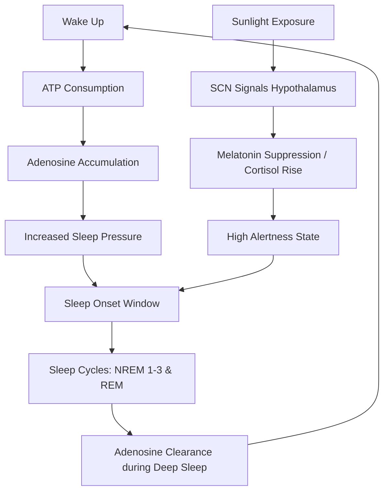

The modern world is currently weathering a quiet but devastating sleep crisis. The **CDC reports that roughly 1 in 3 adults** in the United States do not get enough sleep—a statistic that transcends mere tiredness. Chronic sleep deprivation is not a badge of productivity; it is a systemic physiological failure linked to significantly higher risks of obesity, type 2 diabetes, cardiovascular disease, and cognitive decline [CDC](https://www.cdc.gov/sleep/index.html). 

  
  
 <a href="https://unsplash.com/@jkoblitz">Julia Koblitz</a> on <a href="https://unsplash.com/photos/scientist-using-pipette-with-test-tubes-in-lab-RlOAwXt2fEA">Unsplash</a>

Parallel to this crisis is the explosion of the "sleep economy." We are inundated with marketing for weighted blankets, AI-powered rings, and expensive supplements, all promising a "biohack" for a better night's rest. However, the reality of restorative sleep is grounded not in gadgets, but in basic biology. To truly optimize your rest, you must stop fighting your body and start working with the two primary drivers of sleep: sleep pressure and your circadian rhythm.

---

### 🧬 The Biological Engine: Adenosine and the Internal Clock

To fix your sleep, you must first understand the "Dual-Process Model" of sleep regulation. Your drive to sleep is not a single switch, but the intersection of two distinct biological systems.

#### 1. Sleep Pressure (The Homeostatic Drive)
From the moment you wake up, a molecule called **adenosine** begins to accumulate in your brain. Adenosine is a byproduct of cellular energy consumption; as your brain uses ATP (adenosine triphosphate) to power your thoughts and movements, adenosine builds up in the extracellular space. The higher the concentration of adenosine, the stronger the "sleep pressure" you feel.

This is the primary mechanism behind caffeine. Caffeine does not actually "give" you energy; it is an [adenosine receptor antagonist](https://www.ncbi.nlm.nih.gov/pmc/articles/PMC6022104/). It mimics the shape of adenosine and plugs the receptors, preventing the molecule from signaling your brain to feel tired. However, the adenosine doesn't disappear—it continues to build up behind the "blockage." When the caffeine is metabolized, all that accumulated adenosine floods the receptors simultaneously, leading to the notorious "caffeine crash."

#### 2. The Circadian Rhythm (The Process Clock)
While adenosine tracks how long you've been awake, your circadian rhythm tracks where you are in the 24-hour cycle. This internal clock is governed by the suprachiasmatic nucleus (SCN) in the hypothalamus. The SCN is highly sensitive to light signals from the retina, which dictate the production of cortisol (to wake you up) and melatonin (to prepare you for sleep) [National Institute of General Medical Sciences](https://www.nigms.nih.gov/education/fact-sheets/Pages/circadian-rhythms.aspx).

When these two systems—the buildup of adenosine and the timing of the SCN—are perfectly aligned, you experience "sleep onset" with ease and maintain deep, restorative stages. When they are mismatched—such as during jet lag or shift work—you experience the "tired but wired" phenomenon: your adenosine levels are high (you're exhausted), but your circadian clock is signaling alertness (you can't sleep).

---

### 🌡️ The Sleep Sanctuary: Environmental Optimization

Your brain requires specific environmental cues to transition from an "alert" state to a "recovery" state. If your environment signals "daytime" or "stress," your brain will resist the descent into deep sleep.

**1. The Thermal Trigger**
Temperature is one of the most powerful biological signals for sleep. To initiate sleep, your core body temperature must drop by about **2-3°F (1-1.5°C)**. Research indicates that the ideal room temperature for maximizing slow-wave sleep (SWS)—the deep stage where physical repair and growth hormone release occur—is between **15-19°C (60-67°F)** [Nature](https://www.nature.com/articles/s41598-021-91532-z). The [Sleep Foundation](https://www.sleepfoundation.org/sleep-hygiene) specifically suggests **65°F (18.3°C)** as the optimal baseline. If the environment is too warm, the body struggles to shed heat, resulting in fragmented sleep and a reduction in deep-sleep percentage.

**2. The Blue Light Battle**
Light is the primary "Zeitgeber" (time-giver) for your internal clock. Short-wavelength blue light, emitted by smartphones, tablets, and LED overheads, is particularly effective at suppressing melatonin production. Studies show that restricting blue light exposure **two hours before bed** significantly reduces "sleep onset latency"—the time it takes to actually fall asleep [Harvard Health](https://www.health.harvard.edu/staying-healthy/blue-light). To optimize this, transition to "warm" amber lighting in the evening to mimic the setting sun.

**3. The Glymphatic Flush**
It is worth noting that during deep sleep, the brain engages the **glymphatic system**, a waste-clearance pathway that flushes out metabolic toxins, including beta-amyloid plaques associated with Alzheimer's disease. This process is most efficient during non-REM deep sleep. By optimizing your environment for SWS, you aren't just "resting"—you are literally cleaning your brain.

---

### 🛠️ Behavioral Anchors: Habits That Scale

Sleep quality is not decided at 11:00 PM; it is decided by the cumulative actions of the preceding 16 hours.

> "Consistency is the bedrock of sleep health. Your brain loves predictability; when you provide a consistent schedule, the transition to sleep becomes an automatic biological reflex rather than a psychological struggle."

**The Wake-Up Anchor**
Contrary to popular belief, the time you wake up is more critical for your rhythm than the time you go to bed. Maintaining a consistent wake-up time—even on weekends—anchors your circadian rhythm. This ensures that adenosine begins building up at a predictable time every morning, which in turn creates a predictable "sleep window" every night [Mayo Clinic](https://www.mayoclinic.org/diseases-conditions/insomnia/symptoms-causes/syc-20354998).

**The Metabolic Influence**
Dietary choices impact sleep architecture. High-glycemic meals late at night can cause blood sugar spikes and subsequent crashes, which may trigger the release of cortisol and wake you up at 3:00 AM. Furthermore, while alcohol is a sedative that may help you fall asleep faster, it is a potent disruptor of **REM (Rapid Eye Movement) sleep**. REM is essential for emotional processing and memory consolidation. When you drink, you aren't sleeping; you are chemically sedated, which is why alcohol-induced sleep leaves you feeling foggy and unrefreshed.

**The Caffeine Window**
Caffeine has a half-life of approximately **5-6 hours**, meaning that if you consume 200mg of caffeine at 4:00 PM, 100mg is still circulating in your system at 10:00 PM. Even if you can *fall* asleep, the presence of caffeine blocks the depth of your sleep, reducing the quality of your restorative stages.

---

### 🏥 When "Hygiene" Isn't Enough: The Path to CBT-I

For those suffering from chronic insomnia, basic "sleep hygiene" (dark rooms, no coffee) is often insufficient. In chronic cases, the bedroom becomes a conditioned stimulus for anxiety. The brain stops associating the bed with sleep and begins associating it with the frustration of *trying* to sleep.

The gold standard for treating this is **Cognitive Behavioral Therapy for Insomnia (CBT-I)**. Unlike sedative-hypnotic medications, which treat the symptoms but not the cause, CBT-I addresses the psychological and behavioral roots of sleep disruption. A meta-analysis confirms that **CBT-I is more effective in the long term** than pharmaceutical interventions, with benefits persisting long after the treatment ends [Journal of Clinical Sleep Medicine](https://jcsm.aasm.org/).

CBT-I employs three primary strategies:
*   **Stimulus Control:** Re-establishing the association between the bed and sleep. If you are not asleep within 20 minutes, you must leave the bed and perform a boring task in dim light until you feel sleepy again.
*   **Sleep Restriction Therapy:** Limiting the time spent in bed to the actual amount of time spent sleeping. This artificially increases "sleep pressure," forcing the brain to consolidate fragmented sleep into a single, deep block.
*   **Cognitive Restructuring:** Addressing "sleep effort"—the paradoxical anxiety that comes from *trying* too hard to get exactly 8 hours of sleep, which creates the very stress that prevents it.

---

### ⌚ The Tracker Trap: Data vs. Subjective Feeling

We are currently obsessed with the "quantified self." Oura rings, Whoop straps, and Apple Watches provide "sleep scores" that lead many to believe they have a medical-grade lab on their wrist. However, there is a significant gap between wearable data and reality.

Wearables estimate sleep stages primarily through heart rate variability (HRV) and actigraphy (movement). While excellent for tracking long-term trends, they are far less accurate than **Polysomnography (PSG)**—the gold standard clinical test that measures brain waves (EEG), eye movement, and muscle tone [Healthline](https://www.healthline.com/health/sleep-trackers-accuracy).

This discrepancy has birthed a new clinical phenomenon: **orthosomnia**. This is an obsession with achieving "perfect" sleep metrics. If a user wakes up feeling refreshed but their app gives them a "62% sleep score," they may experience a placebo-induced dip in energy or trigger anxiety-driven insomnia. The most critical metric for sleep health is not a digital score, but **subjective daytime functioning**. If you are alert, focused, and emotionally stable, the data is secondary.

---

### 🏁 Conclusion: The Sleep Blueprint

Optimizing your sleep is not about finding a magic supplement or a high-tech gadget; it is about aligning your lifestyle with your evolutionary biology. If you want to stop guessing and start recovering, ignore the expensive "hacks" and implement the **Big Four**:

1.  **Anchor your wake-up time:** Wake up at the same time every day to stabilize your SCN.
2.  **Cool the environment:** Target **65°F (18°C)** to facilitate the core temperature drop.
3.  **Eliminate blue light:** Use amber lighting or avoid screens **two hours before bed** to allow melatonin to rise.
4.  **Manage your adenosine:** Keep caffeine intake to the early morning to ensure receptors are clear by bedtime.

Sleep is not a luxury, nor is it a productivity hack—it is a fundamental biological necessity. When you stop fighting your physiology and start supporting it, you unlock the most powerful recovery tool available to the human body.

---

## 📖 Related Reading

- [Could Motorola and GrapheneOS Actually Team Up by 2027? 🛡️](/motorolas-grapheneos-phones-will-launch-in-2027-priced-higher-than-pixels/)
- ["If I Release It, You Won’t Get the Same Experience": The Invisible Gap Between Builder and User](/if-i-release-it-you-wont-get-the-same-experience-i-get/)
- [🛡️ The Google Chrome Security Crisis: Unpacking 327 Vulnerabilities](/google-releases-chrome-152-with-fixes-for-327-security-flaws-including-10-critical-bugs-etv-bharat/)
