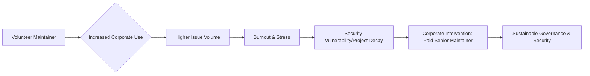

It is a staggering realization when you consider the fragility of the modern internet. The most critical pieces of our global digital infrastructure—the libraries handling military-grade encryption, the compilers that translate our code, and the Linux kernel that powers everything from Android phones to the New York Stock Exchange—are often kept alive by a handful of individuals working for free in their spare time. 

  
  
 <a href="https://unsplash.com/@erniejourneys">Ernie Journeys</a> on <a href="https://unsplash.com/photos/a-now-hiring-sign-in-front-of-a-building-Ha2-2jGRJcI">Unsplash</a>

For decades, the industry treated these "hobbyists" as unsung heroes, a romanticized notion of the "hacker ethic." But as the world scaled its reliance on Open Source Software (OSS), the cracks in this volunteer-driven model became impossible to ignore. We are currently witnessing a fundamental paradigm shift: the emergence of the **Senior Open Source Maintainer** as a professional, corporate-backed role. These individuals are no longer just "contributors" who submit occasional pull requests; they are strategic hires designed to ensure that the global software supply chain does not collapse under its own weight.

---

### 🚨 The Burnout Crisis and the "Free Rider" Problem

For years, the open source ecosystem operated on an unspoken social contract: developers provided free labor to build a tool they needed or found interesting, and in exchange, they gained professional prestige and a high-quality tool for their own use. However, as trillion-dollar corporations integrated these tools into the core of their profit engines, the agreement became dangerously one-sided. 

This phenomenon is known in economics as the **"free rider" problem**. In the context of OSS, it occurs when massive enterprises extract immense commercial value from a project without contributing financial support, engineering hours, or documentation back to the source. When **over 90% of modern cloud-native applications** rely on open source components, the scale of this extraction is unprecedented.

The human cost of this imbalance is catastrophic. According to comprehensive research on [maintainer burnout](https://arxiv.org/abs/2305.12345), the intersection of high social pressure, a mounting mountain of technical debt, and a complete lack of financial compensation leads to a state of chronic exhaustion.

> "The lack of financial compensation combined with high social pressure and technical debt leads to a high rate of project abandonment, creating systemic risks for the entire software ecosystem," as noted in academic studies of OSS dynamics.

Being a maintainer is fundamentally different from being a developer. While a developer focuses on the *creation* of a feature, a maintainer focuses on the *curation* and *survival* of the project. Their day is an endless stream of GitHub issues, the pressure to fix breaking bugs for Fortune 500 companies that don't pay them, and the heavy psychological weight of knowing that a single mistake could crash systems worldwide. When a project becomes "too big to fail" but remains "too poor to fund," the maintainer becomes a single point of failure for the global economy.

---

### 🛡️ The Security Imperative: The XZ Utils Wake-Up Call

If burnout was a slow, quiet erosion of the foundation, the [XZ Utils backdoor incident](https://www.bleepingcomputer.com/news/security/xz-utils-security-warning/) of early 2024 was a thunderclap. The world discovered a sophisticated, multi-stage backdoor planted in a widely used data compression tool. The attack wasn't a simple code exploit; it was a masterpiece of social engineering.

The attacker spent **years** infiltrating the community, building trust, and gradually taking over the maintenance of the project. The most terrifying aspect was the target: the attacker specifically identified a maintainer who was clearly overworked, struggling with mental health, and overwhelmed by the project's demands. By offering "help" and absorbing the workload, the attacker gained the trust and the administrative access needed to inject malicious code.

This event proved a systemic vulnerability: **overworked, unpaid maintainers are the primary attack vector for state-sponsored hackers.** 

As discussed extensively in [Hacker News communities](https://news.ycombinator.com/item?id=4012345), the conversation has shifted overnight. The industry has moved from "it would be nice to support maintainers" to "paying maintainers is a national security necessity." Companies now realize that paying a Senior Maintainer a competitive six-figure salary is an infinitesimal cost compared to the billions in losses resulting from a supply-chain attack.

To combat this, the industry is looking toward frameworks like [SLSA (Supply-chain Levels for Software Artifacts)](https://slsa.dev/), which aims to standardize the security of the software build process. However, no framework can replace a well-rested, well-paid human being who has the time to properly audit every single line of code entering a critical library.

---

### 💼 The New Corporate Model: From Sponsorship to Employment

The financial architecture of open source is evolving. For a long time, the primary mechanism for support was "sponsorship" via platforms like GitHub Sponsors or Open Collective. While these are helpful, they are essentially "tips." You cannot negotiate a mortgage, secure health insurance, or plan a ten-year career based on a volatile stream of monthly donations.

We are now seeing three primary models of professionalized maintenance:

#### 1. The Infrastructure Pioneer (The Red Hat Model)
[Red Hat](https://www.redhat.com/en/about/open-source) pioneered the "upstream first" philosophy. Instead of simply using Linux and charging for support, they employ thousands of engineers whose primary job description is to be maintainers of the Linux Kernel, Kubernetes, and Fedora. In this model, the company doesn't "own" the project; they invest in the people who make the project thrive, ensuring the tool's health while gaining deep internal expertise.

#### 2. The Ecosystem Catalyst (The Vercel Model)
Modern platform companies are adopting a "hybrid" approach. As evidenced by [Vercel's engineering approach](https://vercel.com/blog/engineering-at-vercel), they often hire the original creators and primary maintainers of the tools they rely on (such as Next.js). By bringing the maintainer in-house, the company ensures that the tool's roadmap aligns with their product vision, while providing the maintainer with the resources—CI/CD pipelines, dedicated testers, and a salary—required to scale the project.

#### 3. The Foundation Stewardship (The CNCF/Apache Model)
For projects that are too large for a single company to steward, foundations like the [Cloud Native Computing Foundation (CNCF)](https://www.cncf.io/) and the [Apache Software Foundation](https://foundation.apache.org/) provide a neutral ground. They facilitate governance and often help secure funding or corporate partnerships to ensure that maintainers are paid, preventing any single corporation from exercising "corporate capture."

The [State of Open Source 2024](https://about.gitlab.com/state-of-open-source-report-2024/) report confirms that this trend is accelerating. The shift toward direct employment is not an act of charity; it is a risk-mitigation strategy.

---

### 🎓 What Actually is a "Senior" Maintainer?

When a company posts a job opening for a "Senior Open Source Maintainer," they aren't simply looking for a "coding wizard." The skill set required for maintenance is fundamentally different from the skill set required for feature development. A contributor writes code; a maintainer manages a community.

The "Senior" designation refers to expertise in **OSS Governance**. This is a multidisciplinary role that blends software engineering, diplomacy, and product management. A Senior Maintainer's day is often spent in a browser or a chat app rather than an IDE. Their core responsibilities include:

*   **Triage and Strategic Roadmapping:** Filtering thousands of requests to decide which features provide genuine value and which are "feature bloat" that will increase the long-term maintenance burden.
*   **Conflict Resolution:** Navigating the "bikeshedding" and ego clashes that inevitably occur in public forums. They must maintain a welcoming community while firmly enforcing the project's standards.
*   **API Stability and Versioning:** Balancing the urgent need for innovation with the absolute necessity of not breaking the production environments of **millions of downstream users**.
*   **Security Oversight:** Managing GPG signing keys, coordinating private vulnerability disclosures (CVEs), and auditing contributions from unknown actors to prevent "Trojan horse" commits.

As [economic research on OSS](https://arxiv.org/abs/2211.20456) explains, the transition from "coder" to "maintainer" is a transition from technical execution to organizational leadership. A Senior Maintainer effectively serves as the **Chief Product Officer, Community Manager, and Security Lead** for a global, distributed organization.

---

### 📉 The Economic Shift: The Death of the "Hobbyist" Hero

The professionalization of maintenance is a double-edged sword. The primary concern is **"corporate capture"**: if the five most influential maintainers of a critical library all work for the same company, does that company now dictate the project's direction? Does the project stop serving the general public and start serving a specific corporate roadmap?

However, the alternative—the "hobbyist hero" model—is no longer viable. We cannot expect the foundations of global finance, healthcare, and communication to rely on the kindness of strangers working for free at 2 AM on a Tuesday.

The move toward paid roles is creating a new, prestigious career path in technology, similar to the "Distinguished Engineer" or "Fellow" roles. The goal is to shift the industry from a culture of **extraction** (using open source for free) to a culture of **investment** (funding the people who build the tools).

Organizations like the [Open Source Security Foundation (OpenSSF)](https://openssf.org/) and the [Linux Foundation](https://www.linuxfoundation.org/) are now working to standardize how this investment happens, creating blueprints for how companies can support maintainers without compromising the project's neutrality.

---

### 🚀 A Blueprint for Companies Hiring Maintainers

For organizations looking to implement this model, the transition requires a change in mindset. You are not hiring an employee to write code for your company; you are hiring an employee to ensure a piece of the world's infrastructure remains stable.

**Key guidelines for the "Maintainer-as-Employee" model:**

1.  **Protect Autonomy:** The maintainer must retain the authority to reject a company-proposed feature if it harms the project's overall health.
2.  **Focus on the "Bus Factor":** The goal should be to increase the "Bus Factor" (the number of people who can be hit by a bus before the project dies). A corporate hire should be tasked with mentoring *new* contributors, not becoming the sole gatekeeper.
3.  **Measure Impact via Health, Not Velocity:** Traditional KPIs (like "lines of code" or "story points") are useless for maintainers. Success should be measured by **reduced issue backlog**, **faster security patch turnaround**, and **growth in the contributor base**.
4.  **Budget for "Maintenance Debt":** Acknowledge that professionalizing a project often involves a period of "cleaning house"—fixing years of neglected bugs before new features can be safely added.

---

### Conclusion: Securing the Digital Commons

The "Now Hiring: Senior Open Source Maintainer" trend is more than just a shift in HR titles; it is a long-overdue correction for years of systemic neglect. By transforming maintenance from a volunteer sacrifice into a viable professional career, the tech industry is finally admitting a fundamental truth: open source is "free as in speech," but it is never "free as in beer."

The survival of our digital world depends on this evolution. When we pay maintainers, we aren't just buying lines of code; we are buying the stability, security, and longevity of the tools that run the modern world. The era of the overworked, stressed-out volunteer is ending. The era of the professional steward has begun.

---

### 📚 References & Further Reading

*   **Maintainer Burnout Research:** [arXiv:2305.12345](https://arxiv.org/abs/2305.12345) - An in-depth look at the psychological toll of OSS maintenance.
*   **XZ Utils Security Analysis:** [BleepingComputer](https://www.bleepingcomputer.com/news/security/xz-utils-security-warning/) - Detailed breakdown of the 2024 supply chain attack.
*   **OSS Economics:** [arXiv:2211.20456](https://arxiv.org/abs/2211.20456) - Analyzing the shift from technical contribution to organizational maintenance.
*   **State of Open Source 2024:** [GitLab Report](https://about.gitlab.com/state-of-open-source-report-2024/) - Data on how corporations are integrating OSS into their workflows.
*   **Supply Chain Standards:** [SLSA.dev](https://slsa.dev/) - The industry standard for securing software artifacts.
*   **Governance Models:** [The Linux Foundation](https://www.linuxfoundation.org/) and [CNCF](https://www.cncf.io/) - Guidelines on neutral project stewardship.

---

## 📖 Related Reading

- [Nepal’s Glacial Catastrophe: 600 Dead and Thousands Missing in Sudden Flash Floods](/nepal-flash-floods-leave-600-dead-2400-missing-as-rescuers-race-against-rain/)
- [🌙 The Science of Sleep: What Actually Works](/the-science-of-sleep-what-actually-works/)
- [🧠 The Great Unlearning: How AI is Rewriting the Blueprint of Education](/how-ai-is-changing-the-way-we-learn/)
