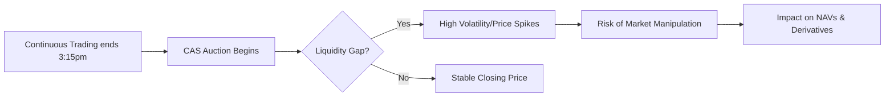

If you were monitoring the Indian equity markets on August 27, you likely witnessed a sequence of events that defied standard market logic. Dr. Kirit Somaiya, a former BJP MP and veteran chartered accountant, has officially called upon the Securities and Exchange Board of India (SEBI) to investigate a period of extreme instability that left many traders questioning the integrity of the system.

  
  
 <a href="https://unsplash.com/@bunly1998">Bunly Hort</a> on <a href="https://unsplash.com/photos/a-man-with-his-arms-crossed-_uxmFql4ycQ">Unsplash</a>

In a formal letter addressed to SEBI Chairman Tuhin Kanta Pandey, Somaiya highlighted a chaotic 10-minute window where the benchmark Sensex reportedly crashed by over **2,200 points**, only to rebound by nearly **2,000 points** almost instantaneously. This volatility has sparked a heated debate: is the newly implemented "Closing Auction Session" (CAS) fundamentally broken, or is the system being weaponized by manipulators to create artificial price swings?

---

### 📉 The "Wild Swing" of August 27: A Timeline

The drama unfolded between 3:20 pm and 3:30 pm on August 27. This specific window was critical as it marked the first monthly derivatives expiry since the rollout of the new CAS mechanism. According to [Moneycontrol](https://www.moneycontrol.com/news/business/markets/ex-bjp-mp-seeks-probe-into-sensex-s-wild-swings-on-aug-27-calls-for-explanation-from-policy-drafters-14018284.html), the movement was categorized as "unusual," characterized by a massive, sudden dip followed by a lightning-fast recovery that wiped out the losses in minutes.

Somaiya argues that such extreme volatility in a benchmark index is never random. When an index of this magnitude swings thousands of points in minutes without a corresponding macroeconomic catalyst, it points to either a systemic design flaw or active, coordinated market manipulation. He is pushing for a comprehensive inquiry and a total redraft of the policy to ensure that [Indian equity markets](https://www.moneycontrol.com/sensex/bse/sensex-live) remain a trusted destination for global and domestic capital.

---

### ⚙️ Decoding the CAS Mechanism and the "Liquidity Gap"

To understand why this happened, one must look at the mechanics of the Closing Auction Session (CAS). Under the new regulatory framework, regular continuous trading for certain stocks ceases at 3:15 pm, at which point an auction process takes over to determine the closing price. However, a critical discrepancy exists: equity derivatives continue to trade until 3:40 pm.

Technical experts and Dr. Somaiya argue that this creates a dangerous "liquidity gap." The closing price is one of the most important figures in finance, as it determines the Net Asset Value (NAV) of mutual funds and settles massive derivative contracts. When continuous trading stops but derivatives keep moving, the underlying cash market lacks the liquidity to absorb sudden shocks.

This leads to what is known as a **"negative liquidity flywheel."** In this scenario, uncertainty during the auction causes large institutional investors to withdraw their orders. This further reduces liquidity, meaning even a relatively small trade can cause a disproportionately massive swing in price.

---

### ⚖️ The Liquidity Divide: NSE vs. BSE

A pivotal part of Somaiya’s argument focuses on the stark difference between India's two primary exchanges: the National Stock Exchange (NSE) and the Bombay Stock Exchange (BSE). Because each exchange operates its own separate closing auction, they maintain different order books, which can lead to divergent closing prices for the same asset.

The disparity in volume is staggering. On the first day of the CAS implementation, the auction turnover on the [NSE](https://www.nseindia.com/) was approximately **Rs 1,276 crore**. In contrast, the [BSE](https://www.bseindia.com/) recorded a turnover of only **Rs 10.8 crore**. 

This massive gap suggests that the BSE closing price is significantly more vulnerable to "spoofing" or manipulation. Given the current **±3 percent** auction band, a single small trade in a low-liquidity environment could theoretically swing the market capitalization of a **Rs 5 lakh crore** company by as much as **Rs 15,000 crore**. For high-frequency traders (HFTs), this creates an opportunity to move the needle with minimal capital.

---

### 🚨 A Pattern of Instability?

This is not an isolated incident of volatility. SEBI has recently been forced to address similar anomalies within the CAS process. On August 19, the regulator issued an order against Mansi Share and Stock Broking and Copthall Mauritius Investment (a unit of JPMorgan). An investigation into the August 13 session revealed three sharp, inexplicable spikes in the Sensex's price, leading SEBI to impound **Rs 3.68 crore** in what were deemed wrongful gains.

The concern is that while SEBI is proficient at punishing "bad actors" after the fact, the system itself remains porous.

> "SEBI must review and if required redraft the policy. Probe and take action against manipulators." — Dr. Kirit Somaiya

While SEBI has been active in policing the markets—such as the recent investigations into [Kapil Raj Finance](https://www.moneycontrol.com/news/business/markets/sebi-probes-kapil-raj-finance-over-suspected-share-pump-and-dump-sebi-had-searched-six-locations-14017629.html) for suspected pump-and-dump schemes—there has been little indication that the regulator intends to overhaul the CAS structure itself.

---

### 🎓 What This Means for the Retail Investor

For the average investor, these swings may seem like noise, but the implications are concrete. If the closing price of a stock is manipulated during the CAS, it directly affects:
1. **Mutual Fund NAVs:** Since NAVs are calculated based on closing prices, a manipulated dip can artificially lower the value of a retail investor's portfolio.
2. **Margin Calls:** Sudden spikes or crashes can trigger automatic margin calls for traders, forcing them to liquidate positions at a loss.
3. **Market Confidence:** Constant "flash crashes" discourage long-term investment and increase the perceived risk of the [Indian financial system](https://www.sebi.gov.in/).

---

### 🏁 The Bottom Line

The conflict between Dr. Kirit Somaiya and SEBI highlights a fundamental regulatory struggle: the balance between modernization and stability. By attempting to align with global standards for closing auctions (similar to those used in [major Western exchanges](https://www.investopedia.com/terms/c/closing-auction.asp)), SEBI may have inadvertently created a window of opportunity for manipulators.

SEBI's current strategy is reactive—catching the "bad guys" through forensic audits. However, as Somaiya argues, the goal should be proactive. Fixing the "liquidity flywheel" and closing the gap between equity and derivative trading windows is the only way to ensure that the Sensex reflects true market value rather than the whims of a few well-timed trades.

---

## 📖 Related Reading

- [The Hidden Cost Of Cheap Smartphones](/the-hidden-cost-of-cheap-smartphones/)
- [Beyond the Commit: Why Companies are Now Hiring Full-Time Open Source Maintainers](/now-hiring-senior-open-source-maintainer/)
- [Nepal’s Glacial Catastrophe: 600 Dead and Thousands Missing in Sudden Flash Floods](/nepal-flash-floods-leave-600-dead-2400-missing-as-rescuers-race-against-rain/)
