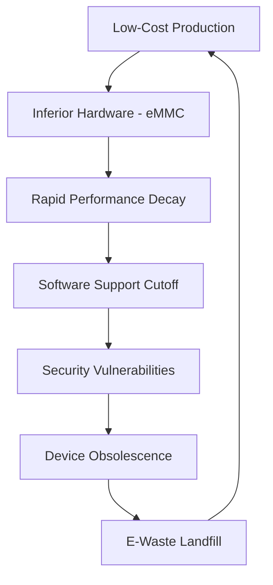

Consumers are frequently targeted by a seductive promise: a fully functional smartphone for under $150. When compared to the $1,200 titanium flagships that dominate tech headlines, these budget devices appear to be a victory for digital inclusion, allowing millions to stay connected without incurring crushing debt. However, in the realm of global economics, there is no such thing as a free lunch—the costs are simply shifted.

  
  
 <a href="https://unsplash.com/@enginakyurt">engin akyurt</a> on <a href="https://unsplash.com/photos/a-hundred-dollar-bill-sticking-out-of-the-back-pocket-of-a-pair-of-jeans-DQajiplDxnM">Unsplash</a>

When the sticker price drops, the "discount" is subsidized by the environment, laborers in the Global South, and the user's own digital privacy. These devices aren't actually cheap; they are merely priced to hide their true externalities. To understand the real cost of a budget phone, one must look beyond the checkout screen and into the depths of the supply chain and the landfills of the developing world.

---

### 🌍 The Ecological Debt: From Mines to Mountains of Waste

A smartphone's lifecycle begins long before it reaches a retail shelf; it starts with the violent extraction of rare earth elements. Cobalt, essential for the lithium-ion batteries that power our mobile lives, is the primary driver of this ecological crisis. A vast majority of the world's cobalt is sourced from the Democratic Republic of Congo (DRC), where the rush for raw materials often bypasses all environmental safeguards. 

As reported by [The Guardian](https://www.theguardian.com/environment/2023/nov/14/the-true-cost-of-your-smartphone-cobalt-mining-drcongo), the pursuit of lower production costs leads to systemic negligence, resulting in toxic runoff that poisons local water tables and destroys arable land. The extraction process doesn't just scar the earth; it leaves a chemical legacy that persists for generations.

The tragedy intensifies once the device reaches its end-of-life. Budget phones are engineered for brevity. Built with lower-grade plastics and non-replaceable batteries, they are designed to fail. This fosters a culture of "disposable electronics." According to the [Global E-waste Monitor 2024](https://ewastemonitor.info/), electronic waste is growing at a rate of **3-5% annually**, far outpacing the global capacity for sustainable recycling. 

When these devices are discarded, they frequently migrate to "digital graveyards" in regions like Agbogbloshie, Ghana, or various hubs in India. In these informal recycling sectors, workers—including children—use open-air burning and acid baths to recover trace amounts of gold and copper. This process releases **lead, mercury, and cadmium** into the atmosphere, creating a public health catastrophe. A device designed for a two-year lifespan leaves a permanent, toxic scar on the planet.

---

### 🛠️ The "Disposable" Design: Hardware Decay and Software Silence

If a budget phone begins to lag significantly after only twelve months, it is rarely a coincidence; it is a result of specific hardware choices. While flagship devices utilize **UFS (Universal Flash Storage)**, which allows for high-speed data read/write cycles, budget phones often rely on **eMMC (embedded MultiMediaCard)**. 

As discussed in various [Hacker News community threads](https://news.ycombinator.com/item?id=3456789), eMMC is not only slower but suffers from significantly faster degradation. As modern operating systems and apps grow in size and complexity, the eMMC storage struggles to keep up, leading to the "stutter" and "freeze" experienced by the user. This is hardware-level obsolescence by design.

Parallel to the hardware decay is the phenomenon of "software silence." Premium manufacturers now promise between **4 and 7 years** of security updates. In contrast, budget brands often provide a single update—or none at all. [Consumer Reports](https://www.consumerreports.org/electronics-smartphones/planned-obsolescence-in-cheap-phones/) emphasizes that a phone without security patches becomes a liability. An outdated kernel is an open door for malware, and eventually, the device ceases to be compatible with essential encrypted apps like banking or secure messaging.

This creates a vicious cycle of **planned obsolescence**:
1. The consumer buys a $150 device.
2. The hardware degrades and software support vanishes within **24 months**.
3. The device becomes insecure and sluggish.
4. The consumer is forced to purchase another "budget" replacement.

Over a decade, a budget user may cycle through **five or six devices**, while a premium user might only purchase two. The cumulative electronic footprint of the "budget" choice is exponentially larger.

---

### 👁️ Trading Privacy for Price: The Data Subsidy

When a manufacturer sells a device at a price point that barely covers the Bill of Materials (BOM), the profit margin must be found elsewhere. This leads to the "data subsidy" model. Many ultra-low-cost smartphones arrive pre-loaded with "bloatware"—third-party applications that are hard-coded into the system partition and cannot be uninstalled by the user.

As [Wired](https://www.wired.com/story/cheap-android-phones-privacy-bloatware/) has detailed, these devices often function as data-harvesting nodes. These background apps track GPS location, app usage patterns, and contact lists, selling this telemetry to third-party brokers to recoup the hardware loss. In this economic model, the consumer is no longer the customer; they are the product.

> "The low entry price of these devices is essentially a contract where the user agrees to surrender their digital privacy in exchange for hardware access."

Furthermore, budget chipsets frequently lack the robust **Hardware Root of Trust (RoT)** and sophisticated encryption modules found in higher-end processors. This makes the devices more susceptible to side-channel attacks and makes it easier for malicious actors to intercept personal data. For the budget-conscious user, the true cost is paid in the erosion of their digital autonomy.

---

### ⛓️ The Human Toll: The Invisible Labor Force

The most devastating aspect of the budget smartphone economy is the human cost. To maintain a **$100-$200 price point**, companies must exert extreme pressure on every link of the supply chain. This pressure is most acutely felt by the most vulnerable.

In the DRC, "artisanal" cobalt mining is often a euphemism for unregulated labor. [Amnesty International](https://www.amnesty.org/en/latest/news/2016/02/cobalt-mining/) has documented the prevalence of child labor and hazardous working conditions, where miners work in hand-dug tunnels prone to collapse without any safety equipment. When a brand competes solely on price, the incentive to perform rigorous audits of their suppliers vanishes.

The exploitation extends to the assembly lines. In "special economic zones," workers often endure **12-to-14 hour shifts** and substandard living conditions to meet the massive quotas required for low-margin devices. The [BBC](https://www.bbc.com/future/article/20240112-e-waste-the-hidden-cost-of-tech) has highlighted how the demand for "fast tech" sustains these dangerous conditions. A "cheap" phone is fundamentally built on the back of labor paid far below a living wage, often in environments that would be illegal in the company's home country.

---

### 📉 The Economic Paradox: Calculating the Total Cost of Ownership (TCO)

At a glance, spending **$150 every two years** seems more affordable than spending **$1,000 every four years**. However, this is a mathematical illusion that ignores the Total Cost of Ownership (TCO) and externalized costs.

**The Budget Cycle (10-Year Projection):**
*   **Upfront Cost:** $150 $\times$ 5 devices = **$750**
*   **Hardware Lifespan:** Average 2 years
*   **Productivity Loss:** High (due to lag and crashes)
*   **Security Risk:** Extreme (lack of patches)
*   **Environmental Impact:** 5 devices in landfills

**The Sustainable/Premium Cycle (10-Year Projection):**
*   **Upfront Cost:** $1,000 $\times$ 2 devices = **$2,000**
*   **Hardware Lifespan:** 5 years (enhanced by battery replacement)
*   **Productivity Loss:** Low (consistent performance)
*   **Security Risk:** Low (long-term official support)
*   **Environmental Impact:** 2 devices in landfills

While the premium route requires more capital upfront, the budget route creates a systemic drain. If we were to factor in the cost of environmental remediation—cleaning the toxic runoff in the DRC or the lead-poisoned soil in Ghana—the **$150 phone would be the most expensive device on the market**.

---

### 🚀 Conclusion: Breaking the Cycle of Obsolescence

The allure of the cheap smartphone is understandable in a world of stark economic inequality. However, we must recognize that these devices are not "bargains"; they are symptoms of a linear economy that prioritizes short-term profit over planetary and human health.

To break this cycle, the industry must pivot toward **circular electronics**. This involves:
*   **Modular Design:** Adopting standards like those championed by [Fairphone](https://www.fairphone.com/), where screens, batteries, and camera modules can be replaced by the user.
*   **Legislative Action:** Supporting the "Right to Repair" movements, as advocated by [iFixit](https://www.ifixit.com/), to force manufacturers to provide parts and manuals.
*   **Extended Support:** Mandating a minimum of **five years** of security updates for any device sold to the public.

By shifting our perspective from "initial price" to "lifetime value," we can stop funding the exploitation of the Global South and the pollution of our oceans. The most expensive phone is not the one with the highest price tag—it is the one you have to throw away.

---

### 📚 References & Further Reading

*   **Global E-waste Monitor (2024):** Comprehensive data on the growth of electronic waste and recycling rates. [ewastemonitor.info](https://ewastemonitor.info/)
*   **Amnesty International:** Reports on human rights abuses in cobalt mining within the DRC. [amnesty.org](https://www.amnesty.org)
*   **UN Environment Programme (UNEP):** Analysis of the impact of heavy metals from e-waste on global soil health. [unep.org](https://www.unep.org)
*   **The Right to Repair Coalition:** Resources on legislative efforts to end planned obsolescence. [repair.org](https://www.repair.org)

---

## 📖 Related Reading

- [Beyond the Commit: Why Companies are Now Hiring Full-Time Open Source Maintainers](/now-hiring-senior-open-source-maintainer/)
- [Nepal’s Glacial Catastrophe: 600 Dead and Thousands Missing in Sudden Flash Floods](/nepal-flash-floods-leave-600-dead-2400-missing-as-rescuers-race-against-rain/)
- [⚖️ Legal Trouble for Mamata Banerjee: FIR Filed Over Defying Calcutta High Court Order](/fir-against-mamata-banerjee-for-violation-of-calcutta-high-court-order-on-trinamool-student-wing-foundation-day-event/)
