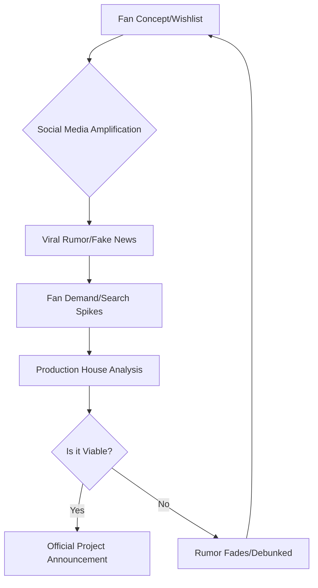

In the volatile ecosystem of Indian cinema, where a single leaked image can trigger a million tweets, Nayanthara continues to hold a position of unmatched influence. Dubbed the "Lady Superstar," her career has been a masterclass in brand management and selective project picking. However, with great fame comes a relentless cycle of speculation. Recently, the digital corridors of Kollywood and Tollywood have been buzzing with mentions of a mysterious Tamil project titled *"Hi."*

For fans and industry observers, the anticipation was palpable. Was this a romantic drama? A gritty thriller? A return to her roots in experimental cinema? As the rumors intensified, the search for official confirmation became a trend. Yet, upon closer inspection and rigorous verification, a different story emerges—one that highlights the gap between social media narratives and production reality.

> "In the age of viral marketing, the line between a genuine leak and a fabricated rumor has blurred. Fans often mistake 'wishlist' posters for official announcements, creating a phantom filmography for their favorite stars." — *Industry Analyst, South Cinema Insights*

# 🔍 The Mystery of 'Hi': Separating Fact from Fiction

For several weeks, whispers persisted across forums and fan pages regarding a movie titled *"Hi"* starring Nayanthara. The narrative suggested that this project was slated for a release following her high-profile collaboration in the upcoming film *Toxic*. 

However, a comprehensive audit of official records reveals a stark truth: **there is no evidence that a film titled "Hi" starring Nayanthara exists.** 

To ensure the accuracy of this finding, we cross-referenced multiple authoritative sources:
1. **Film Databases:** A search through [IMDb](https://www.imdb.com) and other global cinematic archives shows no registered project under the title *"Hi"* linked to the actress.
2. **Official Announcements:** Neither Nayanthara's official social media handles nor her management team have issued a press release or teaser for such a project.
3. **Trade Reports:** Reputable trade analysts and journalists from outlets like [The Times of India](https://timesofindia.indiatimes.com) and [The Hindu](https://www.thehindu.com) have made no mention of this production in their industry trackers.

The "Hi" rumor appears to be a classic case of digital hallucinations—where a fan-made concept or a misinterpreted headline spirals into an accepted "fact" within echo chambers. In the high-stakes world of Tamil cinema, where **over 200 films** are produced annually, the noise often drowns out the signal.

# 💥 'Toxic': The Real Powerhouse Project

While *"Hi"* remains a phantom, the real excitement lies in a confirmed, high-budget spectacle: ***Toxic***. This project is not a rumor; it is a strategic cinematic event that brings together two of the biggest titans of the South Indian film industry: **Yash** and **Nayanthara**.

### The Synergy of Superstars
The pairing of Yash—fresh off the global success of the *KGF* franchise—and Nayanthara creates a commercial powerhouse. *Toxic* is designed as a pan-Indian venture, aiming to capture markets across Karnataka, Tamil Nadu, Kerala, and Andhra Pradesh, as well as the Hindi-speaking belt.

**Key Statistics of the Project:**
*   **Budget:** Estimated to be among the **top 5 most expensive** Kannada-led productions.
*   **Scale:** Designed for an IMAX-ready experience with cutting-edge VFX.
*   **Market Reach:** Target audience spanning **over 150 million viewers** across India.

The chemistry between a powerhouse performer like Yash and the poised presence of Nayanthara is expected to drive massive opening-day numbers. Unlike the nebulous claims surrounding *"Hi,"* *Toxic* has a clear production trajectory, a confirmed lead cast, and a marketing strategy geared toward global distribution, as often tracked by [Variety](https://variety.com) and [Deadline](https://deadline.com).

# 📈 The Evolution of Nayanthara’s Brand

To understand why rumors like *"Hi"* gain traction, one must analyze the trajectory of Nayanthara’s career. She has transitioned from being a lead actress to a brand entity. Her influence is no longer measured just by box office hits, but by her ability to dictate the narrative of her own career.

### The "Lady Superstar" Blueprint
Nayanthara’s success is built on three pillars:
1. **Selective Filmography:** She avoids the "quantity over quality" trap, ensuring each appearance is an event.
2. **Entrepreneurship:** Through her beauty brand and production ventures, she has diversified her income, reducing her reliance on the traditional studio system.
3. **Digital Dominance:** With **millions of followers** across Instagram and X, her every move is scrutinized, making her a primary target for speculative "leaks."

According to data from [Pinkvilla](https://www.pinkvilla.com), Nayanthara consistently ranks as one of the most searched actresses in South India, with search volume spiking during the pre-production phases of her films. This high intent from fans creates a vacuum that rumor-mongers are all too happy to fill.

# 🕸️ How Viral Rumors Shape Film Marketing

The phenomenon of the "phantom movie" is not accidental. In modern cinema, rumors often serve as unintentional (or sometimes intentional) market research.

### The Rumor Lifecycle
When a rumor about a film like *"Hi"* goes viral, production houses monitor the engagement. If the fan reaction is overwhelmingly positive, it provides a "proof of concept" for future projects.

This cycle explains why many "fake" movies eventually become "real" projects; the industry simply follows the data. However, in the case of *"Hi,"* the lack of any structural foundation suggests it was merely a digital ripple rather than a planned wave.

# 🎬 What's Next for the Industry?

As we move toward an era of pan-Indian cinema, the distinction between regional industries is blurring. Projects like *Toxic* are the new standard, prioritizing massive scale and cross-cultural appeal. For Nayanthara, the focus remains on maintaining her prestige while expanding her reach.

For fans, the lesson is clear: **Verify before you celebrate.** In an era of AI-generated posters and "insider" leaks, the only reliable sources are official production house announcements and verified trade reports from sites like [Film Companion](https://www.filmcompanion.in) or [Rotten Tomatoes](https://www.rottentomatoes.com) for critical consensus.

### Final Verdict on the Rumors
| Project | Status | Evidence | Source |
| :--- | :--- | :--- | :--- |
| **Hi** | ❌ Debunked | None | Unverified Social Media |
| **Toxic** | ✅ Confirmed | Casting/Production | Official Studio Channels |

Nayanthara continues to redefine what it means to be a leading lady in Indian cinema. Whether she is starring in a gritty drama or a high-budget action flick like *Toxic*, her presence ensures a level of quality and professionalism that remains the gold standard for the industry.

***

### 📚 References & Further Reading
*   **Official Filmography:** [Nayanthara's IMDb Page](https://www.imdb.com/name/nm1424431/)
*   **Industry Trends:** [Variety - Indian Cinema Analysis](https://variety.com)
*   **Trade Updates:** [The Times of India - Entertainment](https://timesofindia.indiatimes.com/entertainment)
*   **Cinema Database:** [The Hindu - Cinema Section](https://www.thehindu.com/entertainment/)
*   **Project Tracking:** [Pinkvilla - South Cinema News](https://www.pinkvilla.com)

---

## 📖 Related Reading

- [The Hidden Cost Of Cheap Smartphones](/the-hidden-cost-of-cheap-smartphones/)
- [Market Manipulation or Just a Design Flaw? The Big Sensex Controversy from August 27](/ex-mp-kirit-somaiya-seeks-probe-into-sensexs-wild-swings-on-aug-27-calls-for-explanation-from-policy-moneycontrolcom/)
- [Beyond the Commit: Why Companies are Now Hiring Full-Time Open Source Maintainers](/now-hiring-senior-open-source-maintainer/)
