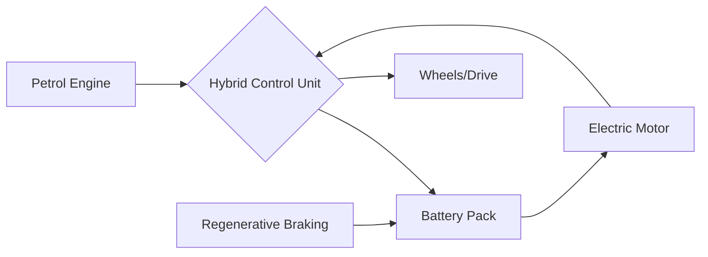

Lexus is redefining the executive sedan landscape in India with the official launch of the **ES 300h**. In a market typically dominated by the thirst for high-displacement petrol and diesel engines, the ES 300h arrives as a disruptive force, proving that uncompromising opulence and environmental consciousness can coexist in a single chassis.

  
  
 <a href="https://unsplash.com/@livingbydesign94">CJ Brown</a> on <a href="https://unsplash.com/photos/a-black-car-parked-in-a-parking-lot-T_3qcKH6P5M">Unsplash</a>

Priced at **Rs 66.10 lakh** (ex-showroom), this executive saloon is capturing attention not merely for its prestige, but for its staggering claimed efficiency of **25.22 kmpl**. For the modern Indian professional, the ES 300h represents a shift toward "intelligent luxury"—where the status symbol is no longer just the badge on the hood, but the efficiency of the engineering beneath it [autocarindia.com](https://www.autocarindia.com).

---

### ⚙️ The Hybrid Heart: Engineering a Seamless Drive

At the core of the ES 300h is a sophisticated self-charging hybrid system. Unlike Plug-in Hybrid Electric Vehicles (PHEVs) that require external charging infrastructure—which remains sporadic across many Indian cities—the ES 300h is entirely autonomous. It leverages regenerative braking and the internal combustion engine to keep its battery topped up.

The powertrain consists of a **2.5-litre naturally aspirated four-cylinder petrol engine** meticulously paired with a high-efficiency electric motor [zigwheels.com](https://www.zigwheels.com). This synergy allows the vehicle to operate in pure EV mode during low-speed city crawls and switch seamlessly to the petrol engine for highway cruising.

The result is an ARAI-certified mileage of **25.22 kmpl**, a figure that is virtually unprecedented for a luxury sedan of this size. By eliminating the "range anxiety" associated with full EVs while slashing fuel costs compared to traditional luxury engines, Lexus has created a pragmatic masterpiece for the Indian urban sprawl.

---

### 🏯 Omotenashi: A Sanctuary on Wheels

Stepping inside the ES 300h is less like entering a car and more like entering a curated sanctuary. Lexus employs the Japanese philosophy of *Omotenashi*—the art of selfless hospitality—ensuring every touchpoint is designed for the guest's comfort before they even realize they need it.

The cabin is a masterclass in tactile luxury, featuring hand-finished leather, authentic wood trim, and a layout designed to minimize cognitive load and maximize serenity.

**Key Interior Highlights:**
*   **Intuitive Interface:** The centerpiece is a high-resolution **12.3-inch touchscreen infotainment system** that integrates seamless connectivity and vehicle diagnostics [carandbike.com](https://www.carandbike.com).
*   **Acoustic Perfection:** For the audiophile, the optional **Mark Levinson sound system** utilizes meticulously placed speakers to create a three-dimensional soundstage, isolating passengers from the cacophony of external traffic.
*   **Executive Comfort:** The rear cabin is designed for those who prefer to be chauffeured. With ample legroom, climate-controlled seats, and independent ventilation, the "boss seat" provides a level of relaxation that rivals first-class air travel.

> "The ES 300h doesn't just transport you from point A to point B; it provides a zen-like environment that systematically isolates the cabin from the chaos of Indian metropolitan traffic."

---

### 💎 Design: The Art of the Spindle

Visually, the ES 300h is an exercise in avant-garde elegance. It eschews the understated look of some of its competitors in favor of a bold, unmistakable identity. The defining feature is the **signature spindle grille**, which gives the fascia a commanding presence while remaining aerodynamically optimized.

The vehicle's profile is characterized by a sweeping roofline and a long wheelbase, emphasizing its role as an executive cruiser rather than a sporty sedan. Every curve is intentional; the sleek silhouette reduces the drag coefficient, which directly contributes to the vehicle's industry-leading fuel economy [timesofindia.indiatimes.com](https://timesofindia.indiatimes.com).

From the sharp LED lighting signatures to the refined alloy wheels, the ES 300h balances aggressive styling with the grace expected of a flagship Lexus sedan.

---

### 🏁 Market Positioning: Challenging the German Hegemony

Positioned at **Rs 66.10 lakh**, the ES 300h enters a battlefield occupied by the Mercedes-Benz E-Class and the BMW 5 Series. While the German trio has long held the crown for raw performance and brand prestige, Lexus is pivoting the conversation toward **reliability, sustainability, and total cost of ownership**.

| Feature | Lexus ES 300h | German Rivals (Average) |
| :--- | :--- | :--- |
| **Fuel Efficiency** | **25.22 kmpl** | 12-16 kmpl |
| **Powertrain** | Self-Charging Hybrid | Diesel / Petrol / PHEV |
| **Core Focus** | Reliability & Zen Comfort | Performance & Driving Dynamics |
| **Ownership Experience** | High Reliability / Low Maintenance | High Performance / Higher Service Cost |

For the buyer who views their vehicle as a tool for stress-free mobility rather than a track toy, the ES 300h is the superior choice. It offers a "hassle-free" ownership experience that leverages Lexus's global reputation for bulletproof reliability [cardekho.com](https://www.cardekho.com).

---

### 🎯 Final Verdict: The Intelligent Choice

The Lexus ES 300h is more than a luxury sedan; it is a statement of intent. By delivering **25.22 kmpl** in a package that costs **Rs 66.10 lakh**, Lexus is targeting a sophisticated demographic: the professionals who value peace, quiet, and ecological responsibility over the roar of a V6 engine.

As India accelerates its transition toward greener mobility, the ES 300h serves as the perfect bridge. It offers the prestige of a top-tier luxury badge with the conscience of a hybrid, making it perhaps the most sensible high-end purchase available in the Indian market today [lexusindia.co.in](https://www.lexusindia.co.in).

---

## 📖 Related Reading

- [🌟 The Lady Superstar's Current Trajectory: Navigating the Hype](/why-did-nayanthara-choose-to-release-tamil-film-hi-after-toxic/)
- [The Hidden Cost Of Cheap Smartphones](/the-hidden-cost-of-cheap-smartphones/)
- [Market Manipulation or Just a Design Flaw? The Big Sensex Controversy from August 27](/ex-mp-kirit-somaiya-seeks-probe-into-sensexs-wild-swings-on-aug-27-calls-for-explanation-from-policy-moneycontrolcom/)
