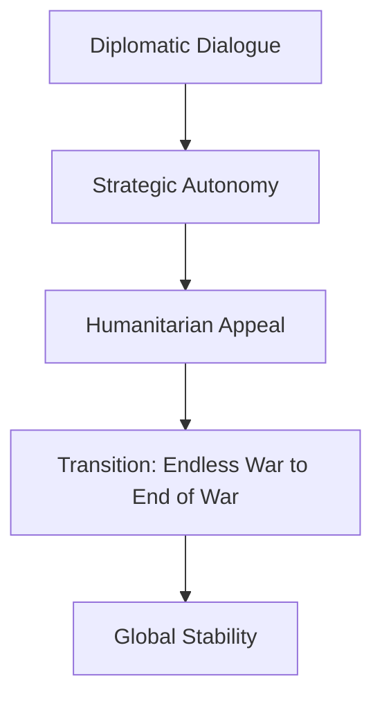

On **August 31, 2026**, Prime Minister Narendra Modi delivered a profound and urgent message of peace to Russian President Vladimir Putin. The two leaders met on the sidelines of the Shanghai Cooperation Organisation (SCO) summit in Bishkek, Kyrgyzstan, amidst a global climate of heightened geopolitical tension. 

  
  
 <a href="https://unsplash.com/@sudhakarchandra">Sudhakar Chandra</a> on <a href="https://unsplash.com/photos/man-waving-to-crowd-at-stadium-with-cameras-qxqCpUkyhsI">Unsplash</a>

The central thesis of PM Modi’s discourse was a critical push to transition from an "endless war" to the "end of war." He argued that the protracted conflicts in Ukraine and the Middle East are not merely regional disputes but are systemic barriers holding back the collective progress of humanity. This meeting underscores India's commitment to its independent foreign policy, positioning the nation as a diplomatic bridge in an increasingly polarized world.

---

### 🌍 The Humanitarian Imperative: People Over Power
The cornerstone of the dialogue was PM Modi’s appeal for an immediate cessation of hostilities. Drawing upon India's philosophical heritage—citing the legacies of Mahatma Gandhi and Gautam Buddha—the Prime Minister emphasized that sustainable global stability can only be achieved through peace, not through the attrition of war.

> “Any day spent in war pushes humanity backward; one step towards peace brings hope. We have to move from endless war to the end of war, which is in humanity’s interest,” PM Modi stated during the high-level meeting [Moneycontrol](https://www.instagram.com/p/DctVcNACSls).

Rather than focusing on the political victory of one side over another, Modi pivoted the conversation toward the staggering human cost. He stressed that every day a conflict continues, it effectively stagnates human progress and diverts resources from development to destruction, making a peaceful resolution a "call of humanity" [News18](https://www.youtube.com/watch?v=pQPNayx9M0g).

---

### ⚖️ Strategic Autonomy: The Indian Diplomatic Blueprint
The Bishkek encounter serves as a quintessential illustration of India's "Strategic Autonomy." While many Western nations have adopted a policy of strict isolation toward Russia, India has maintained a nuanced channel of communication with all primary stakeholders to facilitate a diplomatic exit.

This approach is not merely about preserving a legacy partnership with the Kremlin; it is a calculated balancing act intended to prevent the world from fracturing into two irreconcilable blocs. According to analysis from [News18](https://www.youtube.com/watch?v=pQPNayx9M0g), India's decision to engage with both President Putin and the Iranian President—despite significant pressure from the United States—demonstrates a foreign policy that is independent and prioritized around India's national interests.

By refusing to be pigeonholed into a specific alliance, India ensures it remains a credible interlocutor that both the West and the East can trust for mediation.

---

### 🤝 SCO Synergy and Bilateral Strengthening
The SCO summit in Kyrgyzstan provided the necessary neutral ground for this critical exchange. Beyond the immediate crisis in Ukraine, the leaders focused on the resilience of the India-Russia partnership, discussing the acceleration of economic ties and the implementation of agreements reached at previous business forums.

This encounter marked the **second major meeting** between the two leaders since December 2025, signaling that the strategic partnership remains robust despite global headwinds [News18](https://www.youtube.com/watch?v=pQPNayx9M0g). Both leaders reaffirmed their commitment to safeguarding their respective national interests while collaboratively enhancing trade and regional security for the benefit of their citizens [DD News](https://www.facebook.com/DDNews/posts/prime-minister-narendra-modi-held-extensive-discussions-with-russian-president-v/1512774704210746).

**Key Focus Areas of the Meeting:**
*   **Economic Integration:** Exploring new trade corridors and payment mechanisms.
*   **Regional Security:** Collaborative efforts to combat terrorism and instability in Central Asia.
*   **Humanitarian Aid:** Addressing the fallout of conflict on civilian populations.

---

### 🚀 Looking Ahead: BRICS and the Global South
The discussions in Bishkek are viewed as a critical precursor to the upcoming BRICS summit, which India is scheduled to host. The formal invitation extended to President Putin and the Russian delegation is expected to further cement bilateral ties and enhance the cohesive power of the BRICS bloc [India Global Review](https://www.youtube.com/watch?v=_XXJkypzJ1U).

By linking the SCO dialogues to the future BRICS summit, India is consolidating its role as a leading voice for the "Global South." The objective is clear: to transition the global order away from a state of perpetual crisis and toward a framework of lasting peace, where global leadership is defined by cooperation and mutual respect rather than military dominance [Instagram](https://www.instagram.com/reel/DctZI1Jlb6k).

---

### 🏁 Conclusion: A Victory for Peace
PM Modi's appeal to President Putin to shift from "endless war" to the "end of war" transcends traditional diplomatic rhetoric; it is a strategic plea to protect the future of human civilization. By leveraging its position of neutrality and its historical commitment to non-violence, India continues to advocate for a world where dialogue replaces drones and diplomacy replaces destruction.

As the world anticipates the next BRICS summit, the meeting in Bishkek serves as a poignant reminder that in the modern era, the only victory that truly lasts is one achieved through peace.

---

## 📖 Related Reading

- [🔋 The Fuel-Sipping Luxury King: Lexus ES 300h Hits Indian Roads](/lexus-es-350h-launched-in-india-at-rs-6610-lakh-claims-2522kmpl-efficiency/)
- [🌟 The Lady Superstar's Current Trajectory: Navigating the Hype](/why-did-nayanthara-choose-to-release-tamil-film-hi-after-toxic/)
- [The Hidden Cost Of Cheap Smartphones](/the-hidden-cost-of-cheap-smartphones/)
