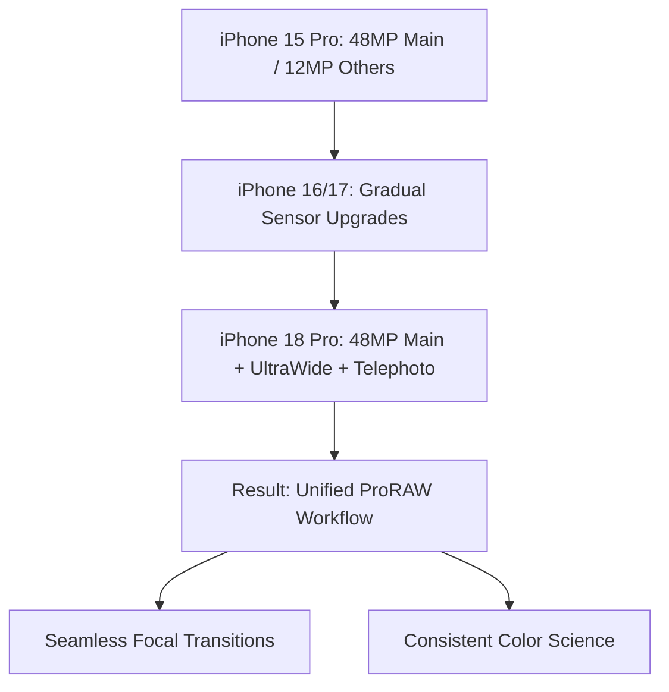

You know how every September, the global tech ecosystem descends into a fever pitch of anticipation for Apple's keynote? While the crowd focuses on the incremental shifts of the current year, a far more seismic shift is gathering momentum on the horizon. Based on supply chain leaks, industry roadmaps, and architectural trends, the **iPhone 18 Pro and iPhone 18 Pro Max** (expected in 2026) are positioned to be the most significant leap in hardware since the transition to Apple Silicon.

  
  
 <a href="https://unsplash.com/@tracminhvu">Trac Vu</a> on <a href="https://unsplash.com/photos/white-pendant-lamp-turned-off-Yut0WQE3jzs">Unsplash</a>

We aren't just talking about a slightly faster clock speed or a new chassis color. We are anticipating a fundamental shift in semiconductor physics with **2nm architecture**, a unified **48MP camera trifecta**, and a hardware foundation specifically engineered for the era of on-device Generative AI.

---

### ⚡ The A20 Bionic: TSMC's 2nm Architectural Breakthrough

The undisputed centerpiece of the iPhone 18 Pro series will be the **A20 Bionic chip**. For several generations, Apple has meticulously refined the 3nm process, squeezing every single drop of efficiency out of the architecture. However, the move to **2nm (N2 process)** represents a "step-function" change rather than a linear improvement.

#### The Magic of Nanosheet Transistors
The transition to 2nm is not just about making things smaller; it's about changing the shape of the transistor. TSMC is moving from FinFET (Fin Field-Effect Transistors) to **GAAFET (Gate-All-Around Field-Effect Transistors)**, specifically using a "nanosheet" design. In a FinFET, the gate wraps around the channel on three sides. In GAAFET, the gate completely surrounds the channel on all four sides.

**Why this matters for the average user:**
*   **Extreme Efficiency:** Lower leakage current means your battery lasts longer even under heavy load.
*   **Higher Performance:** Faster switching speeds allow for higher clock frequencies without overheating.
*   **Thermal Management:** Reduced power waste means the dreaded "thermal throttling" during 8K video recording or AAA gaming (like Resident Evil or Death Stranding) becomes a thing of the past.

According to [TSMC's official roadmap](https://www.tsmc.com), mass production for these 2nm chips is slated for 2025. This timeline aligns perfectly with a late 2026 launch. We expect the A20 to deliver a **15-20% increase in speed** and a **30% reduction in power consumption** compared to its 3nm predecessors.

> "The shift to 2nm isn't merely an iteration; it is the key that unlocks the next tier of on-device intelligence. By packing billions more transistors into the same footprint, Apple can integrate massive Neural Engine clusters without compromising the device's thin profile."

---

### 📸 The 48MP Trifecta: A New Era of Computational Photography

For years, Apple has played a game of "sensor catch-up," upgrading the Main lens to 48MP, then the Ultra-Wide, and finally the Telephoto. By the iPhone 18 Pro, the vision of a **Unified ProRAW Workflow** will finally be realized through the **"48MP Trifecta."**

#### Consistent Resolution Across the Board
When the Main, Ultra-Wide, and Periscope Telephoto lenses all share **48-megapixel sensors**, the user experience changes fundamentally. Currently, switching from 1x to 5x zoom often results in a noticeable "jump" in color science, noise levels, and detail. With three matching high-resolution sensors, the transition becomes seamless.

**The Technical Impact:**
1.  **Unified Detail:** Every shot, regardless of focal length, can be captured in **48MP ProRAW**, allowing professional photographers to crop deeply into a telephoto shot without losing critical detail.
2.  **Enhanced Digital Zoom:** A 48MP telephoto sensor allows for much higher quality "in-sensor" cropping, potentially pushing usable digital zoom further than ever before.
3.  **Real-time HDR Fusion:** Leveraging the A20 chip, the iPhone 18 Pro will likely process data from all three sensors simultaneously, blending them into a single, hyper-detailed image with perfect dynamic range.

For more on how this compares to current industry standards, check out the [evolution of mobile image sensors](https://en.wikipedia.org/wiki/Image_sensor).

---

### 🧠 Intelligence Expanded: The RAM War and On-Device LLMs

The introduction of **Apple Intelligence** has shifted the hardware requirements for iPhones. While early AI features relied heavily on "Private Cloud Compute," the long-term goal is **Edge AI**—where the Large Language Model (LLM) lives and breathes entirely on your device.

#### The Memory Bottleneck
AI models are notoriously memory-hungry. To run a sophisticated LLM locally, the device needs massive amounts of high-speed RAM to store the model's weights. While current Pro models typically feature 8GB of RAM, the iPhone 18 Pro is rumored to jump to **12GB or even 16GB of LPDDR5X RAM**.

**The Benefits of 16GB RAM in a Smartphone:**
*   **Zero Latency:** Your AI assistant responds instantly because it doesn't have to "call home" to a server.
*   **Enhanced Privacy:** Your data never leaves the device, making the iPhone the gold standard for secure AI.
*   **Multitasking Mastery:** More RAM means more apps stay "frozen" in the background, eliminating the need for apps to reload when you switch back to them.

This shift effectively turns the iPhone into a **pocket-sized AI workstation**, capable of summarizing hours of meetings, generating complex images, and managing your entire digital life using a local, private brain.

---

### 📱 The Vanishing Notch: Under-Display Innovation

Apple is famously cautious with design changes, but the iPhone 18 Pro may finally be the moment the **Dynamic Island** retires. The industry is moving toward **Under-Display Face ID (UD-FaceID)**, a technology that allows sensors to "see" through the pixels of the OLED screen.

#### How it Works
By utilizing a specialized OLED layer with higher transparency in specific areas, Apple can hide the infrared camera and dot projector beneath the display. When not in use, the pixels over the sensors look like any other part of the screen. When Face ID is triggered, the sensors read the light passing through the gaps in the pixel grid.

According to [industry trends in OLED transparency](https://www.macrumors.com), the challenge has always been maintaining display quality. If the pixels are too sparse to let light through, you get a "screen door" effect. However, with the advancements in **LTPO 4.0 panels**, Apple is close to solving this.

**The Result:** A truly edge-to-edge, "all-screen" experience where the only visible interruption is a tiny, pinpoint hole for the front-facing camera—or perhaps a fully under-display camera as well.

---

### 🔋 Connectivity and Energy: The Unsung Heroes

While the chip and camera steal the headlines, the iPhone 18 Pro will likely introduce critical updates to connectivity and power. With the rollout of **Wi-Fi 7**, we can expect speeds that rival wired ethernet, reducing latency for cloud gaming and massive file transfers.

Furthermore, there are whispers about Apple exploring **stacked battery technology**. Instead of traditional layers, stacked batteries allow for higher energy density in the same physical volume. This could mean a **10-15% increase in actual battery capacity** without making the phone thicker.

---

### 🏁 Final Verdict: A Generational Leap

For the past few years, the iPhone upgrade cycle has felt like a game of inches—a slightly faster chip, a slightly better lens, a slightly brighter screen. But the iPhone 18 Pro is shaping up to be a game of miles.

**Summary of the "Leap" Factors:**
*   **Processing:** 3nm $\rightarrow$ **2nm GAAFET** (The biggest architectural shift in a decade).
*   **Photography:** Mixed Sensors $\rightarrow$ **48MP Unified Trifecta**.
*   **Intelligence:** Cloud-reliant AI $\rightarrow$ **Local 16GB RAM LLM**.
*   **Design:** Dynamic Island $\rightarrow$ **Under-Display Face ID**.

If you are currently using an iPhone 13 or 14, the incremental updates of the 15, 16, and 17 might feel negligible. However, the iPhone 18 Pro represents the convergence of three massive technological shifts: the 2nm era, the Generative AI explosion, and the all-screen design philosophy. It won't just be a new phone; it will be a fundamentally different tool for the modern age.

For those tracking the latest in semiconductor physics, [AnandTech](https://www.anandtech.com) and [9to5Mac](https://9to5mac.com) remain the best resources for deep-dive technical verification as we approach 2026.

***

**Quick Stats Comparison Table**

| Feature | iPhone 15 Pro | iPhone 18 Pro (Predicted) | Impact |
| :--- | :--- | :--- | :--- |
| **Node Process** | 3nm | **2nm (Nanosheet)** | $\uparrow$ Efficiency / $\downarrow$ Heat |
| **RAM** | 8GB | **12GB - 16GB** | $\uparrow$ On-Device AI Power |
| **Cameras** | 48 / 12 / 12 MP | **48 / 48 / 48 MP** | $\uparrow$ Image Consistency |
| **Display** | Dynamic Island | **Under-Display Face ID** | $\uparrow$ Screen Real Estate |
| **AI** | Cloud-Hybrid | **Native Edge AI** | $\uparrow$ Privacy & Speed |

---

## 📖 Related Reading

- [Supreme Court Stays Fir Against Uttarakhand Gym Owner ‘Mohd’ Deepak](/supreme-court-stays-fir-against-uttarakhand-gym-owner-mohd-deepak/)
- [🇯🇵 The Evolution of Effort: Navigating Japan's Labor Landscape under PM Shigeru Ishiba](/back-to-the-grind-workaholic-pm-takaichi-eases-japans-overtime-curbs/)
- [🕊️ From 'Endless War' to 'End of War': PM Modi’s Urgent Plea to Putin at the SCO](/pm-modis-gives-peace-message-to-putin-on-ukraine-at-sco-meet-move-from-endless-war-to-end-of-war/)
