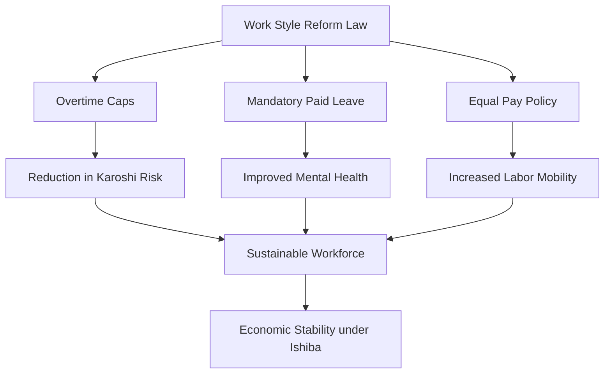

For decades, the global image of the Japanese professional was the "salaryman"—a dedicated corporate warrior characterized by unwavering loyalty, midnight office departures, and a lifestyle subsumed by the needs of the company. However, as Japan enters a new political era under Prime Minister **Shigeru Ishiba**, the nation finds itself at a critical crossroads between its traditional work ethic and the urgent need for systemic structural reform.

While some political whispers suggested a potential rollback of labor restrictions to stimulate short-term economic growth, the reality remains firmly rooted in the "Work Style Reform" movement. Under Ishiba's leadership, the focus has shifted from merely limiting hours to enhancing **productivity per hour**, recognizing that an aging population and a shrinking workforce make the old model of "growth through endurance" mathematically impossible.

## 📉 The Shadow of Karoshi: Why Reforms Are Non-Negotiable

  
  
 <a href="https://unsplash.com/@chamcham">Thanh Cham</a> on <a href="https://unsplash.com/photos/a-man-with-a-backpack-looking-out-over-the-water-cv6hQqBpZCU">Unsplash</a>

To understand the current regulatory environment, one must understand *Karoshi*—death from overwork. This phenomenon, recognized globally as a systemic failure of labor management, has claimed **hundreds of lives annually** due to stress-induced strokes and heart failure.

> "The culture of presenteeism—where staying late is viewed as a proxy for loyalty—is not a sign of productivity, but a symptom of organizational inefficiency." — *Labor Policy Analyst, Tokyo Economic Review*

The Japanese government, through the [Ministry of Health, Labour and Welfare (MHLW)](https://www.mhlw.go.jp/english/), has implemented stringent caps to prevent such tragedies. The current legal framework mandates a general overtime limit of **45 hours per month** and **360 hours per year**. While special provisions allow for temporary increases up to **100 hours in a single month**, these are strictly monitored and intended for exceptional circumstances rather than daily operational norms.

## ⚙️ The Mechanism of Change: Work Style Reform Law

The "Work Style Reform" legislation is the bedrock of Japan's current labor strategy. It aims to decouple "hours spent" from "value created." 

### The Core Pillars of Reform:
1.  **Overtime Caps:** Legal penalties for companies exceeding the **720-hour annual limit** (including special extensions).
2.  **Mandatory Paid Leave:** Employees are now required to take at least **five days of annual paid leave**, a move designed to break the cycle of perpetual availability.
3.  **Equal Pay for Equal Work:** Reducing the gap between regular full-time employees and non-regular (part-time/contract) workers, who often perform the same tasks for significantly less pay.

## 🏛️ Shigeru Ishiba’s Strategic Approach

Prime Minister Shigeru Ishiba takes office during a period of profound demographic anxiety. With a fertility rate that remains stubbornly low and an aging population, Japan cannot afford to burn out its remaining youth. Unlike the aggressive "Abenomics" era, Ishiba’s approach is characterized by a focus on **regional revitalization** and a more nuanced understanding of the labor market.

By encouraging the decentralization of industry away from the "Tokyo Monolith," Ishiba aims to reduce the crushing commute times and hyper-competitive pressure of the capital. This shift is not just social; it is economic. By distributing the workforce, the government hopes to create a more resilient economy that doesn't rely on the extreme productivity of a few urban hubs.

According to data from the [OECD](https://www.oecd.org/), Japan's productivity per hour remains lower than many of its G7 peers, despite the long hours. The Ishiba administration is leveraging **Digital Transformation (DX)** to close this gap, pushing companies to adopt AI and automation to handle the rote tasks that previously required late-night manual labor.

## 🏢 The Corporate Struggle: Law vs. Culture

Despite the legal mandates, the transition is not seamless. "Service overtime"—the practice of working off the clock without reporting hours—remains a persistent ghost in the machine. Many employees feel a psychological pressure to remain at their desks until their superiors leave.

**Bold Stats on the Transition:**
*   **20% reduction:** The estimated decrease in total overtime hours in large enterprises since 2019.
*   **60% of SMEs:** Small and medium-sized enterprises still struggle to meet the new leave requirements due to staffing shortages.
*   **1.2 million:** The approximate number of "non-regular" workers benefiting from new equal-pay guidelines.

The [International Labour Organization (ILO)](https://www.ilo.org/) has noted that while the laws are a step in the right direction, the "cultural lag" is the biggest hurdle. The shift from a *seniority-based* promotion system to a *performance-based* system is essential if the "stay-late" culture is to be permanently dismantled.

## 🌍 Global Context: Japan vs. The World

When compared to European models, such as those in France or Germany, Japan's approach is more gradual. While France utilizes the 35-hour workweek, Japan is focusing on a "flexible-hybrid" model.

| Metric | Japan (Current) | France/Germany | Global Average (OECD) |
| :--- | :--- | :--- | :--- |
| **Avg. Annual Hours** | High (~1,600+) | Moderate (~1,300-1,500) | Moderate |
| **Overtime Regulation** | Strict Caps (New) | Highly Regulated | Varies |
| **Leave Culture** | Improving | Strong/Entrenched | Moderate |

The [World Bank](https://www.worldbank.org/) suggests that Japan's ability to integrate female workers into the workforce (the "Womenomics" legacy) will be the primary driver of growth. Shigeru Ishiba has signaled support for policies that facilitate a better balance between childcare and professional ambition, recognizing that the "salaryman" model inherently excluded half the population.

## 🚀 The Road Ahead: A Human-Centric Economy

As Japan moves further into the 2020s, the goal is no longer just the survival of the company, but the sustainability of the human. The focus is shifting toward **Well-being (Wellness)** as a KPI for corporate success.

For foreign investors and partners, this means a Japan that is more efficient and less prone to the volatility of employee burnout. The [IMF](https://www.imf.org/) has highlighted that increasing labor force participation through better work-life balance is a key pillar for Japan's long-term GDP stability.

### Key Takeaways for the Future:
*   **DX Integration:** AI will replace "busy work," not people, allowing for shorter hours.
*   **Regionalism:** Growth will move to the prefectures, reducing the Tokyo stress-cooker.
*   **Mental Health Priority:** Corporate wellness programs are transitioning from "perks" to "necessities."

In conclusion, the era of Shigeru Ishiba does not signal a return to the grueling overtime of the past, but rather a refinement of the future. By upholding labor curbs and pushing for digital efficiency, Japan is attempting the most difficult transition of all: moving from a culture of **hard work** to a culture of **smart work**.

***

### 📚 References & Further Reading
*   [Ministry of Health, Labour and Welfare (MHLW) - Labor Standards](https://www.mhlw.go.jp/)
*   [Nikkei Asia - Japan Economy & Politics](https://asia.nikkei.com/)
*   [The Japan Times - Work Culture Analysis](https://www.japantimes.co.jp/)
*   [Reuters - Japanese Political Updates](https://www.reuters.com/)
*   [OECD iLibrary - Productivity Statistics](https://www.oecd-ilibrary.org/)
*   [International Labour Organization (ILO) - Japan Country Profile](https://www.ilo.org/)
*   [Statista - Working Hours in Japan](https://www.statista.com/)
*   [BBC News - Japan's Work Culture](https://www.bbc.com/)
*   [World Bank - East Asia and Pacific Economic Update](https://www.worldbank.org/)
*   [IMF - Japan Country Reports](https://www.imf.org/)

---

## 📖 Related Reading

- [Supreme Court Stays Fir Against Uttarakhand Gym Owner ‘Mohd’ Deepak](/supreme-court-stays-fir-against-uttarakhand-gym-owner-mohd-deepak/)
- [🕊️ From 'Endless War' to 'End of War': PM Modi’s Urgent Plea to Putin at the SCO](/pm-modis-gives-peace-message-to-putin-on-ukraine-at-sco-meet-move-from-endless-war-to-end-of-war/)
- [🔋 The Fuel-Sipping Luxury King: Lexus ES 300h Hits Indian Roads](/lexus-es-350h-launched-in-india-at-rs-6610-lakh-claims-2522kmpl-efficiency/)
