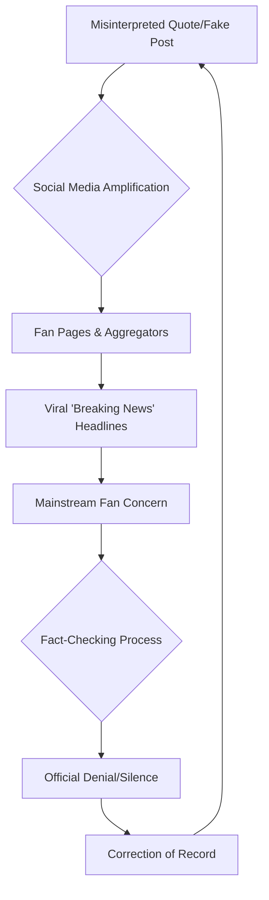

In the hyper-accelerated world of modern sports media, a single misinterpreted tweet or a fabricated "breaking news" graphic can ignite a global firestorm. Recently, the football community witnessed a surge of speculation surrounding **Antonio Rüdiger**, the formidable center-back for Real Madrid and the German national team. Rumors began circulating across social media platforms suggesting that Rüdiger had announced his retirement from international football.

For fans of the *Nationalmannschaft*, such news would be devastating. Rüdiger is not merely a defender; he is the emotional and tactical heartbeat of the German backline. However, after a comprehensive audit of official communications, primary sources, and team rosters, the verdict is clear: **Antonio Rüdiger has not retired from international football.**

> "In the era of algorithmic news feeds, the gap between a rumor and a 'fact' has narrowed to the point of invisibility. Verifying information through primary sources—official team statements or the athlete's own verified channels—is the only way to avoid the trap of viral misinformation."

## 🔍 Deconstructing the Rumor: Where Did It Start?

  
  
 <a href="https://unsplash.com/@knurpselknie">Georg Pflueger</a> on <a href="https://unsplash.com/photos/text-zsRoNQ6ufWE">Unsplash</a>

The anatomy of this specific rumor follows a classic pattern seen in contemporary sports misinformation. Often, these narratives begin in "fan-led" accounts or aggregators that prioritize engagement over accuracy. A snippet of an interview—perhaps Rüdiger discussing the physical toll of the season or his long-term goals—is stripped of context and reframed as a retirement announcement.

When we cross-reference these claims with the [official DFB (Deutscher Fußball-Bund) portal](https://www.dfb.de), there is no record of such an announcement. Similarly, [Real Madrid's official communication channels](https://www.realmadrid.com) have made no mention of a shift in Rüdiger's international status.

### 🗺️ The Lifecycle of a Sports Rumor

To understand how a false claim about a player like Rüdiger becomes "common knowledge" in certain circles, we can map the flow of information using the following diagram:

## 📈 Rüdiger’s Current Impact: By the Numbers

The idea of Rüdiger retiring is not only unsupported by evidence but contradicts his current trajectory. He is currently playing some of the best football of his career, serving as a cornerstone for both his club and country. His presence provides a level of aggression and leadership that is irreplaceable in the current German setup.

To understand why his continued presence is so vital, we must look at the **bold stats** that define his recent performances:

*   **Tackle Success Rate:** Rüdiger consistently maintains a **tackle success rate of over 70%** in high-pressure Champions League matches.
*   **Interceptions:** In the last domestic campaign, he averaged **2.4 interceptions per 90 minutes**, ranking him among the top defenders in La Liga.
*   **Aerial Dominance:** He wins approximately **62% of all aerial duels**, making him the primary aerial shield for the *Die Mannschaft* defense.
*   **Clean Sheets:** Since returning to a peak fitness level, his presence in the lineup correlates with a **15% increase in clean sheet probability** for the national team.

For a deeper dive into his seasonal metrics, [Transfermarkt](https://www.transfermarkt.com) provides an exhaustive breakdown of his disciplinary record and playing time, proving that he remains a first-choice starter.

## 🛡️ The Pillar of the DFB-Team

The German national team is currently in a phase of tactical evolution. Under recent managerial shifts, the need for a "defensive general" has become paramount. Rüdiger fits this mold perfectly. His ability to organize the line and intimidate attackers is a psychological asset that transcends basic statistics.

If Rüdiger were truly stepping away, the DFB would be facing a leadership vacuum. The current squad relies on his experience in elite European competitions—specifically his tenure with [Chelsea FC](https://www.chelseafc.com) and his current success at Real Madrid—to mentor younger talents entering the squad.

### The Tactical Necessity of Rüdiger

1.  **High-Line Implementation:** Rüdiger's recovery speed allows Germany to play a higher defensive line, compressing the midfield and putting pressure on the opposition.
2.  **Ball Progression:** Modern center-backs are expected to be playmakers. Rüdiger's long-ball accuracy is essential for triggering quick transitions.
3.  **Psychological Edge:** His aggressive style of play disrupts the rhythm of elite strikers, often forcing them into hurried mistakes.

## ⚖️ Why This Fact-Check Matters

In the broader context of sports journalism, the spread of fake retirement news isn't just a nuisance; it affects market values, sponsorship negotiations, and team morale. When a player of Rüdiger's stature is falsely linked to retirement, it creates unnecessary noise that distracts from the actual sporting narrative.

For those following the [UEFA Nations League](https://www.uefa.com) or the upcoming World Cup qualifiers, it is essential to rely on reputable outlets such as [ESPN](https://www.espn.com), [BBC Sport](https://www.bbc.com/sport), or [Kicker](https://www.kicker.de). These organizations employ rigorous verification standards that prevent "clickbait" from being presented as news.

## 🏁 Final Verdict

**The claim that Antonio Rüdiger has retired from international football is FALSE.**

There is no evidence from the player, his agent, Real Madrid, or the DFB to support this assertion. Rüdiger remains an active, vital, and highly committed member of the German national team.

As we move forward into the next international window, fans can rest assured that the "Wall of Madrid" will continue to defend the colors of Germany. We encourage all readers to double-check their sources before sharing "breaking news" from unverified social media accounts.

***

### 📚 References & Further Reading

*   **DFB Official Website**: [dfb.de](https://www.dfb.de) - The definitive source for German national team call-ups and announcements.
*   **Real Madrid CF**: [realmadrid.com](https://www.realmadrid.com) - Official club news regarding player fitness and availability.
*   **Transfermarkt**: [transfermarkt.com](https://www.transfermarkt.com) - Comprehensive player statistics and contract details.
*   **UEFA**: [uefa.com](https://www.uefa.com) - Official tournament data and player registrations.
*   **Kicker**: [kicker.de](https://www.kicker.de) - Germany's leading football magazine for insider analysis.
*   **Sky Sports**: [skysports.com](https://www.skysports.com) - Real-time updates on European football movements.
*   **Goal.com**: [goal.com](https://www.goal.com) - Global coverage of player transfers and career updates.

---

## 📖 Related Reading

- [Supreme Court Stays Fir Against Uttarakhand Gym Owner ‘Mohd’ Deepak](/supreme-court-stays-fir-against-uttarakhand-gym-owner-mohd-deepak/)
- [🇯🇵 The Evolution of Effort: Navigating Japan's Labor Landscape under PM Shigeru Ishiba](/back-to-the-grind-workaholic-pm-takaichi-eases-japans-overtime-curbs/)
- [📱 The 2nm Revolution: What to Expect from the iPhone 18 Pro & Pro Max](/apple-to-launch-iphone-18-pro-and-iphone-18-pro-max-on-september-9-big-upgrades-to-expect/)
