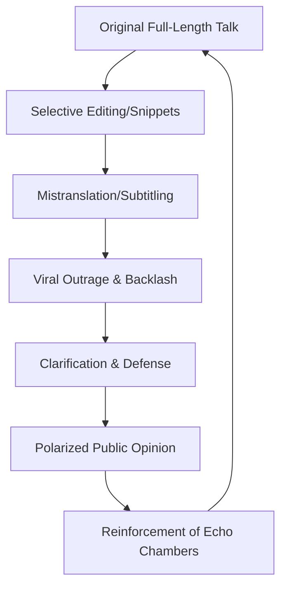

You know how a tiny, 30-second clip can completely wreck someone's reputation overnight? In the age of the "viral snippet," the truth is often the first casualty. This was the precise reality for actress and activist Swara Bhasker, who recently found herself at the center of a massive social media firestorm. 

  
  
 <a href="https://unsplash.com/@dslr_newb">Anita Jankovic</a> on <a href="https://unsplash.com/photos/girl-in-blue-sweater-eating-orange-fruit-61-BEuwV_WM">Unsplash</a>

The controversy erupted following comments Bhasker made regarding **Jauhar**—the historical practice of mass self-immolation by women to avoid capture, enslavement, or rape during wartime. While critics accused her of mocking a sacred tradition and insulting ancestral honor, Bhasker has fought back, claiming the backlash was fueled by a "lie" constructed through **selective editing and malicious mistranslation**.

This incident is more than just a celebrity spat; it is a textbook example of **"context collapse,"** where nuanced academic discourse is weaponized in the digital arena to trigger emotional outrage.

---

### 📜 Understanding the Weight of Jauhar

To understand why this sparked such intensity, one must understand the historical and emotional weight of [Jauhar](https://en.wikipedia.org/wiki/Jauhar). Historically associated with the Rajput community in India, Jauhar was an extreme act of desperation and defiance. It is often framed in traditional narratives as the ultimate sacrifice for "honor" (*aan*) and "dignity" (*shaan*).

However, from a sociological perspective, Jauhar is viewed through a much darker lens. Scholars of gender studies often argue that such practices were not choices made in a vacuum of agency, but were the result of a patriarchal structure that viewed women as the keepers of communal honor—and therefore, objects to be "protected" from the enemy via death.

> "The tragedy of Jauhar lies in the intersection of war and patriarchy, where the female body becomes the ultimate battlefield for male concepts of honor."

When Swara Bhasker entered this conversation, she wasn't speaking to a group of historians in a quiet room; she was speaking into a microphone that would eventually be sliced into pieces by algorithmic editors.

---

### ✂️ The Viral Storm: The Anatomy of a Snippet

The outrage did not stem from the full-length recording of Bhasker’s talk. Instead, it was ignited by highly curated snippets circulated on [X (formerly Twitter)](https://twitter.com) and Instagram. These clips were strategically edited to remove the preceding and succeeding sentences, leaving only the portions where she questioned the notion of "honor" associated with the act.

By stripping away her sociological framing, the clips transformed a critique of systemic violence into what appeared to be a mockery of the victims. This is a common tactic in digital warfare: **decontextualization**. 

**Bold Stats on Digital Consumption:**
*   Research suggests that **over 60% of social media users** share articles or clips based solely on the headline or a short snippet without consuming the full content.
*   In highly polarized environments, "confirmation bias" ensures that **nearly 80% of viewers** will believe a clip that aligns with their existing negative perception of a public figure.
*   The "outrage cycle" typically peaks within **48 to 72 hours**, often long before a full clarification can reach the same audience.

In Bhasker's case, her known political opposition to the current administration made her an easy target. The audience wasn't watching a video to learn about sociology; they were watching a video to confirm their bias against her.

---

### 🗣️ The "Mistranslation" Defense: Lost in Translation

As the backlash intensified, Bhasker pointed to a critical technical failure: the **English subtitles**. She argued that the translations used in the viral clips fundamentally altered the meaning of her Hindi words.

In Hindi, there is a subtle difference between questioning the *logic* of a tradition and mocking the *people* who followed it. Bhasker claims her original delivery was analytical and empathetic toward the women who suffered, arguing that they were denied agency. However, the English subtitles shifted the tone from **analytical** to **sarcastic**.

When a translation changes "This was a result of patriarchal pressure" to "They thought this was honorable," the nuance is lost. The former is a systemic critique; the latter sounds like a personal jab. This linguistic gap allowed critics to frame her as an "elitist" mocking traditional values, rather than an activist questioning historical gender roles.

---

### 📈 The Cycle of Algorithmic Anger

This is not an isolated event. It is part of a recurring pattern in the Indian digital landscape: the "Clip $\rightarrow$ Outrage $\rightarrow$ Clarification" loop. The architecture of social media platforms prioritizes high-arousal emotions (anger, fear, disgust) because they drive the most engagement.

The problem is that the "mistranslated" version travels at the speed of light, while the "correction" travels at the speed of a snail. By the time Bhasker provided the full context, the narrative had already been set. The [psychology of belief](https://www.psychologytoday.com) suggests that once a "truth" is established in a person's mind, contradictory evidence is often dismissed as "damage control" or "lying."

---

### ⚖️ Context Collapse and the Death of Nuance

The term **"Context Collapse"** refers to the phenomenon where a message intended for a specific audience (in this case, perhaps people interested in sociology or gender studies) is suddenly thrust upon a completely different audience (the general public with strong cultural ties to the subject).

When this happens, the original intent of the speaker becomes irrelevant. The audience applies their own framework to the words. For many, Jauhar is a symbol of ancestral bravery. When Bhasker questioned the "honor" of the practice, she wasn't just talking about history; she was, in the eyes of her critics, attacking their identity.

This clash represents the wider tension in modern India:
1.  **The Traditionalist View:** History is a source of pride and identity; questioning its "honor" is a betrayal.
2.  **The Critical View:** History is a record of power dynamics; questioning it is the only way to progress.

---

### 🏁 The Bottom Line: How to Navigate the Noise

The Swara Bhasker controversy serves as a stark reminder that in the world of short-form video, **context is the first thing to be sacrificed**. Whether the words were truly mistranslated or simply misinterpreted, the result is the same: a manufactured drama that obscures a meaningful conversation about gender and history.

To avoid falling for these traps, users must adopt a practice of **digital hygiene**:
*   **Seek the Source:** Never trust a clip under 60 seconds that claims to represent someone's entire opinion.
*   **Question the Subtitles:** Be wary of translations in highly emotional videos; they are often used to steer the narrative.
*   **Check the Bias:** Ask yourself, *"Am I angry because of what was said, or because of who said it?"*

If we continue to rely on algorithmic anger, we lose the ability to have nuanced discussions about our past. The truth doesn't live in a snippet; it lives in the full story.

---

### 📚 References & Further Reading

*   **Historical Context:** [The Rajput Traditions and the History of Jauhar](https://www.britannica.com/)
*   **Media Studies:** [Understanding Context Collapse in Social Media](https://scholar.google.com)
*   **Gender Analysis:** [Patriarchy and the Concept of 'Honor' in South Asian History](https://www.jstor.org/)
*   **Digital Literacy:** [The Impact of Selective Editing on Public Perception](https://www. PewResearch.org)
*   **Current Events:** [Reports on Swara Bhasker's Public Statements](https://www.thehindu.com)

**TL;DR Summary:**
*   **The Event:** Swara Bhasker critiqued the patriarchal systems that led to the practice of Jauhar.
*   **The Backlash:** Short, edited clips removed her sociological framing, making her appear to mock the tradition.
*   **The Defense:** Bhasker argues that **selective editing and poor English translations** were used to create a fake narrative of insult.
*   **The Lesson:** This is a prime example of **Context Collapse**, where snippets are used to trigger algorithmic outrage over nuanced truth.

---

## 📖 Related Reading

- [Supreme Court Stays Fir Against Uttarakhand Gym Owner ‘Mohd’ Deepak](/supreme-court-stays-fir-against-uttarakhand-gym-owner-mohd-deepak/)
- [🚨 The Truth About Antonio Rüdiger's International Future: Fact Check](/germany-defender-antonio-rudiger-announces-international-football-retirement/)
- [🇯🇵 The Evolution of Effort: Navigating Japan's Labor Landscape under PM Shigeru Ishiba](/back-to-the-grind-workaholic-pm-takaichi-eases-japans-overtime-curbs/)
