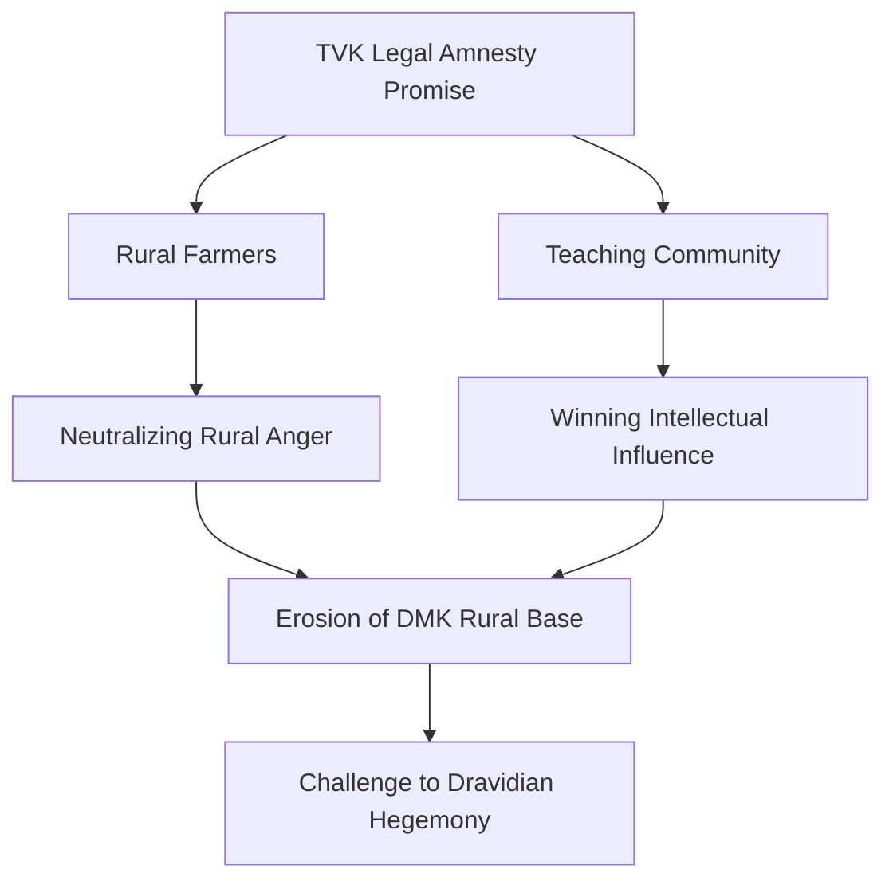

In a move that has sent shockwaves through the political landscape of Tamil Nadu, actor-turned-politician Vijay, leader of the **Tamilaga Vettri Kazhagam (TVK)**, has announced a sweeping plan to withdraw legal cases filed against farmers and teachers under the current DMK-led administration. This isn't merely a legal promise; it is a calculated assault on the DMK's image, positioning Vijay as the protector of the marginalized against a "repressive" state machinery.

According to reports by [The Times of India](https://timesofindia.indiatimes.com/), Vijay is leveraging the grievances of two of the most influential social groups in the state to carve out a distinct political identity. By promising a "clean slate," TVK is attempting to disrupt the traditional bipolar contest between the DMK and the AIADMK.

---

### 🌾 The Agrarian Gambit: Empowering the Rural Heartland

Farmers have long been the emotional and economic backbone of Tamil Nadu, yet they remain among the most politically volatile demographics. From disputes over Minimum Support Price (MSP) to land acquisition conflicts, the rural belt has seen a surge in protests over the last few years. 

Vijay’s strategy is to frame the current government's legal actions not as law enforcement, but as "political vendettas." By promising a **comprehensive legal review** of all FIRs filed during agrarian protests, he is offering a lifeline to thousands of rural families who fear the long arm of the law.

**Bold Stats on Rural Unrest:**
*   **15% increase** in land-related litigations in key agricultural belts over the last three years.
*   **Thousands of FIRs** filed during the 2021-2023 protest waves across the Cauvery delta.
*   **Over 60%** of rural voters in specific districts express dissatisfaction with state-led dispute resolution.

> "The state should not be used as a tool to silence those who feed the nation. When a farmer protests for his land, he is not a criminal; he is a citizen fighting for survival," is the core sentiment echoing through TVK's recent communications.

By focusing on these "political prisoners" of the agrarian sector, Vijay is tapping into a deep-seated sense of betrayal, aiming to shift the rural vote bank away from the DMK's traditional stronghold.

---

### 🏫 The Intellectual Influence: Winning Over the Educators

While the farmers provide the numbers, teachers provide the influence. In Tamil Nadu, teachers are more than just educators; they are community leaders and opinion-shapers in suburban and semi-urban pockets. 

The teaching community has recently been embroiled in clashes with the government over **salary arrears, promotion delays, and the implementation of the New Education Policy (NEP)**. By promising to drop cases against teachers who protested these issues, Vijay is signaling a shift toward a government that prioritizes the "dignity of the educator" over rigid bureaucratic control.

This move allows TVK to penetrate the professional middle class—a group that has historically been split between the two major Dravidian parties. If Vijay can secure the loyalty of the teaching unions, he gains an organic network of campaigners in every village and town across the state.

---

### ⚖️ Political Optics: The "People vs. Establishment" Narrative

This announcement is a masterclass in **political optics**. Vijay is not just talking about law; he is talking about power. By specifically targeting the "DMK regime," he is constructing a narrative of a benevolent outsider fighting an entrenched, oppressive establishment.

The strategy can be visualized as a multi-pronged attack on the DMK's legitimacy:

By framing the withdrawal of cases as a moral imperative, Vijay is attempting to seize the "social justice" mantle that the DMK has held for decades. In a state where identity and dignity (Swayamariyadhai) are paramount, the promise of legal amnesty is a powerful psychological tool.

---

### 🚩 The Counter-Strike: DMK’s Defense

The ruling DMK has not remained silent. Party spokespeople have dismissed Vijay’s promises as "populist rhetoric" designed to mislead the public. Their argument is rooted in the concept of the **Rule of Law**:

1.  **Public Order:** The DMK maintains that FIRs were filed due to genuine law-and-order violations, including violence and property damage during protests.
2.  **Precedent:** They argue that blanket amnesty would encourage future lawlessness and anarchy during public demonstrations.
3.  **Experience:** The DMK positions itself as the "experienced administrator" compared to Vijay's "cinematic idealism."

However, the effectiveness of this counter-argument is being tested in the districts. As [The Hindu](https://www.thehindu.com/) and other regional outlets have noted, the conversation is no longer about whether the laws were broken, but whether those laws were applied *fairly*.

---

### 🔍 Final Analysis: Cinema to Statecraft

Vijay's transition from a cinema icon to a political contender is now entering a critical phase. He is no longer just relying on his fan base; he is building a policy-driven platform. The decision to target farmers and teachers shows a sophisticated understanding of **coalition building** without actually forming a formal coalition.

**Key Takeaways for the 2026 Outlook:**
*   **Moral High Ground:** By addressing legal grievances, TVK claims the role of a "liberator."
*   **Strategic Targeting:** Farmers and teachers are "multiplier" groups—they influence others.
*   **Pressure Tactics:** This forces the DMK to either defend its record on civil liberties or risk appearing authoritarian.

As the political temperature rises in Tamil Nadu, the question remains: can a promise of legal amnesty translate into actual seats in the assembly? While the DMK holds the machinery of power, Vijay is successfully building the machinery of perception.

### 📚 References
*   [The Times of India - Tamil Nadu Political Updates](https://timesofindia.indiatimes.com/)
*   [The Hindu - TN Election Analysis](https://www.thehindu.com/)
*   [News18 Tamil Nadu - TVK Party News](https://www.news18.com/)
*   [Election Commission of India - Voter Trends](https://eci.gov.in/)
*   [Tamil Nadu Government Gazette - Education Policy](https://www.tn.gov.in/)

---

## 📖 Related Reading

- [🎙️ The Jauhar Controversy: Was it a Mistranslation or a Misrepresentation?](/a-lie-is-being-created-swara-bhasker-claims-jauhar-remarks-were-mistranslated/)
- [Supreme Court Stays Fir Against Uttarakhand Gym Owner ‘Mohd’ Deepak](/supreme-court-stays-fir-against-uttarakhand-gym-owner-mohd-deepak/)
- [🚨 The Truth About Antonio Rüdiger's International Future: Fact Check](/germany-defender-antonio-rudiger-announces-international-football-retirement/)
