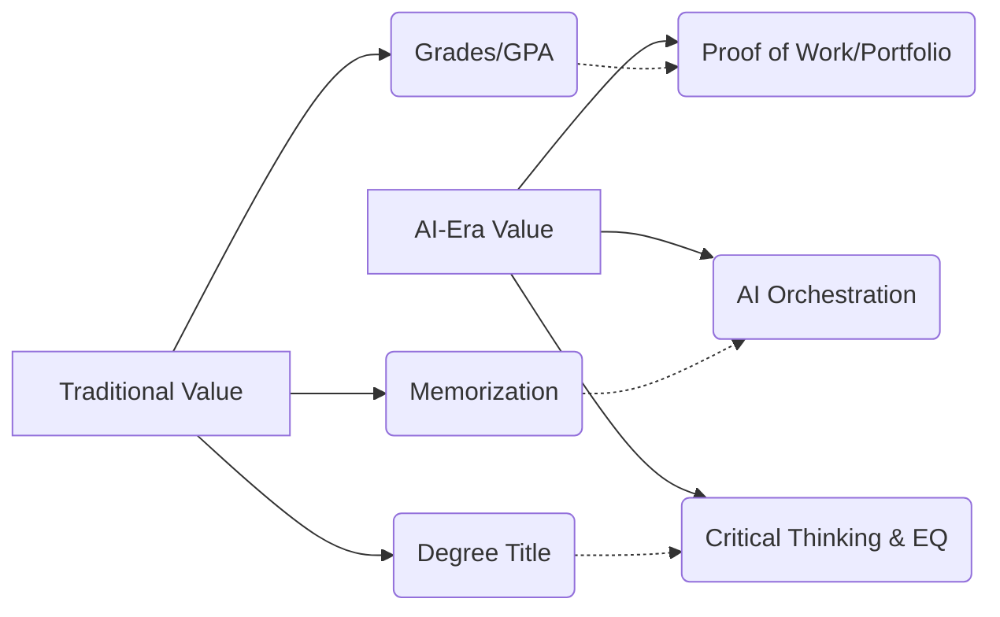

For decades, the prevailing narrative for international students and locals alike has been simple: a degree from a German university is a golden ticket. Whether you are grinding through a rigorous *Diplom* or aiming for a prestigious TU9 technical university, that piece of parchment has traditionally guaranteed a stable, high-paying career and social prestige. In the German "Zertifikatskultur" (certificate culture), the credential was the destination.

  
  
 <a href="https://unsplash.com/@christianlue">Christian Lue</a> on <a href="https://unsplash.com/photos/flag-of-us-a-on-top-of-building-G6RE_to6Lus">Unsplash</a>

But the landscape has shifted beneath our feet. The emergence of Large Language Models (LLMs) has decoupled "knowledge" from "intelligence." When AI can pass the Bar exam, generate production-ready Python code in seconds, and synthesize complex medical literature, the old markers of success—specifically your GPA—lose their signaling power.

The degree still gets you through the door, but your **AI-era skill set** is the only thing that actually lets you into the room.

---

### 🎓 The Grade Trap: Why a 1.0 Isn't Everything Anymore

The German education system is world-renowned for its precision and rigor. For many, the pursuit of the perfect 1.0 GPA is a badge of honor, signaling discipline and intellectual capacity. However, we have entered what I call the "Grade Trap."

Grades primarily measure a student's ability to absorb information, follow strict directions, and perform within a closed system of rules. These are precisely the tasks that AI now handles with superhuman efficiency. When a machine can summarize a 50-page academic paper or solve a multi-variable calculus problem instantly, the value of "knowing the answer" plummets toward zero.

> "The value of education is shifting from the acquisition of knowledge to the application of knowledge in unpredictable environments."

In Germany, this theoretical shift is meeting a harsh economic reality. The country is currently facing a staggering **Fachkräftemangel (skilled labor shortage)**. According to recent data, there are over **170,000 vacant positions in the IT sector alone**, yet many employers report a "competence gap." They are seeing graduates with perfect transcripts who are paralyzed when faced with a messy, real-world project that doesn't have a grading rubric. 

The degree proves you can learn; it no longer proves you can *execute*.

---

### 🤖 From Coder to Conductor: Learning to Orchestrate AI

In the current professional climate, the most critical technical skill is no longer "doing the work"—it is "orchestrating" it. For students of Computer Science or Engineering, the ability to write a basic loop in Java or C++ is becoming a commodity. The new gold standard is **AI Literacy**: the ability to use AI as a force multiplier.

We are transitioning from a world of *production* to a world of *direction*. To remain competitive, you must move from being the "worker bee" to the "conductor." This requires mastering three core competencies:

1. **Advanced Prompt Engineering & Iterative Design:** It is no longer about simple questions. The pros are building complex, multi-step workflows. This includes "Chain-of-Thought" prompting and using AI to draft system architectures before a single line of code is written.
2. **Verification & Algorithmic Auditing:** As AI handles the bulk of the creation, the human role shifts to "Editor-in-Chief." Your value lies in your ability to spot a "hallucination," identify a security vulnerability, or correct a logical fallacy that the AI overlooked. **Research shows that while AI can increase coding speed by up to 55%, the risk of introducing subtle bugs increases if the human auditor is unskilled.**
3. **Cross-Tool Integration:** The winners won't just use ChatGPT; they will be the ones connecting LLMs to APIs, vector databases (like Pinecone), and automation platforms (like LangChain) to build autonomous ecosystems.

If you browse [Hacker News](https://news.ycombinator.com), you'll notice the discourse has shifted. The question is no longer "Which language should I learn?" but "How can I manage a fleet of AI agents to ship a product in a weekend?"

---

### 🧠 The "Human-Only" Zone: What AI Can't Touch

As AI automates routine cognitive labor, the "Human Premium" is shifting toward tasks that machines cannot replicate. Research into the [future of work and AI](https://arxiv.org/abs/2303.10150) suggests a widening gap between "closed-system" tasks (where AI dominates) and "open-system" tasks (where humans shine).

Open-system tasks are characterized by ambiguity, emotional nuance, and ethical complexity. For any student in Germany, doubling down on these three "Human-Only" zones is the best insurance policy against automation:

* **Complex Problem Synthesis:** AI can find the fastest route down a path that already exists, but it cannot decide which path is worth taking. Identifying a problem that *actually* needs solving—and aligning that solution with business goals—is a uniquely human skill.
* **High-Stakes Emotional Intelligence (EQ):** You cannot automate the intricacies of the German corporate hierarchy. Navigating a boardroom, collaborating with diverse international teams, negotiating a high-value contract, or leading a team through a crisis requires a level of empathy and social intuition that silicon cannot simulate.
* **Ethical Governance & Compliance:** With the introduction of the [EU AI Act](https://digital-strategy.ec.europa.eu/en/policies/regulatory-framework-ai), Europe is leading the world in AI regulation. We desperately need "Ethical Auditors"—people who understand the societal impact of an algorithm and can ensure that AI deployments are transparent, fair, and legal.

---

### 🛠️ Proof of Work: Building Your "Parallel Transcript"

If grades are the currency of the old world, **Proof of Work** is the currency of the new one. A certificate says you sat in a room for three years; a portfolio proves you can solve a problem today.

To bridge the gap between academia and industry, you need to build a "Parallel Transcript"—a public, verifiable record of your competence.

**The Portfolio Blueprint by Field:**

* **For Developers & Engineers:** A [GitHub](https://github.com) profile is non-negotiable. However, don't just upload class assignments. Contribute to open-source projects, build a tool that solves a personal problem, and document your "commit" history to show how you iterate.
* **For Data Scientists:** A [Kaggle](https://www.kaggle.com) profile or a series of technical blog posts showing how you've cleaned messy, real-world data to derive a non-obvious insight.
* **For Business & Humanities:** A curated industry newsletter, deep-dive whitepapers on LinkedIn, or a track record of freelance consulting.

Companies are rapidly pivoting toward "skills-based hiring." A hiring manager at a top firm would rather see a live demo of a functioning app you built than a 1.3 GPA in "Theoretical Informatics." Your portfolio provides empirical evidence of your ability to execute.

---

### 🇩🇪 The Hybrid Strategy: Navigating German "Zertifikatskultur"

Let's be realistic: Germany still loves its paperwork. If you are applying for a Blue Card, a permanent residency permit, or a position at a traditional *Mittelstand* (medium-sized) company, the degree remains a critical filter. You cannot simply ignore the university system.

The secret is the **Hybrid Strategy**. You use the degree as your foundation (the "filter") and your skill stack as your differentiator (the "value").

**The 30/30/40 Framework for Students:**

1. **40% Academic Maintenance:** Keep your grades respectable. You don't need a 1.0, but you do need to pass the HR filters. Don't let the pursuit of perfection kill your productivity.
2. **30% AI Tooling:** Spend a third of your time mastering the latest AI workflows. Be the person in your class who knows how to use LLMs to accelerate research and coding.
3. **30% Public Proof of Work:** Spend the remainder of your time building things in public. Write the blog, commit the code, and launch the project.

Additionally, remember the power of **Vitamin B** (connections). In the German market, networking is often more powerful than a transcript. Use your student status as a "golden key" to reach out to industry professionals for informational interviews. People are far more likely to help a curious student than a desperate job-seeker.

---

### Conclusion: The Era of Meta-Learning

The era of "learn once, work for forty years" is dead. In a world where the half-life of a technical skill is now measured in months, the most valuable asset you can possess is **meta-learning**—the ability to learn how to learn.

A German degree is a fantastic starting line, but it is no longer the finish line. The most successful professionals of the next decade will not be those who memorized the most facts, but those who can pivot the fastest, orchestrate the best tools, and bring an irreplaceable human perspective to a world run by machines.

Stop obsessing over your transcript. Start building your legacy.

---

### 📚 References & Further Reading

* **EU AI Act:** The official regulatory framework for AI in the European Union. [Digital Strategy EU](https://digital-strategy.ec.europa.eu/en/policies/regulatory-framework-ai)
* **Bundesagentur für Arbeit:** Statistics on the German labor market and skilled labor shortages. [BA.de](https://www.bundesagenturfueralbeit.ru/en)
* **arXiv.org:** Research on the impact of LLMs on professional productivity and the future of work. [arXiv:2303.10150](https://arxiv.org/abs/2303.10150)
* **GitHub & Kaggle:** Industry standards for technical Proof of Work. [GitHub](https://github.com) | [Kaggle](https://www.kaggle.com)

---

## 📖 Related Reading

- [🚩 The Strategic Pivot: Vijay’s TVK Challenges DMK with Legal Amnesty](/cm-vijay-announces-to-drop-cases-against-farmers-teachers-during-dmk-regime-the-times-of-india/)
- [🎙️ The Jauhar Controversy: Was it a Mistranslation or a Misrepresentation?](/a-lie-is-being-created-swara-bhasker-claims-jauhar-remarks-were-mistranslated/)
- [Supreme Court Stays Fir Against Uttarakhand Gym Owner ‘Mohd’ Deepak](/supreme-court-stays-fir-against-uttarakhand-gym-owner-mohd-deepak/)
