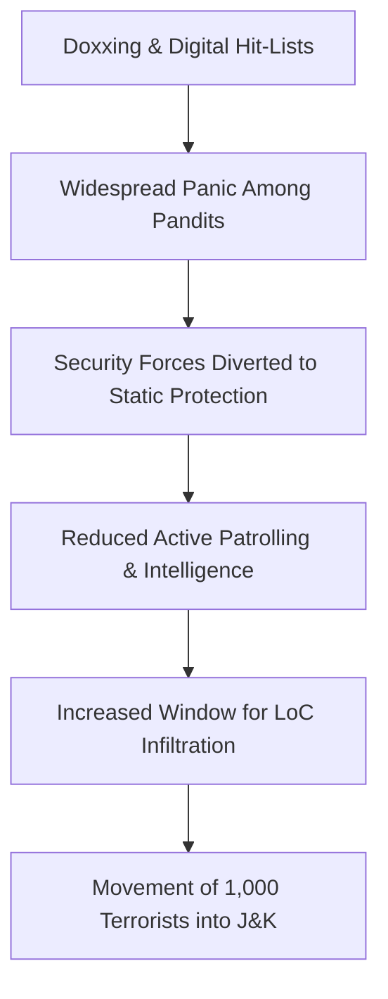

The landscape of conflict in Jammu and Kashmir is undergoing a dangerous evolution. While the region has long grappled with physical insurgency, a new, more insidious front has opened: the digital battlefield. Groups linked to the banned Lashkar-e-Taiba (LeT) have weaponized "doxxing"—the malicious publication of private personal information—to target the Kashmiri Pandit community. 

  
  
 <a href="https://unsplash.com/@visuals">visuals</a> on <a href="https://unsplash.com/photos/text-PuNW11NRjI4">Unsplash</a>

A recent threat letter from the United Liberation Council (ULC) has placed Indian security agencies on high alert. The campaign specifically targets over **7,000 migrant Kashmiri Pandit employees** currently working in the Kashmir Valley under the Prime Minister’s Special Package. By leaking sensitive personal data, these proxy groups are not merely threatening individuals; they are engaging in psychological warfare designed to destabilize the region and intimidate a community attempting to reclaim its ancestral home.

### 🕵️ The Mechanics of Digital Terror
This is not a random act of online harassment; it is a calculated, data-driven operation. The ULC has been circulating "digital hit-lists" that contain highly sensitive information, including **full names, residential addresses, and vehicle registration numbers** of government employees [news18.com](https://www.news18.com/india/kashmiri-pandit-employees-in-valley-seek-urgent-security-after-threat-poster-leaks-personal-details-ws-l-10292230.html). 

The intent behind doxxing is to strip away the victim's sense of anonymity and safety. When a government employee discovers that their home address and car plate are public knowledge among terror proxies, the psychological impact is profound. It creates a state of "constant surveillance," where the target feels watched even within the perceived safety of their own home.

Furthermore, the ULC is actively attempting to manipulate the community's perception of its own security. They have openly opposed efforts to provide migrant Pandits with light weapons for self-defense, framing such measures as a way to turn the community into "targetable counter-insurgency tools." This narrative is carefully crafted to isolate the Pandits, making them feel vulnerable regardless of whether they are armed or unarmed.

### 🧠 The "White-Collar" Narrative and Social Fragmentation
Beyond the immediate physical threat, there is a sophisticated propaganda campaign aimed at driving a wedge between the local Kashmiri population and the returning migrant Pandits. Proxy groups have begun labeling those employed through government schemes as "white-collar operatives," suggesting they are agents serving an external political agenda rather than citizens returning to their homeland [news18.com](https://www.news18.com/india/doxxing-as-a-weapon-how-lets-proxy-is-targeting-7000-kashmiri-pandits-exclusive-details-10307300.html).

By reframing the rehabilitation of the Pandit community as a political maneuver rather than a fundamental human right, these groups seek to erode local support for their return. This strategy of social fragmentation ensures that the returning community remains psychologically isolated, making them easier targets for both digital harassment and physical violence.

### 📉 The Grand Strategy: ISI's Tactical Diversion
Intelligence sources suggest that these online threats are not isolated incidents of "digital noise" but are part of a broader strategic play by Pakistan’s Inter-Services Intelligence (ISI). Security analysts argue that these high-profile hit-lists serve as a tactical distraction.

The logic is simple: by creating a widespread sense of panic among **7,000 targeted employees**, the ISI forces Indian security forces to shift their operational focus. Resources that would normally be used for active patrolling, intelligence gathering, and counter-infiltration are instead diverted toward **static protection duties**—guarding specific residences and offices.

> "Pakistan’s Inter-Services Intelligence (ISI) is leveraging these high-profile digital hit-lists to distract law enforcement, forcing security forces to divert personnel towards static protection duties while terror handlers attempt to rebuild ground networks." — Security Analysts via [news18.com](https://www.news18.com/india/doxxing-as-a-weapon-how-lets-proxy-is-targeting-7000-kashmiri-pandits-exclusive-details-10307300.html).

This diversion is intended to create "security blind spots." While the army and police are occupied with protecting individuals, the ISI aims to facilitate the movement of nearly **1,000 terrorists** currently stationed at launchpads along the Line of Control (LoC), waiting for an opportunity to infiltrate the dense forests of Jammu and Kashmir.

### ⚖️ Legal Retribution and the Proxy Backlash
As the security forces ramp up their vigilance, the conflict has also entered the judicial arena. The State Investigation Agency (SIA) of Jammu and Kashmir has recently reopened several "cold cases" involving the targeted killings of Kashmiri Hindus from previous decades [news18.com](https://www.news18.com/amp/india/cold-case-heat-lashkar-proxy-threatens-kashmiri-pandits-as-sia-reopens-decades-old-probes-exclusive-details-ws-t-10297456.html).

This pursuit of historical justice appears to be a primary trigger for the current spike in aggression. As the SIA works to hold perpetrators accountable for the atrocities that led to the original exodus, groups like the The Resistance Front (TRF) and the ULC have intensified their threats to intimidate witnesses and disrupt legal proceedings. 

The tension is further exacerbated by political friction. Recent comments regarding the security of Hindu police officers have sparked heated debates, highlighting the precarious nature of security parity in the region [news18.com](https://www.news18.com/india/why-no-threat-to-hindu-police-officers-farooq-abdullahs-comments-on-kashmiri-pandit-threats-spark-row-10306500.html).

### 🏁 Conclusion: The Future of Hybrid Warfare
The targeting of Kashmiri Pandits through doxxing represents a shift toward hybrid warfare, where data is used as a weapon to achieve kinetic goals. By blending digital harassment with strategic diversions, the ISI and its proxies (ULC and TRF) are attempting to turn personal information into a tool for border infiltration [news18.com](https://www.news18.com/amp/world/isi-still-backs-let-jem-trf-as-india-keeps-indus-waters-treaty-in-abeyance-10302926.html).

For the thousands of employees in the Valley, this is not a theoretical concern about "data privacy"—it is a direct threat to their survival. The challenge for the Indian state is twofold: it must provide robust, invisible security that protects the community without falling into the ISI's trap of resource depletion. As the boundary between the internet and the battlefield vanishes, the defense of the Kashmiri Pandits will require as much digital intelligence as it does physical firepower.

---

## 📖 Related Reading

- [🐯 Jailer 2 is Officially Happening This Dussehra—Rumors of a Delay are Fake News!](/jailer-2-rajinikanth-film-is-not-postponed-makers-confirm-dussehra-release-with-new-poster/)
- [Beyond the GPA: Why Your Skills Matter More Than Your Grades in the AI Era 🚀](/dreaming-of-german-degrees-these-skills-matter-more-than-grades-in-the-ai-era/)
- [🚩 The Strategic Pivot: Vijay’s TVK Challenges DMK with Legal Amnesty](/cm-vijay-announces-to-drop-cases-against-farmers-teachers-during-dmk-regime-the-times-of-india/)
