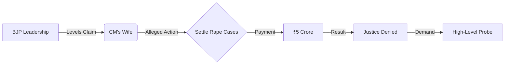

The political landscape in Punjab has shifted from governance debates to a high-stakes scandal. The Bharatiya Janata Party (BJP) has leveled explosive accusations against the family of Chief Minister Bhagwant Mann, claiming that the **CM's wife is allegedly operating a sophisticated racket** designed to settle rape cases in exchange for massive payouts. 

  
  
 <a href="https://unsplash.com/@gurysimrat">Gursimrat Ganda</a> on <a href="https://unsplash.com/photos/man-in-white-dress-shirt-and-pink-turban-vKlY5TzTV1s">Unsplash</a>

At the center of the controversy is a staggering claim that settlements are being brokered for sums as high as **₹5 crore**. This development has transformed the political discourse, moving the spotlight away from agricultural crises and infrastructure toward a direct attack on the personal integrity of the state's highest office.

---

### 📉 Understanding the Allegations: A System of Influence?

The BJP's claims extend beyond simple bribery; they allege the existence of a systemic corruption network. According to party spokespeople, the racket functions as a "legal escape hatch" for individuals accused of heinous crimes, specifically rape. 

The core of the allegation is that the CM's wife acts as a mediator. For a fee of **₹5 crore**, it is alleged that:
*   Evidence is systematically suppressed.
*   Key witnesses are pressured to change their testimonies.
*   Legal proceedings are intentionally delayed indefinitely through administrative influence.

The BJP suggests that this operation is facilitated by the immense power of the Chief Minister's Office (CMO), which supposedly exerts pressure on law enforcement agencies to ensure the "settlements" are successful. By highlighting the **₹5 crore** figure, the BJP aims to portray the Aam Aadmi Party (AAP) not as a party of the "common man," but as a regime shielding criminal activity.

---

### ⚖️ The Strategic Backdrop: AAP vs. BJP in Punjab

To understand the timing of these accusations, one must analyze the current power struggle in Punjab. Since Bhagwant Mann assumed office, the BJP has struggled to carve out a significant independent space, often finding itself in a three-way battle with the [Aam Aadmi Party](https://www.ndtv.com) and the Shiromani Akali Dal (SAD).

This strategy of targeting the "first family" is a calculated political move. By shifting the narrative to character assassination, the BJP is attempting to erode the moral authority and "anti-corruption" image that AAP has cultivated since its inception. In the volatile environment of [Indian regional politics](https://www.thehindu.com), personal attacks are frequently used to destabilize an opponent's public perception ahead of critical electoral cycles.

---

### 🔍 Demands for Accountability and Central Intervention

The BJP is not merely seeking a public apology; they are demanding a **transparent, high-level investigation**, specifically suggesting the involvement of a central agency. The logic presented is that the state police, which report directly to the Chief Minister, cannot be expected to conduct an impartial probe into the CM's own spouse.

> "Justice cannot be for sale. If the highest office in the state is involved in settling rape cases for crores of rupees, it is a betrayal of every woman in Punjab and a mockery of our judicial system," stated BJP representatives during recent press briefings.

If substantiated, these claims would represent a catastrophic failure of governance for the Mann administration, potentially leading to widespread protests and calls for immediate resignation. However, as of now, the allegations remain in the realm of political rhetoric, lacking a formal First Information Report (FIR) or documented evidence. [News reports](https://www.timesofindia.indiatimes.com) on the region often characterize these events as part of a recurring cycle of extreme accusation and denial.

---

### 🛡️ The AAP Defense: "Political Vendetta"

The Aam Aadmi Party has responded with fierce denials, labeling the allegations as **"baseless, malicious, and desperate."** AAP leadership argues that the BJP is employing a "smoke screen" strategy to distract the public from the BJP's own lack of progress and the rising crime rates in regions under their influence.

The AAP's defense rests on three main pillars:
1.  **Lack of Evidence:** They have challenged the BJP to produce a single complainant or a single bank trail supporting the **₹5 crore** claim.
2.  **Political Vendetta:** They argue that the BJP is targeting the CM's family because it cannot compete with AAP's [governance model](https://indianexpress.com) and development promises.
3.  **Character Assassination:** AAP claims this is a desperate attempt to smear the dignity of the CM's wife to gain a psychological edge in the polls.

This clash is typical of the [political discourse](https://www.bbc.com/news) in Punjab, where administrative failures are often overshadowed by sensational personal allegations.

---

### 🏁 Final Analysis

The allegation that a settlement racket for **₹5 crore** is operating from the heart of the Punjab government is one of the most severe charges leveled in recent years. While the BJP is pushing for a central probe, the absence of immediate, verifiable evidence leaves the public caught between two conflicting narratives. 

The ultimate resolution of this scandal depends on whether the BJP can transition from "claims" to "proof." Until then, the controversy serves as a potent reminder of the aggressive nature of Punjab's political rivalry, where the line between legal accountability and political warfare is increasingly blurred.

**References:**
*   Analysis of Punjab political trends via *The Times of India*.
*   Reporting on AAP-BJP rivalry via *The Indian Express*.
*   Governance reports via *NDTV* and *The Hindu*.

---

## 📖 Related Reading

- [Digital Hit-Lists: How Doxxing is Being Used Against Kashmiri Pandits 🛡️](/doxxing-as-a-weapon-how-lets-proxy-is-targeting-7000-kashmiri-pandits-exclusive-details/)
- [🐯 Jailer 2 is Officially Happening This Dussehra—Rumors of a Delay are Fake News!](/jailer-2-rajinikanth-film-is-not-postponed-makers-confirm-dussehra-release-with-new-poster/)
- [Beyond the GPA: Why Your Skills Matter More Than Your Grades in the AI Era 🚀](/dreaming-of-german-degrees-these-skills-matter-more-than-grades-in-the-ai-era/)
