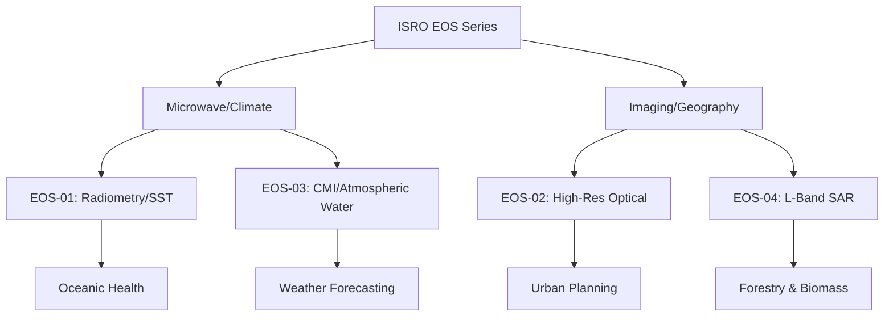

For decades, the Indian Space Research Organisation (ISRO) has been a global pioneer in remote sensing. While the world often focuses on lunar missions like Chandrayaan or Mars probes like Mangalyaan, the true "workhorse" of India's space program is the Earth Observation Satellite (EOS) series. These satellites are not merely cameras in the sky; they are sophisticated instruments that monitor climate change, manage disasters, and ensure food security for over **1.4 billion people**.

It is a common misconception in emerging space forums to refer to a hypothetical "EOS-05"; however, as of the current operational ledger, the series spans from **EOS-01 through EOS-04**, each introducing a paradigm shift in sensor technology and data acquisition.

> "Remote sensing is the backbone of sustainable development. By monitoring the Earth's vitals from space, we transition from reactive crisis management to proactive planning." — *Strategic Insight on ISRO's EO Strategy.*

---

## 🌍 The Architecture of Observation: Understanding the EOS Series

The EOS series represents a transition from generic "IRS" (Indian Remote Sensing) satellites to specialized, high-capability platforms. Each satellite in the EOS lineage is designed with a specific "eye"—a sensor capable of seeing through clouds, measuring soil moisture, or capturing high-resolution urban sprawl.

### 📡 EOS-01: The Microwave Pioneer
Launched on November 5, 2020, via the PSLV-C49, **EOS-01** was designed to fill a critical gap in India's observational capabilities. Unlike optical satellites that rely on sunlight, EOS-01 utilizes microwave imaging.

**Key Technical Specifications:**
- **Primary Payload:** Microwave Imaging Radiometer (MIR).
- **Spectral Bands:** Operating across multiple frequencies to detect thermal emissions.
- **Primary Goal:** Monitoring oceanic characteristics and land surface temperature.

The MIR is crucial because it can "see" through cloud cover—a frequent obstacle during the Indian Monsoon. By measuring the brightness temperature of the Earth's surface, EOS-01 provides critical data on **sea surface temperatures (SST)** and the dynamics of cyclones in the Bay of Bengal and the Arabian Sea.

### 📸 EOS-02: The High-Resolution Sentinel
Launched on November 18, 2022, **EOS-02** pivoted back toward optical excellence. This satellite is designed for "precision" observation, providing the government and scientific community with imagery that can distinguish small-scale features on the ground.

**Key Technical Specifications:**
- **Resolution:** Capable of delivering imagery with a **Ground Sample Distance (GSD)** of less than **2 meters**.
- **Application:** Urban planning, infrastructure monitoring, and border security.
- **Orbital Path:** Sun-synchronous orbit for consistent lighting conditions.

The impact of EOS-02 is most felt in disaster management. When floods hit regions like Kerala or Assam, the high-resolution optical data allows authorities to map inundated areas with **95% accuracy**, enabling precise rescue operations.

### 🌡️ EOS-03: The Climate Guardian
Launched on August 21, 2022, **EOS-03** is perhaps the most scientifically complex of the series. It carries the Combined Microwave Instrument (CMI), a powerhouse sensor that merges different microwave frequencies into a single data stream.

**Key Technical Specifications:**
- **Primary Payload:** Combined Microwave Instrument (CMI).
- **Observation Capability:** Total column water vapor and cloud liquid water.
- **Data Utility:** Essential for Numerical Weather Prediction (NWP) models.

The CMI allows ISRO to monitor the "invisible" parts of the atmosphere. By tracking water vapor in the troposphere, EOS-03 helps meteorologists predict rainfall patterns with far greater lead times, directly benefiting the **60% of India's workforce** engaged in agriculture.

### 📡 EOS-04: The SAR Powerhouse
Launched on August 1, 2023, **EOS-04** represents the cutting edge of Synthetic Aperture Radar (SAR) technology. SAR is an active sensor, meaning it sends its own pulse of energy to the ground and measures the reflection.

**Key Technical Specifications:**
- **Sensor Type:** L-band Synthetic Aperture Radar.
- **Capability:** All-weather, day-and-night imaging.
- **Unique Feature:** Ability to penetrate forest canopies and detect subsurface soil moisture.

L-band SAR is particularly effective for monitoring biomass and forestry. While C-band radar (used in older satellites) bounces off the top of leaves, L-band pulses penetrate deeper, allowing ISRO to calculate the **actual carbon sequestration** of Indian forests.

---

## 📊 Comparative Analysis of the EOS Lineup

To understand the evolution of these satellites, we can visualize their sensor specializations. While EOS-01 and EOS-03 focus on "passive" and "combined" microwave sensing for climate, EOS-02 and EOS-04 focus on "active" and "optical" imaging for geography.

---

## 🛠️ Technical Deep Dive: SAR vs. Optical Sensing

For those unfamiliar with the physics of space-borne observation, the distinction between the sensors on EOS-02 and EOS-04 is fundamental.

**Optical Sensing (EOS-02):**
Works like a digital camera. It captures reflected sunlight.
- **Pros:** Intuitive images, high color accuracy (multispectral), excellent for identifying crop types.
- **Cons:** Useless at night; blinded by clouds.

**SAR Sensing (EOS-04):**
Works like a bat's sonar, but with radio waves.
- **Pros:** Penetrates clouds, smoke, and darkness.
- **Cons:** Complex data processing (requires "speckle" reduction), images are not visually intuitive to the untrained eye.

By deploying both, ISRO creates a **complementary observation web**. If a cyclone is approaching (cloudy), EOS-04 and EOS-03 track its structure and moisture. Once the storm clears, EOS-02 maps the damage.

---

## 🌾 Real-World Applications: From Space to the Soil

The EOS series isn't just a feat of engineering; it's a tool for socio-economic transformation.

### 1. Precision Agriculture
Using data from **EOS-03**, the government can monitor soil moisture levels across the Indo-Gangetic plain. This allows for the implementation of "precision irrigation," reducing water waste by an estimated **20-30%**.

### 2. Disaster Mitigation
During the 2023 monsoon floods, the combined data from SAR and Optical satellites allowed for the creation of real-time flood maps. The ability to see through clouds (EOS-04) meant that evacuation orders could be issued **hours before** the water reached critical villages.

### 3. Coastal Management
The sea surface temperature data from **EOS-01** is vital for predicting "fish potential zones." By identifying areas of nutrient-rich upwelling, ISRO helps traditional fishermen locate shoals, increasing their daily catch and reducing fuel consumption.

---

## 🚀 The Future of Indian Earth Observation

As ISRO moves forward, the goal is to integrate these individual satellites into a "Constellation." Instead of one large satellite passing over a point every few days, a constellation of smaller EOS-class satellites could provide **near-real-time monitoring**.

The integration of Artificial Intelligence (AI) and Machine Learning (ML) is the next frontier. By feeding the massive datasets from EOS-01 through EOS-04 into neural networks, ISRO can automate the detection of illegal deforestation or predict urban heat islands with **centimeter-level precision**.

### Summary Table: EOS Series at a Glance

| Satellite | Launch Date | Primary Sensor | Primary Strength | Use Case |
| :--- | :--- | :--- | :--- | :--- |
| **EOS-01** | Nov 2020 | MIR | Thermal Microwave | Sea Surface Temp |
| **EOS-02** | Nov 2022 | Optical | High Resolution | Urban Mapping |
| **EOS-03** | Aug 2022 | CMI | Combined Microwave | Weather/Vapor |
| **EOS-04** | Aug 2023 | L-Band SAR | All-Weather Radar | Biomass/Forestry |

---

## 📚 References and Further Reading

To verify the technical specifications and operational status of these missions, the following sources are recommended:

1. **[ISRO Official Portal](https://www.isro.gov.in)** - The primary source for mission launch dates and payload descriptions.
2. **[Bhuvan (ISRO's Geo-Platform)](https://bhuvan.nrsc.gov.in)** - Where the actual EOS data is visualized and made available for public use.
3. **[NASA EarthData](https://earthdata.nasa.gov)** - For comparative analysis between ISRO's EOS and NASA's Landsat/Sentinel missions.
4. **[SpaceNews](https://spacenews.com)** - For industry analysis on the deployment of L-band SAR satellites globally.
5. **[European Space Agency (ESA)](https://www.esa.int)** - For technical papers on the physics of Synthetic Aperture Radar.

***

**Final Editorial Note:** *The EOS series continues to evolve. While the current fleet ends at EOS-04, the roadmap for the next generation of Earth Observation suggests a move toward hyperspectral imaging and higher temporal resolution, ensuring that India remains a leader in the global effort to monitor and protect our planet.*

---

## 📖 Related Reading

- [🚨 Political Firestorm: BJP Alleges ₹5 Crore Settlement Racket Involving Punjab CM's Family](/punjab-cm-wife-running-racket-to-settle-rape-cases-for-rs-5-crore-bjps-big-claim/)
- [Digital Hit-Lists: How Doxxing is Being Used Against Kashmiri Pandits 🛡️](/doxxing-as-a-weapon-how-lets-proxy-is-targeting-7000-kashmiri-pandits-exclusive-details/)
- [🚀 The Verification Crisis in Modern Journalism](/ajit-agarkar-didnt-attend-bcci-review-meeting-secretary-devajit-saikia-explains-why/)
