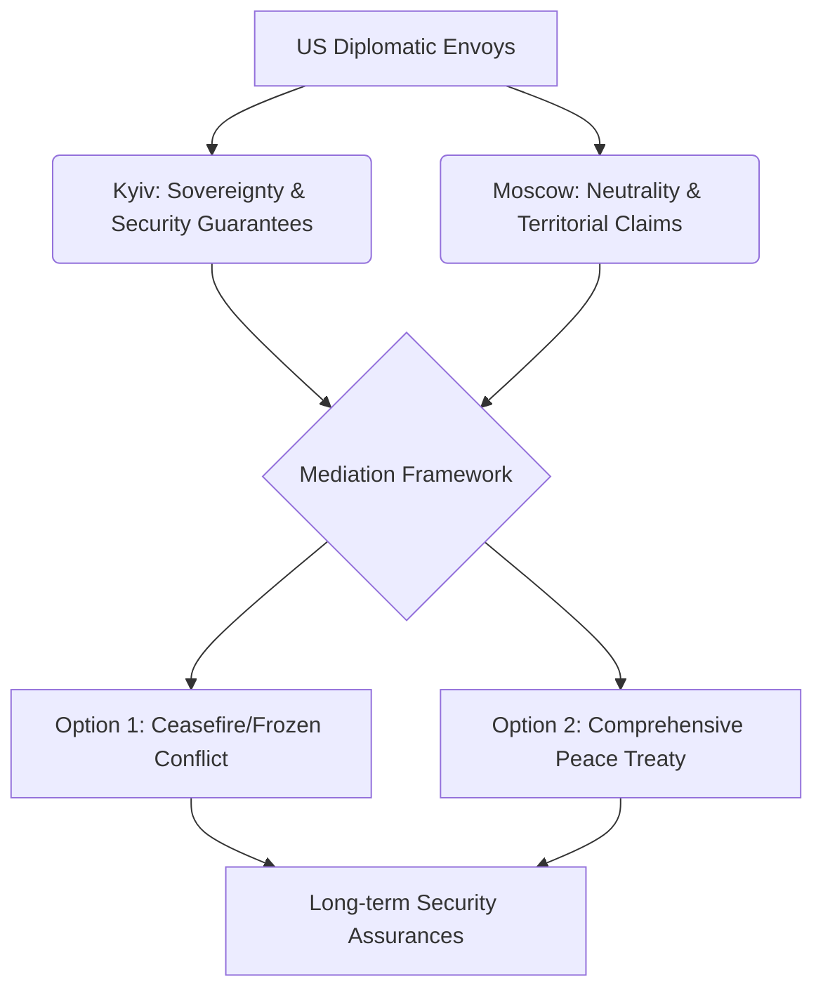

The geopolitical landscape of Eastern Europe is currently witnessing a subtle but significant recalibration. For the past several years, the United States' strategic posture toward the conflict in Ukraine has been defined by a policy of "strategic endurance"—providing the military hardware and financial intelligence necessary for Kyiv to repel Russian aggression. However, a shift is emerging in Washington. There is an increasing recognition that while military support remains vital, the path to a sustainable conclusion may require a transition from a purely supportive role to an active mediation role.

  
  
 <a href="https://unsplash.com/@navymedicine">Navy Medicine</a> on <a href="https://unsplash.com/photos/people-holding-a-welcome-home-banner-for-emf-bravo-5aK5t8WhbeU">Unsplash</a>

The current objective is the **relaunching of mediation efforts** to break a grueling war of attrition. The goal is to steer both Kyiv and Moscow toward a negotiated settlement before the conflict enters a permanent state of instability. However, the diplomatic tightrope is precarious: Washington must find a path that secures Ukrainian sovereignty without triggering a wider escalation or rewarding territorial conquest.

---

### 🏛️ The Strategic Pivot: Why Now?

The impetus for this diplomatic shift is rooted in a complex blend of domestic political pressures and the sobering reality of the front lines. For the initial phase of the war, the Biden administration operated under the mantra of "as long as it takes," focusing on the degradation of Russia's conventional military capabilities. Yet, as [Council on Foreign Relations (CFR)](https://www.cfr.org) analysts have noted, the "diminishing returns" of battlefield gains have become apparent.

The reality is that a decisive military victory—defined as the total liberation of all occupied territories through force alone—is increasingly viewed as a long-term, high-cost prospect. The US finds itself in a unique position of leverage: it is the primary architect of Ukraine's defense, but it is also the only global power with the diplomatic infrastructure and economic weight to compel Vladimir Putin to engage in serious negotiations.

This "relaunch" of diplomacy is not merely about arranging meetings; it is about redefining the **terms of engagement**. Washington is exploring how to pivot from a strategy of "defeat" to one of "resolution," balancing the need for a just peace with the practical necessity of stopping the bloodshed.

---

### 🇺🇦 Ukraine’s Red Lines: Sovereignty vs. Survival

For President Volodymyr Zelenskyy, the parameters of any negotiation are strictly governed by the [Ukraine Peace Formula](https://www.ukraine.gov.ua). This framework is not a mere set of requests but a comprehensive demand for the restoration of Ukraine's **territorial integrity** within its internationally recognized borders, including Crimea.

Kyiv’s position is grounded in a fundamental security principle: ceding land for peace creates a dangerous precedent. The Ukrainian leadership argues that any territorial concession would not be a "peace treaty" but rather a "strategic pause," allowing Russia to replenish its stockpiles and reorganize its forces for a future offensive.

> "Peace cannot be achieved at the expense of sovereignty; a peace based on the surrender of land is merely a delayed war."

Despite this firm stance, the internal pressures are mounting. Ukraine is grappling with **severe manpower shortages** and a shrinking industrial base. There is an emerging, albeit quiet, discourse regarding a "frozen conflict" model. This would mirror the situation on the Korean Peninsula—a ceasefire agreement that halts active hostilities and establishes a demilitarized zone without requiring a formal diplomatic recognition of lost territories.

---

### 🇷🇺 The Kremlin’s Calculus: "New Territorial Realities"

Russia enters any potential diplomatic dialogue from a position of perceived strength, currently occupying approximately **18% of Ukrainian territory**. Vladimir Putin has consistently signaled that any agreement must acknowledge these "new territorial realities." From Moscow's perspective, the war is as much about geopolitical alignment as it is about land.

The Kremlin's primary objectives remain:
1. **Formal Neutrality**: Ensuring Ukraine is permanently blocked from joining [NATO](https://www.nato.int).
2. **Territorial Annexation**: Legal recognition of the Donbas and Crimean regions as Russian.
3. **Western Exhaustion**: Waiting for the "Ukraine fatigue" to peak in US and European capitals.

According to reports from the [Institute for the Study of War (ISW)](https://www.understandingwar.org), Russia is utilizing a strategy of attrition to force the West to pressure Kyiv into concessions. The challenge for US mediators is to construct a "middle path" that prevents the collapse of the Ukrainian state without providing Russia with a "victory" that would embolden other revisionist powers globally.

---

### 🗺️ The Architecture of Mediation

Designing a peace process for this conflict is a massive geopolitical puzzle. The US cannot act in a vacuum; it must synchronize its efforts with the European Union and navigate the complex interests of the "Global South."

Countries like India and China, while maintaining varying degrees of neutrality, hold significant sway over Russia's economic resilience. Any deal that lacks the endorsement of these powers is unlikely to be durable.

To move the needle, the US maintains two critical "levers":
*   **The Military Lever**: The ability to increase or restrict the flow of advanced weaponry (such as F-16s or long-range missiles) to influence Kyiv's bargaining position.
*   **The Economic Lever**: The potential to either tighten or selectively ease [economic sanctions](https://treasury.gov) to incentivize Moscow's cooperation.

---

### 📉 The Cost of Stagnation: Economic and Human Toll

The urgency of this diplomatic push is underscored by the staggering costs of the conflict. According to the [World Bank](https://www.worldbank.org), the economic damage to Ukraine's infrastructure is measured in the hundreds of billions of dollars. Beyond the finances, the human cost is catastrophic.

**Bold Stats on the Conflict:**
*   **18%**: The approximate percentage of Ukrainian land currently under Russian occupation.
*   **$100B+**: Estimated minimum cost for the initial phase of Ukraine's reconstruction.
*   **Millions**: The number of Ukrainians displaced internally or as refugees across Europe.
*   **Thousands**: The daily casualties estimated across both sides during peak attrition phases.

The [United Nations](https://www.un.org) has repeatedly warned that the war's impact on global food security—specifically grain exports from the Black Sea—continues to threaten stability in Africa and the Middle East. This global instability adds a layer of urgency to the US push for a resolution.

---

### ⚖️ The Bottom Line: A High-Stakes Gamble

This renewed diplomatic push is a strategic gamble of the highest order. If the United States pushes too aggressively for a "quick fix," it risks alienating a key ally and signaling to the world that aggression can be rewarded with land. Conversely, if the US remains committed to a purely military solution in a stalemate environment, it risks a permanent war of attrition that drains Western treasuries and destabilizes the global economy.

The success of these mediation efforts will not depend on the eloquence of diplomats, but on a cold calculation of costs. Peace will only arrive when the **cost of continued fighting**—in terms of blood, treasure, and political capital—finally exceeds the **cost of making a compromise**.

### 📚 References & Further Reading
*   [Official Portal of the Government of Ukraine](https://www.gov.ua)
*   [NATO Strategic Concept 2022](https://www.nato.int/nato2022/)
*   [Reuters: Ukraine Conflict Analysis](https://www.reuters.com)
*   [Associated Press: War in Ukraine Coverage](https://apnews.com)
*   [Foreign Affairs: The Future of the Ukraine War](https://www.foreignaffairs.com)

---

## 📖 Related Reading

- [🛰️ Mastering the Horizon: A Comprehensive Guide to ISRO's Earth Observation Satellite (EOS) Series](/isro-successfully-launches-earth-observation-satellite-eos-05/)
- [🏗️ Boxed-In Brilliance: Inside India’s Bold Bet on Container Athlete Villages](/india-replicates-asian-games-village-with-shipping-container-housing-it-was-awkward-but/)
- [🚨 Political Firestorm: BJP Alleges ₹5 Crore Settlement Racket Involving Punjab CM's Family](/punjab-cm-wife-running-racket-to-settle-rape-cases-for-rs-5-crore-bjps-big-claim/)
