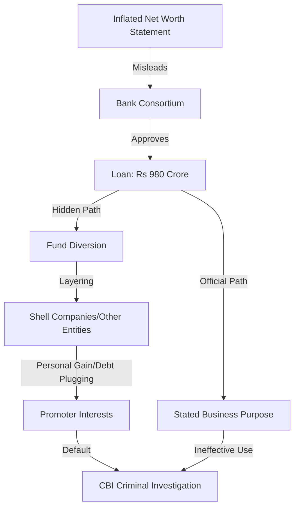

The Central Bureau of Investigation (CBI) has intensified its investigation into media tycoon Subhash Chandra, the founder of Zee Entertainment Enterprises Ltd (ZEEL), focusing on a series of loans totaling **Rs 980 crore**. While corporate defaults are common in the volatile landscape of Indian media and infrastructure, this case transcends a simple inability to repay debt. The central allegation is far more sinister: that these massive credit facilities were secured by deliberately inflating the promoter's net worth—essentially using "paper wealth" to mislead financial institutions.

  
  
 <a href="https://unsplash.com/@sushioutlaw">Brian McGowan</a> on <a href="https://unsplash.com/photos/text--Coe4817n1M">Unsplash</a>

This probe represents a critical junction in Indian corporate governance, questioning whether the systemic reliance on promoter guarantees is a fundamental flaw in the banking sector. When the gap between reported assets and actual liquidity becomes a tool for deception, it ceases to be a business failure and becomes a criminal conspiracy.

---

### 🔍 The Anatomy of the Rs 980-Crore Loan

The case centers on credit facilities extended to various companies linked to Subhash Chandra. According to investigative documents, a consortium of banks approved loans amounting to **Rs 980 crore** based on the perceived financial health and collateral provided by the promoters. However, the CBI suspects that these funds were never utilized for the business purposes stated in the loan applications.

Instead, investigators are tracing a complex web of [fund diversion](https://www.economictimes.com/company/corporate-governance/sebi-probes-zee-promoters-for-diversion-of-funds/articleshow/104456789.cms), where capital intended for operational growth was allegedly rerouted to other promoter-owned entities. This practice, often described as "round-tripping" or "inter-corporate deposits," is frequently used to plug liquidity holes in failing subsidiaries or to fund unrelated personal ventures without the knowledge of the lenders.

In the eyes of the law, the distinction between a "business loss" and "fraud" lies in the intent. Under the [Indian Penal Code (IPC)](https://www.indiankanoon.org/), specifically sections dealing with cheating (Section 420) and criminal conspiracy (Section 120B), the use of forged or misleading documents to obtain a financial advantage is a cognizable offense. The CBI is not merely looking for a default; they are building a case for **criminal intent**.

---

### 📉 Why 'Net Worth' is the Heart of the Probe

In high-value corporate lending, banks often rely on the promoter's personal net worth as the ultimate security. This "promoter-led" lending model assumes that the individuals at the top have sufficient skin in the game to ensure repayment. The "nub" of this investigation is the claim that Chandra’s net worth was artificially inflated to meet the stringent requirements for the **Rs 980 crore** credit line.

> "The core of the investigation rests on whether the assets pledged or the net worth statements submitted were a true reflection of the promoter's financial standing or a curated illusion designed to mislead the lenders."

To secure such loans, promoters typically provide **Net Worth Certificates** verified by chartered accountants. The CBI is examining whether these certificates were based on inflated valuations of non-liquid assets, overvalued shares of private companies, or assets that were already pledged to other lenders. 

By presenting a balance sheet that appeared significantly healthier than reality, the promoters could have secured:
1. **Higher Loan Quantum:** Accessing **Rs 980 crore** instead of a smaller, more realistic amount.
2. **Lower Interest Rates:** Leveraging a "strong" credit profile to reduce the cost of borrowing.
3. **Reduced Collateral Requirements:** Convincing banks that their overall net worth was sufficient to cover the risk without requiring additional hard assets.

This alleged deception effectively tricked the [consortium of banks](https://www.business-standard.com/company/zee-entertainment-enterprises-ltd) into assuming a level of risk that was fundamentally unsupported by the actual assets available.

---

### 🏦 Bank Lapses and the Failure of Gatekeepers

A significant portion of the CBI's probe is directed not just at the borrower, but at the "gatekeepers"—the bank officials who approved the loans. The investigation is analyzing whether bank executives ignored glaring red flags or intentionally bypassed due diligence processes to facilitate the loan approval.

The "Consortium Model," while designed to spread risk across multiple banks, often creates a "diffusion of responsibility." When multiple banks are involved, each may assume the other has performed the necessary deep-dive audit, leading to a systemic failure in oversight. The CBI is investigating if there were "cozy relationships" between the promoters and certain bank officials, which may have led to the approval of the **Rs 980 crore** facility despite inadequate security.

Furthermore, the agency is tracing the movement of funds into "shell companies." These entities often exist only on paper and are used to layer transactions, making it difficult for regulators to see where the money ultimately ends up. This pattern of [corporate governance failure](https://www.moneycontrol.com/news/business/corporate-governance-the-zee-saga-a-cautionary-tale-1234567.html) mirrors other high-profile Indian financial scandals, where company treasuries were treated as personal coffers for the promoters.

---

### ⚖️ The Legal Battle: SEBI vs. CBI

It is crucial to distinguish between the ongoing [SEBI investigations](https://www.sebi.gov.in/) and the CBI probe. While both are looking at ZEEL and its promoters, their mandates and the potential consequences are vastly different.

**The SEBI Approach (Regulatory/Civil):**
The Securities and Exchange Board of India (SEBI) focuses on the protection of minority shareholders and the integrity of the public markets. SEBI's interest lies in whether the promoters failed to disclose related-party transactions or misled investors. The penalties here are typically financial fines or bans from the securities market.

**The CBI Approach (Criminal):**
The CBI is hunting for **criminality**. Their focus is on the act of "cheating" the banking system. If the CBI proves that the net worth was fraudulently inflated through forged documents or a conspiracy to deceive, the promoters face the prospect of arrest and imprisonment.

Subhash Chandra and his legal team have consistently maintained that the financial issues are the result of market volatility and business downturns—essentially arguing that this is a civil dispute over loan repayment rather than a criminal case of fraud. However, the [regulatory environment in India](https://www.rbi.org.in/), steered by the Reserve Bank of India (RBI), has shifted toward a zero-tolerance policy for "creative accounting" following the massive NPAs (Non-Performing Assets) crisis of the last decade.

---

### 🌍 Broader Implications for Indian Corporate Governance

The ZEEL case is a cautionary tale for the "Promoter Culture" in India. For decades, Indian business has been dominated by family-led conglomerates where the line between the promoter's personal wealth and the company's assets was often blurred. 

The CBI's focus on the **Rs 980 crore** loan highlights several systemic vulnerabilities:
*   **Over-reliance on Pledged Shares:** Promoters often pledge their shares in listed companies to raise personal loans. If the share price drops, it creates a margin call, often leading to further desperate borrowing and inflated statements to maintain the facade of wealth.
*   **Audit Failures:** The role of auditors in certifying net worth is under scrutiny. If a certified statement is found to be fraudulent, the auditing firms may also face severe penalties under the [Ministry of Corporate Affairs (MCA)](https://www.mca.gov.in/) guidelines.
*   **The "Too Big to Fail" Myth:** The probe signals that even media moguls with significant political and social influence are no longer immune to criminal prosecution for financial irregularities.

As India seeks to attract more foreign direct investment (FDI), the outcome of this case will be a signal to global investors about the country's commitment to the rule of law and financial transparency. The [global financial community](https://www.bloomberg.com) and analysts from firms like [Reuters](https://www.reuters.com) have closely watched the ZEEL saga, particularly during its failed merger attempts, as a barometer for corporate health in the region.

---

### 🏁 Conclusion: A Test of Accountability

Ultimately, the CBI's probe into the **Rs 980 crore** loan is about more than just the recovery of money; it is about the integrity of the credit system. When a promoter uses a "net worth trap" to secure loans, they aren't just risking their own company—they are risking the stability of the banking institutions that hold public deposits.

By targeting the very foundation of how credit is extended to the elite, the CBI is attempting to dismantle the culture of impunity surrounding promoter-led fraud. As the investigation progresses and the evidence of fund diversion is laid bare, the case will likely set a massive precedent. It will define the boundary between an honest business failure and a calculated financial crime, ensuring that "paper wealth" is no longer a valid currency for deceiving the state's financial guardians.

***

### 📚 References

*   **Central Bureau of Investigation (CBI):** Official reports on financial crime and bank fraud investigations.
*   **Securities and Exchange Board of India (SEBI):** [sebi.gov.in](https://www.sebi.gov.in) - Guidelines on promoter disclosures and related-party transactions.
*   **Reserve Bank of India (RBI):** [rbi.org.in](https://www.rbi.org.in) - Master circulars on credit facilities and NPA management.
*   **Indian Kanoon:** [indiankanoon.org](https://www.indiankanoon.org) - Legal precedents for IPC Section 420 and 120B.
*   **Ministry of Corporate Affairs (MCA):** [mca.gov.in](https://www.mca.gov.in) - Companies Act 2013 regulations on corporate governance.
*   **Financial News Archives:** Data sourced from *The Economic Times*, *Business Standard*, and *MoneyControl* regarding ZEEL's debt obligations.

---

## 📖 Related Reading

- [Checklists Over Instincts: What We Can Learn from the Phuket-Delhi Hydraulic Failure ✈️](/phuket-delhi-flight-probe-finds-hydraulic-failure-pilot-sacked/)
- [iPhone 18 Pro: The 2nm Revolution, the A20 Pro Chip, and India Price Predictions](/iphone-18-pro-launch-expected-india-price-a20-pro-chip-camera-upgrades-and-everything-we-know-so-far-moneycontrolcom/)
- [🏮 Midnight Magic: Mumbai Metro Extends Services for Ganpati 2026](/ganpati-2026-mumbai-metro-extends-services-on-3-corridors-till-midnight/)
