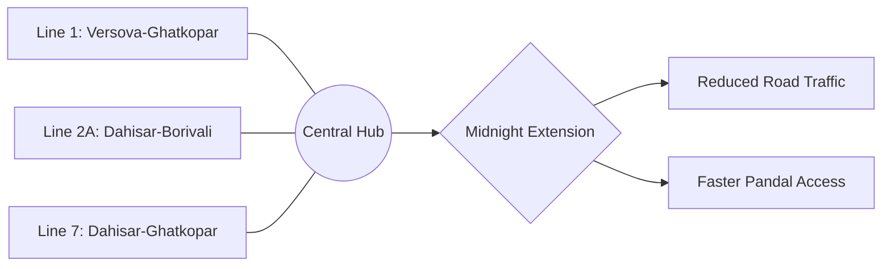

# 🚉 Navigating the Festivities: 3 Metro Corridors to Run Until Midnight for Ganpati 2026

  
  
 <a href="https://unsplash.com/@vishalpanchal96">Vishal Panchal</a> on <a href="https://unsplash.com/photos/a-statue-of-an-elephant-with-people-around-it-5MBlhC1ZxRg">Unsplash</a>

If you're planning to head out for pandal hopping or late-night *aartis* during Ganpati 2026, the city has provided a significant logistical upgrade. To accommodate the millions of devotees and tourists celebrating the festival, the Mumbai Metro is extending its service until **midnight** across three major corridors. 

This strategic initiative aims to alleviate road congestion and provide a faster, safer, and more comfortable alternative to the heavily congested suburban "locals." By extending operational hours on **Line 1, Line 2A, and Line 7**, the city is ensuring seamless mobility even when festivities reach their peak. With an estimated **20% to 30% increase in ridership** during the ten-day festival, these extensions are not just a convenience—they are a necessity for urban survival in Mumbai.

---

### 🗺️ The Strategic Three: Which lines are running late?

The midnight extension focuses on the high-traffic corridors that link the northern suburbs to the heart of the city, ensuring that devotees can traverse the metropolis without relying on taxis or overcrowded buses.

1.  **Line 1 (Versova-Andheri-Ghatkopar):** As the pioneer of the network, this line remains the most critical link between the Western and Eastern suburbs. Given the presence of legendary pandals in Andheri and Ghatkopar, this corridor expects the highest volume of passengers. [Mumbai Metro Line 1](https://mumbaimetro.com/) serves as the primary transit bridge for those crossing the city.
2.  **Line 2A (Dahisar-Borivali West):** This line services the northwestern suburbs, facilitating easy movement for residents of Dahisar and Borivali—areas renowned for their massive community celebrations and high-density residential clusters.
3.  **Line 7 (Dahisar-Ghatkopar):** Running parallel to the Western Express Highway (WEH), Line 7 is a lifesaver for commuters traveling from the far north toward the eastern hubs, bypassing the notorious WEH traffic jams.

---

### 🌙 Why the midnight extension actually matters

The decision to stay open until midnight is a data-driven response to the unique behavioral patterns of the Ganpati festival. Unlike standard weekday commutes, the festival generates a massive spike in transit demand between **8:00 PM and 12:00 AM**, as families venture out for evening prayers and community gatherings.

The [MMRDA (Mumbai Metropolitan Region Development Authority)](https://mmrda.maharashtra.gov.in/) has identified that the traditional railway network often reaches a breaking point during the *Visarjan* (immersion) days. By operating the metro until midnight, the city creates a "pressure valve" effect, redistributing the crowd away from railway stations. This is particularly beneficial for elderly citizens and families with children, who prefer the metro's climate-controlled environment and elevator access over the chaotic nature of the local trains.

---

### ⚙️ Crowd Management: More trains and extra security

Extending hours is only half the battle; managing the resulting surge in footfall is the real challenge. To maintain safety and efficiency, the Metro administration is implementing several operational upgrades:

*   **Increased Frequency:** During the evening peak (**6 PM to 12 AM**), headways (the time between trains) will be reduced. This prevents dangerous overcrowding on platforms and ensures a steady flow of passengers.
*   **Enhanced Security Presence:** In coordination with the [Central Industrial Security Force (CISF)](https://cisf.gov.in/), additional personnel will be deployed at entry and exit points to monitor crowds and prevent stampede-like situations.
*   **Queue Management Systems:** Special zig-zag queuing barriers are being installed at high-traffic interchange stations, such as Andheri and Ghatkopar, to maintain an orderly boarding process.
*   **Real-time Monitoring:** Utilizing CCTV and AI-based crowd analytics to identify bottlenecks before they become critical.

These measures align with global urban transit standards for managing "mega-events," similar to protocols seen in [urban transit updates](https://timesofindia.indiatimes.com/city/mumbai) across other Asian metropolises.

---

### 🚆 Taking the pressure off the "Lifeline"

For decades, the Mumbai Suburban Railway has been the city's undisputed "lifeline." However, the expansion of the metro network is fundamentally altering the city's transit DNA.

> "The extension of metro services during festivals is not just a convenience; it is a critical safety measure to prevent over-congestion on the local trains and reduce the risk of track-crossing accidents," notes a recent analysis on Mumbai's evolving urban planning.

By shifting a significant portion of the "pandal-hopping" crowd to the metro, the city effectively reduces the risk of accidents on the railway tracks and prevents the Western Express Highway from becoming a stationary parking lot. The metro is transitioning from a secondary option to a primary utility for festival travel.

---

### 💡 Pro-Tips for a Stress-Free Journey

To make the most of the midnight services, commuters are encouraged to follow these guidelines to avoid delays:

*   **Skip the Ticket Lines:** Avoid the long queues at kiosks by using the official Metro app or recharging your smart cards in advance.
*   **Plan via Digital Tools:** Use [Google Maps Transit](https://www.google.com/maps) to check for real-time delays or station closures.
*   **Follow Local Guidelines:** Keep an eye on updates from the [Brihanmumbai Municipal Corporation (BMC)](https://portal.mcgm.gov.in/) regarding road closures and diverted traffic near major pandals.
*   **Travel Light:** To ensure a comfortable journey for all, avoid carrying oversized items or large ceremonial offerings that may block aisles.

---

### 🏁 Final Thoughts

The decision to run the Mumbai Metro until midnight for Ganpati 2026 is a major victory for urban mobility. By leveraging **Line 1, 2A, and 7**, the city is ensuring that the spirit of the festival isn't dampened by the stress of the commute. As Mumbai welcomes the Elephant God, the metro stands ready to ensure that every journey to the pandal is as peaceful as the prayer itself. 

Stay safe, travel smart, and enjoy the festivities!

---

## 📖 Related Reading

- [Checklists Over Instincts: What We Can Learn from the Phuket-Delhi Hydraulic Failure ✈️](/phuket-delhi-flight-probe-finds-hydraulic-failure-pilot-sacked/)
- [iPhone 18 Pro: The 2nm Revolution, the A20 Pro Chip, and India Price Predictions](/iphone-18-pro-launch-expected-india-price-a20-pro-chip-camera-upgrades-and-everything-we-know-so-far-moneycontrolcom/)
- [Can a New US Diplomatic Push Actually End the War in Ukraine?](/us-envoys-headed-to-russia-and-ukraine-to-relaunch-mediation-al-jazeera/)
