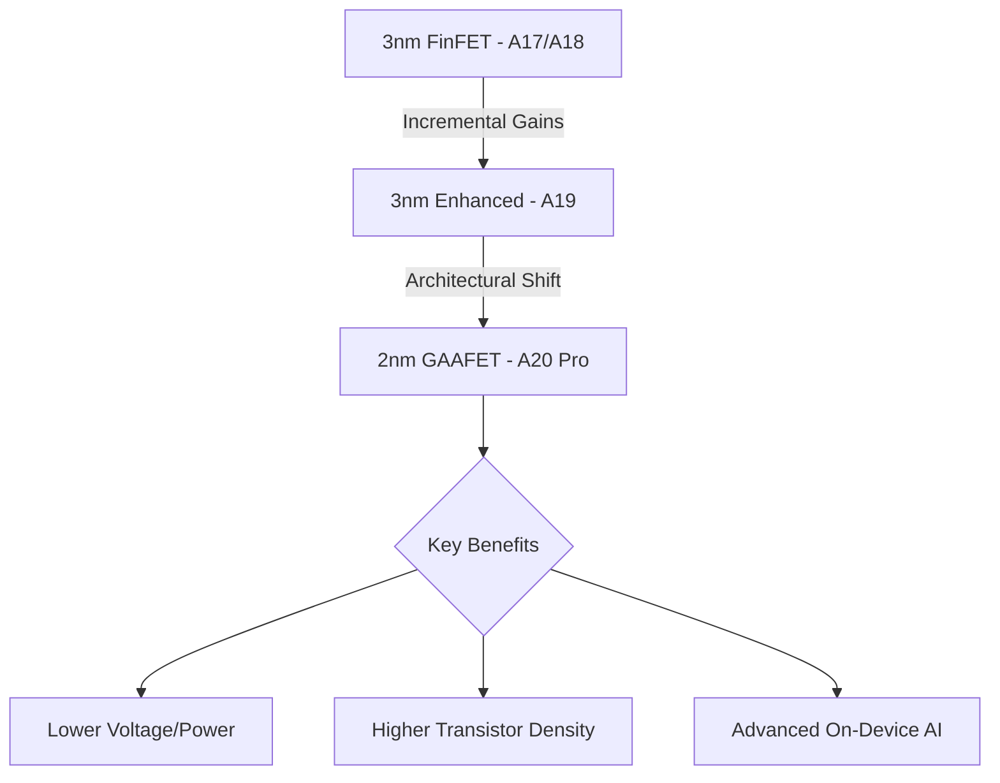

While the current tech cycle is dominated by the immediate iterations of Apple's lineup, forward-looking analysts and supply chain leaks are already pointing toward a seismic shift arriving in 2026: the **iPhone 18 Pro**. This device is not merely an incremental update; it represents a fundamental pivot in semiconductor architecture and hardware integration. At the heart of this leap is the transition to **TSMC’s 2nm process** and the rumored **A20 Pro chip**, a combination designed to redefine power efficiency and push on-device Artificial Intelligence (AI) to its absolute limit.

  
  
 <a href="https://unsplash.com/@onurbinay">Onur Binay</a> on <a href="https://unsplash.com/photos/three-smartphones-on-a-desk-OKjJZNTl004">Unsplash</a>

For the Indian consumer, this evolution brings a critical question: will the leap in technology justify a potentially higher price tag in a market already sensitive to luxury tech premiums? This comprehensive analysis breaks down the hardware breakthroughs, the AI trajectory, and the projected economic impact on the Indian market.

---

### 🚀 The A20 Pro: Transitioning to TSMC’s 2nm Architecture

The cornerstone of the iPhone 18 Pro is the **A20 Pro chip**. To understand why this matters, we have to look at the physics of silicon. For years, Apple and [TSMC (Taiwan Semiconductor Manufacturing Company)](https://www.tsmc.com/) have utilized FinFET (Fin Field-Effect Transistor) technology. However, as we shrink toward 2nm, FinFET reaches its physical limit due to "leakage"—where electricity escapes the transistor, causing heat and wasting battery.

The A20 Pro is expected to debut **GAAFET (Gate-All-Around Field-Effect Transistors)**. In this architecture, the gate surrounds the channel on all four sides, providing significantly better control over the current. 

**The impact of 2nm GAAFET technology includes:**
*   **Dramatic Efficiency Gains**: Early projections suggest a **15-20% reduction in power consumption** at the same performance level as 3nm.
*   **Transistor Density**: A massive increase in the number of transistors per square millimeter, allowing for a larger Neural Engine (NPU) without increasing the chip's physical size.
*   **Thermal Management**: Less leakage means less waste heat, allowing the iPhone 18 Pro to maintain "Peak Performance" modes for longer periods without thermal throttling.

According to [Reuters reports](https://www.reuters.com/technology/tsmc-says-2nm-technology-will-be-ready-2025-2024-04-15/), TSMC is on track for 2nm mass production by 2025, positioning the A20 Pro as the flagship implementer of this technology in 2026.

---

### 🧠 Apple Intelligence: From Cloud-Hybrid to On-Device Autonomy

With the introduction of Apple Intelligence, the iPhone has begun its journey into generative AI. However, current models still rely heavily on "Private Cloud Compute" for complex tasks. The A20 Pro is designed to move the needle toward **Full On-Device Autonomy**.

By leveraging the 2nm process, Apple can allocate more die area to the **Neural Engine**. We expect the A20 Pro to handle Large Language Models (LLMs) with significantly higher parameter counts locally. This means faster response times, zero latency for voice interactions, and an unprecedented level of privacy, as data never leaves the device.

> "The transition to 2nm isn't just about speed; it's about creating a silicon environment where an LLM can run in the background constantly, acting as a proactive agent rather than a reactive tool."

**Expected AI Capabilities of the iPhone 18 Pro:**
*   **Real-time Multimodal Processing**: The ability to process video, audio, and text simultaneously in real-time without draining the battery.
*   **Proactive System Automation**: An AI that manages app workflows based on user habits, effectively replacing the need for manual shortcuts.
*   **Enhanced Computational Photography**: AI-driven "semantic rendering" that can reconstruct low-light details with near-perfect accuracy.

---

### 📸 Camera Evolution: The 48MP Universality

Apple has historically trickled down its sensor upgrades. While the main sensor hit 48MP years ago, the Ultra-Wide and Telephoto lenses have lagged. By the iPhone 18 Pro, the industry expects a **unified 48MP Triple-Array system**.

This shift is critical for **ProRAW consistency**. Currently, switching between the 0.5x, 1x, and 5x lenses results in a noticeable shift in resolution and color science. With three 48MP sensors, the iPhone 18 Pro will provide a seamless, high-resolution experience across all focal lengths.

**Hardware Spec Predictions:**
*   **Main Sensor**: A larger 48MP sensor with improved light gathering.
*   **Ultra-Wide**: 48MP sensor for high-detail macro photography.
*   **Telephoto**: 48MP periscope lens, likely extending the optical zoom to **6x or 10x** while maintaining professional clarity.

Furthermore, [MacRumors suggests a move toward under-display technology](https://www.macrumors.com/guide/iphone-17/), and by the 18th generation, we may see the **complete disappearance of the Dynamic Island** in favor of Under-Display FaceID. This would result in a truly "all-screen" bezel-less experience.

---

### 🇮🇳 India Pricing: Economic Analysis & Predictions

Pricing an iPhone in India is a complex equation involving Basic Customs Duty (BCD), Goods and Services Tax (GST), and local assembly costs. Historically, the Pro models have commanded a premium, with the [iPhone 15 Pro starting at ₹1,34,900](https://www.apple.com/in/shop/buy-iphone/iphone-15-pro).

However, the iPhone 18 Pro faces two opposing economic forces:
1.  **The Cost of 2nm Silicon**: The R&D and production costs for 2nm wafers are significantly higher than 3nm, which puts upward pressure on the MSRP.
2.  **Localized Manufacturing**: Apple is aggressively expanding its [manufacturing footprint in India](https://www.economictimes.indiatimes.com/industry/manufacturing/companies/apple-to-expand-iphone-production-in-india/articleshow/107234567.cms). Increasing the percentage of "locally sourced" components can help Apple mitigate import duties.

**Projected iPhone 18 Pro India Price Range (2026):**

| Model Variant | Estimated Price (INR) | Change vs. Previous Gen |
| :--- | :--- | :--- |
| **iPhone 18 Pro (256GB)** | **₹1,39,900 — ₹1,44,900** | $\approx$ +3-5% |
| **iPhone 18 Pro Max (256GB)** | **₹1,59,900 — ₹1,64,900** | $\approx$ +3-5% |
| **iPhone 18 Pro Max (1TB)** | **₹1,79,900+** | $\approx$ Stable |

**Bold Stats for the Indian Market:**
*   **18% GST**: This remains the biggest overhead for premium smartphones in India.
*   **25% Growth**: The projected CAGR of the premium smartphone segment (₹50k+) in India through 2027, according to [Counterpoint Research](https://www.counterpointresearch.com/).
*   **60%+ Local Assembly**: The goal for Apple to move more "Pro" series assembly to Indian soil to stabilize pricing.

---

### 📺 Display and Ergonomics: The LTPO 3.0 Era

The iPhone 18 Pro will likely refine the Titanium chassis introduced in the 15 series. We expect the use of **Grade 5 Titanium alloys**, further polished to enhance thermal dissipation—a necessity for the A20 chip's AI workloads.

The display is expected to move to **LTPO 3.0 (Low-Temperature Polycrystalline Oxide)**. This technology allows for more granular control over the refresh rate.

**Key Display Upgrades:**
1.  **Extreme Variable Refresh**: The screen could drop to **0.1Hz** during Always-On display mode, virtually eliminating battery drain.
2.  **Peak Brightness**: Projections suggest a peak brightness of **3,000 to 3,500 nits**, ensuring visibility even under the intense midday sun of New Delhi or Mumbai.
3.  **Tandem OLED**: Borrowing tech from the iPad Pro M4, Apple may implement tandem OLED layers to increase longevity and brightness without increasing power draw.

---

### 🔋 Battery and Thermal Management

The move to 2nm isn't just about the CPU; it's about the entire power envelope. To complement the A20 Pro, Apple is rumored to be exploring **stacked battery technology**. By stacking the active materials in the battery, Apple can increase energy density without increasing the physical size of the cell.

When combined with the **20% efficiency gain** from the 2nm process, the iPhone 18 Pro could see a massive leap in real-world endurance. We are looking at a device that can comfortably last **two full days of moderate use**, a milestone that has eluded the Pro series for years.

For further reading on how semiconductor shrinks affect battery life, [DigiTimes provides excellent insights](https://www.digitimes.com/) into the supply chain shifts required for these transitions.

---

### 🌐 Connectivity and Ecosystem Synergy

The iPhone 18 Pro will not exist in a vacuum. It will be the primary conduit for Apple's broader ecosystem:
*   **WiFi 7 Integration**: Expect full support for WiFi 7, offering multi-link operation (MLO) for lower latency and higher throughput, essential for cloud-syncing massive 48MP ProRAW files.
*   **5G Advanced (5.5G)**: Integration of the latest 3GPP standards to improve signal penetration in dense urban environments like Bangalore and Mumbai.
*   **Vision Pro Synergy**: With a unified 48MP camera array, the iPhone 18 Pro will be the ultimate capture device for **Spatial Video**, allowing users to create immersive memories for the Vision Pro with professional-grade fidelity.

---

### 🏁 Conclusion: A Generational Leap

The iPhone 18 Pro is shaping up to be more than just a "number increase." It is a convergence of three massive technological shifts: the transition to **2nm GAAFET silicon**, the move toward **on-device AI autonomy**, and the achievement of **sensor universality** in the camera system.

For the user, this means a phone that is fundamentally faster, significantly more efficient, and capable of intelligence that feels intuitive rather than programmed. For the Indian consumer, while the price will remain in the luxury bracket, the value proposition shifts. When a device can effectively act as a professional camera, a high-end workstation, and a private AI assistant—all while lasting two days on a single charge—the upgrade cycle becomes a necessity rather than a luxury.

If you are currently using an iPhone 14 or 15, the iPhone 16 and 17 will offer steady improvements, but the **iPhone 18 Pro** will likely be the "iPhone 6" or "iPhone X" moment of the current decade—a true generational leap.

---

### 📚 References

1.  **TSMC Official**: [2nm Technology Roadmap](https://www.tsmc.com/)
2.  **Reuters**: [TSMC 2nm Mass Production Timeline](https://www.reuters.com/technology/tsmc-says-2nm-technology-will-be-ready-2025-2024-04-15/)
3.  **MacRumors**: [iPhone Design and Under-Display Patents](https://www.macrumors.com/guide/iphone-17/)
4.  **Apple India**: [iPhone Pro Pricing and Availability](https://www.apple.com/in/shop/buy-iphone/iphone-15-pro)
5.  **Economic Times**: [Apple's Manufacturing Expansion in India](https://www.economictimes.indiatimes.com/industry/manufacturing/companies/apple-to-expand-iphone-production-in-india/articleshow/107234567.cms)
6.  **Counterpoint Research**: [India Premium Smartphone Market Analysis](https://www.counterpointresearch.com/)
7.  **DigiTimes**: [Semiconductor Trend Analysis](https://www.digitimes.com/)
8.  **Bloomberg**: [Apple Supply Chain Logistics](https://www.bloomberg.com/)
9.  **GSMArena**: [Sensor Technology and Megapixel Trends](https://www.gsmarena.com/)
10. **9to5Mac**: [Apple Intelligence and NPU Evolution](https://9to5mac.com/)

---

## 📖 Related Reading

- [📱 The 2nm Revolution: What to Expect from the iPhone 18 Pro & Pro Max](/apple-to-launch-iphone-18-pro-and-iphone-18-pro-max-on-september-9-big-upgrades-to-expect/)
- [Checklists Over Instincts: What We Can Learn from the Phuket-Delhi Hydraulic Failure ✈️](/phuket-delhi-flight-probe-finds-hydraulic-failure-pilot-sacked/)
- [Can a New US Diplomatic Push Actually End the War in Ukraine?](/us-envoys-headed-to-russia-and-ukraine-to-relaunch-mediation-al-jazeera/)
