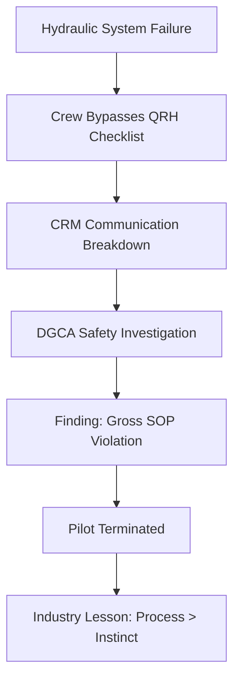

When something goes wrong in a cockpit, it is the ultimate stress test. Every second counts, and the only thing standing between a safe landing and a catastrophic disaster is a rigorous adherence to established rules. A recent IndiGo flight from Phuket to Delhi served as a stark reminder of this reality. While the aircraft landed safely, a hydraulic failure evolved into a major industry learning moment regarding the dangers of ignoring standard operating procedures (SOPs).

Following a detailed probe by the [Directorate General of Civil Aviation (DGCA)](https://www.dgca.gov.in), it was discovered that serious lapses in cockpit management occurred. These errors were so critical that they ultimately led to the termination of the pilot in command.

---

### 🛠️ The Mechanics: What Actually Went Wrong?

During the flight, the crew encountered a significant hydraulic system failure. To understand the gravity of this, one must view hydraulic systems as the "muscles" of an aircraft. These systems provide the necessary pressure to operate essential components, including **flight control surfaces (ailerons, elevators, and rudders), the braking systems, and the deployment of the landing gear**.

When a hydraulic system fails, the aircraft does not simply fall from the sky, but it becomes significantly more difficult to maneuver. Pilots must pivot to backup systems or employ manual overrides—such as allowing the landing gear to drop via gravity. In the Phuket-Delhi incident, the failure created a high-pressure environment where the crew was required to execute a very specific sequence of actions to ensure the aircraft remained stable for touchdown.

---

### 📋 The Fatal Flaw: Skipping the Manual

The primary issue identified by investigators was not the mechanical glitch itself, but the human response to it. Modern aviation safety is built upon the foundation of the **Quick Reference Handbook (QRH)**. The [QRH](https://www.skybrary.aero/articles/quick-reference-handbook-qrh) is a condensed, step-by-step manual that provides a mandatory checklist for every conceivable emergency, from engine fires to hydraulic leaks.

The DGCA investigation revealed a shocking deviation: the crew did not follow the "Hydraulic System Failure" checklist. Instead of executing the steps in the precise order they were engineered, the pilots attempted to manage the crisis using intuition and memory.

In the world of aviation, relying on "gut feeling" over a manual is a massive red line. Checklists are designed to remove cognitive load during emergencies, ensuring that no critical step—no matter how small—is overlooked. By bypassing these verification steps, the crew converted a manageable technical failure into a **100% avoidable safety risk**.

---

### 🗣️ The Collapse of Cockpit Resource Management (CRM)

Beyond the checklist failure, the incident highlighted a total breakdown in **Cockpit Resource Management (CRM)**. CRM is the strategic use of all available resources—including people, hardware, and information—to ensure the safest flight possible.

The [DGCA](https://www.dgca.gov.in) noted "serious lapses" in the communication between the Captain and the co-pilot. In a high-functioning cockpit, the co-pilot serves as a critical safeguard, tasked with cross-verifying the Captain's actions to prevent "tunnel vision." However, on this flight, this safety net vanished:

> "The lack of coordination and failure to cross-verify actions meant that errors went uncorrected in real-time, leaving the aircraft's safety dependent on luck rather than procedure."

When CRM fails, the redundancy that defines aviation safety disappears, leaving the passengers vulnerable to a single point of human failure.

---

### ⚖️ The Fallout: Zero Tolerance for Error

The regulatory response was swift. The DGCA concluded that the failure to follow mandatory procedures constituted a significant safety violation. In professional aviation, a "safe landing" is not the sole metric of success; *how* that landing is achieved is equally important.

As a result, [IndiGo](https://www.goindigo.in) took the decisive step of sacking the pilot. This move sends a clear signal to the global aviation community: **technical proficiency is not a substitute for procedural discipline**. The airline's decision underscores a **zero-tolerance policy** toward skipping SOPs during emergencies.

---

### 🏁 The Bottom Line

This incident serves as a powerful case study for the [International Civil Aviation Organization (ICAO)](https://www.icao.int) standards of safety. It proves that the most dangerous element in a cockpit is not a mechanical failure, but a pilot who believes they are above the manual.

Real safety is not found in the ability to "wing it" during a crisis; it is found in the disciplined, repetitive, and boring adherence to the checklist. For the aviation industry, the Phuket-Delhi flight is a reminder that while instincts can be helpful, the manual is what saves lives.

#### Key Takeaways for Aviation Safety:
*   **QRH Adherence:** Checklists must be followed linearly without exception.
*   **CRM Integrity:** Co-pilots must be empowered to challenge the Captain when SOPs are ignored.
*   **Outcome vs. Process:** A successful outcome (landing) does not justify a flawed process.
*   **Regulatory Oversight:** The [DGCA](https://www.dgca.gov.in) continues to tighten enforcement on procedural deviations to maintain India's airspace safety.

---

## 📖 Related Reading

- [What Actually Happened During the IndiGo Emergency Landing in Chennai?](/indigo-flight-makes-emergency-landing-after-engine-failure-full-emergency-declared-at-chennai-airport-the-times-of-india/)
- [Can a New US Diplomatic Push Actually End the War in Ukraine?](/us-envoys-headed-to-russia-and-ukraine-to-relaunch-mediation-al-jazeera/)
- [🛰️ Mastering the Horizon: A Comprehensive Guide to ISRO's Earth Observation Satellite (EOS) Series](/isro-successfully-launches-earth-observation-satellite-eos-05/)
