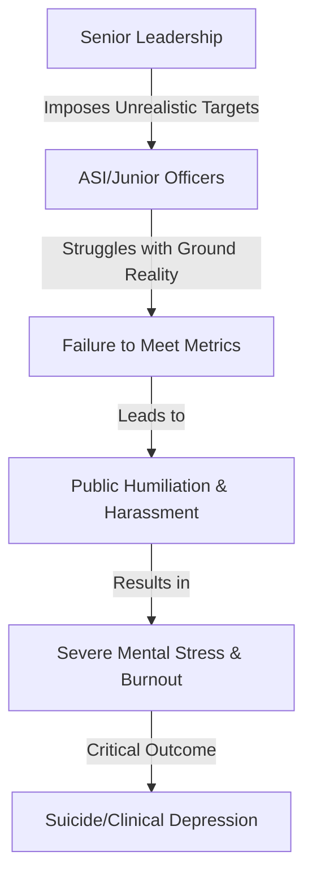

The Navi Mumbai Police department is currently grappling with a harrowing internal crisis. The recent suicide of Assistant Sub-Inspector (ASI) Sandeep Kadam has sent shockwaves through the Vashi police division, not only because of the loss of life but because of the searing indictment left behind in his final words. 

Sandeep Kadam did not leave a simple goodbye; he left a roadmap of systemic failure. In a devastating suicide note, Kadam alleged that he was subjected to relentless mental torture and systemic harassment by his senior officers. This tragedy has forced a necessary, albeit painful, conversation regarding the mental health of law enforcement officers in India—specifically the toxic intersection of "performance targets" and professional well-being.

---

### 📉 The "Target" Culture and Mental Torture

At the core of Kadam’s distress was the pervasive and controversial "target culture" embedded within many Indian police jurisdictions. While the objective of reducing crime is paramount, the method of measuring success has often shifted from community safety to raw metrics.

Officers are frequently pressured to meet specific quotas regarding the number of First Information Reports (FIRs) filed, the volume of arrests made, or the amount of contraband recovered. When these numbers dip, the reaction from senior leadership is often not support, but scrutiny and humiliation.

> "The pressure to deliver numbers often transforms police stations into corporate sales offices, where the metric of success is the number of arrests or FIRs rather than actual community safety."

For middle-ranking officers like ASIs, this creates a psychological vice. They are squeezed between the unrealistic demands of high-ranking officials and the ground reality of policing. Reports indicate that Kadam felt trapped in a cycle where his efforts were ignored, but his perceived failures were weaponized against him by senior leadership, as noted in reports by the [Times of India](https://timesofindia.indiatimes.com/).

---

### ⚖️ The Official Response: Accountability or Optics?

Following the public outcry and the revelation of the suicide note, the Navi Mumbai Police Commissioner’s office acted swiftly to contain the fallout. An official probe committee has been established to investigate the allegations of harassment. The department has stated that any officer found guilty of professional misconduct or mental torture will face strict disciplinary action.

However, police welfare activists and legal experts remain skeptical. Historically, internal inquiries within the police force lack the transparency required to hold high-ranking officials accountable. The concern is that these committees often serve as a mechanism for "damage control" rather than a vehicle for genuine reform.

---

### 🧠 The Systemic Crisis of Police Wellness

ASI Kadam’s death is not an isolated incident but a symptom of a profound systemic crisis. The culture of the Indian Police Service (IPS) and state forces is built on a rigid, paramilitary hierarchy where questioning a superior is often equated with insubordination.

The statistics regarding police wellness in India are alarming:
*   Officers frequently work **12-16 hour shifts** without scheduled breaks.
*   There is a staggering lack of access to confidential counseling or psychological support.
*   The **2006 Supreme Court ruling** in the *Prakash Singh* case emphasized the need for police reforms to reduce political interference and improve working conditions, yet implementation remains sluggish across many states.

Research into [occupational stress among Indian police](https://www.ncbi.nlm.nih.gov/pmc/) highlights that the combination of political pressure, social isolation, and professional harassment creates a "pressure cooker" environment. When officers feel they have no safe space to report abuse without fearing professional retaliation, the only escape for some becomes a permanent one.

---

### 🛡️ Conclusion: Beyond the Inquiry

The loss of ASI Sandeep Kadam must be a catalyst for change. For too long, the "strongman" image of the police has been used to mask a crumbling internal support system. Law enforcement cannot effectively protect the public if the protectors themselves are being destroyed from within.

To prevent further tragedies, the Navi Mumbai Police—and the broader Indian law enforcement apparatus—must move beyond the "target" mindset. True accountability must involve:
1.  **Decoupling** performance reviews from arbitrary numerical quotas.
2.  **Implementing** mandatory mental health screenings and accessible counseling.
3.  **Establishing** independent oversight bodies to handle internal harassment claims, removing them from the chain of command.

The tragedy of ASI Kadam serves as a grim reminder that a uniform does not make a person immune to pain. Accountability must mean more than a committee report; it must mean a fundamental shift in how leadership is practiced in the force.

---

### 📚 References & Further Reading

*   **National Crime Records Bureau (NCRB):** [Data on Police Personnel and Crime](https://ncrb.gov.in/)
*   **The Hindu:** [Analysis of Police Reforms in India](https://www.thehindu.com/)
*   **Supreme Court of India:** [Prakash Singh vs Union of India (Police Reforms)](https://main.sci.gov.in/)
*   **World Health Organization (WHO):** [Guidelines on Mental Health at Work](https://www.who.int/)
*   **Indian Express:** [Reports on Police Workload and Stress](https://indianexpress.com/)

---

## 📖 Related Reading

- [Checklists Over Instincts: What We Can Learn from the Phuket-Delhi Hydraulic Failure ✈️](/phuket-delhi-flight-probe-finds-hydraulic-failure-pilot-sacked/)
- [iPhone 18 Pro: The 2nm Revolution, the A20 Pro Chip, and India Price Predictions](/iphone-18-pro-launch-expected-india-price-a20-pro-chip-camera-upgrades-and-everything-we-know-so-far-moneycontrolcom/)
- [🏮 Midnight Magic: Mumbai Metro Extends Services for Ganpati 2026](/ganpati-2026-mumbai-metro-extends-services-on-3-corridors-till-midnight/)
