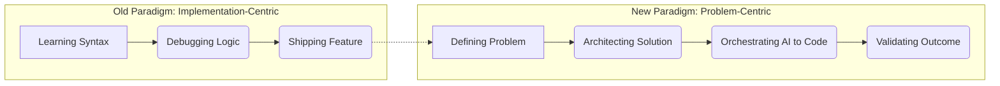

For decades, the identity of a "software engineer" was inextricably linked to a specific set of technical skills: the ability to master complex syntax, manage memory pointers, and navigate the idiosyncratic whims of compilers. To be a developer was to be a syntax wizard—a translator who could turn a vague human requirement into the precise, rigid language of C++, Java, or Python.

  
  
 <a href="https://unsplash.com/@champsara">AJOY DAS</a> on <a href="https://unsplash.com/photos/a-man-with-a-mustache-and-a-pink-shirt-86hgM8nTsUU">Unsplash</a>

However, according to [Sridhar Vembu](https://www.zoho.com/about.html), the CEO of Zoho Corporation, that era is rapidly drawing to a close. Vembu posits a bold, disruptive thesis: **AI will soon be writing the vast majority of software code**, effectively turning the act of "coding" into a commodity. 

This transition does not signal the death of the software profession, but rather its evolution. We are witnessing a shift where the "how" of programming—the syntax and implementation—is being decoupled from the "what" and "why"—the architecture and problem-solving. To remain relevant, developers must pivot from being "coders" to becoming "problem solvers" and "system architects."

---

### 🤖 Why "Knowing the Language" Isn't a Moat Anymore

Historically, the barrier to entry for software development was a steep learning curve. Engineers spent years mastering concurrency, memory management, and the nuances of different frameworks. This specialized knowledge created a professional "moat," protecting the value of the developer's labor.

The emergence of Large Language Models (LLMs) has effectively drained that moat. Tools like [GitHub Copilot](https://github.com/features/copilot) and [ChatGPT](https://openai.com) are no longer just sophisticated autocomplete engines; they are synthesizing entire modules, writing unit tests, and refactoring legacy code from simple natural language prompts. When an AI can generate a bug-free API integration or a complex React component in seconds, the market value of simply "knowing the language" plummets.

This shift is backed by [recent academic research on LLMs in software engineering](https://arxiv.org/abs/2308.02922), which indicates that AI is a massive productivity booster for routine tasks but lacks a fundamental understanding of big-picture architecture and long-term maintainability.

**The value proposition is shifting fundamentally:**
* **The Old Paradigm:** $\text{Value} = (\text{Knowledge of Syntax}) \times (\text{Ability to implement logic})$.
* **The New Paradigm:** $\text{Value} = (\text{Clarity of Specification}) \times (\text{Ability to orchestrate AI})$.

In this new ecosystem, the "coder" is replaced by the "orchestrator." The technical debt of the future will not be caused by "bad syntax" or "missing semicolons," but by "bad instructions" and "flawed specifications."

---

### 🏗️ Moving Up the Ladder: Coder $\rightarrow$ Architect $\rightarrow$ Product Thinker

If the implementation layer is automated, where does the human engineer fit in? Vembu suggests a hierarchy of value. To avoid obsolescence, developers must climb this ladder, moving toward roles that require high-level cognitive judgment and empathy.

#### 1. The Coder (High Risk)
The Coder is a translator. They take a Jira ticket or a specification document and turn it into code. Because this is essentially a translation task—from one language (English) to another (TypeScript)—it is the easiest function for AI to automate. According to some industry estimates, **up to 80% of routine boilerplate code** can now be generated by AI with minimal human oversight.

#### 2. The Architect (Medium Risk)
The Architect focuses on the "skeleton" of the application. They handle scalability, security, data flow, and the interaction between distributed systems. While AI can suggest design patterns, it cannot yet navigate the messy, political, and technical trade-offs of a specific company's legacy infrastructure. The Architect ensures the system doesn't collapse under its own weight.

#### 3. The Product Thinker (Low Risk)
The Product Thinker focuses on the "Why." They possess the empathy to understand a customer's frustration and the business acumen to identify a market gap. They define the problem so precisely that the AI can solve it correctly the first time. This role is the most secure because it requires human intuition and a deep understanding of human behavior.

> "The focus must shift from 'how to code' to 'what to build.' The real value lies in the problem definition, not the solution implementation." — *Paraphrased from Sridhar Vembu's philosophy on AI democratization.*

To visualize this mental shift, consider the following transition in the development workflow:

---

### 🛠️ The "Last 10%" Problem and the Human Moat

Despite the hype, the software community—particularly on platforms like [Hacker News](https://news.ycombinator.com)—frequently discusses the "Last 10% Problem." 

AI is exceptional at getting a project 90% of the way there. It can spin up a database, build a responsive UI, and write the core business logic. However, that final 10%—the edge cases, the deep-seated race conditions, the subtle security vulnerabilities, and the performance tuning required for millions of concurrent users—remains the domain of the human expert.

This is where **Deep Domain Expertise** becomes the ultimate competitive advantage. If you are building software for the healthcare sector, your value isn't in knowing Python; it's in your understanding of [HIPAA compliance](https://www.hhs.gov/hipaa/index.html), patient clinical workflows, and the nuances of medical data privacy.

**Your "Human Moat" is now constructed from three pillars:**
1. **Empathy:** Understanding the emotional friction a user feels when a tool fails—a sensation an LLM can simulate but never experience.
2. **Judgment:** The ability to decide when *not* to add a feature, preventing "feature bloat" even when the AI can build that feature in seconds.
3. **Verification:** The skill to audit AI-generated code to catch "hallucinations"—logic that looks syntactically correct but fails catastrophically in a production environment.

As AI lowers the cost of producing code, the global volume of software will explode. This will create a massive demand for **Code Auditors**: elite engineers who can ensure that this mountain of AI-generated software is secure, maintainable, and efficient.

---

### 🌾 Democratization and the Rural Tech Revolution

One of the most compelling aspects of Sridhar Vembu's vision is the intersection of AI and his commitment to rural empowerment through [Zoho](https://www.zoho.com). For years, Vembu has argued that talent is distributed globally, but opportunity is concentrated in a few urban hubs like Silicon Valley or Bangalore.

Historically, becoming a software creator required an expensive computer science degree and access to urban tech ecosystems. AI destroys this barrier. By handling the syntax, AI allows the **domain expert**—the farmer, the rural teacher, the village doctor—to become a **software creator**.

Imagine a farmer in rural India who deeply understands the soil degradation patterns in their region. Previously, they would have had to hire a developer (who doesn't understand farming) to build an app. Now, the farmer can use AI to translate their domain expertise directly into a functional tool for their community. 

This transforms software development from an "elite priesthood" into a universal utility. It aligns perfectly with Vembu's goal of creating "rural hubs" of innovation, shifting the center of gravity from chasing the latest framework in a city to solving real-world problems in the heartland.

---

### 🚀 A Strategic Roadmap for Staying Relevant

To thrive in this environment, developers must stop competing with AI and start managing it. The goal is to move from being a "resource" to being a "multiplier."

#### 1. Transition to "Product Engineering"
Stop asking, *"How do I implement this function?"* and start asking, *"Is this the right problem to be solving?"* Invest time in learning user psychology, business strategy, and [Product Management](https://www.productplan.com/glossary/product-management/). The engineer who can bridge the gap between a business goal and a technical execution plan is indispensable.

#### 2. Master High-Level System Design
While AI can write a function, it struggles to design a massive, distributed system that balances speed, consistency, and reliability. Study the [CAP Theorem](https://en.wikipedia.org/wiki/CAP_theorem), microservices architecture, and the [System Design Primer](https://github.com/donnemartin/system-design-primer). Focus on how data flows across a global infrastructure rather than how a loop is written.

#### 3. Develop "T-Shaped" Expertise
Maintain a broad understanding of the tech stack, but go extremely deep into one non-technical vertical (e.g., Fintech, Logistics, BioTech, or Agritech). The most valuable person in the room is the one who knows *why* the software is failing the user, regardless of whether a human or an AI wrote the code.

#### 4. Learn AI Orchestration and Agentic Workflows
Prompt engineering is merely the first step. The future belongs to those who can build **Agentic Workflows**—systems where multiple AI agents (e.g., a "Coder agent," a "Reviewer agent," and a "Tester agent") work in a loop to design and deploy software. Explore frameworks like [LangChain](https://www.langchain.com) or [AutoGPT](https://github.com/Significant-Gravitas/AutoGPT) to understand how to build the "factory" rather than acting as the "machine."

---

### 🏁 The Big Picture: The Unbundling of Engineering

Sridhar Vembu is not predicting the disappearance of the software engineer; he is predicting the **unbundling** of the role. The mechanical act of writing code is being separated from the intellectual act of engineering software.

According to recent surveys from [Stack Overflow](https://survey.stackoverflow.co), a significant majority of developers are already integrating AI into their daily workflows, with some reporting a **55% increase in speed** for routine tasks. This efficiency gain is the catalyst for the shift.

If you identify solely as a "coder," the future may seem precarious. But if you evolve into an architect, a product thinker, or a domain expert, AI becomes the greatest leverage tool in human history. By automating the mundane, AI is finally liberating engineers to do what they were always meant to do: **solve problems.**

---

## 📖 Related Reading

- [Ai Is Removing The Middle Class Of Software Engineering](/ai-is-removing-the-middle-class-of-software-engineering/)
- [🚨 The Breaking Point: The Tragic Death of ASI Sandeep Kadam](/navi-mumbai-police-asi-dies-by-suicide-leaves-note-alleging-harassment-by-senior-officers/)
- [Checklists Over Instincts: What We Can Learn from the Phuket-Delhi Hydraulic Failure ✈️](/phuket-delhi-flight-probe-finds-hydraulic-failure-pilot-sacked/)
