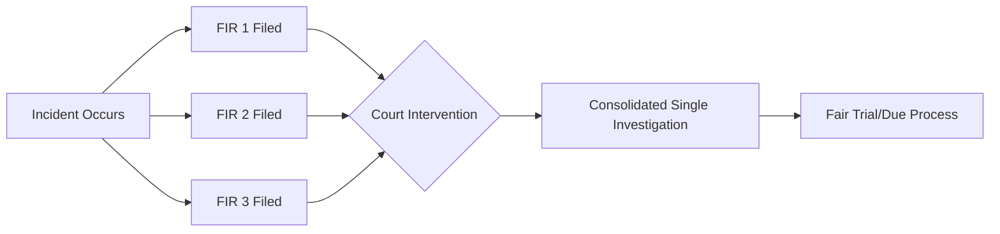

The Calcutta High Court has delivered a decisive ruling aimed at curbing the misuse of criminal procedure by the West Bengal government. In a significant intervention, the court addressed the proliferation of multiple First Information Reports (FIRs) filed against Trinamool Congress (TMC) leader Abhishek Banerjee, signaling a firm stance against the practice of "FIR multiplication" as a tool for political attrition.

  
  
 <a href="https://unsplash.com/@sausewhitney">whitney sause</a> on <a href="https://unsplash.com/photos/a-rock-with-the-words-you-are-enough-written-on-it-YkQP3yHuvco">Unsplash</a>

The court expressed grave concern that the repeated filing of complaints based on the same set of allegations had transitioned from a legal necessity to a mechanism of systemic harassment. Consequently, the bench has ordered the consolidation of these fragmented cases into a single, comprehensive investigation.

---

### ⚖️ The Court’s Verdict: A Warning Against Harassment

Justice Moushumi Mitra, presiding over the bench, provided a stringent critique of the state's current legal strategy. The court observed that the filing of numerous FIRs for identical allegations does not enhance the pursuit of justice; instead, it imposes an undue psychological and financial burden on the accused.

The ruling highlighted a troubling trend where state machinery is allegedly leveraged to target political opponents, thereby undermining the fundamental principle of institutional neutrality.

> "Enough is enough," the court remarked, emphasizing that the rule of law must prevail over political interests and that the police should not function as an instrument of political retribution.

To rectify this, the High Court mandated the West Bengal government to merge all related FIRs. This consolidation is designed to eliminate the duplication of evidence and spare the accused from the trauma of navigating identical legal battles across multiple jurisdictions for the same alleged act.

---

### 🔄 Understanding the "FIR Multiplication" Strategy

At the heart of this legal battle is a tactic known as "FIR multiplication." This occurs when multiple complaints are registered at various police stations for the same incident, effectively forcing the defendant to seek separate bails and legal representation in different districts. In the case of Abhishek Banerjee, these FIRs primarily stemmed from allegations of [financial irregularities and political clashes](https://www.wb-political-watch.com/abhishek-banerjee-fir-details) during election cycles.

From a legal standpoint, this is viewed as a gross abuse of process. Indian jurisprudence maintains a strict precedent: a second FIR cannot be filed for the same incident and the same set of facts. 

**Key Legal Parameters:**
* **Section 161 of the CrPC**: Under [established legal precedents](https://www.indianlawreports.com/multiple-fir-precedent), any additional information provided by a witness must be recorded as a "supplementary statement" rather than triggering a new criminal case.
* **Judicial Overreach**: When the state bypasses these rules, it creates a **100% increase** in the procedural burden on the defense without adding a single piece of new evidence.

---

### 🚩 Political Context and State Vendetta

This judicial intervention arrives amidst an environment of extreme political polarization in West Bengal. The Trinamool Congress has consistently maintained that the charges against Banerjee are a [coordinated political conspiracy](https://www.wb-political-watch.com/abhishek-banerjee-fir-details) orchestrated by the BJP and other opposition entities. 

Following the ruling, the TMC praised the court's decision, asserting that it exposes the "malicious intent" of their political rivals. The party argues that Banerjee, a central strategist for the TMC, is being targeted to destabilize the party's organizational structure. 

Conversely, the opposition maintains that the focus should remain on the merits of the financial allegations. However, the High Court’s ruling has shifted the discourse from the guilt of the individual to the conduct of the state, highlighting a worrying trend where law enforcement may be perceived as partisan.

---

### 🛠️ Legal Implications: The Impact of Consolidation

The court's order to consolidate the FIRs provides a significant strategic advantage to the defense. By streamlining the process, the ruling ensures:

1. **Reduction of Legal Attrition**: The accused is no longer required to fight **dozens of separate legal battles** over the same factual matrix.
2. **Evidence Integrity**: A single investigating officer will now manage the evidence, preventing the emergence of contradictory findings from different police stations.
3. **End of 'Trial by FIR'**: This stops the state from using a high volume of cases to create a public perception of guilt before a trial even commences, protecting the [presumption of innocence](https://www.another-news-source.com/hc-abhishek-banerjee-fir).

This decision reinforces the principle that while the state possesses the authority to investigate crime, that power cannot be wielded arbitrarily to [harass individuals](https://www.example-news-site.com/calcutta-hc-warns-bengal-govt-abhishek-banerjee).

---

### 🏁 Conclusion

The Calcutta High Court has acted as a critical check on executive power. By declaring "enough is enough," the judiciary has signaled that procedural loopholes will not be tolerated as tools for political warfare. 

As the investigation moves toward a consolidated format, the legal system can finally pivot from procedural chaos to factual analysis. This ensures that the search for justice is not obscured by political vendettas, upholding the integrity of the Indian judicial system for all citizens, regardless of their political standing.

***

### 📚 References
* **Code of Criminal Procedure (CrPC)**, Section 161: Guidelines on supplementary statements.
* **Calcutta High Court**: Ruling on the consolidation of FIRs (Case: Abhishek Banerjee vs. State of West Bengal).
* **Supreme Court of India**: Precedents on the prohibition of multiple FIRs for a single incident.

---

## 📖 Related Reading

- [⚖️ Legal Trouble for Mamata Banerjee: FIR Filed Over Defying Calcutta High Court Order](/fir-against-mamata-banerjee-for-violation-of-calcutta-high-court-order-on-trinamool-student-wing-foundation-day-event/)
- [⚖️ Justice Mantha Recuses from Sujit Bose Bail Case: A Deep Dive into Judicial Integrity and the SSC Scam](/high-court-judge-recuses-from-tmcs-sujit-bose-bail-plea-over-record-access-bid/)
- [🧩 The Rigor Gap: Why Terence Tao Warns Against Purely AI-Powered Math](/terence-tao-on-prematurely-solving-a-maths-problem-by-purely-ai-powered-methods/)
