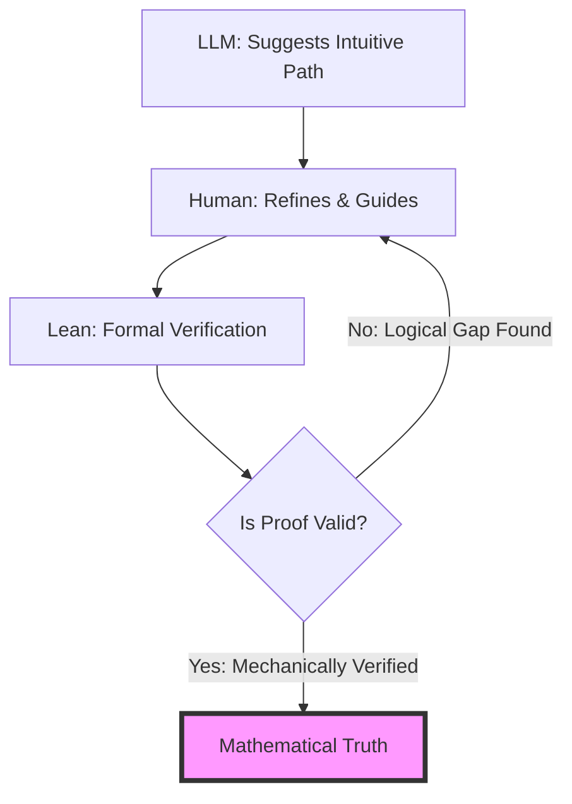

It is tempting to imagine we are entering an era of "instant mathematics." With Large Language Models (LLMs) demonstrating an uncanny ability to synthesize information and generate code, the prospect of typing a complex conjecture into a prompt and receiving a polished, peer-review-ready proof feels like science fiction becoming reality. However, Terence Tao—widely regarded as one of the most brilliant mathematicians of the 21st century—argues that this optimism is dangerous.

  
  
 <a href="https://unsplash.com/@pabloarenas">Pablo Arenas</a> on <a href="https://unsplash.com/photos/a-man-with-a-beard-and-a-black-shirt-aJI9tOltpF4">Unsplash</a>

Tao contends that "solving" a problem using only AI is often a **premature victory**. In the realm of mathematics, finding an answer is not the same as solving a problem. A solution only exists when there is a rigorous, verifiable proof that leaves no room for ambiguity. To Tao, relying on AI without a mechanism for formal verification isn't progress; it is a statistical gamble.

---

### 🤖 The LLM as a "Stochastic Copilot"

Contrary to some critics, Tao is not an AI skeptic. In fact, he has become one of the most prominent adopters of LLMs within the mathematical community. On his [personal blog](https://terrytao.wordpress.com/), he has documented his iterative process of using these tools to handle the "drudgery" of research. For Tao, the value of an LLM lies not in its ability to "think" or "reason" in the human sense, but in its utility as a highly efficient clerk.

He utilizes AI for several high-leverage, low-risk tasks:
* **Generating LaTeX Boilerplate**: Speeding up the tedious process of formatting complex symbols and structures for academic papers.
* **Rapid Brainstorming**: Using the model to suggest potential directions or to perform a "sanity check" on a general intuitive approach.
* **Translation and Structuring**: Converting informal, handwritten mathematical sketches into structured outlines.

However, Tao is adamant about the distinction between a **copilot** and a **pilot**. The fundamental limitation is that LLMs are probabilistic, not logical. They function by predicting the next most likely token based on a massive corpus of existing literature. This makes them exceptional at mimicking the *style* and *cadence* of a mathematical proof, but they remain susceptible to failing the actual *logic* of the proof. When a mathematician relies purely on an AI for a solution, they are trusting a statistical mirror rather than a logical engine.

> "LLMs are designed to be persuasive, not necessarily correct. In mathematics, a persuasive argument that is slightly wrong is more dangerous than no argument at all."

---

### ⚠️ The Hallucination Hazard and "Premature" Solutions

In most software engineering contexts, AI hallucinations are easily caught. If an AI suggests a non-existent library or a syntax error, the compiler throws an error, and the developer fixes it. Mathematics, however, lacks a built-in "compiler" for informal proofs.

A hallucinated step in a mathematical proof can be insidious. It may look perfectly plausible—following the standard conventions of the field—but contain a tiny, fatal logical gap. This is what Tao describes as the "premature solution." This occurs when an AI provides a sequence of steps that *appears* to lead to the correct conclusion, leading the human researcher to believe the problem is solved when, in reality, the logical bridge is broken.

The danger is systemic. If the mathematical community begins to accept results based on the "intuition" of an AI, we risk building the tower of mathematical knowledge on a foundation of statistical mirages. Tao emphasizes that an LLM's **confidence interval** (how sure it sounds) is absolutely no substitute for a **mathematical proof** (how certain the result is).

---

### 🛡️ Lean and the Formalization Shield

To bridge the gap between AI-driven intuition and absolute mathematical truth, Tao advocates for the integration of **formal verification systems**, most notably [Lean](https://lean-lang.org/). 

Lean is a proof assistant and a functional programming language that allows mathematicians to write proofs that are verified mechanically by a computer kernel. Unlike a human peer reviewer, who might skim a "trivial" step and miss a mistake, the Lean kernel checks every single logical inference against a set of foundational axioms.

Tao envisions a symbiotic, hybrid workflow where the AI serves as the "creative engine" and the formal system serves as the "ultimate judge." In this model, the AI doesn't provide the truth; it provides **candidates**—hypotheses and proof sketches that are then rigorously tested.

By shifting the objective from "getting an answer" to "getting a Lean-verified proof," the risk of premature solutions is eliminated. In this framework, the AI can be as "wrong" as it wants during the brainstorming phase. The [formal kernel](https://lean-lang.org/lean4/doc/) will catch every single error before the result is accepted as a theorem. This transforms the hallucination problem from a crisis of truth into a mere problem of efficiency.

---

### 📐 The AlphaGeometry Paradox

The discourse around AI in math is often skewed by high-profile successes, such as [Google DeepMind's AlphaGeometry](https://deepmind.google/discover/blog/alphageometry-solving-olympiad-geometry-problems/). This system achieved a milestone by solving **25 out of 30** International Mathematical Olympiad (IMO) geometry problems—performing at the level of a human gold medalist.

While impressive, Tao views these as "narrow AI" successes. AlphaGeometry does not function like a standard LLM; it combines a neural language model with a **symbolic deduction engine**. It operates within a highly constrained domain with a finite set of rules.

The "paradox" is that while AlphaGeometry can solve a specific competition problem, it cannot "do mathematics" in the broader sense. It cannot identify which problems are actually important to solve, nor can it create a brand-new conceptual framework to tackle an unsolved mystery like the Riemann Hypothesis.

**Key Distinctions in AI Capability:**

| Feature | Pure LLM (Probabilistic) | AlphaGeometry (Hybrid) | Formal Verification (Lean) |
| :--- | :--- | :--- | :--- |
| **Logic** | Mimicked / Stochastic | Symbolic / Deductive | Absolute / Axiomatic |
| **Reliability** | Low (Hallucinations) | High (within domain) | Absolute |
| **Creativity** | High (Pattern Matching) | Low (Search-based) | None (Verification only) |
| **Scope** | General | Narrow (Geometry) | General Mathematics |

Tao suggests that any approach relying solely on neural networks will eventually hit a wall. This is because mathematics is not just about finding patterns in existing data; it is about the **creation of new logic**. Solving a puzzle (like an IMO problem) is a closed-set task; expanding the frontier of mathematics is an open-set task.

---

### 🏁 Conclusion: The Future of the Human-AI-Formal Loop

Terence Tao’s perspective provides a sobering yet optimistic roadmap for the future of scientific discovery. He warns that the rush for "instant" results could erode the very rigor that makes mathematics the "gold standard" of truth.

The future of the field does not lie in the replacement of the mathematician by the machine, but in a sophisticated triadic relationship:
1. **The Generative Power of LLMs**: To suggest paths, automate boilerplate, and spark intuition.
2. **The Critical Intuition of Humans**: To direct the search and identify meaningful problems.
3. **The Absolute Certainty of Formal Systems**: To ensure that the final result is an immutable truth.

In Tao's world, AI is a powerful tool that frees the mathematician from the mundane, provided they never stop questioning the machine. The goal is not to find the answer faster, but to be more certain that the answer is correct.

***

### 📚 References & Further Reading

* **Tao, T.** (2023). *Observations on using LLMs for mathematics*. [Terry Tao's Blog](https://terrytao.wordpress.com/).
* **DeepMind.** (2024). *AlphaGeometry: Solving Olympiad Geometry Problems*. [DeepMind Blog](https://deepmind.google/discover/blog/alphageometry-solving-olympiad-geometry-problems/).
* **Lean Community.** *Lean Theorem Prover Documentation*. [lean-lang.org](https://lean-lang.org/).
* **International Mathematical Olympiad (IMO).** *Problem Archives and Standards*. [imo-official.org](https://www.imo-official.org/).
* **arXiv.** *Recent preprints on Neural Theorem Proving*. [arxiv.org](https://arxiv.org/).

---

## 📖 Related Reading

- [🏗️ The End of the Coder, the Rise of the Architect: Sridhar Vembu on AI and the Future of Software](/sridhar-vembu-says-ai-could-write-most-software-humans-must-figure-out-how-to-stay-relevant/)
- [🚨 The Breaking Point: The Tragic Death of ASI Sandeep Kadam](/navi-mumbai-police-asi-dies-by-suicide-leaves-note-alleging-harassment-by-senior-officers/)
- [Checklists Over Instincts: What We Can Learn from the Phuket-Delhi Hydraulic Failure ✈️](/phuket-delhi-flight-probe-finds-hydraulic-failure-pilot-sacked/)
