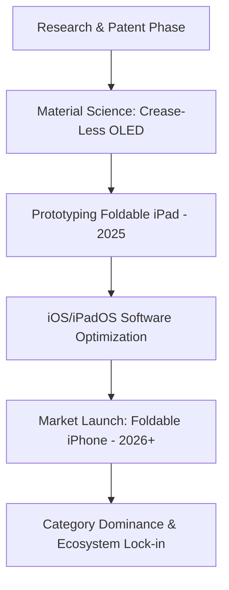

For nearly a decade, the tech community has echoed a consistent sentiment: Apple is "late" to the foldable party. While Samsung has iterated through multiple generations of the Z Fold and Z Flip, and Google has entered the fray with the Pixel Fold, Cupertino has remained conspicuously silent. However, in the world of Apple, "late" is often a synonym for "calculated."

  
  
 <a href="https://unsplash.com/@lagommedia">Laurenz Heymann</a> on <a href="https://unsplash.com/photos/apple-store-shop-front-VkfhJLz5SMQ">Unsplash</a>

Apple is not merely ignoring the trend; they are executing a classic "second-mover advantage." By allowing competitors to act as the industry's crash-test dummies, Apple is identifying the precise pain points of foldable technology—namely durability, screen creasing, and software fragmentation—to ensure that when they finally launch, the product isn't a beta test, but a definitive standard. Based on current supply chain leaks and patent filings, we are looking at a tiered rollout: a **20-inch foldable iPad as early as 2025**, followed by the highly anticipated **Foldable iPhone between 2026 and 2027**.

---

### 🛠️ The Engineering War: Solving the "Crease" Problem

The primary barrier to mainstream foldable adoption isn't the price—it's the physics. Almost every foldable device currently on the market suffers from a visible and tactile "crease" where the screen bends. For a company obsessed with industrial design and "pixel-perfect" aesthetics, a dip in the center of the display is an unacceptable flaw.

Apple's approach to this problem involves a multi-pronged strategy focusing on material science and hinge geometry. According to recent [Apple intellectual property filings](https://www.apple.com/legal/intellectual-property/), the company is experimenting with a "crease-less" display that utilizes a combination of ultra-thin glass (UTG) and a proprietary polymer layer. 

The goal is to create a display that maintains the rigidity of a standard iPhone screen while possessing the flexibility of a foldable. This involves a hinge mechanism that allows the screen to curve in a way that minimizes stress on the organic light-emitting diodes (OLED). By optimizing the radius of the fold, Apple aims to eliminate the permanent deformation that causes the crease in competing devices.

> "Apple's internal goal is not just to make a phone that folds, but to create a device that maintains the structural integrity and display quality of a standard iPhone, ensuring the user experience is indistinguishable from a static slab." — *Industry Insider Report*

---

### 📅 The Strategic Roadmap: 2025 and Beyond

Tracking the timeline of an Apple product is an exercise in patience and pattern recognition. Analysts like [Ming-Chi Kuo](https://twitter.com/mingchi_kuo) and display expert [Ross Young](https://twitter.com/RossYoung) have consistently pointed toward a gradual entry into the foldable space. Rather than jumping straight to a phone, Apple is likely to use the iPad as a bridge.

#### 💻 The Foldable iPad (Estimated 2025)
The first foldable device will likely be a massive iPad—potentially **20 inches** when unfolded. This device would effectively blur the line between a tablet and a laptop, positioning it as a direct competitor to the MacBook Air. By launching a foldable iPad first, Apple can refine its hinge durability and software scaling on a larger canvas before shrinking the tech down to a pocket-sized device.

#### 📱 The Foldable iPhone (Estimated 2026-2027)
The "iPhone Fold" (or "iPhone Ultra") will be the crown jewel. Positioned as a high-end luxury tier above the Pro Max, this device will likely target power users who want a tablet-sized screen in their pocket. This launch is expected to trigger a **massive new upgrade cycle**, as millions of users who have held onto their iPhones for 4-5 years finally see a form factor change significant enough to justify the cost.

---

### ⚙️ Software Evolution: More Than Just a Big Screen

Hardware is only half the battle. The current state of foldable software is often a "stretched" version of a phone app. For Apple, the challenge is to overhaul [iOS and iPadOS](https://www.apple.com/ios/ipados/) to support dynamic resizing.

The vision is a "fluid canvas." Imagine an app that opens in a standard iPhone window and, as the device unfolds, seamlessly transitions into a multi-pane layout. This requires a fundamental shift in how developers build apps. Apple will likely introduce a new "Foldable API," forcing developers to optimize their layouts for variable aspect ratios.

**Key software improvements will include:**
*   **Advanced Multitasking:** Moving beyond "Split View" to allow **three or more active windows** simultaneously.
*   **Continuity 2.0:** Enhanced hand-off between the folded (compact) mode and unfolded (productive) mode.
*   **Contextual Toolbars:** Menus that shift position based on whether the device is partially folded (Laptop mode) or fully open (Tablet mode).

By leveraging the raw power of the M-series chips, a foldable iPhone wouldn't just be a phone; it would be a pocketable workstation, potentially rendering the iPad Mini obsolete for many consumers.

---

### 🥊 Competitive Analysis: Apple vs. The World

Apple is entering a market where [Samsung's Galaxy Z Fold](https://www.samsung.com/global/galaxy/galaxy-z-fold/) and the [Google Pixel Fold](https://store.google.com/product/pixel_fold) have already established a foothold. However, Samsung's lead is primarily in hardware iteration, not necessarily in user experience.

| Feature | Samsung/Google Approach | Apple's Predicted Approach |
| :--- | :--- | :--- |
| **Market Entry** | First-to-market / Iterative | Second-mover / Definitive |
| **Display** | Visible crease, softer feel | Crease-less, rigid-feel glass |
| **Software** | Android adaptation | Ground-up iOS optimization |
| **Integration** | Hardware-led | Ecosystem-led (Hardware + Software + Services) |
| **Target** | Early adopters / Tech enthusiasts | Mass market / Luxury professional |

While Samsung dominates the **market share** of foldables currently, Apple’s secret weapon is vertical integration. Because Apple controls the silicon, the operating system, and the App Store, they can ensure that the transition from a 6-inch screen to a 10-inch screen is frictionless.

---

### 📈 The Economic Impact and Market Outlook

The introduction of a foldable iPhone is not just a product launch; it's a financial strategy. Market data from [Counterpoint Research](https://www.counterpointresearch.com/) suggests that the foldable market is growing at a compound annual growth rate (CAGR) that far outpaces standard smartphones.

**Bold Financial Projections:**
*   **Price Point:** Expect a premium. A foldable iPhone could easily start at **$1,999 to $2,499**, creating a new "Ultra-Premium" segment.
*   **Upgrade Cycles:** A foldable launch could shorten the average upgrade cycle from **3.5 years back down to 2 years** for high-end users.
*   **Supply Chain:** Apple's entry will likely force OLED suppliers like Samsung Display and LG Display to innovate further, potentially lowering the cost of foldable panels for the entire industry.

As reported by [IDC](https://www.idc.com/), the demand for larger screens in mobile form factors is increasing, especially in the "prosumer" demographic. Apple is positioning itself to capture this peak demand precisely when the technology reaches maturity.

---

### 🏁 Final Verdict: Is the Wait Worth It?

The skepticism surrounding Apple's delay is understandable, but historical precedent suggests that waiting is their winning move. They didn't invent the MP3 player, the smartphone, or the smartwatch—they perfected them.

The promise of a **crease-free, durable, and deeply integrated** foldable device is a compelling value proposition. While the wait until **2026** may seem long to the enthusiast, for the average consumer, the first "reliable" foldable will be the only one that matters. If Apple can solve the physics of the fold and the logic of the software, they won't just participate in the foldable market—they will define it.

For those currently holding a standard iPhone, the advice is simple: hold on. The transition from the "slab" to the "fold" will likely be the most significant leap in mobile computing since the original iPhone launched in 2007.

---

### 📚 References & Further Reading

*   **Apple Newsroom:** [Official Product Announcements](https://www.apple.com/newsroom/)
*   **Display Supply Chain Consultants (DSC):** [Ross Young's Industry Analysis](https://twitter.com/RossYoung)
*   **Ming-Chi Kuo:** [Supply Chain Leaks and Projections](https://twitter.com/mingchi_kuo)
*   **Samsung Mobile:** [Galaxy Z Series Specifications](https://www.samsung.com/global/galaxy/galaxy-z-fold/)
*   **Google Store:** [Pixel Fold Overview](https://store.google.com/product/pixel_fold)

---

## 📖 Related Reading

- [📱 Apple’s Next Act: Folding Screens and the Succession Race](/apple-expected-to-unveil-folding-iphone-as-new-ceo-takes-center-stage/)
- [Researchers Put Chatgpt, Gemini And Grok On Therapy, Here Is How Ai Reacted When Questioned](/researchers-put-chatgpt-gemini-and-grok-on-therapy-here-is-how-ai-reacted-when-questioned/)
- [🧩 The Rigor Gap: Why Terence Tao Warns Against Purely AI-Powered Math](/terence-tao-on-prematurely-solving-a-maths-problem-by-purely-ai-powered-methods/)
