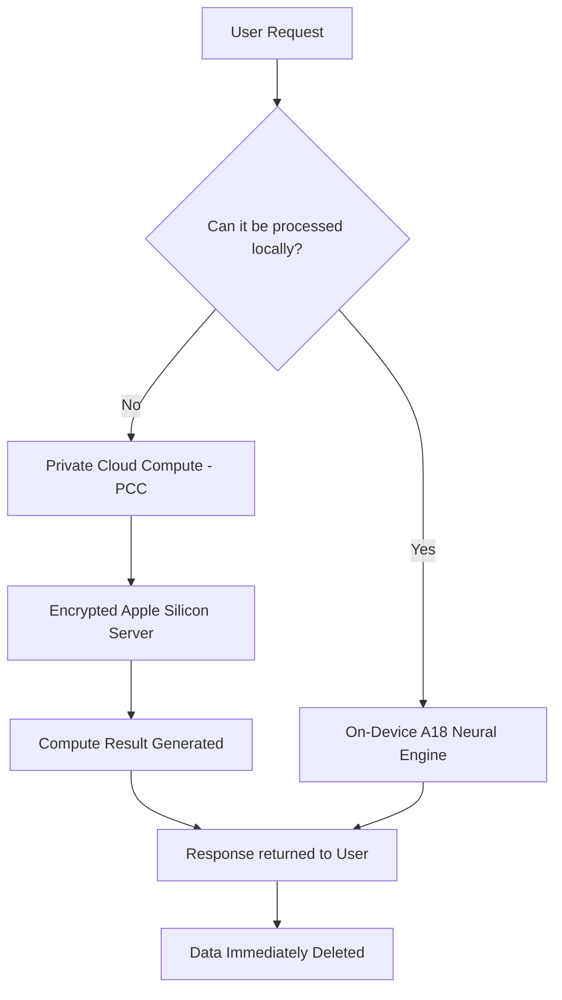

Apple recently concluded its "Glowtime" event, signaling a fundamental shift in the company's product philosophy. For the past decade, Apple has mastered the art of the incremental hardware update—slightly faster chips, slightly better cameras, and marginally brighter screens. However, with the introduction of the **iPhone 16 series**, the narrative has shifted from *what the device is* to *what the device can do* via artificial intelligence.

  
  
 <a href="https://unsplash.com/@bangyuwang">Bangyu Wang</a> on <a href="https://unsplash.com/photos/grayscale-photo-of-hanging-heart-shaped-pendant-lamp-omoCm0bvNW4">Unsplash</a>

The centerpiece of this transition is [Apple Intelligence](https://www.apple.com/apple-intelligence/), a deeply integrated personal intelligence system that aims to transform the smartphone from a passive tool into a proactive assistant. While the hardware updates are present, they now serve a singular purpose: providing the compute power necessary to run large language models (LLMs) locally while maintaining the strict privacy standards Apple has built its brand upon.

---

### 📱 The iPhone 16: Hardware Reimagined for AI

The iPhone 16 and 16 Plus are no longer just "entry-level" models. In a strategic move to ensure the entire lineup can support the demands of generative AI, Apple has equipped the base models with the **A18 chip**. This leap skips a generation of silicon, providing the neural processing power required for on-device token generation and image synthesis.

#### New Tactile Interfaces
Beyond the silicon, Apple has introduced two major physical changes:
1.  **The Action Button:** Previously exclusive to the Pro line, this customizable button is now standard across all models, allowing users to trigger shortcuts, voice memos, or accessibility features instantly.
2.  **Camera Control:** This is more than a button; it is a sapphire-crystal, pressure-sensitive sensor. It allows users to slide their finger to adjust zoom, exposure, or depth of field without ever touching the screen, mimicking the experience of a professional DSLR.

#### The Pro Powerhouse
For the power users, the iPhone 16 Pro and Pro Max have expanded to **6.3-inch and 6.9-inch displays**, respectively. These devices utilize the **A18 Pro chip**, which features an enhanced GPU and a faster Neural Engine. The camera system sees a massive upgrade with a **48MP Ultra Wide camera**, enabling high-resolution macro photography and the ability to capture **4K120 fps Dolby Vision** video—a professional-grade spec that allows for cinematic slow-motion playback.

> "The Camera Control button is a return to the tactile feel of a dedicated camera, though its true value will depend on how third-party developers integrate it into their apps." — *Community Sentiment via [Hacker News](https://news.ycombinator.com)*

---

### 🤖 Apple Intelligence: Redefining the OS

While the titanium frames and new buttons get the headlines, the real revolution is happening in [iOS 18](https://www.apple.com/ios/ios-18/). Apple Intelligence isn't a standalone app; it is a fabric woven into the entire operating system.

#### Core Capabilities
*   **Writing Tools:** System-wide capabilities to rewrite, proofread, and summarize text across Mail, Notes, and third-party apps.
*   **Image Playground:** A generative AI tool that allows users to create stylized images (Animation, Illustration, or Sketch) based on prompts or photos of friends.
*   **Contextual Siri:** The new Siri can finally "see" what is on your screen and understand personal context. For example, asking "When does my mom's flight land?" allows Siri to scan your emails and calendar to find the answer without you providing the flight number.

#### Solving the "AI Privacy Paradox"
The biggest hurdle for AI adoption is data privacy. To combat this, Apple introduced **Private Cloud Compute (PCC)**. Most AI assistants send data to a centralized cloud where it is processed and potentially stored. PCC changes this by using custom Apple Silicon servers that extend the security of the on-device enclave to the cloud.

According to Apple's [Privacy Whitepaper](https://www.apple.com/privacy/), data processed via PCC is never stored and is inaccessible even to Apple employees. This "stateless" approach ensures that the intelligence is personal, but the data remains private.

---

### ⌚ The Wearables Evolution: Watch Series 10 & AirPods 4

Apple's wearables are continuing their trend of "invisible" improvements—changes that feel natural but are technically significant.

#### Apple Watch Series 10: Slimmer and Sharper
The **Apple Watch Series 10** is the thinnest watch in Apple's history, featuring a new **wide-angle OLED display**. This display is designed to be more legible from various angles, reducing the need to tilt your wrist to see notifications.

The most critical addition is the **Sleep Apnea detection** feature. By utilizing the accelerometer to monitor breathing disturbances during sleep, the watch can notify users of potential health risks, urging them to consult a physician. This further cements the Apple Watch's position as a medical-grade health companion rather than just a fitness tracker.

#### AirPods 4: ANC for Everyone
The **AirPods 4** launch marks a shift in the audio lineup. For the first time, Apple is offering **Active Noise Cancellation (ANC)** in an open-ear design. Powered by the **H2 chip**, these earbuds use computational audio to cancel out external noise while maintaining a comfortable fit for those who dislike silicone tips. This brings the "Pro" experience to a wider audience, making high-end noise cancellation a standard expectation for the average consumer.

---

### ⚖️ Market Analysis: The AI-Phone Arms Race

Apple is not alone in the AI pivot. Competitors like [Samsung with Galaxy AI](https://www.samsung.com/galaxy-ai/) and [Google with Gemini](https://deepmind.google/technologies/gemini/) have already integrated generative AI into their handhelds. However, Apple's strategy differs in one key area: **Integration vs. Overlay**.

While Samsung and Google often rely on cloud-based overlays, Apple is betting on a hybrid model. By leveraging the **A18's 16-core Neural Engine**, Apple aims to perform as many tasks as possible on-device. This reduces latency, saves battery life, and enhances security.

**Comparative Statistics at a Glance:**

| Feature | iPhone 16 Pro | Galaxy S24 Ultra | Pixel 9 Pro |
| :--- | :--- | :--- | :--- |
| **Primary AI** | Apple Intelligence | Galaxy AI | Google Gemini |
| **Processing** | Hybrid (On-Device/PCC) | Hybrid (On-Device/Cloud) | Hybrid (On-Device/Cloud) |
| **Key Hardware** | **A18 Pro (3nm)** | **Snapdragon 8 Gen 3** | **Tensor G4** |
| **Privacy Focus** | Private Cloud Compute | Knox Security | Google Privacy Sandbox |
| **Video Spec** | **4K120 fps Dolby Vision** | 8K Video | Video Boost |

---

### 🏁 Final Verdict: Incremental Hardware, Exponential Software

The "Glowtime" event reveals an Apple that is no longer content with just refining the slab of glass in your pocket. They are attempting to redefine the relationship between the user and the operating system. 

The hardware upgrades—the **6.9-inch screens**, the **Camera Control**, and the **Satin Black Ultra 2**—are pleasant refinements, but they are secondary. The real gamble is whether Apple Intelligence can move beyond the "novelty phase" of AI. If the generative tools feel like glorified autocomplete, the upgrade cycle for the iPhone 16 may be slow. 

However, if **Private Cloud Compute** becomes the gold standard for AI privacy, Apple will have secured a massive competitive advantage. They aren't just selling a faster phone; they are selling a trusted, intelligent partner. As we move into the era of the "AI-Phone," the winner won't be the company with the most features, but the one that users trust with their most personal data.

---

### 📚 References & Further Reading
*   [Apple Newsroom: iPhone 16 Official Press Release](https://www.apple.com/newsroom/)
*   [MacRumors: Deep Dive into A18 Chip Architecture](https://www.macrumors.com)
*   [The Verge: iPhone 16 Pro Hands-on Review](https://www.theverge.com)
*   [9to5Mac: iOS 18 Feature Breakdown](https://9to5mac.com)
*   [Apple Support: Understanding Private Cloud Compute](https://www.apple.com/privacy/)

---

## 📖 Related Reading

- [📱 The 2nm Revolution: What to Expect from the iPhone 18 Pro & Pro Max](/apple-to-launch-iphone-18-pro-and-iphone-18-pro-max-on-september-9-big-upgrades-to-expect/)
- [📱 Apple’s Next Act: Folding Screens and the Succession Race](/apple-expected-to-unveil-folding-iphone-as-new-ceo-takes-center-stage/)
- [📱 The Crease-Less Revolution: Apple’s Strategic Bet on the Foldable iPhone](/apple-expected-to-unveil-first-folding-phone-with-new-ceo-ternus-in-command/)
