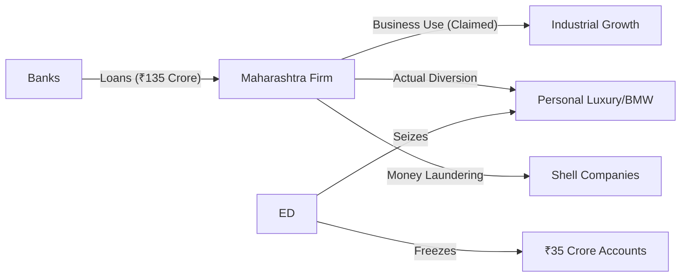

The Enforcement Directorate (ED) has significantly intensified its crackdown on corporate financial crimes in Maharashtra. In a series of high-stakes raids, the agency targeted a local firm accused of orchestrating a massive **₹135 crore bank fraud**. To ensure the recovery of public funds, the agency has already **frozen ₹35 crore in bank accounts** and seized a luxury **BMW**, signaling a zero-tolerance approach toward the diversion of corporate loans for personal extravagance.

  
  
 <a href="https://unsplash.com/@zoshuacolah">Zoshua Colah</a> on <a href="https://unsplash.com/photos/an-aerial-view-of-a-highway-and-a-large-body-of-water-OonZSa_ME6s">Unsplash</a>

---

### 🔍 The Raid: Deciphering the Maharashtra Operation

This operation was not a routine inspection but a precision strike based on specific intelligence regarding a massive credit default. The ED conducted simultaneous raids across multiple locations linked to the firm and its promoters throughout Maharashtra. Utilizing the stringent powers granted under the [Prevention of Money Laundering Act (PMLA), 2002](https://en.wikipedia.org/wiki/Prevention_of_Money_Laundering_Act), officials focused on retrieving digital evidence, forensic accounting documents, and tangible assets acquired through "proceeds of crime."

This action is part of a broader national strategy to target "willful defaulters." According to [Reserve Bank of India (RBI) guidelines](https://www.rbi.org.in), a willful defaulter is an entity that has the capacity to pay but deliberately defaults on its obligations. By freezing liquid assets and seizing high-value property, the ED aims to create a recovery pool to reimburse the affected banking institutions.

---

### 💰 The Money Trail: Where Did the ₹135 Crore Go?

The core of the investigation centers on the "diversion of funds." The firm allegedly secured massive credit lines from multiple banks, claiming the capital was necessary for scaling industrial operations and business expansion. However, the investigation reveals a calculated trail where the funds were diverted away from the business.

> "The freezing of ₹35 crore in bank accounts is a critical first step in neutralizing the liquidity of the accused and preventing further siphoning of funds to offshore accounts or shell companies."

**Financial Breakdown of the Fraud:**
* **Total Alleged Fraud:** **₹135 Crore**
* **Immediate Assets Frozen:** **₹35 Crore**
* **Primary Modus Operandi:** Misuse of bank credit facilities and loan diversion.
* **Primary Legal Charge:** Money Laundering under the PMLA.

Currently, the ED is scrutinizing digital ledgers and bank statements to track the remaining **₹100 crore**. Investigators suspect the use of "layered" transactions, where money is moved through a network of shell companies to obscure its origin and final destination.

---

### 🏎️ The Smoking Gun: The Significance of the Seized BMW

The seizure of a luxury **BMW** served as more than just a headline; in financial forensics, such assets are often the "smoking gun." When a company claims it lacks the liquidity to pay back a loan while its directors acquire high-end luxury vehicles, it provides a clear narrative of fund diversion.

Under the PMLA, the government has the authority to attach any property derived—directly or indirectly—from criminal activity. This BMW is legally classified as "proceeds of crime." Such seizures serve as a psychological and legal deterrent to other corporate entities, proving that the digital banking era has made it nearly impossible to hide the trail of diverted loans.

---

### ⚖️ Legal Framework: How PMLA Accelerates Recovery

The ED utilizes the [Prevention of Money Laundering Act](https://www. transpose.gov.in) to bypass the often sluggish pace of civil recovery lawsuits. While a standard civil suit for recovery can take years to reach a verdict, the PMLA allows the agency to provisionally attach assets *before* a final conviction, provided there is reasonable ground to believe the assets are linked to the crime.

This operation highlights the synergy between the [Central Bureau of Investigation (CBI)](https://cbi.gov.in) and the ED. Typically, the CBI investigates the "predicate offense"—the initial act of fraud or cheating—while the ED focuses on the "money trail" to seize and forfeit assets. For the banking sector, which struggles with [Non-Performing Assets (NPAs)](https://www.investopedia.com/terms/n/non-performing-asset.asp), this aggressive recovery mechanism is vital for maintaining financial stability.

---

### 🏁 The Bottom Line

While the seizure of a luxury car and the freezing of ₹35 crore are significant milestones, they represent only a fraction of the **₹135 crore** total. As the ED continues to peel back the layers of this corporate entity's finances, the message to the business community is clear: the digital footprint of financial fraud is permanent. 

With enhanced data analytics and inter-agency cooperation, the era of "borrowing and vanishing" is coming to an end. The focus has shifted from merely filing charges to the actual recovery of wealth, ensuring that corporate fraud no longer pays.

---

## 📖 Related Reading

- [🌟 Apple's "Glowtime": The Dawn of the AI-First iPhone](/apple-event-all-new-launches-features-big-announcements/)
- [📱 Apple’s Next Act: Folding Screens and the Succession Race](/apple-expected-to-unveil-folding-iphone-as-new-ceo-takes-center-stage/)
- [📱 The Crease-Less Revolution: Apple’s Strategic Bet on the Foldable iPhone](/apple-expected-to-unveil-first-folding-phone-with-new-ceo-ternus-in-command/)
