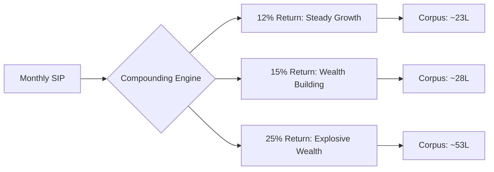

Most retail investors are content with a steady 12-15% return, often mirroring the long-term average of the Nifty 50. But for those with a higher risk appetite and a longer time horizon, there is a more aggressive pursuit: the **"25% Club."** This is a realm where compounding doesn't just grow your capital; it accelerates it exponentially, transforming a modest monthly saving into a generational fortune.

Aiming for a **25% XIRR (Extended Internal Rate of Return)** over a decade is widely considered the "holy grail" of equity investing. While achieving this consistently is exceptionally difficult, certain funds—specifically those targeting the mid-cap and small-cap segments—have demonstrated the ability to hit these marks by betting on India's rising corporate stars. Funds like the [Invesco India Mid Cap Fund](https://www.moneycontrol.com/mutual-funds/nav/invesco-india-mid-cap-fund-direct-plan-growth/IMFCF12) and [Union Small Cap Fund](https://www.moneycontrol.com/mutual-funds/nav/union-small-cap-fund-direct-plan-growth/UUSCF12) are prime examples of vehicles designed for this high-octane growth.

---

### 🚀 Why that Extra 10% Changes Everything

To understand the obsession with the 25% mark, you have to look past the percentage and analyze the terminal value of the investment. The jump from a 15% return to a 25% return over 10 years isn't a linear 10% increase in profit—it is a total transformation of the final corpus due to the nature of geometric growth.

Consider the trajectory of a monthly SIP (Systematic Investment Plan) of **₹10,000** over a 10-year period:

*   **At 12% Return:** Your total investment of ₹12 lakh grows to approximately **₹23.2 lakh**.
*   **At 15% Return:** The corpus increases to approximately **₹27.8 lakh**.
*   **At 25% Return:** The math enters the "explosive" phase. Your ₹12 lakh investment balloons to approximately **₹52.9 lakh**.

> "The first rule of compounding is to never interrupt it unnecessarily. The second rule is that the rate of return is the most powerful lever in the wealth equation; a few percentage points of difference today result in millions of difference tomorrow."

The difference between a "good" return (15%) and an "elite" return (25%) in this scenario is nearly **₹25 lakh**. This delta is why aggressive investors pivot toward Mid Cap and Small Cap funds. While these segments are notoriously volatile, the mathematical upside often outweighs the emotional stress of short-term dips.

---

### 📉 Understanding the Engine: Mid Caps vs. Small Caps

Before diving into specific funds, it is crucial to understand what is actually happening under the hood. According to [SEBI guidelines](https://www.sebi.gov.in), the distinction between these categories is based on market capitalization:

1.  **Mid Cap Funds:** These invest in companies ranked **101st to 250th** in terms of market capitalization. These companies are "adolescents"—they have proven their business models and survived the early-stage fragility of a startup, but they haven't yet hit the growth ceiling that plagues Large Cap giants.
2.  **Small Cap Funds:** These invest in companies ranked **251st and below**. These are the "infants" of the stock market. They are highly volatile and susceptible to liquidity shocks, but they possess the highest potential for **multi-bagger returns** (stocks that grow 5x, 10x, or 100x).

By allocating capital to these segments, investors are essentially buying "future blue-chip companies" at a discount.

---

### 📈 Invesco India Mid Cap: The Steady Compounder

For investors seeking a balance between aggression and stability, the [Invesco India Mid Cap Fund](https://www.invescoindia.com/mutual-funds/mid-cap-fund) serves as a benchmark for quality growth. The fund avoids the "lottery ticket" approach, instead focusing on companies with strong pricing power and sustainable competitive advantages (moats).

Invesco’s strategy revolves around **Quality Growth**. Rather than chasing temporary momentum or thematic bubbles, the fund managers prioritize companies with clean balance sheets and high Return on Equity (ROE). This disciplined approach allows the fund to act as an "anchor" in a high-growth portfolio. 

While a pure small-cap fund might spike 40% in a bull run and crash 30% in a bear market, a quality mid-cap fund like Invesco tends to capture a significant portion of the upside while cushioning the downside. For those chasing the 25% club, Invesco provides the necessary structural integrity to ensure that a single market crash doesn't wipe out years of gains.

---

### ⚡ Union Small Cap: The High-Speed Option

If Invesco is the anchor, the [Union Small Cap Fund](https://www.unionmf.in) is the rocket. Small-cap investing is a high-stakes game of discovery. Union Small Cap has gained traction by aggressively identifying undervalued gems in niches like specialty chemicals, emerging consumer tech, and precision engineering before they become mainstream.

The fund's performance has been characterized by high alpha generation—meaning it consistently beats its benchmark index. However, the "cost" of this performance is volatility. In a correction, small-cap funds can see drawdowns of **30-40%** very quickly.

This is precisely why the **SIP mechanism** is non-negotiable for this fund. By investing a fixed amount monthly, you benefit from **Rupee Cost Averaging**. When the market crashes and the fund's NAV drops, your ₹10,000 buys *more* units. When the market eventually recovers, those extra units act as a force multiplier, pushing your XIRR toward that elusive 25% mark.

---

### 🏆 The Supporting Trio: Building a Diversified High-Growth Portfolio

A professional portfolio is rarely built on just two funds. To mitigate "fund-manager risk," savvy investors build a diversified core of 5-6 funds. To round out the top tier, consider these three heavy hitters:

#### 1. Quant Small Cap Fund
[Quant Mutual Fund](https://www.quantmutual.com) utilizes a proprietary **VLRT framework** (Valuation, Liquidity, Risk, Timing). Unlike traditional "buy and hold" funds, Quant is highly opportunistic. They use quantitative models to rotate sectors quickly, catching momentum in themes like PSU stocks or Defense before the broader market reacts. This agility often makes them a top performer in volatile markets.

#### 2. Nippon India Small Cap Fund
As one of the largest funds in the category, [Nippon India Small Cap](https://www.moneycontrol.com/mutual-funds/nav/nippon-india-small-cap-fund-direct-plan-growth/NINSF12) relies on the power of extreme diversification. By holding a vast number of stocks, they ensure that while a few companies may fail, a few "super-winners" will drive the overall portfolio upward. This is an ideal fund for those who want small-cap exposure without the concentrated risk of a smaller fund.

#### 3. HDFC Mid-Cap Opportunities Fund
For those who prioritize consistency over raw speed, [HDFC Mid-Cap Opportunities](https://www.hdfcfund.com) is a titan. Due to its massive Asset Under Management (AUM), it may struggle to deliver 30% returns in a hyper-bull market, but its ability to compound wealth steadily over decades is legendary. It provides a layer of institutional stability to an otherwise aggressive portfolio.

---

### ⚠️ The Reality Check: Managing the Risks

Chasing a 25% return is not a passive activity; it requires psychological fortitude. The most dangerous trap for new investors is **Recency Bias**—the mistaken belief that last year's 30% return is a guaranteed baseline for next year.

In equity markets, **Mean Reversion** is a law of nature. A fund that outperforms the index by a massive margin one year often underperforms the next as valuations become stretched and the market "corrects."

To survive the journey to the 25% club, adhere to these three golden rules:

*   **The 5-Year Horizon:** Never allocate capital to small or mid-caps that you might need within 60 months. The volatility is too high; you do not want to be forced to sell during a temporary 20% dip.
*   **The 30% Cap:** Limit your total exposure to small and mid-caps to **20-30% of your total portfolio**. The rest should reside in Large Cap funds or Debt instruments to provide emotional and financial stability.
*   **Strategic Rebalancing:** If a bull run pushes your small-cap holdings to 50% of your portfolio, you are over-exposed. Move a portion of those gains into safer assets. This "locks in" your profits and ensures you are selling high and buying low.

> "The best returns in the market do not go to the smartest analyst, but to the investor who can stay rational when everyone else is panicking."

---

### 🏁 Final Thoughts: The Path to Real Wealth

Is a 25% SIP return over 10 years an ambitious goal? Yes. Is it possible? In a developing economy like India, where thousands of mid-sized companies are scaling into global players, it is absolutely achievable.

The secret isn't finding a "magic" fund; it is the combination of **smart fund selection**, **disciplined SIPs**, and **unwavering patience**. By utilizing the growth engines of Invesco, Union, Quant, and Nippon, you stop merely "saving" and start building true wealth. 

Start early, ignore the noise of the daily ticker, and let the relentless math of compounding do the heavy lifting for you.

***

### 📚 References & Further Reading
*   **AMFI India:** [Association of Mutual Funds in India](https://www.amfiindia.com) - For official industry data and investor education.
*   **Value Research:** [Fund Analysis Tools](https://www.valueresearchonline.com) - For comparing CAGR and expense ratios.
*   **Moneycontrol:** [Mutual Fund NAV Tracker](https://www.moneycontrol.com) - For real-time tracking of fund performance.
*   **Groww/Zerodha:** [SIP Calculators](https://groww.in/calculators/sip-calculator) - To model your own wealth projection scenarios.

---

## 📖 Related Reading

- [🚨 Luxury Cars and Loan Defaults: ED Cracks Down on ₹135 Crore Maharashtra Bank Fraud](/ed-raids-maharashtra-firm-in-rs-135-crore-bank-fraud-rs-35-crore-frozen-bmw-seized/)
- [🌟 Apple's "Glowtime": The Dawn of the AI-First iPhone](/apple-event-all-new-launches-features-big-announcements/)
- [📱 Apple’s Next Act: Folding Screens and the Succession Race](/apple-expected-to-unveil-folding-iphone-as-new-ceo-takes-center-stage/)
