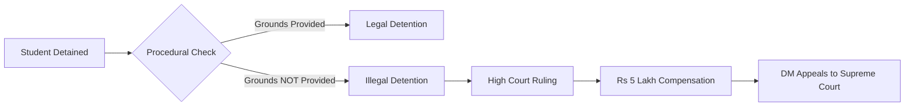

A high-stakes legal battle is currently unfolding between the District Magistrate (DM) of Gautam Buddh Nagar (Noida) and the Indian judiciary. In a move that has sent ripples through administrative circles, the DM has approached the [Supreme Court of India](https://main.sci.gov.in/) to overturn a stringent ruling by the Allahabad High Court. 

The crux of the dispute? A court order mandating the administration to pay **Rs 5 lakh** in compensation to a student. The court determined that the student had been subjected to "illegal detention," sparking a critical national conversation about the boundary between state security and the fundamental rights of a citizen.

## 🔍 Understanding Preventive Detention in India

To understand this case, one must first understand the mechanism of "preventive detention." Unlike punitive detention—where a person is imprisoned after a crime is committed—preventive detention allows the state to detain an individual to prevent them from committing a future act that might disturb public order.

While this is a legitimate tool for maintaining peace during periods of unrest, it is one of the most potent and potentially dangerous powers granted to the state. To prevent its misuse for political vendettas or administrative convenience, the Indian legal system has embedded strict procedural safeguards. When these safeguards are ignored, a legal security measure transforms into an infringement of human rights.

## ⚖️ The High Court’s Verdict: Why Procedure Matters

The Allahabad High Court's decision didn't hinge on whether the student was "innocent" or "guilty," but rather on whether the state followed the law. Upon reviewing the case, the court discovered a critical failure: the administration did not provide the student with the "grounds of detention"—the specific reasons for their arrest—within the legally mandated timeframe.

This omission is not a mere clerical error. It is a direct violation of **Article 22(5)** of the [Constitution of India](https://www.india.gov.in/my-government/constitution-india), which explicitly states that a detained person must be informed of the grounds for their detention "as soon as may be" to allow them to make a representation against the order.

> "When the state bypasses the procedural safeguards enshrined in the Constitution, the detention ceases to be a legal act and becomes an act of oppression."

By failing to provide the grounds, the administration effectively stripped the student of their right to challenge the legality of their confinement, rendering the entire process void and the detention **illegal**.

## 💰 The Price of Error: Analyzing the Rs 5 Lakh Penalty

The award of **Rs 5 lakh** is a significant sum in the context of Indian administrative law. Traditionally, compensation for illegal detention was nominal. However, there is a growing trend in Indian courts to award "exemplary damages" to serve as a deterrent.

The court is no longer viewing these as simple mistakes but as "constitutional torts." By imposing a heavy financial penalty, the judiciary is signaling that the mental agony and loss of liberty cannot be dismissed as "collateral damage" of maintaining law and order.

**Bold stats** highlight the shift: In recent years, the frequency of high-value compensation for custodial and illegal detention has risen as the [National Human Rights Commission (NHRC)](https://nhrc.nic.in/) and the courts push for greater official accountability.

## 🏛️ The Supreme Court Appeal: "Good Faith" vs. Due Process

The Noida DM’s appeal to the Supreme Court rests on the argument of "good faith." The administration contends that they were operating in a high-pressure environment where the breakdown of law and order was imminent. In their view, a technical lapse in paperwork should not result in a massive financial penalty, especially when the intent was to protect the public.

The Supreme Court must now navigate three pivotal questions:
1. **Necessity vs. Legality:** Does a crisis situation grant officials the license to bypass the procedural mandates of Article 22?
2. **Proportionality:** Is **Rs 5 lakh** a fair reflection of the harm caused, or is it an excessive penalty for a procedural slip?
3. **Personal Liability:** Should the financial burden fall on the government treasury or the individual officer whose decision led to the illegality?

## 🏁 Final Verdict: The Future of State Accountability

This case serves as a landmark tug-of-war between state security and individual liberty. If the Supreme Court upholds the High Court's decision, it will reinforce the principle that **due process is non-negotiable**. It would send a clear message to every District Magistrate and police chief in the country: constitutional safeguards are not optional "suggestions" to be followed when convenient.

Conversely, if the court sides with the DM, it may provide administrative officers with more leeway during public unrest, potentially lowering the bar for what constitutes "legal" preventive detention.

For those tracking the evolution of civil liberties and administrative law in India, this ruling will be a critical precedent. Continued updates on this and similar cases can be found through legal repositories like [LiveLaw](https://www.livelaw.in) and [Bar and Bench](https://www.barandbench.com).

***

### References
* *The Constitution of India, Article 22 (Protection against arrest and detention in certain cases).*
* *Allahabad High Court Judgment on Preventive Detention and Compensation.*
* *Guidelines on Custodial Justice, National Human Rights Commission (NHRC).*

---

## 📖 Related Reading

- [From Small Caps to Big Wealth: How Some Funds Aim for that "25% Club"](/invesco-india-mid-cap-and-union-small-cap-among-5-equity-funds-that-deliver-upto-25-sip-returns-in-10-years-gain-of-monthly-mutual-fund-sip-investments/)
- [🚨 Luxury Cars and Loan Defaults: ED Cracks Down on ₹135 Crore Maharashtra Bank Fraud](/ed-raids-maharashtra-firm-in-rs-135-crore-bank-fraud-rs-35-crore-frozen-bmw-seized/)
- [🌟 Apple's "Glowtime": The Dawn of the AI-First iPhone](/apple-event-all-new-launches-features-big-announcements/)
