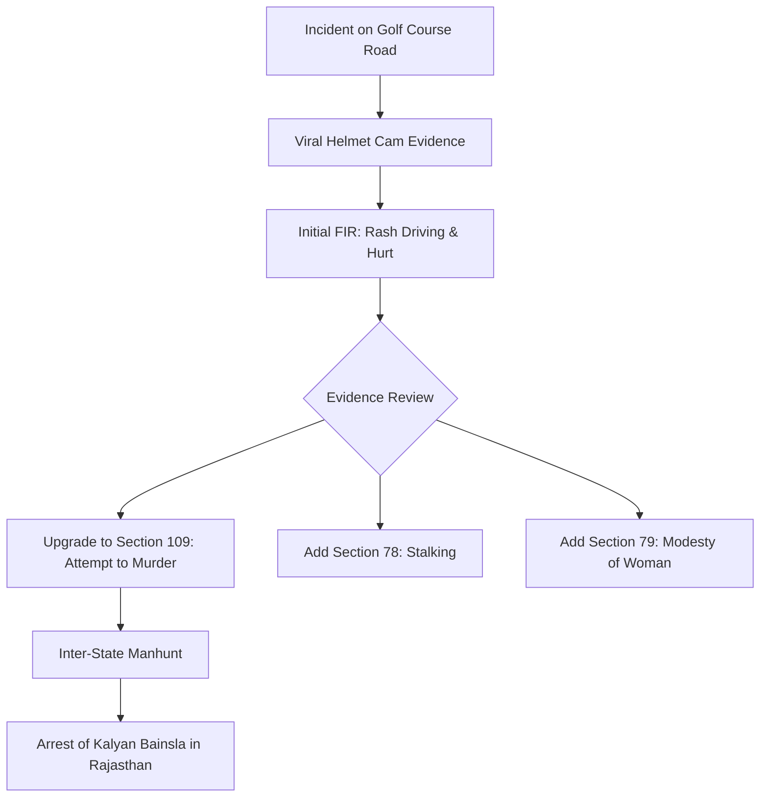

The streets of Gurugram, particularly the affluent stretch of Golf Course Road, are often seen as symbols of corporate success and urban modernization. However, a recent, disturbing incident has stripped away this veneer, exposing the volatile nature of road rage and the precarious safety of women in public spaces. A woman biker, identified as Sia, became the center of a national conversation after she was allegedly chased and deliberately rammed by a car driven by Kalyan Bainsla.

  
  
 <a href="https://unsplash.com/@philton88">Parker Hilton</a> on <a href="https://unsplash.com/photos/green-and-black-van-on-road-during-daytime-EmW3uy2VAQ8">Unsplash</a>

The incident, which was captured in stark, high-definition detail by helmet cameras, shows Sia being thrown from her Aprilia RS 457, skidding several meters across the asphalt in a terrifying display of aggression. What began as a potential traffic dispute has spiraled into a high-stakes criminal case, with the Haryana State Commission for Women demanding the strictest possible punishment and the police upgrading the charges to "attempt to murder."

---

### 📹 The Crash and the Power of Digital Evidence

The events unfolded on a Sunday morning, a time typically reserved for leisure rides and early-morning commutes. Sia was riding with a group of fellow bikers when the situation turned hostile. According to Sia's account, a white sedan began following her aggressively, with the occupants making threatening gestures. 

The footage from the motorcycles' cameras provides a visceral, real-time account of the attack. It shows the car swerving sharply into her path, an action that appears calculated rather than accidental. The impact was violent, knocking Sia off her bike and leaving her vulnerable on the road.

Sia has since stated that the occupants of the vehicle appeared to be intoxicated and that the driver specifically targeted her because she is a woman biker. Adding to the gravity of the situation, the footage shows that Bainsla did not stop to render aid or assess the damage; instead, he sped away from the scene. This [viral footage](https://www.indiatoday.in/cities/gurugram/story/gurugram-golf-course-road-crash-woman-biker-injured-after-car-hits-her-video-2994024-2026-09-14) served as the primary catalyst for the police to shift the investigation from a routine accident to a targeted criminal assault.

> "The digital footprint left by these cameras has changed the landscape of road safety evidence in India. We are no longer relying solely on eyewitness accounts, which are often contradictory, but on objective, timestamped visual data." — *Legal Analyst on Indian Traffic Law*

---

### ⚖️ The Legal Evolution: From Rash Driving to Attempted Murder

Initially, the Gurugram Police responded by filing a First Information Report (FIR) based on standard traffic violations. The charges were centered around **Section 281 (Rash driving)** and **Section 125 (Causing hurt)** under the newly implemented **Bharatiya Nyaya Sanhita (BNS)**.

However, as the helmet cam footage was scrutinized, the narrative shifted from "negligence" to "intent." The legal escalation was swift:

1.  **Section 109 (Attempt to Murder):** The most severe addition, carrying a potential sentence of up to **10 years in prison**.
2.  **Section 78 (Stalking):** Added due to the evidence of the car chasing the biker over a distance.
3.  **Section 79 (Insulting the Modesty of a Woman):** Invoked based on the targeted nature of the attack and the gestures made toward the victim [as reported by LiveMint](https://www.livemint.com/news/india/gurugram-road-rage-case-accused-kalyan-bainsla-arrested-attempt-to-murder-charge-added-11789456188767.html).

The transition from the Indian Penal Code (IPC) to the BNS has brought new nuances to how these crimes are categorized. In this case, the police are utilizing the BNS to argue that the act was not merely a failure of driving skill, but a deliberate attempt to cause grievous harm or death.

---

### 🗣️ A Clash of Narratives: Accident vs. Intent

As is common in high-profile legal battles, two diametrically opposed versions of the truth have emerged. 

**The Accused's Defense:**
In an [exclusive interview with India Today](https://www.indiatoday.in/cities/gurugram/story/i-did-not-hit-intentionally-man-accused-of-hitting-gurugram-biker-denies-deliberate-ramming-2994351-2026-09-14), Kalyan Bainsla—a gym owner and kabaddi player—denied any malicious intent. He claimed that the group of bikers were "constantly overtaking" him and slowing down abruptly, which he describes as provocative behavior. He maintains that he simply "lost control near a U-turn," resulting in the collision. Furthermore, he argued that his decision to flee the scene was a survival instinct, claiming he feared "mob violence" from the accompanying bikers.

**The Victim's Perspective:**
Sia and her riding group reject Bainsla's claims as a fabrication to avoid a decade of imprisonment. They argue that the "mob violence" narrative is a common trope used by perpetrators to justify hit-and-run actions. Sia points to the lack of any attempt to help as the ultimate proof of malice.

> "My first thought as a female rider was that I didn't feel safe at all on the Delhi and Gurugram roads that day... I feel ashamed of such people." [New Indian Express](https://www.newindianexpress.com/india/2026/Sep/15/accused-car-driver-in-gurugram-hit-and-run-case-arrested-from-rajasthan-attempt-to-murder-charge-invoked)

---

### 🛡️ Gender, Safety, and the "Woman Biker" Stigma

This case has transcended a simple road rage incident to become a symbol of the challenges women face when entering traditionally male-dominated spaces—including the world of high-performance biking. The Aprilia RS 457 is a powerful machine, and the act of a woman riding one is often met with a mixture of admiration and hostility in urban India.

The Haryana State Commission for Women has stepped in to frame this as a systemic issue. Chairperson Renu Bhatia rejected the "accident" theory, noting that the surveillance and helmet footage clearly show a pattern of targeting. 

**The broader context of women's safety in the NCR (National Capital Region) is alarming:**
*   **Bold Stat:** According to various NCR crime reports, road-related harassment of women has seen a **steady increase** in urban clusters.
*   **Bold Stat:** The conviction rate for hit-and-run cases in India remains **abysmally low**, often below **20%**, due to a lack of concrete evidence.

Bhatia is calling for **"exemplary punishment,"** arguing that unless the state makes an example of such perpetrators, the roads will remain hostile for women. Haryana Minister Gaurav Gautam has reinforced this stance, stating that the law will be applied without bias, adding that the guilty will be punished **"even if the person is from my own family"** [LatestLY](https://www.latestly.com/agency-news/india-news-haryana-minister-vows-arrest-of-gurugram-hit-and-run-accused-womens-commission-backs-victim-7605003.html).

---

### 🔍 Deep Dive: The Psychology of Road Rage in Urban India

Road rage is not merely a series of isolated outbursts but a psychological phenomenon exacerbated by urban stressors. In cities like Gurugram, the combination of extreme traffic congestion, high-pressure corporate environments, and a perceived "status battle" between luxury vehicle owners often creates a powder keg.

When a driver perceives another road user as "inferior" or "out of place"—such as a woman on a sports bike—the rage can quickly escalate into a desire to dominate or punish. This is known as "displaced aggression," where the driver vents frustrations from other areas of their life onto a vulnerable target.

**Factors contributing to the escalation in this case:**
*   **Anonymity:** The feeling that a car provides a shield of anonymity, emboldening the driver to act aggressively.
*   **Alcohol Influence:** Sia's allegation of intoxication suggests a lowered inhibition, which often turns mild annoyance into violent aggression.
*   **Gender Bias:** The belief that a woman can be intimidated or pushed around more easily than a man.

---

### 🛠️ The Role of Technology in Modern Justice

The Sia vs. Bainsla case highlights a pivotal shift in how crimes are solved in India. For decades, "he-said, she-said" scenarios dominated traffic courts. The introduction of affordable, high-quality helmet cams and dashcams is effectively decentralizing surveillance.

**Why this matters for future cases:**
1.  **Objective Truth:** Cameras do not have biases or memory lapses. They capture the exact sequence of events.
2.  **Deterrence:** The knowledge that almost every rider or driver could be recording creates a psychological deterrent against aggression.
3.  **Rapid Response:** Viral videos force police action in cases that might otherwise have been ignored or dismissed as "minor accidents."

For those interested in the legal frameworks governing these digital evidences, the [Indian Evidence Act](https://www.indiacode.nic.in/) (and its replacements under the new criminal laws) provides the guidelines for the admissibility of electronic records in court.

---

### 🏁 Conclusion: A Precedent for the Future

The case of Sia and Kalyan Bainsla is more than a story of a crash on Golf Course Road. It is a litmus test for the Indian judicial system's ability to distinguish between a tragic accident and a targeted attack. 

If the court upholds the **Section 109 (Attempt to Murder)** charge, it will send a powerful message: road rage is not "just a mistake," and using a vehicle as a weapon is a serious crime. For women bikers across India, the outcome of this case will determine whether the road is a space of freedom or a place of fear.

As the trial proceeds, the focus remains on the evidence. In an era of high-definition recording, the truth is rarely hidden—it is simply waiting to be played back.

#### 📚 References & Further Reading
*   [Bharatiya Nyaya Sanhita (BNS) Overview](https://www.mha.gov.in/) - Understanding the new criminal codes.
*   [Haryana State Commission for Women](https://hscw.gov.in/) - Official updates on women's safety initiatives.
*   [NCR Road Safety Reports](https://morth.nic.in/) - Statistics on urban road accidents and fatalities.
*   [India Today: Exclusive with Kalyan Bainsla](https://www.indiatoday.in/cities/gurugram/story/i-did-not-hit-intentionally-man-accused-of-hitting-gurugram-biker-denies-deliberate-ramming-2994351-2026-09-14)
*   [LiveMint: Legal Breakdown of BNS Charges](https://www.livemint.com/news/india/gurugram-road-rage-case-accused-kalyan-bainsla-arrested-attempt-to-murder-charge-added-11789456188767.html)

---

## 📖 Related Reading

- [🚔 The Clash: Administrative Power vs. Individual Liberty](/noida-dm-moves-sc-against-rs-5-lakh-compensation-order-in-student-detention-case/)
- [From Small Caps to Big Wealth: How Some Funds Aim for that "25% Club"](/invesco-india-mid-cap-and-union-small-cap-among-5-equity-funds-that-deliver-upto-25-sip-returns-in-10-years-gain-of-monthly-mutual-fund-sip-investments/)
- [🚨 Luxury Cars and Loan Defaults: ED Cracks Down on ₹135 Crore Maharashtra Bank Fraud](/ed-raids-maharashtra-firm-in-rs-135-crore-bank-fraud-rs-35-crore-frozen-bmw-seized/)
