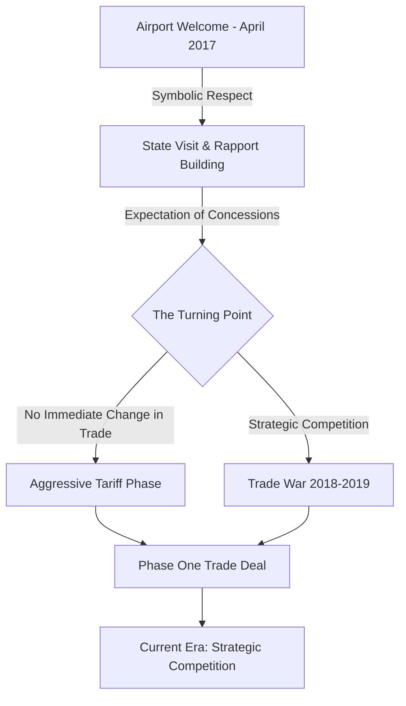

In the rigid, choreographed world of international diplomacy, there is a "playbook"—a set of unspoken but strictly adhered-to rules that govern how world leaders interact. These protocols are designed to prevent misunderstandings, maintain national dignity, and ensure that no leader appears subordinate to another. However, in April 2017, Donald Trump decided to throw the playbook away.

When Chinese President Xi Jinping touched down in Washington D.C., he wasn't met by a high-ranking State Department official or the Secretary of State, as is the tradition for visiting heads of state. Instead, he found the President of the United States waiting for him on the tarmac. 

This gesture, while seemingly simple, was a seismic shift in diplomatic signaling. For the first time in decades, a U.S. president had personally greeted a Chinese leader at the airport, a move intended to signal a level of respect and personal kinship that bypassed the sterile channels of bureaucracy. It was an opening gambit in a high-stakes game of geopolitical chess, attempting to replace institutional friction with personal chemistry.

---

## 📜 Breaking the Diplomatic Blueprint

  
  
 <a href="https://unsplash.com/@historyhd">History in HD</a> on <a href="https://unsplash.com/photos/2-men-in-black-suit-sitting-on-red-chair-05QvOWAzN3I">Unsplash</a>

To understand why this was a "big deal," one must first understand the nature of diplomatic protocol. For generations, the arrival of a foreign leader was a meticulously timed operation. The standard operating procedure dictated that the visiting leader be received by a welcoming committee—usually consisting of the Chief of Protocol and a cabinet-level official. The President would remain at the White House, awaiting the arrival of the guest for a formal ceremony on the South Lawn.

By skipping this step and appearing on the tarmac, Trump was not merely being polite; he was consciously dismantling the "buffer zone" created by the State Department. This move signaled several things simultaneously:

1.  **Prioritization of the Individual:** It announced that Trump viewed the relationship as being between *two men* rather than *two governments*.
2.  **The "Face" Factor:** In Chinese culture, the concept of "face" (*mianzi*) is paramount. By granting Xi this rare honor, Trump was giving him immense "face," signaling to the Chinese leadership that the U.S. recognized China as a peer of the highest order.
3.  **Disruption of the Establishment:** It was a clear signal to the U.S. foreign policy establishment—the "Deep State" in Trump's terminology—that the traditional ways of handling China were now obsolete.

This departure from the blueprint was an attempt to jumpstart what Trump hoped would be a "special relationship." He believed that the cumbersome machinery of the [U.S. Department of State](https://www.state.gov) often slowed down progress and that a direct, leader-to-leader connection could achieve results that diplomats could not.

---

## 🤝 The "Personal Rapport" Strategy

Donald Trump’s approach to international relations was an extension of his business philosophy: the belief that every conflict is a negotiation and every negotiation depends on the strength of the personal bond between the principals. In his worldview, treaties and protocols were secondary to the "deal" and the chemistry of the people making it.

The airport welcome was the opening move of a broader strategy to build personal rapport. Trump believed that if he could make Xi Jinping feel respected and admired, he could leverage that goodwill to extract concessions on issues that had plagued U.S.-China relations for decades.

> "The goal was to build a personal relationship that could be leveraged to solve complex trade and security issues without the friction of traditional diplomatic channels. It was transactional diplomacy at its most visceral level."

Throughout the subsequent 2017 state visit, this strategy was on full display. There were lavish dinners, public displays of friendship, and a shared narrative of two "strongmen" who could reshape the world together. This was a calculated risk. By elevating the relationship to a personal level, Trump was attempting to create a shortcut to solving the **$375 billion trade deficit** (as estimated in early 2017) and addressing the systemic theft of intellectual property.

---

## 🌏 Strategic Stakes: Trade, Technology, and North Korea

While the cameras captured handshakes and smiles, the underlying strategic environment was fraught with tension. The 2017 meeting took place against a backdrop of escalating competition in three primary arenas:

### 1. The Economic Imbalance
The U.S. was increasingly alarmed by China's "Made in China 2025" initiative, which aimed to make China the global leader in high-tech industries. The U.S. viewed this not just as competition, but as a state-sponsored effort to undermine American technological supremacy. The **trade imbalance**, characterized by a flood of cheap Chinese imports and restrictive barriers to U.S. goods, had become a central political issue in the United States.

### 2. The North Korean Nuclear Threat
At the time, North Korea was aggressively testing ballistic missiles and nuclear warheads. The U.S. needed China's cooperation to implement "maximum pressure" on Pyongyang. Trump’s gesture at the airport was partially a strategic plea: *I will give you the respect you crave if you help me solve the North Korea problem.*

### 3. The South China Sea
Tensions were rising over China's construction of artificial islands and military installations in the South China Sea. The U.S. Navy was conducting "Freedom of Navigation" operations to challenge these claims, creating a volatile environment where a single miscalculation could lead to open conflict.

To visualize the trajectory of this relationship, we can see how the initial "rapport" phase served as a brief bridge before the inevitable collision of national interests:

---

## 📉 From Red Carpets to Trade Wars: The Great Pivot

The tragedy—or perhaps the inevitability—of the "Personal Rapport" strategy is that personal chemistry cannot override structural geopolitical conflict. By 2018, the honeymoon period ended abruptly. The rapport built on the tarmac in 2017 proved insufficient to bridge the gap between two superpowers with diametrically opposed visions of global governance.

The transition from "Airport Handshakes" to "Trade Wars" was swift and brutal. The Trump administration began imposing tariffs on hundreds of billions of dollars worth of Chinese imports. The stats from this era are staggering:

*   **25% Tariffs:** The U.S. imposed tariffs of up to **25%** on a wide array of Chinese industrial goods.
*   **Retaliatory Strikes:** China responded by targeting American agricultural exports, specifically hitting U.S. soybean farmers with massive tariffs, leading to a **$28 billion** bailout package from the U.S. government to support farmers.
*   **Supply Chain Shift:** This period saw a measurable shift in global trade, as companies began the "China Plus One" strategy to diversify supply chains away from the mainland.

The shift highlighted the duality of Trump's presidency. He could be unexpectedly gracious and break every rule of etiquette to make a leader feel welcome, yet he could be purely transactional and aggressive the moment he felt the "deal" was unfair. The airport gesture was a bridge, but the bridge was built on the shifting sands of personal ego rather than the solid rock of institutional agreement.

---

## 🔍 Analysis: Why the "Handshake" Failed to Prevent the War

Many analysts from the [Council on Foreign Relations](https://www.cfr.org) and the [Brookings Institution](https://www.brookings.edu) have debated whether the "Personal Rapport" approach was a mistake or simply a necessary first step. 

The failure of the personal approach can be attributed to three main factors:

**First, the Institutional Gap.** While Trump and Xi may have had a moment of mutual admiration, the bureaucracies beneath them—the U.S. Treasury and the Chinese Ministry of Commerce—were operating on entirely different logic. No amount of personal warmth between leaders can suddenly align the economic interests of **1.4 billion people** in China with the political demands of the American "Rust Belt."

**Second, the Nature of Power.** In the Chinese political system, Xi Jinping's power was consolidating. He did not need a "special relationship" with the U.S. as much as he needed to maintain stability and growth within China. The U.S. gestures were appreciated, but they did not change the fundamental trajectory of China's rise.

**Third, the Transactional Trap.** Because Trump viewed diplomacy as a series of deals, he expected immediate, tangible wins. When the "personal rapport" didn't instantly result in a massive reduction of the trade deficit, he pivoted to the only other tool in his arsenal: economic coercion.

---

## 🏁 Conclusion: The Legacy of a Non-Traditional Gesture

The image of Donald Trump meeting Xi Jinping at the airport remains a potent symbol of an era of "disruption." It was a moment where the world saw a U.S. president attempt to replace the cold, calculating machinery of the State Department with the warmth of a personal handshake.

Ultimately, the "Airport Handshake" taught us a critical lesson about modern geopolitics: **symbolism is powerful, but structure is stronger.** You can break protocol, you can ignore the playbook, and you can build a personal bond with a rival leader, but you cannot "deal" your way out of a fundamental struggle for global hegemony.

Trump’s experiment in personal diplomacy didn't stop the slide into a trade war, nor did it permanently alter the trajectory of US-China relations. However, it fundamentally changed how the world views the U.S. presidency. It proved that the office is no longer bound by the traditions of the 20th century and that the "rules" of diplomacy are only as strong as the person currently holding the pen.

In the end, the airport welcome was a rare, experimental moment—a flash of optimistic cooperation before the long, cold winter of strategic competition. It serves as a reminder that while the world is indeed run by people, it is governed by interests.

---

## 📚 References & Further Reading

*   **U.S.-China Trade Relations:** See the detailed analysis on [World Trade Organization (WTO)](https://www.wto.org) regarding the 2018-2019 tariff disputes.
*   **Diplomatic Protocol:** For a deeper dive into the rules Trump broke, refer to the [Office of the Chief of Protocol](https://www.state.gov/protocol/).
*   **Geopolitical Analysis:** Explore the [Center for Strategic and International Studies (CSIS)](https://www.csis.org) for reports on the "Phase One" trade deal and its long-term efficacy.
*   **Economic Data:** Review the [World Bank](https://www.worldbank.org) data on US-China trade volumes from 2016 to 2020.
*   **Historical Context:** Research the "Nixon-Mao" meeting of 1972 to see an earlier example of a high-stakes, protocol-breaking encounter that reshaped global politics.

---

## 📖 Related Reading

- [Unmasking ‘Operation Groundwire’: How Digital Influence Works](/operation-groundwire-exposed-pakistans-alleged-digital-influence-network-plain-speak/)
- [Tragedy on a Birthday: 24-Year-Old Flung into Air by Speeding Car in Greater Noida](/greater-noida-24-year-old-returning-with-his-birthday-cake-hit-by-car-flung-into-the-air/)
- [🏍️ Was it Road Rage or an Intentional Attack? The Case of the Gurugram Biker and Kalyan Bainsla](/gurugram-road-rage-womens-commission-demands-strict-action-against-kalyan-bainsla/)
