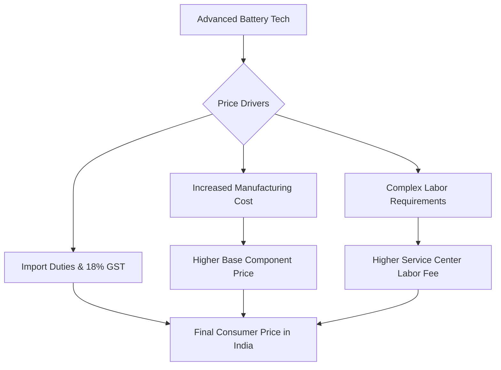

If you own a premium iPhone in India, your relationship with the "Battery Health" percentage in your settings is likely one of anxiety. It is more than just a metric; it is a countdown clock determining when you will have to pay a significant sum for a replacement. While the **iPhone 18 Pro** remains a future release, the trajectory of Apple's pricing strategy in India suggests that maintaining a flagship device is becoming an increasingly expensive endeavor.

  
  
 <a href="https://unsplash.com/@amanz">Amanz</a> on <a href="https://unsplash.com/photos/hand-holding-smartphone-with-abstract-wallpaper-8UlIoxJGcTI">Unsplash</a>

Between escalating component costs, a rigid tax structure, and the complex geopolitical struggle over the "Right to Repair," the financial burden of staying powered up is climbing. For the Indian consumer, the question isn't just *when* the battery will degrade, but *how much* it will cost to fix it.

---

### 💰 The Current Baseline: The "Pro Tax" in India

To project the costs for the iPhone 18 Pro, we must first analyze the current landscape. For recent flagships, such as the [iPhone 15 and 16 Pro series](https://support.apple.com/en-in/iphone/repair), a battery replacement at an Apple Authorized Service Provider (AASP) in India typically ranges between **₹7,000 and ₹9,000**.

This represents a steep climb from the pricing seen in the iPhone 11 or 12 eras. This trend is driven by what enthusiasts call the "Pro Tax." Because Pro models utilize larger cell capacities, more intricate internal shielding, and sophisticated thermal management systems, they are inherently more expensive to service than their standard counterparts. 

If we apply a conservative **5-10% annual increase** in service costs, users can realistically expect the iPhone 18 Pro battery replacement to cost between **₹10,000 and ₹12,000**. This puts the cost of a single component repair at nearly **10-15% of the total residual value** of a three-year-old device.

---

### ⚙️ The Architecture of Price Hikes: Tech and Taxation

The rising cost of repair is not merely a result of corporate margin expansion; it is a collision of advanced materials science and Indian fiscal policy.

#### 1. The GST Burden
Every official repair in India is subject to an **18% GST (Goods and Services Tax)**. As the base price of the battery increases due to higher energy density and better materials, the tax component grows proportionally. For a ₹10,000 repair, nearly **₹1,800** goes directly to the government, making the "official" route significantly more expensive than grey-market alternatives.

#### 2. Software Locks and "Parts Pairing"
Apple employs a controversial system known as "parts pairing." Each battery is digitally serialized and locked to the device's logic board. If a technician replaces the battery with another genuine Apple part from a different device, the phone will trigger an "Unknown Part" warning. 

To avoid this, technicians must use [proprietary Apple calibration software](https://www.macrumors.com/guide/iphone-right-to-repair/) to "handshake" the new battery with the motherboard. This requirement mandates that users visit authorized centers, effectively eliminating price competition from independent shops.

#### 3. The Shift to Stacked Battery Technology
Industry leaks suggest that future iPhones, likely including the 18 series, will move toward "stacked battery" technology. Unlike traditional wound batteries, stacked cells allow for higher density and better efficiency. However, they are more complex to manufacture and significantly riskier to remove without damaging the surrounding circuitry. This increased complexity inevitably drives up the labor cost for certified technicians.

---

### 🛠️ The "Right to Repair" Tug-of-War in India

India has emerged as a critical battleground for the global [Right to Repair movement](https://www.consumeraffairs.nic.in/). The Ministry of Consumer Affairs has been pushing for a framework that forces OEMs (Original Equipment Manufacturers) to provide spare parts, diagnostic tools, and repair manuals to independent technicians and consumers.

> "The goal of the Right to Repair is to decouple the ownership of a product from the manufacturer's control over its lifespan. When a battery becomes a gatekeeper to a device's utility, the consumer loses the true ownership of their hardware."

While Apple has introduced a "Self Service Repair" program in the US and Europe, its rollout in India has been sluggish. For the iPhone 18 Pro user, this creates a precarious binary choice:
*   **The Official Route:** Guaranteed safety, maintained warranty, and accurate battery health data, but at a **premium price point**.
*   **The Third-Party Route:** Lower immediate cost, but risks include the loss of battery health percentages, potential overheating issues, and the "Unknown Part" software warning.

As Apple further integrates software locks, the "cheap" alternative becomes less of a repair and more of a compromise.

---

### 🌡️ The India Factor: Why Our Batteries Die Faster

When discussing repair costs, we must address *why* we need these repairs. India's unique climatic conditions play a massive role in battery degradation. Lithium-ion batteries are chemically sensitive to heat. During Indian summers, where ambient temperatures frequently exceed **40°C**, smartphones experience "thermal throttling."

When a device runs hot, the chemical reactions within the battery accelerate, leading to permanent capacity loss. A user in Delhi or Chennai will likely see their battery health drop to **80% significantly faster** than a user in London or San Francisco. This environmental factor effectively shortens the repair cycle, meaning the average Indian user will pay the "Battery Tax" more frequently over the lifetime of their iPhone 18 Pro.

---

### 📈 Future Outlook: The Road to iPhone 18 Pro

As we move toward the iPhone 18 generation, we can expect the integration of AI-driven power management. While this may extend the *daily* life of the battery, the hardware itself will become more integrated. We anticipate three major trends:

1.  **Higher Specialized Labor Costs:** As devices become thinner and adhesives stronger, the risk of screen breakage during a battery swap increases. Service centers will likely raise their "risk premiums."
2.  **Component Scarcity:** During the first 12-18 months of the iPhone 18 Pro's lifecycle, genuine battery replacements will be scarce and priced at a premium.
3.  **The AppleCare+ Pivot:** Apple will likely push [AppleCare+](https://www.apple.com/in/applecare/) more aggressively in the Indian market. By converting a potential **₹12,000** surprise bill into a predictable monthly or upfront insurance premium, Apple secures recurring revenue while the user gains peace of mind.

---

### 🔋 Proactive Maintenance: How to Delay the Bill

Since the cost of repair is trending upward, the most effective financial strategy is avoidance. To ensure your iPhone 18 Pro lasts as long as possible, follow these technical guidelines:

*   **Avoid the "0% to 100%" Cycle:** Lithium batteries are most stressed at the extremes. Aim to keep your charge between **20% and 80%**.
*   **Optimize Charging Settings:** Enable "Optimized Battery Charging" in settings to prevent the phone from sitting at 100% for hours while plugged in.
*   **Combat Thermal Stress:** Avoid using fast chargers in direct sunlight or inside a hot car. Use a [certified MFi (Made for iPhone)](https://www.mfi.apple.com/) cable to ensure stable voltage delivery.
*   **Manage High-Drain Apps:** Limit the use of "Always-On Display" and high-brightness settings during peak summer months to reduce internal heat generation.

### Final Verdict: The Price of Luxury

The iPhone 18 Pro will undoubtedly be a marvel of engineering, but that engineering comes with a maintenance cost that is increasingly detached from the cost of the raw materials. In India, the combination of **high import duties**, **18% GST**, and **software restrictions** creates a perfect storm that makes battery replacement a significant expense.

As we move toward a more sustainable future, the hope is that the Indian government's Right to Repair initiatives will force a price correction. Until then, the best way to save money on an iPhone 18 Pro battery is to treat the hardware with extreme care.

---

### 📚 References & Further Reading

*   **Apple Support India:** [iPhone Repair & Service Guidelines](https://support.apple.com/en-in/iphone/repair)
*   **Govt of India:** [National Right to Repair Portal](https://righttorepairindia.gov.in/)
*   **MacRumors:** [Deep Dive into iPhone Parts Pairing](https://www.macrumors.com/guide/iphone-right-to-repair/)
*   **Consumer Affairs India:** [Guidelines on Consumer Rights for Electronics](https://www.consumeraffairs.nic.in/)
*   **Apple India:** [AppleCare+ Terms and Conditions](https://www.apple.com/in/applecare/)

---

## 📖 Related Reading

- [🏛️ The Bombay House Divide: Value vs. Values in the Tata Empire](/trust-deficit-bombay-house-splits-over-tata-sons-listing-and-chandrasekarans-return-as-chairman/)
- [🛫 The Airport Handshake: When Trump Broke Protocol for Xi Jinping](/trumps-rare-gesture-to-xi-jinping-us-president-to-personally-welcome-chinese-leader-at-airport-moneycontrolcom/)
- [Unmasking ‘Operation Groundwire’: How Digital Influence Works](/operation-groundwire-exposed-pakistans-alleged-digital-influence-network-plain-speak/)
