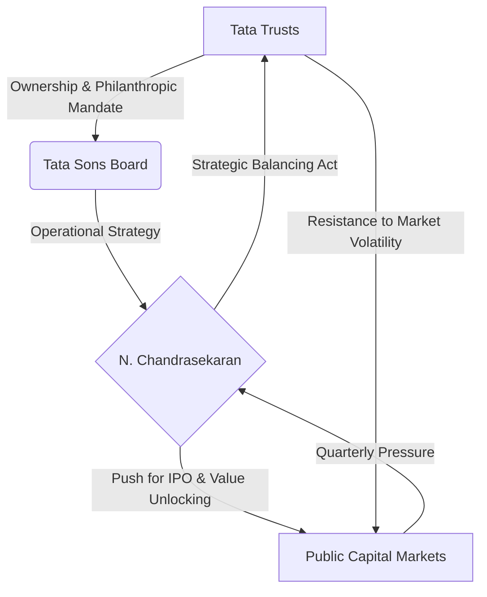

There is a palpable tension brewing within the hallowed halls of Bombay House, the headquarters of India's most storied conglomerate. For decades, the Tata Group has projected an image of seamless unity, blending aggressive industrialization with a deep-seated commitment to philanthropy. However, a growing "trust deficit" is beginning to emerge between the **Tata Trusts**—the philanthropic entities that hold the majority stake in the group—and the professional management team leading **Tata Sons**.

  
  
 <a href="https://unsplash.com/@jpsanabria">Josh Sanabria</a> on <a href="https://unsplash.com/photos/white-and-black-wooden-signage-on-white-sand-during-daytime-CKpvgDu0fXU">Unsplash</a>

At the heart of this friction is a high-stakes debate: should Tata Sons, the principal investment holding company, launch an Initial Public Offering (IPO)? While proponents argue that listing the parent company would unlock unprecedented shareholder value and provide the Trusts with a massive war chest for social causes, skeptics fear that the "Tata Way"—defined by long-term stewardship over short-term gains—cannot survive the relentless scrutiny of the public equity markets. This situation places N. Chandrasekaran, the current Chairman, in a precarious position as he attempts to steer the group toward a more assertive, modern business model.

---

### 📈 The Listing Gambit: Unlocking the Holding Company

The proposal to take Tata Sons public is not merely a financial maneuver; it represents a fundamental strategic pivot. In its current form, Tata Sons acts as a private umbrella for a sprawling array of listed giants, including **TCS, Tata Motors, and Tata Steel**. By listing the holding company, the group could potentially unlock billions of dollars in dormant value.

From a financial perspective, a public listing would provide a clear market valuation for the entire group's ecosystem. Currently, much of the group's value is fragmented across its subsidiaries. A consolidated listing would likely attract massive institutional interest from global funds seeking a single point of entry into the Indian economy's most diversified conglomerate.

However, this "listing gambit" has created a profound rift. Internal critics argue that the private nature of Tata Sons has historically served as a protective shield, allowing the group to execute "generational bets" without the pressure of quarterly earnings calls. As reported by [The Economic Times](https://economictimes.indiatimes.com), the core of the disagreement lies in whether the transparency mandated by the [Securities and Exchange Board of India (SEBI)](https://www.sebi.gov.in) is worth the sacrifice of strategic independence.

**The financial stakes are staggering:**
*   **TCS**, the group's crown jewel, maintains a market capitalization often exceeding **$150 billion**, providing the bulk of the holding company's dividends.
*   The Tata Group’s combined annual revenue is estimated to be over **$150 billion**, making it one of the largest private entities in the developing world.
*   A public listing could potentially create a holding company valuation that exceeds the combined market cap of several Nifty 50 companies.

---

### 🤝 The Trust Gap: Philanthropy vs. Professionalism

To understand the "trust deficit," one must understand the unique architecture of the Tata Group. Unlike most global conglomerates, the majority of Tata Sons is owned by philanthropic trusts. This creates an inherent structural tension: the Trusts are driven by a social mission to improve Indian society, while the management of Tata Sons must operate with a competitive, profit-maximizing mindset to survive in a globalized market.

Under the leadership of N. Chandrasekaran, Tata Sons has shifted toward a leaner, more professional operational style. This has involved exiting non-core businesses, consolidating fragmented brands, and doubling down on "future-ready" sectors like semiconductors and digital platforms. While these moves have improved the balance sheet, some members of the Trusts view this shift as an erosion of the traditional, "family-first" culture established by the group's founders.

This tension is a subtle echo of the governance battles witnessed during the Cyrus Mistry era. As [Mint](https://www.livemint.com) has noted, the current disagreement is less about personal animosity and more about the velocity of change. The Trusts are hesitant to trade their role as the "moral compass" for a role as "public shareholders," fearing that the pursuit of **EPS (Earnings Per Share)** will overshadow the pursuit of social equity.

> "The existential challenge for the current leadership is to prove that professional efficiency and aggressive market capitalization do not come at the expense of the group's foundational ethics."

---

### ⚖️ Chandrasekaran’s High-Wire Act

N. Chandrasekaran is performing one of the most difficult balancing acts in corporate history. As Chairman, he must act as the conduit between the visionary, often conservative, goals of the Trusts and the cold realities of the [National Stock Exchange (NSE)](https://www.nseindia.com) and [BSE](https://www.bseindia.com).

He has championed a consolidated leadership style, positioning the Chairman as the primary decision-maker between the board and the trusts. This centralized approach is designed to accelerate decision-making in a volatile market. However, it has also led to concerns regarding the concentration of power. For Chandrasekaran, the goal is clear: evolve the Tata Group into a global powerhouse capable of competing with the likes of Samsung or Alphabet, while keeping the philanthropic soul of the organization intact.

The pressure is mounting as the group makes massive capital expenditures in the "New Economy." From the acquisition of Air India to the launch of the Tata Neu super-app, the group is spending billions to pivot. [Business Standard](https://www.business-standard.com) points out that his ability to bridge the gap between the Trusts' legacy and the market's demands will define the group's trajectory for the next decade.

---

### 📉 Governance in Crisis: The Power Flow

The conflict at Bombay House can be visualized as a struggle over the "steering wheel" of the empire. While the Trusts provide the capital and the ethical framework, the management team handles the tactical execution. When these two forces align, the group is unstoppable; when they clash, the resulting deadlock can paralyze strategic pivots.

In this ecosystem, the "trust deficit" manifests as a hesitation to commit to long-term public transparency. If Tata Sons goes public, the Trusts will no longer be the sole arbiters of the group's direction; they will have to answer to thousands of minority shareholders. This shift from "stewardship" to "governance" is the primary point of contention.

---

### 🌐 Comparative Analysis: The Global Holding Company Model

To gauge the risks, one can look at other global conglomerates. Companies like Berkshire Hathaway have successfully navigated the holding company model by maintaining a cult of personality and a long-term investment horizon. However, many Asian conglomerates (such as those in South Korea's *Chaebols*) have struggled with "holding company discounts," where the market values the parent company at less than the sum of its parts.

If Tata Sons lists, it risks facing this same discount unless it can prove that its management adds significant "synergy value" beyond just owning great companies. Reports from [Reuters](https://www.reuters.com) suggest that for a Tata Sons IPO to be successful, the group would need to redefine its identity not as a collection of companies, but as a cohesive investment platform.

---

### 🏁 The Path Forward: Evolution or Preservation?

The resolution of the split at Bombay House will determine whether the Tata Group remains a philanthropic empire led by ancestral values or evolves into a market-driven global titan. The stakes transcend mere currency; they involve the very identity of one of India's most trusted brands.

For a listing to occur, three conditions must be met:
1.  **Alignment of Vision:** The Trusts must accept that public transparency can coexist with philanthropic goals.
2.  **Governance Reform:** A new framework must be established to protect the group from the short-termism of the stock market.
3.  **Value Proposition:** The group must demonstrate a clear strategy for how a public listing benefits the broader Indian economy, not just the balance sheet.

As [Bloomberg](https://www.bloomberg.com) and [Financial Express](https://www.financialexpress.com) continue to track the movements within the group, it is evident that the "Tata Way" is under renovation. N. Chandrasekaran's success will not be measured by the valuation of a potential IPO, but by his ability to ensure that as the group steps into the spotlight of the public market, it does not lose the soul that made it legendary.

***

### 📚 References & Further Reading
*   **Tata Group Official Portal:** [tata.com](https://www.tata.com) — For official statements on corporate structure.
*   **SEBI Guidelines:** [sebi.gov.in](https://www.sebi.gov.in) — For regulations regarding the listing of holding companies in India.
*   **Market Analysis:** Refer to recent equity research on the "Holding Company Discount" in emerging markets.
*   **Corporate History:** Documentation on the transition from Ratan Tata to N. Chandrasekaran.

---

## 📖 Related Reading

- [🛫 The Airport Handshake: When Trump Broke Protocol for Xi Jinping](/trumps-rare-gesture-to-xi-jinping-us-president-to-personally-welcome-chinese-leader-at-airport-moneycontrolcom/)
- [Unmasking ‘Operation Groundwire’: How Digital Influence Works](/operation-groundwire-exposed-pakistans-alleged-digital-influence-network-plain-speak/)
- [Tragedy on a Birthday: 24-Year-Old Flung into Air by Speeding Car in Greater Noida](/greater-noida-24-year-old-returning-with-his-birthday-cake-hit-by-car-flung-into-the-air/)
