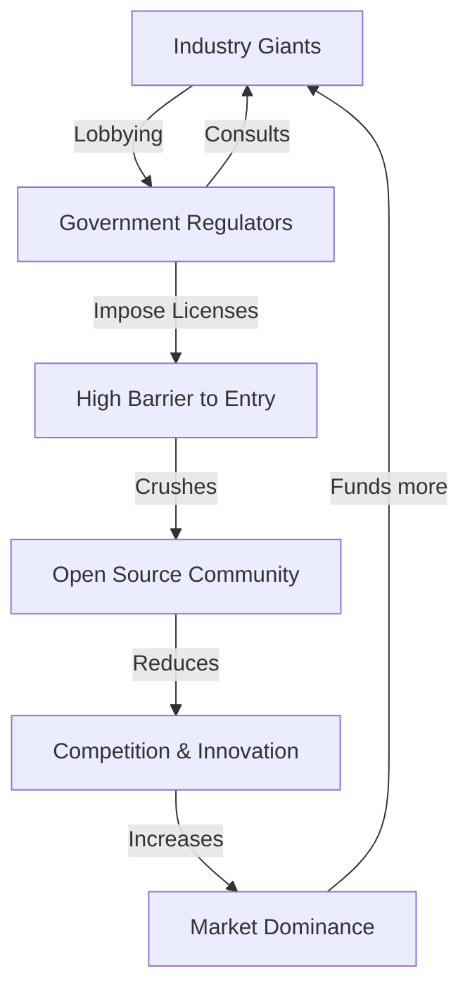

There is a massive legal and philosophical battle unfolding in the United States, and its resolution might change the trajectory of human intelligence forever. At the center of this conflict is a provocative question: Is the global push for "AI Safety" a genuine effort to prevent an apocalypse, or is it the most sophisticated antitrust maneuver in the history of the tech industry?

  
  
 <a href="https://unsplash.com/@anldrms">Anil Baki Durmus</a> on <a href="https://unsplash.com/photos/a-united-states-courthouse-building-is-shown-M-J9cdC1e0Q">Unsplash</a>

A burgeoning series of legal challenges and industry critiques claim that the current titans of the field—**OpenAI, Anthropic, and Google**—are coordinating to slow down the open-source AI movement. The argument is that these companies are using "existential risk" (X-risk) as a strategic smokescreen to build a "regulatory moat." By lobbying for strict government licenses and heavy oversight, they aren't necessarily trying to protect humanity—they are trying to protect their market share by making it illegal for anyone without a billion-dollar balance sheet to train a frontier model.

---

### 🏗️ The Mechanics of Regulatory Capture

To understand this conflict, one must first understand **regulatory capture**. This occurs when a powerful industry successfully lobbies the government to create regulations that appear to be in the public interest but actually serve to protect the incumbents from new competitors. 

In the context of AI, this manifests as the push for "licensing regimes." Imagine a world where the US government declares that any model trained with more than **10^25 floating-point operations (FLOPs)** is a "dangerous weapon" and requires a federal license to develop. While this sounds reasonable to a lawmaker fearing a rogue AI, the practical effect is devastating: only three or four companies in the world could afford the legal, compliance, and hardware costs associated with such a license.

> "The tragedy of the 'safety' narrative is that it transforms a technical challenge into a political tool. When we define 'safety' as 'only accessible to licensed corporations,' we aren't eliminating risk; we are centralizing power." — *Independent AI Ethics Researcher*

By framing big AI models as national security risks akin to nuclear enrichment, these companies encourage the government to create hurdles that small startups and independent researchers simply cannot jump over. This effectively turns "safety" into a competitive advantage.

---

### 🤝 The Frontier Model Forum: Cartel or Collaboration?

A primary piece of evidence cited by critics is the [Frontier Model Forum (FMF)](https://www.frontiermodelforum.org/), an industry body founded by OpenAI, Anthropic, Google, and Microsoft. The FMF presents itself as a collaborative effort to ensure that the most powerful AI systems are developed safely and reliably. However, legal challengers view this as a **de facto cartel**.

The suspicion is that the FMF serves as a coordination hub where the "Big Four" can agree on safety standards that align perfectly with their existing internal architectures but are prohibitively expensive or technically impossible for open-source projects to implement. This allows them to:

1.  **Synchronize Lobbying:** Present a united front to the White House and Congress, making their "expert" advice seem like a consensus.
2.  **Control the Definition of "Frontier":** Influence the legal definition of what constitutes a "frontier model," ensuring the threshold is set just high enough to capture open-source rivals while exempting their own slightly older, widely used models.
3.  **Throttle Information Flow:** Coordinate the release of "safety benchmarks" that prioritize the types of risks their models are already good at avoiding, while ignoring the risks (like centralization of power) that their business models create.

---

### 🔓 The Open-Source Battleground: Weights vs. Walls

The tension is most visible in the war between "Closed AI" and "Open Weights AI." Companies like **Meta** (with Llama) and **Mistral** have championed a more open approach, arguing that transparency is the *only* way to truly ensure safety. 

The "Closed" camp—led by OpenAI and Anthropic—argues that releasing model weights is inherently dangerous. They claim that a bad actor could take a powerful open-weights model and "fine-tune" it to create biological weapons or execute sophisticated autonomous cyberattacks. 

However, the open-source community points to a few glaring contradictions:
*   **The Knowledge Gap:** Most of the information needed to build a bio-weapon is already available in textbooks and scientific journals; the AI is just a more efficient index.
*   **The "Safety" Paradox:** If a model is so dangerous that its weights cannot be shared, how can the global research community audit it for bias, hallucinations, or hidden backdoors?
*   **The Compute Divide:** Training a model from scratch costs **hundreds of millions of dollars** in H100 GPUs. The real "danger" isn't the weights—it's the compute. If the government wanted to stop dangerous AI, they would regulate the hardware (GPU clusters), not the software (weights).

According to recent data, the cost of training a frontier model has surged, with some estimates suggesting the next generation of models will require **$1 billion to $10 billion** in compute alone. By shifting the regulatory focus from *compute* to *weights*, the incumbents protect their hardware advantage while criminalizing the software distribution that allows the "little guys" to innovate.

---

### ⚖️ The Defense: Is Existential Risk a Fair Point?

To provide a balanced view, we must acknowledge that the "doomer" perspective isn't entirely fabricated. Figures like Geoffrey Hinton and Yoshua Bengio have warned that Artificial General Intelligence (AGI) could pose a genuine [existential threat](https://openai.com/safety) if it develops goals misaligned with human survival.

From this perspective, the push for regulation isn't about profit; it's about survival. They argue that:
*   **Rapid Iteration is Risky:** In a "wild west" environment, one mistake in an autonomous agent's goal-setting could lead to catastrophic systemic failure.
*   **The Need for Global Coordination:** If the US has strict rules but other nations don't, we enter a "race to the bottom" where safety is sacrificed for speed.
*   **The "Black Box" Problem:** Because we don't fully understand *how* these models reason (the interpretability problem), we cannot trust them with critical infrastructure without extreme oversight.

The companies argue that they are the only ones with the resources to implement the rigorous "red-teaming" and evaluation frameworks necessary to prevent these outcomes. In their view, a centralized, licensed approach is the only moral way to handle a technology that could potentially end the human era.

---

### 📉 The Economic Impact of AI Centralization

If the "Regulatory Moat" strategy succeeds, the economic implications will be profound. We risk moving from a decentralized internet economy to a "feudal AI" system.

**Bold Stats on AI Centralization:**
*   **GPU Monopoly:** NVIDIA currently controls roughly **80% to 95%** of the high-end AI chip market, creating a hardware bottleneck that favors the largest buyers.
*   **Compute Concentration:** Only about **10-15 companies** globally possess the compute clusters necessary to train a model that competes with GPT-4.
*   **Data Moats:** The top labs have signed exclusive multi-million dollar deals with publishers (like Reddit and News Corp), ensuring that open-source models are starved of high-quality, fresh data.

When AI is centralized, the "alignment" of the AI is decided by a handful of board members in San Francisco and London. If these companies decide that certain political views, scientific hypotheses, or business strategies are "unsafe," they can effectively erase those ideas from the AI's output, creating a centralized filter for human knowledge.

---

### 🌍 A Global Perspective: The EU AI Act vs. The US Approach

The US is currently debating whether to follow a "Safety-First" (Closed) or "Innovation-First" (Open) path. Meanwhile, the European Union has already moved forward with the [EU AI Act](https://artificialintelligenceact.eu/). 

The EU Act takes a risk-based approach, categorizing AI systems into "unacceptable," "high," "limited," and "minimal" risk. Interestingly, the EU has faced similar lobbying efforts. The "General Purpose AI" (GPAI) rules in the Act were a point of intense contention, with critics arguing that the requirements for "systemic risk" models were designed to favor large US-based labs while stifling smaller European startups.

The danger is a "Brussels Effect" combined with "Silicon Valley Capture," where a global standard is set that ensures only a few companies can legally operate. This would be catastrophic for the Global South, where open-source AI is the only way to develop localized models that aren't biased toward Western cultural norms.

---

### 🚩 Red Flags and Future Indicators

How can we tell if "AI Safety" is being used as a weapon for market capture? We should watch for these three red flags:

1.  **The "Compute Threshold" Loophole:** If regulations target *weights* (software) but ignore *compute* (hardware), it's a sign of capture.
2.  **Closed-Door "Safety" Audits:** If the government allows companies to "self-certify" their safety or use proprietary, non-transparent audits, the moat is being reinforced.
3.  **Criminalizing Fine-Tuning:** If laws are passed that make it illegal for an individual to fine-tune a model on their own hardware, the war on open source has been won.

---

### 🏁 Conclusion: The Crossroads of Intelligence

The debate over AI safety is not just a technical discussion—it is a struggle for the ownership of the most powerful tool ever created. If we accept the premise that only a few licensed giants can be trusted with "frontier" intelligence, we are trading the risk of a "rogue AI" for the certainty of a corporate oligarchy.

Open source is more than just "free software"; it is a system of checks and balances. It allows for independent auditing, democratic access, and a diversity of thought that no single corporate board can provide. The lawsuit against OpenAI, Google, and Anthropic is a symptom of a much larger tension: the clash between the desire for control and the necessity of openness.

As the legal battles progress, the world must decide: Do we want an AI future that is **centralized and curated**, or one that is **distributed and diverse**? The answer will determine whether AI becomes a utility for all of humanity or a private kingdom for a few.

---

### 📚 References & Further Reading

*   **Federal Trade Commission (FTC):** [Inquiries into AI Partnerships](https://www.ftc.gov)
*   **Stanford Institute for Human-Centered AI (HAI):** [AI Index Report 2024](https://aiindex.stanford.edu/)
*   **arXiv.org:** [Research on Open-Weights Model Performance](https://arxiv.org/)
*   **The Verge:** [Analysis of OpenAI's Transition to For-Profit](https://www.theverge.com)
*   **Wired:** [The Rise of the 'Doomer' Philosophy in Silicon Valley](https://www.wired.com)
*   **MIT Technology Review:** [The Case for Open Source AI](https://www.technologyreview.com)
*   **European Parliament:** [Official Text of the EU AI Act](https://artificialintelligenceact.eu/)
*   **Center for AI Safety (CAIS):** [Statement on Mitigating Existential Risk](https://www.safe.ai)
*   **Mistral AI:** [The Philosophy of Open Weights](https://mistral.ai)
*   **Meta AI:** [Llama 3 Technical Documentation](https://llama.meta.com)

---

## 📖 Related Reading

- [🏏 The Noise Around Agarkar, Rohit, and the NCA](/why-did-ajit-agarkar-quit-rohits-future-fiasco-differences-with-vvs-laxman/)
- [🏛️ The Bombay House Divide: Value vs. Values in the Tata Empire](/trust-deficit-bombay-house-splits-over-tata-sons-listing-and-chandrasekarans-return-as-chairman/)
- [🔋 iPhone 18 Pro Battery Repairs in India: The Rising Cost of Power](/iphone-18-pro-battery-repair-gets-costlier-in-india-how-much-will-you-pay/)
