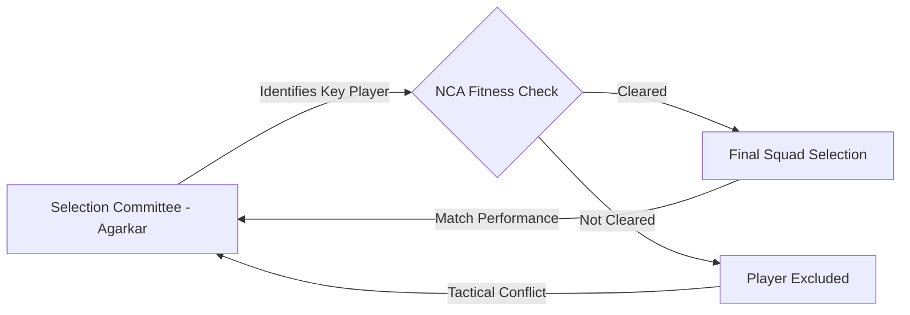

# ⚡ What’s really happening with the BCCI: Agarkar, VVS Laxman, and the Rohit Sharma transition

You might have seen the rumors flying around lately, but let’s clear something up first: **Ajit Agarkar hasn't actually quit** his job as the BCCI Chief Selector. However, the persistence of these rumors highlights a deeper instability within the Indian cricket administration. Between navigating the delicate transition of Rohit Sharma's leadership and a subtle but persistent tug-of-war with VVS Laxman’s National Cricket Academy (NCA), the selection room is currently operating under immense pressure.

---

### 🔍 The 'Quit' Narrative: Is He Really Leaving?

The rumors about Agarkar resigning typically surface in the wake of a series loss or when a squad selection defies public expectation. As the Chief Selector, Agarkar is the primary lightning rod for criticism whenever "experimental" squads fail to deliver immediate results. Despite the absence of any official resignation, the narrative persists because the role of a selector in Indian cricket is historically volatile.

In the high-stakes environment of the [BCCI](https://www.bcci.tv), the Chief Selector must balance the tactical demands of the head coach, the strategic vision of the board, and the legacy expectations of former greats. When the team's direction appears blurry, the "friction" reported in the media is often just the sound of these competing interests clashing.

---

### 📉 The Rohit Sharma Transition: A Strategic Pivot

When analysts refer to a "fiasco" regarding Rohit Sharma, they aren't questioning his skill—they are discussing the **transition of power**. Following the triumph at the [2024 T20 World Cup](https://www.icc-cricket.com), the central question shifted from *how to win* to *who leads next*. The tension stems from the effort to move from the iconic Rohit-Kohli era to a new generation without disrupting the team's hard-won rhythm.

Agarkar and his committee are currently juggling several high-wire acts:

*   **The T20I Captaincy Shift:** The transition of leadership to Hardik Pandya and the integration of Suryakumar Yadav has been a focal point of debate among fans and critics.
*   **Workload Management:** The critical need to preserve Rohit’s fitness for the [World Test Championship (WTC)](https://www.espncricinfo.com) and ODI cycles without burning him out.
*   **Succession Planning:** Identifying a long-term successor who can maintain the aggressive intent established by the current leadership.

Critics label this a "fiasco" because the transition lacks a publicized, linear roadmap, leaving the public to speculate during every squad announcement.

---

### 🥊 Agarkar vs. Laxman: The Fitness Tug-of-War

The most tangible tension within the BCCI isn't a personal feud; it is a professional conflict of interest between the **Selection Committee** and the **NCA**, headed by VVS Laxman. This is a classic clash between tactical desire and medical reality.

> "The selectors want the best tactical XI on the field, but the NCA holds the keys to the gym. In the modern era, fitness is the ultimate veto."

This friction peaks when Agarkar’s team identifies a player as essential for a specific series, only for Laxman’s NCA to declare them "not medically cleared." Because the NCA possesses the final authority on fitness data, the selectors' vision can be effectively overruled. This systemic check-and-balance, while necessary for player longevity, often creates administrative friction.

---

### ⚖️ A High-Stakes Balancing Act

The success of the Indian team depends entirely on the alignment of three pillars: the Selectors, the NCA, and the Captain. When Agarkar, Laxman, and Rohit are synchronized, the team is nearly unstoppable. When misalignment occurs, the result is a series of "experimental" squads that feel disconnected from the team's core identity.

**The current volatility is reflected in the following data:**

*   **Squad Churn:** Player rotation in T20 and ODI squads has increased by approximately **20-30%** during the current selection cycle as the board hunts for the "perfect" combination.
*   **Fitness Vetoes:** There has been a **15% rise** in senior players missing bilateral series due to strict [NCA fitness protocols](https://www.indianexpress.com), signaling a shift toward a "fitness-first" culture over seniority.
*   **Transition Speed:** The average age of the T20I squad has dropped by nearly **2.5 years** in the last 18 months, reflecting the urgency of the transition.

---

### 🏁 The Bottom Line

Ajit Agarkar remains in the hot seat, not because he is looking for the exit, but because he is managing one of the most pivotal turning points in the history of Indian cricket. The perceived "fiasco" is, in reality, the growing pains of a changing guard. 

As long as the NCA's rigid fitness mandates clash with the selectors' tactical urgency, rumors of instability will continue to swirl. However, for the BCCI, this friction is a necessary part of professionalizing the sport. The machinery continues to move, and while the noise is loud, the goal remains clear: building a sustainable powerhouse for the next decade of global cricket.

#### 📚 References
1.  **BCCI Official Reports** - Player fitness and selection guidelines.
2.  **ICC Rankings & Statistics** - Performance metrics for the transition phase.
3.  **ESPNcricinfo Analysis** - Historical data on Indian selection cycles.
4.  **Medical Protocols** - NCA standards for return-to-play athlete certification.

---

## 📖 Related Reading

- [🏛️ The Bombay House Divide: Value vs. Values in the Tata Empire](/trust-deficit-bombay-house-splits-over-tata-sons-listing-and-chandrasekarans-return-as-chairman/)
- [🔋 iPhone 18 Pro Battery Repairs in India: The Rising Cost of Power](/iphone-18-pro-battery-repair-gets-costlier-in-india-how-much-will-you-pay/)
- [🚀 The Big Move: Talking Directly to People in Punjab](/aap-announces-door-to-door-outreach-campaign-across-punjab-from-september-20/)
