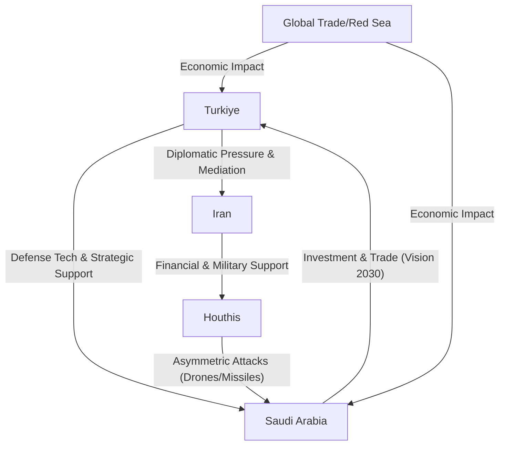

There is a seismic shift occurring in the geopolitical architecture of the Middle East. Turkish Foreign Minister Hakan Fidan has recently stepped forward to explicitly back the security and stability of Saudi Arabia, particularly as the threat from the Houthi movement in Yemen escalates. According to reports from [Al Jazeera](https://www.aljazeera.com), this represents a profound evolution in Ankara's foreign policy trajectory. We are witnessing a decisive move away from the frost-bitten relationship Turkiye once shared with Riyadh, transitioning instead toward a strategic partnership rooted in mutual survival and regional pragmatism.

As the Houthis utilize advanced drones and ballistic missiles to destabilize the Arabian Peninsula, Turkiye has come to a critical realization: the security of the Saudi state is not merely a Gulf concern, but a prerequisite for preventing a total systemic collapse across the region. In a landscape where proxy wars are the norm, Ankara is choosing to align with the center of gravity in the Arab world to ensure its own regional leverage.

---

### 🛡️ The Diplomatic Shield: Fidan’s New Doctrine

The cornerstone of this shift is the rhetoric and strategy deployed by Hakan Fidan. A former intelligence chief, Fidan views the Middle East through a lens of security interdependence. He has argued that a stable Middle East is an impossibility if Saudi Arabia remains vulnerable to asymmetric threats. By publicly siding with Riyadh, Turkiye is not merely performing a diplomatic courtesy; it is acknowledging that Saudi Arabia possesses legitimate security concerns regarding the Houthi insurgents—concerns that now overlap with Turkiye's own interests in maritime security and regional trade.

> "The security and stability of Saudi Arabia are essential for the peace and prosperity of the region," the Turkish diplomatic narrative suggests, framing the Houthi threat as a collective regional challenge rather than a localized Yemeni conflict.

This endorsement arrives at a precarious juncture for the Kingdom. Saudi Arabia is currently attempting a high-stakes pivot away from the grinding attrition of the war in Yemen to focus on its **Vision 2030** initiative. This ambitious blueprint aims to diversify the economy away from oil, targeting a non-oil GDP contribution of **over 50% by 2030**. However, the feasibility of these massive infrastructure projects—such as NEOM—depends entirely on a perception of safety. If the Houthis can successfully strike the heart of the Kingdom, foreign direct investment (FDI) will evaporate. Turkiye, recognizing this, is positioning itself as a security guarantor and a diplomatic ally to ensure the economic engine of the Gulf remains operational.

---

### 🚀 The Houthi Threat Landscape and Asymmetric Warfare

When Turkish and Saudi officials speak of "escalating attacks," they are referring to a sophisticated evolution in asymmetric warfare. The Houthi movement, heavily supported by Iran, has transitioned from a tribal insurgency to a regional actor capable of projecting power far beyond Yemen's borders. Using a combination of **long-range ballistic missiles** and **loitering munitions** (suicide drones), the Houthis have repeatedly targeted Saudi oil installations, including the critical Abqaiq and Khurais plants.

As detailed in [Wikipedia's documentation on the Saudi–Yemen war](https://en.wikipedia.org/wiki/Saudi_Arabia%E2%80%93Yemen_war), the conflict has been characterized by fragile ceasefires and broken diplomatic promises. In recent months, the conflict has spilled over into the Red Sea and the Bab-el-Mandeb strait, one of the world's most vital maritime chokepoints. Approximately **12% of global trade** and a significant portion of the world's oil shipments pass through this corridor.

The Houthi strategy of targeting commercial shipping has created a global economic ripple effect. For Turkiye, a nation that relies heavily on maritime trade and is striving to become a global logistics hub, any disruption in the Red Sea is a direct threat to its national economy. The use of "loitering munitions" has forced Saudi Arabia to invest **tens of billions of dollars** into missile defense systems like the Patriot, yet the persistence of the Houthi drone fleet suggests that hardware alone is not the solution. This is where Turkiye enters the conversation. As a global leader in unmanned aerial vehicle (UAV) technology, Turkiye offers not just diplomatic support, but a potential technological blueprint for countering asymmetric threats.

---

### 🤝 From Friction to Partnership: The Great Reset

The current alignment is striking when contrasted with the volatility of the previous decade. For years, the relationship between President Recep Tayyip Erdoğan and Crown Prince Mohammed bin Salman (MBS) was defined by ideological rivalry and public friction. The nadir of this relationship arrived following the 2018 Khashoggi crisis, which led to a period of diplomatic freezing and mutual suspicion.

However, starting around **2022**, a pragmatic "reset" began. This was not a sudden change of heart, but a calculated response to shifting domestic and international pressures. Turkiye was facing a severe currency crisis and soaring inflation, making the prospect of Gulf investment irresistible. Simultaneously, Saudi Arabia recognized that the United States was gradually pivoting its focus toward the Indo-Pacific, leaving a security vacuum in the Middle East.

The restoration of ties has proceeded across three primary vectors:

1.  **Economic Normalization:** There has been a surge in bilateral trade, with both nations aiming to increase trade volumes to **$30 billion annually**.
2.  **Diplomatic Restoration:** The return of ambassadors and the resumption of high-level state visits have signaled to the world that the era of public disputes is over.
3.  **Security Convergence:** Both Ankara and Riyadh have concluded that regional proxies—funded by outside powers—are the primary threat to sovereign borders.

By moving past the ghosts of the 2010s, Turkiye and Saudi Arabia are practicing a form of *Realpolitik* that prioritizes stability over ideology. According to analysis by the [Council on Foreign Relations](https://www.cfr.org), this shift reflects a broader trend of "regionalization," where Middle Eastern powers seek local solutions to local problems rather than relying on Western intervention.

---

### 🏗️ The Defense Export Dimension

One cannot analyze Turkiye's support for Saudi Arabia without discussing the defense industry. Turkiye has evolved into a global powerhouse in drone warfare, with the Bayraktar TB2 and AKINCI drones achieving legendary status in conflicts across Nagorno-Karabakh and Ukraine. For Saudi Arabia, the allure of Turkish defense technology is twofold: it is highly effective and comes without the stringent political conditions often attached to U.S. arms sales.

The possibility of a defense pact or a significant transfer of UAV technology provides Turkiye with a powerful "diplomatic currency." If Ankara can help Riyadh secure its borders against Houthi drones, it cements its role as an indispensable security partner. This symbiotic relationship transforms Turkiye from a mere diplomatic ally into a strategic asset. The [Middle East Institute](https://www.mei.edu) notes that Turkey's ability to export security is now a central pillar of its foreign policy, allowing it to penetrate markets in the Gulf that were previously closed to it.

---

### ⚖️ The Iranian Balancing Act

Perhaps the most complex aspect of this strategy is Turkiye's relationship with Iran. The Houthis are widely viewed as an extension of Tehran's "Axis of Resistance." By backing Saudi Arabia against a Houthi-led escalation, Turkiye is walking a tightrope. Ankara wants to maintain a functional relationship with Iran to manage conflicts in Syria and Iraq, but it cannot afford to be seen as complicit in the destabilization of the Gulf.

This is where Hakan Fidan’s expertise in intelligence and mediation becomes crucial. Turkiye is attempting to play the role of the "honest broker." By strengthening its ties with Riyadh, Ankara gains the leverage necessary to pressure Tehran to moderate its support for regional proxies. This balancing act is not without risk, but it allows Turkiye to occupy a unique position: it is the only regional power that maintains a high-level dialogue with both the Saudi monarchy and the Iranian leadership.

---

### 🌍 The Geopolitical Chessboard: A New Era of Realism

The broader implication of this partnership is the death of the "ideological rivalry" that characterized the early 2010s. The era of competing for the "leadership of the Muslim world" has been replaced by a quest for economic resilience and border security. 

As indicated by reports from [Reuters](https://www.reuters.com), the regional dynamic is shifting toward a multipolar reality. With China mediating the Saudi-Iran rapprochement and Turkiye bridging the gap between the Gulf and the Mediterranean, the Middle East is slowly constructing its own security architecture. 

**Key drivers of this new realism include:**
*   **The U.S. Pivot:** The perceived reduction in American commitment to regional security has forced Riyadh and Ankara to look toward each other.
*   **Economic Interdependence:** The reliance on the [Saudi Vision 2030](https://www.vision2030.gov.sa) framework for regional growth.
*   **Shared Threat Perception:** The realization that Houthi-style asymmetric warfare can be exported and used against any sovereign state in the region.

For Turkiye, backing Saudi Arabia is a masterstroke of strategic positioning. It secures an economic lifeline, opens a massive market for its defense industry, and ensures that it remains a central player in the Yemen peace process.

---

### 🏁 Conclusion: The Architecture of Stability

At its core, Turkiye’s support for Saudi security is far more than a diplomatic gesture; it is a recognition of a new global reality. The Houthi threat proves that in the modern age, a non-state actor with a handful of drones can disrupt global trade and threaten the stability of a G20 economy. 

By aligning with Riyadh, Ankara is not just protecting a neighbor—it is protecting the predictability of the regional order. This unexpected partnership, born from the ashes of mutual distrust, may well become the cornerstone of Middle Eastern security for the next decade. As the Houthis continue to push the envelope of regional aggression, the Turkiye-Saudi axis provides a critical bulwark, proving that in the game of geopolitical survival, pragmatism will always triumph over ideology.

The road ahead remains fraught with challenges, from the volatility of the Yemeni interior to the shifting whims of Tehran. However, the current trajectory suggests a move toward a more integrated, realist, and stable Middle East—one where security is viewed as a shared commodity rather than a zero-sum game.

***

### 📚 References

*   **Al Jazeera:** Analysis of Turkish-Saudi diplomatic relations and Fidan's recent statements.
*   **Council on Foreign Relations (CFR):** Reports on the "Regionalization" of Middle East security.
*   **Middle East Institute (MEI):** Research on Turkiye's defense exports and their diplomatic utility.
*   **Reuters:** Coverage of trade agreements and the "reset" between Erdogan and MBS.
*   **Saudi Vision 2030 Official Portal:** Details on economic diversification and GDP targets.
*   **Wikipedia:** Historical timeline of the Saudi–Yemen conflict and Houthi tactics.
*   **Bloomberg:** Economic analysis of Red Sea shipping disruptions and global trade impact.
*   **UN News:** Updates on Yemen ceasefire negotiations and humanitarian reports.
*   **Foreign Affairs:** Long-form analysis of Turkey's strategic pivot in the Gulf.
*   **Turkish Ministry of Foreign Affairs:** Official statements regarding regional stability and security cooperation.

---

## 📖 Related Reading

- [🌊 The Caribbean Silence: Investigating the Transparency Gap in Maritime Interdiction](/us-boat-strike-in-caribbean-kills-four-amid-expanded-anti-drug-campaign/)
- [🏏 The Noise Around Agarkar, Rohit, and the NCA](/why-did-ajit-agarkar-quit-rohits-future-fiasco-differences-with-vvs-laxman/)
- [🛡️ Is "AI Safety" Just a Way to Kill Open Source?](/us-lawsuit-says-openai-anthropic-and-google-colluded-to-slow-ai-progress/)
