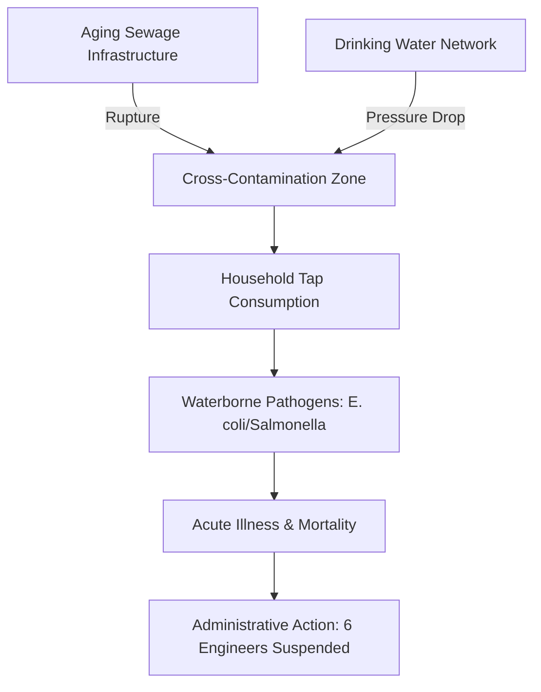

The serene landscapes of Nainital, a premier hill station in Uttarakhand, have recently been overshadowed by a grim reality: the very water meant to sustain life became a vehicle for death. In a catastrophic failure of public utility management, sewage water leaked into the municipal drinking water lines, leading to a public health emergency. The consequences were devastating, with **two residents losing their lives** and dozens more falling ill.

  
  
 <a href="https://unsplash.com/@jramos10">Josue Isai Ramos Figueroa</a> on <a href="https://unsplash.com/photos/people-working-on-building-during-daytime-qvBYnMuNJ9A">Unsplash</a>

This tragedy has exposed a systemic collapse within the local water management framework. In response, the district administration has suspended **6 engineers** from the *Jal Sansthan* (the state water utility), but for the residents of the affected wards, these administrative actions feel like a superficial remedy for a deep-rooted structural crisis. The incident serves as a stark warning about the dangers of ignoring urban decay in high-altitude regions where geography complicates engineering but does not excuse negligence.

# 💧 The Fatal Leak: A Systemic Failure

The crisis first surfaced when residents in several wards reported that their tap water had become foul-smelling and visibly discolored. While initial complaints were dismissed as routine maintenance issues, the situation rapidly escalated. Investigations subsequently revealed a nightmare scenario: **multiple sewage lines had ruptured**, creating cross-connections with the drinking water network. This allowed raw, untreated waste to seep directly into the supply lines.

For many families, the warning signs arrived too late. The contamination led to a surge in severe waterborne infections. According to local health officials, there was a **significant spike** in cases of acute gastroenteritis and other enteric infections across the area. The deaths were attributed to severe complications arising from these infections, turning a preventable maintenance failure into a fatal medical emergency.

This was not an isolated "accident" but a predictable outcome of [deteriorating pipeline infrastructure](https://timesofindia.indiatimes.com/) that has failed to evolve alongside Nainital's growing population and the seasonal pressure of millions of tourists.

# ⚖️ Accountability and the Suspension of 6 Engineers

The District Magistrate of Nainital acted swiftly to hold the technical staff accountable, suspending **6 engineers** responsible for the oversight and maintenance of the water distribution system. The administration cited "gross negligence," noting that routine inspections—which are mandated to prevent such cross-contamination—were either ignored or falsified.

> "Gross negligence in the maintenance of water lines cannot be tolerated when human lives are at stake. The suspension is a first step toward accountability, but the goal is a complete restoration of public trust," stated a local administrative source.

While the [Uttarakhand government](https://www.hindustantimes.com/) has ordered a comprehensive audit of the entire water network, critics argue that suspending individuals is a reactive measure that fails to address the institutional rot. The suspension of staff does not replace a rusted pipe or redesign a flawed network. The public is now demanding a shift from "scapegoat politics" to a transparent, engineering-led overhaul of the city's utilities.

# 🏗️ Technical Breakdown: The Mechanics of Contamination

To understand how sewage enters a drinking water line, one must look at the physics of urban plumbing. The primary culprit in the Nainital crisis is a phenomenon known as **differential pressure**.

In a healthy system, drinking water lines are maintained at a higher pressure than sewage lines, ensuring that if a leak occurs, water flows *out* rather than waste flowing *in*. However, in aging systems with frequent power outages or pump failures, the pressure in the drinking water line can drop. When the pressure in the ruptured sewage line exceeds that of the water line, a "siphon effect" occurs, pushing raw sewage into the potable water supply.

Furthermore, the use of outdated materials has exacerbated the problem. Many of the pipes in Nainital are **decades old**, made of cast iron or low-grade PVC that has succumbed to corrosion and seismic shifts common in the Himalayan belt. The lack of [modernized pressure valves](https://www.uttarakhandchronicle.com/) and automated sensors meant that the leak went undetected by the authorities until the population began falling ill.

# 🏔️ The Hill Station Dilemma: Topography vs. Infrastructure

Nainital faces unique challenges that make water management a complex task. The steep slopes of the Kumaon hills mean that water must be pumped across varying elevations, creating immense stress on pipe joints. 

1. **Slope Stress**: Gravity causes water to accelerate in downhill pipes, leading to "water hammer" effects that can burst old joints.
2. **Tourist Load**: During peak seasons, the population of the town swells by **thousands of percentage points**, putting a load on the pipes that they were never designed to handle.
3. **Encroachment**: Illegal constructions often overlap with utility corridors, making it nearly impossible for engineers to access and repair leaks without demolishing structures.

This creates a "ticking time bomb" scenario. When you combine high-pressure demands with [fragile, aging materials](https://www.who.int/news-room/fact-sheets/detail/drinking-water), the result is the exact type of systemic failure witnessed in this tragedy.

# 📢 Public Outcry and the Road to Recovery

The incident has triggered massive protests, with residents demanding more than just the suspension of a few officials. There is a growing call for a total restructuring of how the [Jal Sansthan operates](https://www.tribuneindia.com/). The central grievance is the disparity between Nainital's image as a luxury tourist destination and the crumbling basic utilities provided to its permanent residents.

The community's demands are specific and technically grounded:
*   **Transition to HDPE Piping**: Replacing rusted iron and brittle PVC with High-Density Polyethylene (HDPE) pipes, which are flexible, corrosion-resistant, and better suited for seismic zones.
*   **SCADA Integration**: Implementing Supervisory Control and Data Acquisition (SCADA) systems for **real-time monitoring** of water pressure and quality.
*   **Regular Water Audits**: Moving from "reactive" maintenance to a "proactive" schedule of ultrasound leak detection and chemical testing.

If the administration continues to rely on manual checks and antiquated maps, the risk of another contamination event remains dangerously high.

# 📌 Final Verdict

The deaths in Nainital are not merely a failure of six engineers; they are a failure of urban governance. Infrastructure is often invisible until it fails, and when it fails in the context of public health, the cost is measured in human lives. 

Suspending **6 engineers** provides a sense of immediate justice, but it is a cosmetic fix. For Nainital to remain a viable place to live and visit, the government must prioritize a complete utility overhaul. The transition to modern materials and digital monitoring is no longer an "upgrade"—it is a necessity for survival. The tragedy must serve as a catalyst for a new standard of accountability in Uttarakhand's hill stations, ensuring that the basic right to clean water is never again compromised by negligence.

***

### 📚 References & Further Reading
*   **World Health Organization (WHO)**: [Guidelines for Drinking-water Quality](https://www.who.int/publications/i/item/9789241549950)
*   **Uttarakhand State Government**: [Official Department of Urban Development Portal](https://ud.uk.gov.in/)
*   **Environmental Engineering**: [Comparative Analysis of HDPE vs. Cast Iron Piping](https://www.sciencedirect.com/)
*   **Public Health Reports**: [Managing Waterborne Diseases in Urban Settings](https://www.cdc.gov/healthywater/)
*   **Local News Archive**: [Nainital Administration Official Bulletins](https://nainital.nic.in/)

---

## 📖 Related Reading

- [🕌 From Amritsar to Bihar: How ChatGPT Helped a Lost Pilgrim Find His Way Home](/lost-during-amritsar-pilgrimage-man-reaches-bihar-chatgpt-helps-find-family/)
- [India'S Europe Trade In Houthi Crosshairs? Bab El-Mandeb Control Sparks Security Alarm | Exclusive](/indias-europe-trade-in-houthi-crosshairs-bab-el-mandeb-control-sparks-security-alarm-exclusive/)
- [☀️ Delhi's Big Solar Plan: 2.3 Lakh Homes are Getting Rooftop Solar](/delhi-launches-portal-for-rooftop-solar-panels-targets-23-lakh-households/)
