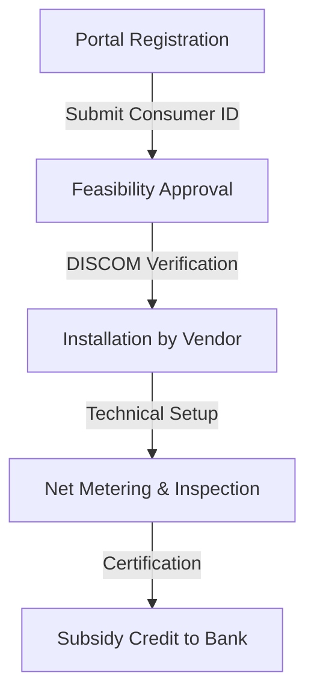

Delhi is currently navigating a pivotal transition in its urban energy landscape. Facing the dual challenges of extreme summer heatwaves and critical air quality crises, the city has launched an ambitious initiative to integrate renewable energy directly into the residential fabric. By partnering with the [PM Surya Ghar: Muft Bijli Yojana](https://pmsuryaghar.gov.in), the Delhi government aims to facilitate the installation of rooftop solar panels for **2.3 lakh households**. 

  
  
 <a href="https://unsplash.com/@vonkm737">Martijn Vonk</a> on <a href="https://unsplash.com/photos/a-group-of-people-walking-around-a-city-street-n56pIUKGUeM">Unsplash</a>

This is not merely an environmental gesture; it is a strategic economic shift. The program is designed to transform the average citizen from a passive consumer into a "prosumer"—someone who both produces and consumes energy. By leveraging a streamlined digital portal, residents can now bypass traditional bureaucratic hurdles to potentially secure up to **300 units of free electricity** every month.

---

### 🚀 The Digital Shift: Cutting Out the Paperwork

For years, the primary barrier to solar adoption in urban India wasn't a lack of interest, but a surplus of friction. Prospective adopters were often deterred by a fragmented process involving multiple permits, unreliable vendors, and an opaque subsidy disbursement system.

The introduction of the new solar portal represents a fundamental shift toward a **single-window interface**. This digital ecosystem centralizes the entire lifecycle of solar adoption:

1.  **Application and Documentation:** Users no longer need to visit multiple government offices. All KYC and electricity bill submissions are handled digitally.
2.  **Real-time Tracking:** The portal provides a transparent dashboard where applicants can track their feasibility approval and installation status.
3.  **Vendor Verification:** To prevent fraud and poor-quality installations, the portal connects users with certified installers who meet the stringent quality standards set by the [Ministry of New and Renewable Energy (MNRE)](https://mnre.gov.in).

By reducing the "cognitive load" of switching to green energy, the government is ensuring that the target of **2.3 lakh households** is a reachable milestone rather than a theoretical goal.

---

### 💰 Financial Engineering: The Mathematics of Savings

The financial viability of rooftop solar has historically been hampered by high upfront costs. The [PM Surya Ghar: Muft Bijli Yojana](https://pmsuryaghar.gov.in) addresses this through a tiered subsidy structure that makes solar accessible to middle- and lower-income families.

#### 📊 Breakdown of Direct Subsidies
The central government provides significant financial incentives to lower the "payback period" of the system:

*   **Small Systems (up to 2 kW):** Households installing a 2 kW system can receive a subsidy of approximately **₹60,000**. This is ideal for smaller apartments or homes with modest energy needs.
*   **Medium to Large Systems (3 kW and above):** For systems of 3 kW or more, the subsidy increases up to **₹78,000**. These systems are designed for larger families or those utilizing multiple air conditioners during Delhi's brutal summers.

> "The goal is to empower the common man to become a 'prosumer'—someone who both produces and consumes energy—thereby turning rooftops into mini-power plants that stabilize the city's grid."

#### 📈 Return on Investment (ROI) Analysis
Beyond the immediate subsidy, the long-term financial gains are substantial. With solar panels having a functional lifespan of **25 years**, the initial investment is typically recovered within **4 to 6 years** through avoided electricity bills. After this period, the electricity generated is essentially free. Furthermore, the "Net Metering" facility allows households to sell excess power back to the grid, creating a potential revenue stream.

---

### ⚡ Grid Resilience: Creating a Virtual Power Plant

While individual savings are the primary driver for homeowners, the systemic impact on Delhi's power grid is profound. Delhi's energy demand peaks during the summer, often pushing the distribution infrastructure to its breaking point and leading to localized blackouts.

By distributing solar generation across **2.3 lakh rooftops**, Delhi is effectively building a **"Virtual Power Plant" (VPP)**. 

**How a VPP benefits the city:**
*   **Peak Shaving:** Solar energy is generated exactly when demand for cooling is at its highest (mid-day), reducing the load on central power stations.
*   **Reduced Transmission Loss:** Generating power at the point of consumption eliminates the energy loss that occurs when electricity travels long distances from coal plants to the city.
*   **Grid Stability:** A decentralized energy network is more resilient to single-point failures than a centralized one.

According to reports from the [International Energy Agency (IEA)](https://www.iea.org), decentralized solar is the fastest way for megacities to reduce their dependence on volatile fossil fuel markets.

---

### 🌿 Environmental Impact: Breathing Life Back into Delhi

Delhi's battle with smog and particulate matter is well-documented. A significant portion of the city's energy is still derived from coal-fired power plants, which emit sulfur dioxide, nitrogen oxides, and massive amounts of $\text{CO}_2$.

The shift of **2.3 lakh homes** to solar energy contributes to a drastic reduction in the city's carbon footprint. By displacing coal-based power, the initiative helps reduce the precursors of smog, directly impacting public health.

**Key Environmental Stats:**
*   **Carbon Offset:** Every 1 kW of solar installation offsets approximately **1 ton of $\text{CO}_2$ per year**.
*   **Air Quality:** Reducing reliance on coal lowers the emission of $\text{PM}_{2.5}$ and $\text{SO}_x$, which are critical contributors to Delhi's winter haze.
*   **Sustainable Urbanism:** This move aligns Delhi with the goals of the [International Renewable Energy Agency (IRENA)](https://www.irena.org), pushing the city toward a net-zero future.

---

### 📋 Implementation Roadmap: A Step-by-Step Guide

To ensure a seamless transition, the government has standardized the installation process into a four-stage pipeline.

#### 1. Registration & Application
The journey begins at the [National Portal](https://pmsuryaghar.gov.in). Residents must register using their mobile number and electricity consumer account number (CA number) provided by their respective DISCOMs (such as [BSES Rajdhani](https://www.bsesdelhi.com), [BSES Yamuna](https://www.bsesymuna.com), or [Tata Power DDL](https://www.tatapower-ddl.com)).

#### 2. Technical Feasibility
Once the application is submitted, the Distribution Company (DISCOM) evaluates the roof's technical viability. They check for:
*   **Shadow-free area:** Ensuring no nearby tall buildings block the sunlight.
*   **Structural Integrity:** Confirming the roof can support the weight of the panels and mounting structures.
*   **Grid Connection:** Evaluating the nearest transformer's capacity to handle the fed-back power.

#### 3. Installation & Vendor Selection
Upon receiving feasibility approval, the homeowner selects a registered vendor. It is critical to use **MNRE-approved vendors** to ensure the eligibility of the subsidy. The installation typically involves mounting the panels, installing the solar inverter, and wiring the system to the home's electrical board.

#### 4. Commissioning and Subsidy
The final step is the installation of a **Net Meter**. Unlike a standard meter, a net meter tracks both the energy consumed from the grid and the energy exported to the grid. Once the DISCOM inspects the installation and commissions the meter, the subsidy is credited directly to the applicant's bank account via Direct Benefit Transfer (DBT), as mandated by [India.gov.in](https://www.india.gov.in).

---

### 🛠️ Technical Deep Dive: Choosing the Right Setup

Not all solar panels are created equal. For Delhi residents, choosing the right technology is essential to maximize the **300 units of free electricity** goal.

| Feature | Monocrystalline Panels | Polycrystalline Panels |
| :--- | :--- | :--- |
| **Efficiency** | **Higher (17-22%)** | Lower (13-16%) |
| **Space Requirement** | Less space needed | More space needed |
| **Performance in Heat** | Better performance | Slightly lower in extreme heat |
| **Cost** | More expensive | More affordable |
| **Appearance** | Uniform black color | Blue, speckled appearance |

**Editor's Note:** Given Delhi's limited rooftop space in congested colonies, **Monocrystalline panels** are generally recommended to maximize power density.

---

### ⚠️ Overcoming Common Challenges

While the portal simplifies the process, homeowners should remain vigilant about a few key pitfalls:

*   **The "Too Good to Be True" Vendor:** Beware of installers promising "zero cost" or "guaranteed 100% savings" without a proper technical survey. Always verify vendor credentials on the official portal.
*   **Maintenance Neglect:** Solar panels in Delhi face a massive challenge: **Dust**. A layer of dust can reduce efficiency by **15-25%**. Regular cleaning (once every two weeks) is essential to maintain peak output.
*   **Structural Load:** Ensure your roof is waterproofed before installation. Once panels are fixed, accessing the roof for repairs becomes more difficult.

---

### 🔮 The Future: Beyond the Rooftop

The installation of solar panels in **2.3 lakh homes** is the first step toward a broader energy revolution. The next phase of Delhi's energy evolution will likely involve:

1.  **Battery Energy Storage Systems (BESS):** Moving from net-metering to self-sufficiency by storing daytime energy for nighttime use.
2.  **Smart Grids:** Integrating AI to automatically shift energy loads across the city based on real-time solar generation.
3.  **Electric Vehicle (EV) Integration:** Using rooftop solar to charge EVs, creating a completely carbon-neutral transport-energy loop.

As noted by [The Energy and Resources Institute (TERI)](https://www.teri.in), the integration of rooftop solar is the cornerstone of "Urban Energy Transition," turning cities from energy sinks into energy sources.

---

### ❓ Frequently Asked Questions (FAQ)

**Q: Do I still pay a fixed charge on my electricity bill if I have solar?**
A: Yes. Most DISCOMs continue to charge a minimum fixed monthly fee for maintaining the grid connection, even if your net energy consumption is zero.

**Q: What happens on cloudy or rainy days?**
A: Solar panels still generate electricity in overcast conditions, though at a reduced capacity (roughly **10-25%** of peak output). The net-metering system ensures that you can draw power from the grid during these times and "pay it back" during sunny days.

**Q: Is the subsidy available for rented properties?**
A: Generally, the subsidy is linked to the property owner and the electricity connection holder. Tenants are encouraged to coordinate with landlords, as the landlord benefits from increased property value while the tenant benefits from lower bills.

**Q: How long does the entire process take?**
A: From registration to subsidy credit, the process typically takes between **30 to 90 days**, depending on the DISCOM's approval speed and the vendor's installation timeline.

---

### 📜 References & Resources

*   **PM Surya Ghar Portal:** [pmsuryaghar.gov.in](https://pmsuryaghar.gov.in)
*   **Ministry of New and Renewable Energy:** [mnre.gov.in](https://mnre.gov.in)
*   **Central Pollution Control Board (CPCB):** [cpcb.nic.in](https://cpcb.nic.in)
*   **International Energy Agency (IEA):** [iea.org](https://www.iea.org)
*   **World Bank Urban Development:** [worldbank.org](https://www.worldbank.org)
*   **BSES Delhi Distribution:** [bsesdelhi.com](https://www.bsesdelhi.com)
*   **Tata Power Delhi Distribution Ltd:** [tatapower-ddl.com](https://www.tatapower-ddl.com)

---

## 📖 Related Reading

- [🕌 From Amritsar to Bihar: How ChatGPT Helped a Lost Pilgrim Find His Way Home](/lost-during-amritsar-pilgrimage-man-reaches-bihar-chatgpt-helps-find-family/)
- [India'S Europe Trade In Houthi Crosshairs? Bab El-Mandeb Control Sparks Security Alarm | Exclusive](/indias-europe-trade-in-houthi-crosshairs-bab-el-mandeb-control-sparks-security-alarm-exclusive/)
- [🌊 The Caribbean Silence: Investigating the Transparency Gap in Maritime Interdiction](/us-boat-strike-in-caribbean-kills-four-amid-expanded-anti-drug-campaign/)
