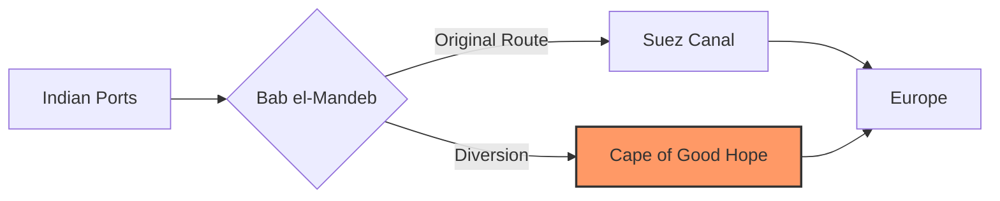

The Bab el-Mandeb strait—the narrow corridor connecting the Indian Ocean to the Red Sea—has evolved from a strategic waterway into a geopolitical flashpoint. As Houthi rebels intensify their campaign of drone and missile attacks on commercial shipping, India’s primary trade artery to Europe is under severe strain. With approximately **20% of India's trade with Europe** flowing through the Suez Canal, this is no longer a distant regional conflict; it is a direct economic blow felt from the ports of Gujarat to the warehouses of Rotterdam. From skyrocketing freight costs to the urgent deployment of warships, New Delhi is now fighting a high-stakes battle to keep its commercial lifelines open.

### 📍 The Strategic Chokepoint: Why Bab el-Mandeb Matters

The [Bab el-Mandeb](https://en.wikipedia.org/wiki/Bab_el-Mandeb), meaning "Gate of Tears" in Arabic, is one of the world's most critical maritime chokepoints, situated between Yemen, Djibouti, and Eritrea. For India, this strait serves as the essential highway to the European Union and North American markets. Any instability here effectively throttles the fastest route to the Suez Canal, forcing vessels to abandon the Red Sea entirely.

The vulnerability is stark: a few miles of water are now dictating the delivery schedules of Indian textiles, chemicals, and agricultural exports. The crisis has demonstrated a frightening asymmetry in modern warfare; the Houthis have utilized relatively low-cost unmanned aerial vehicles (UAVs) and anti-ship missiles to disrupt a massive global flow of goods, transforming a geographic bottleneck into a potent geopolitical weapon.

### 💸 The Economic Toll: Surging Costs and Delays

The financial impact on Indian exporters has been immediate and severe. To mitigate the risk of attack, major shipping conglomerates are bypassing the Red Sea, opting instead for the arduous journey around the Cape of Good Hope at the southern tip of Africa.

> "The rerouting around Africa adds nearly **3,000 to 4,000 nautical miles** to the journey, fundamentally altering the cost structure of India-EU trade and inflating the final price of goods for the consumer."

The ripple effects are evident across three primary metrics:

*   **Freight Rates:** Shipping costs for Indian exports heading to Europe have surged by **100% to 200%** due to reduced vessel availability and increased fuel consumption ([Economic Times](https://www.economictimes.indiatimes.com/news/economy/shipping-costs-surge-as-india-europe-trade-diverts-from-red-sea/articleshow109234567.cms)).
*   **Transit Time:** Shipments are now facing delays of **10 to 15 days**, disrupting "just-in-time" supply chains and causing inventory shortages in European markets ([The Hindu](https://www.thehindu.com/news/national/india-increases-naval-presence-in-red-sea-to-protect-trade/article67812345.ece)).
*   **Insurance and Risk:** Beyond basic freight, companies are grappling with exorbitant **War Risk Surcharges** and steep premiums from maritime insurers ([Business Standard](https://www.business-standard.com/economy/news/red-sea-crisis-india-trade-europe-impact-analysis/article.2105678.html)).

### ⚓ India's Naval Response: Securing the Seas

New Delhi has responded with a decisive shift in its maritime posture. The Indian Navy has significantly augmented its presence in the Red Sea and the Gulf of Aden, deploying **destroyers and frigates** to provide escort services for merchant vessels ([The Hindu](https://www.thehindu.com/news/national/india-increases-naval-presence-in-red-sea-to-protect-trade/article67812345.ece)).

The mission has evolved from passive surveillance to active interception. Reports indicate that the Indian Navy has successfully **neutralized several drone attacks** targeting commercial ships, utilizing advanced electronic warfare and surface-to-air missiles ([Indian Express](https://www.indianexpress.com/article/india/indian-navy-intercepts-houthi-drone-attacks-red-sea-security/9210456.html)). By safeguarding these waters, India is not merely protecting its own cargo but is asserting itself as a "Net Security Provider" in the Indian Ocean Region (IOR), filling a vacuum in maritime stability.

### 🌐 Geopolitical Stakes: The Balancing Act

India is currently performing a complex diplomatic balancing act. While coordinating with the U.S.-led [Operation Prosperity Guardian](https://www.orfonline.org/research/india-red-sea-security-houthi-threats), New Delhi is careful to maintain a degree of strategic autonomy. The goal is to ensure maritime safety without becoming an entanglement in a broader regional war that could further destabilize Middle Eastern partners.

This crisis has accelerated a fundamental rethink of India's trade architecture. It has highlighted the danger of over-reliance on a single maritime corridor and has renewed interest in the [India-Middle East-Europe Economic Corridor (IMEC)](https://www.meids.org), which aims to create a multimodal rail and ship route that bypasses the traditional chokepoints of the Red Sea.

### 🏁 Conclusion

The disruptions caused by Houthi militants in the Bab el-Mandeb are more than a temporary logistics hurdle; they are a systemic challenge to India's economic ambitions. When **shipping costs double** and delivery timelines stretch by weeks, the fragility of global trade is laid bare. 

While the Indian Navy's rapid response provides a necessary tactical shield, the long-term solution requires a strategic pivot. India must diversify its trade routes, invest in alternative corridors, and continue enhancing its blue-water naval capabilities. The Red Sea crisis serves as a stark reminder that in the modern era, the security of the sea lanes is inextricably linked to national economic security.

---

## 📖 Related Reading

- [🕌 From Amritsar to Bihar: How ChatGPT Helped a Lost Pilgrim Find His Way Home](/lost-during-amritsar-pilgrimage-man-reaches-bihar-chatgpt-helps-find-family/)
- [🌊 The Caribbean Silence: Investigating the Transparency Gap in Maritime Interdiction](/us-boat-strike-in-caribbean-kills-four-amid-expanded-anti-drug-campaign/)
- [Why Turkiye is Backing Riyadh Amid the Houthi Escalation](/turkiye-backs-saudi-arabias-security-amid-escalating-houthi-attacks-fm-al-jazeera/)
