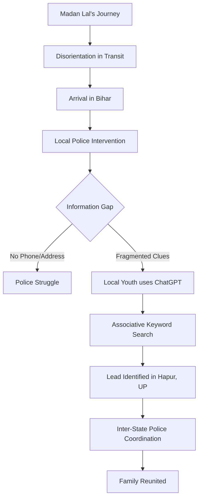

In an era where artificial intelligence is often debated for its potential to replace human jobs or create deepfakes, a heartwarming story from the heart of India reminds us that technology, when wielded with empathy, can be a literal lifesaver. The case of Madan Lal, a **65-year-old** man who found himself stranded thousands of miles from home, serves as a poignant case study in the intersection of digital literacy and humanitarian aid.

  
  
 <a href="https://unsplash.com/@salilkoli">Salil</a> on <a href="https://unsplash.com/photos/golden-temple-at-night-in-amritsar-XdiskAdiZto">Unsplash</a>

What began as a spiritual journey to the [Golden Temple](https://en.wikipedia.org/wiki/Harmandir_Sahib) in Amritsar transformed into a terrifying ordeal of disorientation, leaving a senior citizen lost in a land where he knew no one and spoke a different dialect. The resolution of this crisis didn't come from traditional police databases alone, but from the quick thinking of a local youth and the associative power of **ChatGPT**.

---

### 🧭 The Journey That Went Wrong

Madan Lal set out from his home in Hapur, [Uttar Pradesh](https://en.wikipedia.org/wiki/Uttar_Pradesh), driven by faith and the desire to visit one of the holiest sites in Sikhism. For many elderly pilgrims in India, these journeys are deeply personal and often undertaken with minimal planning, relying on the kindness of strangers and a basic understanding of the rail network.

However, during his return journey, something went catastrophically wrong. Whether due to a sudden onset of cognitive disorientation, a misunderstanding of transit directions, or a combination of both, Madan Lal missed his markers. Instead of heading west toward Hapur, he drifted east. He continued traveling until he arrived in [Bihar](https://en.wikipedia.org/wiki/Bihar), a state located in the eastern part of India.

To put this error in perspective, the distance between Amritsar in Punjab and the heart of Bihar is over **1,000 kilometers**. For a senior citizen traveling alone, this is not merely a "wrong turn"—it is a perilous situation. In the heat and chaos of Indian transit hubs, a disoriented elder without a functioning phone or a written address is incredibly vulnerable to exploitation or health crises.

---

### 🚨 Stranded in a Strange Land

When local residents in Bihar discovered Madan Lal, he was in a state of extreme distress. He was confused, dehydrated, and unable to provide the specific details necessary for a standard police search. While he remembered the name of his town—Hapur—he could not recall a specific street, a landmark, or a phone number for his children or spouse.

The local community acted swiftly, transporting him to the nearest police station. However, the officers faced a systemic hurdle. In a country with a population of over **1.4 billion**, searching for a man who only knows the name of a town in another state is like searching for a needle in a haystack. Hapur is a densely populated area, and without a full name or a contact number, the police had no digital trail to follow.

> "The man was found disoriented and unable to provide precise details about his home, leaving the police with very few leads to work with," reports [India Today](https://www.indiatoday.in/india/story/man-lost-amritsar-pilgrimage-reaches-bihar-chatgpt-helps-find-family-2557752-2024-11-24).

The situation highlighted a recurring issue in [missing persons cases in India](https://ncrb.gov.in/), where the lack of centralized, real-time identification for the elderly often leads to prolonged separations.

---

### 🤖 The AI Intervention: Beyond the Search Bar

This is where the story takes a modern turn. A local youth, witnessing the police's struggle, decided to apply a tool that has become ubiquitous in the modern workspace: **ChatGPT**. 

It is important to clarify a technical nuance: ChatGPT is not a GPS tracker, nor does it have access to private government databases or real-time surveillance. It cannot "find" a person in the physical world. However, Large Language Models (LLMs) excel at **associative thinking** and **data synthesis**. 

The youth began feeding the AI the fragmented clues Madan Lal *could* remember. He used the AI to brainstorm potential landmarks in Hapur that might be associated with the man's descriptions, searched for public social media patterns, and looked for community groups or local "help" forums in the Hapur region that might have posted about a missing elderly relative.

By using the AI to filter through the noise and suggest specific keywords for search engine queries—keywords that a human might not think to combine—the youth was able to uncover a potential lead. As [The Times of India](https://www.timesofindia.indiatimes.com/india/bihar/man-lost-during-amritsar-pilgrimage-reunited-with-family-via-chatgpt/articleshow/115338124.cms) noted, the AI acted as a sophisticated filter, narrowing down the vast possibilities of "Hapur" into a manageable set of leads.

---

### 🤝 The Final Link and the Human Element

Once the AI-assisted search provided a plausible lead, the human infrastructure of law enforcement took over. The Bihar police established contact with the [Hapur police](https://en.wikipedia.org/wiki/Hapur) in Uttar Pradesh. Through traditional verification—cross-referencing the man's physical description and his fragmented memories of his neighborhood—the authorities successfully identified Madan Lal's family.

The reunion was an emotional milestone. Madan Lal was safely transported back to Hapur, where he was greeted by his family, who had been searching for him in a state of panic. 

This outcome underscores a vital truth: AI did not "solve" the case in a vacuum. Instead, it served as a **bridge** between raw, fragmented data and the actionable intelligence required by the police. The success of the operation relied on a three-tier synergy:
1. **The Community:** The locals who rescued him.
2. **The Technology:** The AI that organized the search parameters.
3. **The State:** The police who executed the final verification and transport.

---

### 🌍 The Broader Implications: AI in Humanitarian Aid

Madan Lal's story is more than just a feel-good anecdote; it is a glimpse into the future of [digital humanitarianism](https://www.openai.com/chatgpt). As [artificial intelligence](https://www.openai.com/chatgpt) becomes more integrated into daily life, we are seeing its application move from corporate productivity to critical social intervention.

#### 1. Bridging the Digital Divide
In many parts of rural India, there is a massive gap between the elderly, who may be digitally illiterate, and the youth, who are "digital natives." This story illustrates how the youth can act as "digital intermediaries," using advanced tools to solve real-world problems for those who cannot.

#### 2. Addressing Cognitive Decline
Disorientation in seniors is often linked to conditions like dementia or acute stress. According to the [World Health Organization (WHO)](https://www.who.int/), the global prevalence of dementia is rising. When elderly individuals wander, the first **24 to 48 hours** are critical. The ability of AI to speed up the identification process could significantly increase the survival rates of lost seniors.

#### 3. Enhancing Public Safety
While the [Digital India](https://www.digitalindia.gov.in/) initiative has modernized many government services, the integration of AI into missing persons protocols remains in its infancy. If police departments were trained in "prompt engineering" for investigative purposes, they could potentially resolve thousands of "unidentified" cases by synthesizing fragmented witness testimonies.

---

### 💡 Conclusion: The Synergy of Heart and Hardware

Madan Lal’s journey began as a quest for spiritual peace but nearly ended in a permanent tragedy. His return home is a testament to the power of community and the evolving role of technology. 

We often fear that AI will alienate us or make human intuition obsolete. However, this case proves the opposite: AI can actually **amplify** our innate human desire to help others. It took a human's compassion to notice a lost man, a human's curiosity to try a new tool, and a human's authority to bring him home.

ChatGPT didn't replace the police or the kindness of the Bihar locals; it simply gave them a faster way to find the truth. In the end, technology didn't just process data—it restored a family.

---

### 📚 References

* **India Today:** [Man lost during Amritsar pilgrimage reaches Bihar; ChatGPT helps find family](https://www.indiatoday.in/india/story/man-lost-amritsar-pilgrimage-reaches-bihar-chatgpt-helps-find-family-2557752-2024-11-24)
* **The Times of India:** [Man lost during Amritsar pilgrimage reunited with family via ChatGPT](https://www.timesofindia.indiatimes.com/india/bihar/man-lost-during-amritsar-pilgrimage-reunited-with-family-via-chatgpt/articleshow/115338124.cms)
* **OpenAI:** [ChatGPT Official Site](https://www.openai.com/chatgpt)
* **Government of India:** [Digital India Portal](https://www.digitalindia.gov.in/)
* **World Health Organization:** [Dementia Fact Sheet](https://www.who.int/news-room/fact-sheets/detail/dementia)
* **National Crime Records Bureau (NCRB):** [Missing Persons Statistics](https://ncrb.gov.in/)

---

## 📖 Related Reading

- [🌊 The Caribbean Silence: Investigating the Transparency Gap in Maritime Interdiction](/us-boat-strike-in-caribbean-kills-four-amid-expanded-anti-drug-campaign/)
- [Why Turkiye is Backing Riyadh Amid the Houthi Escalation](/turkiye-backs-saudi-arabias-security-amid-escalating-houthi-attacks-fm-al-jazeera/)
- [AI vs. AI: How an Indian Trio Used Claude to Crack OpenAI](/openai-hacked-meet-indian-origin-trio-who-used-anthropics-claude-to-breach-its-systems/)
