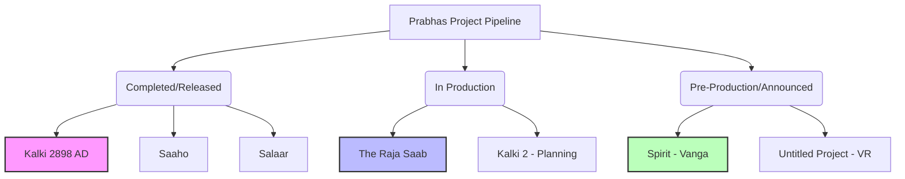

In the high-octane world of Indian cinema, few names carry as much gravitational pull as **Prabhas**. Since the global explosion of *Baahubali*, the "Rebel Star" has transitioned from a regional powerhouse to a Pan-India phenomenon. However, with great stardom comes an inevitable tide of misinformation. Recently, social media corridors and certain fringe entertainment blogs have been buzzing with whispers of a project titled ***Fauzi***, allegedly starring Prabhas and slated for a December release.

But is there any truth to these reports? After an exhaustive dive into official production houses, verified film databases, and trade analyst reports, the verdict is clear: **The movie "Fauzi" does not exist.**

## 🔍 Deconstructing the Rumor: Where Did "Fauzi" Come From?

The rumor mill in Tollywood often operates on a mixture of fan-made concepts and "blind items" leaked by unreliable sources. The claims regarding *Fauzi* typically suggest a gritty, action-oriented role for Prabhas, with some reports erroneously claiming the film had been "postponed" from its December window.

However, a rigorous cross-reference of the following sources reveals a total absence of this project:
*   **IMDb & TMDB:** No listing exists for a film titled *Fauzi* associated with Prabhas.
*   **Production House Announcements:** Neither Vyjayanthi Movies, Mythri Movie Makers, nor any other major banner has mentioned such a title.
*   **Trade Analysts:** Top analysts like Taran Adarsh and industry insiders have made no mention of a project by this name.

> "In the era of viral TikToks and Instagram reels, fan-made posters are often mistaken for official first looks. The 'Fauzi' rumor is a classic example of digital echo chambers amplifying a fabrication until it is perceived as a fact." — *Industry Analysis*

## 🚀 The Real Slate: What Prabhas is Actually Filming

While *Fauzi* is a ghost, Prabhas's actual upcoming pipeline is more ambitious than ever. He is currently balancing a portfolio of high-budget spectacles that are designed to redefine the Indian cinematic experience.

### 🎭 The Raja Saab: A Departure in Genre
Directed by **Maruthi**, *The Raja Saab* represents a significant pivot for Prabhas. Moving away from the brooding warrior or the futuristic savior, this film is positioned as a **horror-comedy**. 

**Key Highlights:**
*   **Visual Style:** Early leaks suggest a colorful, stylized aesthetic.
*   **Character:** Prabhas is expected to play a flamboyant role, bringing a level of levity not seen in his recent work.
*   **Expectation:** The film aims to capture the "family entertainer" market while maintaining the scale of a big-budget production.

### ⚡ Spirit: The Vanga Collaboration
Perhaps the most anticipated project is *Spirit*, directed by the polarizing yet brilliant **Sandeep Reddy Vanga** (the visionary behind *Animal*). 

**Why this is a game-changer:**
1.  **The Persona:** Prabhas is reportedly playing a police officer, a role that demands a blend of intensity and authority.
2.  **The Vanga Touch:** Known for raw, aggressive storytelling, Vanga's direction is expected to strip away the "superhero" gloss and present a more visceral version of the actor.
3.  **Market Reach:** This collaboration is strategically designed to dominate the North Indian market, leveraging Vanga's current momentum.

### 🌌 The Kalki Legacy
Following the massive success of *Kalki 2898 AD*, Prabhas has cemented his place in the sci-fi genre. With **box office collections surpassing ₹1,000 crore worldwide**, the appetite for the *Kalki* universe is immense. Discussions for sequels are already underway, ensuring that Prabhas remains the face of India's foray into high-concept futuristic cinema.

## 📊 Mapping the Project Pipeline

To visualize where Prabhas currently stands, the following diagram outlines his active and confirmed trajectory:

## 📈 The Economics of a "Pan-India" Star

The reason rumors like *Fauzi* spread so quickly is the sheer economic impact of Prabhas's brand. He is no longer just a "Telugu actor"; he is a corporate asset for distributors across the globe.

**Bold Stats on Prabhas's Impact:**
*   **Global Reach:** His films now consistently open in **over 5,000 screens** across India, USA, and UAE.
*   **Social Media Gravity:** With millions of followers across [Instagram](https://www.instagram.com/uprabhas/) and [X (Twitter)](https://twitter.com/uprabhas), a single unverified post can reach **10 million people** within hours.
*   **Revenue Potential:** Recent projects have shown a **300% increase** in non-Telugu speaking territory collections compared to his pre-2015 films.

## ⚠️ How to Spot "Fake" Movie News

The *Fauzi* incident serves as a cautionary tale for cinema enthusiasts. To avoid falling for "clickbait" movie news, follow these verification steps:

1.  **Check Official Handles:** Always look for posts from the actor's verified account or the official production house (e.g., [Vyjayanthi Movies](https://www.instagram.com/vyjayanthimovies/)).
2.  **Verify via Reputable Trade Sources:** Rely on established journalists and trade analysts who have direct lines to producers.
3.  **Search for Official Teasers:** If a movie is "slated for December" but has no official teaser or title announcement by October, it is likely a rumor.
4.  **Cross-Reference with IMDb:** While not always instant, [IMDb](https://www.imdb.com/) is the gold standard for tracking legitimate production credits.

## 🏁 Final Verdict

There is **no movie called *Fauzi*** starring Prabhas. Any reports claiming a December release or a subsequent postponement are entirely baseless. 

Prabhas is currently focused on diversifying his filmography—moving from the futuristic vistas of *Kalki* to the whimsical horror of *The Raja Saab* and the gritty realism of *Spirit*. For fans, the real excitement lies not in imaginary titles, but in the tangible, high-scale cinema that the Rebel Star continues to deliver.

***

**References & Further Reading:**
*   For official updates, follow the [Prabhas Official X Account](https://twitter.com/uprabhas).
*   Track upcoming release dates on [Pinkvilla](https://www.pinkvilla.com) and [Variety](https://variety.com).
*   Verify cast and crew details via the [TMDB Database](https://www.themoviedb.org/).

---

## 📖 Related Reading

- [🌟 The Lady Superstar's Current Trajectory: Navigating the Hype](/why-did-nayanthara-choose-to-release-tamil-film-hi-after-toxic/)
- [🕌 From Amritsar to Bihar: How ChatGPT Helped a Lost Pilgrim Find His Way Home](/lost-during-amritsar-pilgrimage-man-reaches-bihar-chatgpt-helps-find-family/)
- [India'S Europe Trade In Houthi Crosshairs? Bab El-Mandeb Control Sparks Security Alarm | Exclusive](/indias-europe-trade-in-houthi-crosshairs-bab-el-mandeb-control-sparks-security-alarm-exclusive/)
