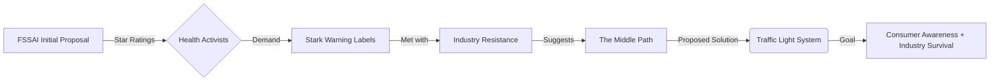

If you’ve ever stared at a snack packet trying to decipher a complex table of percentages and milligrams, you’re not alone. For months, a high-stakes tug-of-war has unfolded in India between the Food Safety and Standards Authority of India (FSSAI) and the nation's largest food corporations. The battlefield? **Front-of-Pack Labelling (FOPL)**. 

  
  
 <a href="https://unsplash.com/@sfkopstein">shraga kopstein</a> on <a href="https://unsplash.com/photos/close-up-photo-of-bread-wn8L0Exu3v8">Unsplash</a>

On one side, public health activists are demanding bold, unmistakable warning labels to combat a surging obesity crisis. On the other, food giants argue that such labels are "alarmist" and could devastate sales of processed goods. This deadlock has left consumers in the dark, navigating a sea of misleading "healthy" claims.

However, a new proposal has emerged from former FSSAI leaders and nutrition experts: a "middle path" known as the **color-coded "Traffic Light" system**. This approach seeks to protect public health without triggering a full-scale economic collapse of the processed food industry.

---

### 🚥 The "Traffic Light" Twist: How It Works

Rather than a binary "healthy" or "unhealthy" designation, the Traffic Light system utilizes a graded approach. Instead of a blunt warning—which the industry often views as a "death sentence" for a product—this system uses **Red, Amber, and Green** indicators for specific nutrients: salt, sugar, and saturated fats.

Based on the policy framework surrounding [Front-of-Pack Labelling](https://www.fssai.gov.in/), the logic is simple:
*   🔴 **Red:** High levels of the nutrient (Avoid/Limit).
*   🟡 **Amber:** Medium levels (Consume in moderation).
*   🟢 **Green:** Low levels (Healthier choice).

Imagine comparing two brands of cornflakes. Instead of scanning a tiny nutrition table on the back, you would see at a glance that one has an "Amber" sugar rating while the other is "Red." This shifts the consumer psychology from "don't eat this" to "here is a slightly healthier alternative," a nuance that experts believe is far more palatable for the Indian market.

---

### 🥊 The Clash: Star Ratings vs. Warning Labels

To understand why the Traffic Light system is being proposed, one must look at why previous negotiations failed. The FSSAI initially floated a **Star Rating system** (1 to 5 stars), similar to energy ratings on electronics. However, health advocacy groups, including the [Centre for Science and Environment (CSE)](https://www.cseindia.org/), rejected this. They argued that star ratings are "too soft" because they often average out nutrients. For example, a product could be dangerously high in sodium but receive a 3-star rating because it is low in fat.

In contrast, activists pushed for "Warning Labels"—similar to the black octagons used in Chile that explicitly state **"High in Saturated Fat."** The food industry, represented by bodies like [FICCI](https://ficci.in/), fought this tooth and nail, claiming these labels ignore the "total nutritional profile" of the food.

> "The industry argues that stark warning labels are too simplistic and create unnecessary panic, potentially leading to a sharp decline in the consumption of processed foods that still provide essential calories."

---

### 📉 The Urgency: India's "Silent Pandemic"

This debate is not merely about graphic design; it is a response to a mounting healthcare catastrophe. India is currently grappling with a "silent pandemic" of Non-Communicable Diseases (NCDs). According to the [World Health Organization (WHO)](https://www.who.int/india), hypertension and type-2 diabetes are skyrocketing, particularly in urban centers where processed food consumption is highest.

The [National Family Health Survey (NFHS-5)](https://rchiips.org/nfhs/) has highlighted a worrying upward trend in overweight and obese adults. With **diabetes prevalence estimated at over 11%** in certain demographics and a significant rise in childhood obesity, the ability to identify "hidden" sugars and salts at a glance is no longer a luxury—it is a medical necessity. Furthermore, the [Indian Council of Medical Research (ICMR)](https://main.icmr.nic.in/) has repeatedly warned that excessive sodium intake is a primary driver of India's high stroke rate.

---

### 🌍 Global Precedents: A Proven Model?

India is not reinventing the wheel here. The Traffic Light model is largely based on systems successfully implemented in the [United Kingdom and the European Union](https://www.gov.uk/government/publications/traffic-light-labelling-for-foods). By adopting a graded system, India can align its food safety standards with international benchmarks while accommodating the specific economic pressures of its domestic market.

The UK's experience shows that while such labels don't always stop people from buying "Red" foods, they significantly increase the likelihood of consumers switching from a "Red" product to an "Amber" or "Green" alternative within the same category.

---

### 🏁 The Bottom Line

The shift from "Star Ratings" to a "Traffic Light" system represents a major strategic compromise. While health purists may find it less aggressive than the Chilean warning labels, it is a monumental leap forward from the current state of confusion. 

In the tug-of-war between corporate profitability and public health, the "middle path" may be the only viable way to break the deadlock. If the FSSAI adopts this system, it will finally empower the Indian consumer to make informed choices, moving us one step closer to curbing the NCD crisis.

***

**References:**
*   Food Safety and Standards Authority of India (FSSAI) - *FOPL Guidelines*
*   Centre for Science and Environment (CSE) - *Nutrition Advocacy Reports*
*   World Health Organization (WHO) - *India NCD Profile*
*   National Family Health Survey (NFHS-5) - *Obesity and Diabetes Data*
*   UK Government - *Food Labelling Standards*

---

## 📖 Related Reading

- [🎙️ The Performance of Power: Decoding the "Expectant Pause"](/was-trump-waiting-for-applause-that-never-came/)
- [🎬 The "Fauzi" Mystery: Fact-Checking the Rumors Around Prabhas](/prabhas-fauzi-postponed-from-december-makers-yet-to-set-new-release-date/)
- [🕌 From Amritsar to Bihar: How ChatGPT Helped a Lost Pilgrim Find His Way Home](/lost-during-amritsar-pilgrimage-man-reaches-bihar-chatgpt-helps-find-family/)
