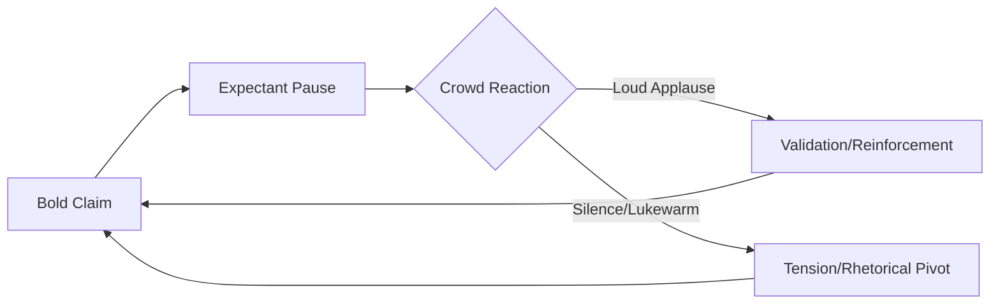

If you analyze Donald Trump’s speaking style with a critical eye, you will notice that the most revealing moments are not the shouting matches, the aggressive insults, or the hyperbolic claims. Instead, the true narrative is written in the silence. Across thousands of hours of rallies and debates, a recurring pattern emerges—a phenomenon we can call the **"Expectant Pause."**

  
  
 <a href="https://unsplash.com/@historyhd">History in HD</a> on <a href="https://unsplash.com/photos/2-men-in-black-suit-sitting-on-red-chair-05QvOWAzN3I">Unsplash</a>

This is the precise moment where Trump stops talking mid-sentence, leans slightly forward, and scans the horizon of the crowd. He is not merely taking a breath; he is creating a rhetorical vacuum. In the physics of populist communication, this vacuum is designed to be filled by the roar of the audience. To his supporters, this is a masterclass in suspense and timing. To his critics, it is a visible craving for external validation. However, when that applause is delayed, lukewarm, or entirely absent, the silence transforms from a strategic tool into a moment of palpable tension.

The "Expectant Pause" serves as a real-time barometer of power. In a high-energy environment, the roar confirms his dominance. In a muted environment, the silence suggests a disconnect. This dynamic reveals a fundamental truth about his communication: it is not a monologue, but a continuous, high-stakes negotiation between the leader and the led.

# 🌀 The Rhetoric of the "Strategic Pause" and Co-Creation

Trump does not deliver speeches in the traditional political sense. He eschews the rigid structure of a teleprompter in favor of a "stream-of-consciousness" delivery that functions more like a high-stakes improv show. This style relies heavily on what linguists call **"co-creation,"** where the speaker and the audience build the narrative together in real-time.

When Trump stops mid-sentence, he is non-verbally asking the crowd, *"Are you with me?"* By leaving a gap, he invites the audience to provide the "proof" of his claim through their volume. According to linguistic analyses of populist rhetoric, this technique transforms a political event from a transmission of information into a shared emotional experience [The Atlantic](https://www.theatlantic.com/politics/archive/2016/06/the-language-of-donald-trump/4bshSsc9XvW9shD7A/). If the crowd cheers instantly, the claim—no matter how factual or unfounded—feels "proven" because the social consensus is audible.

This mirrors the concept of **Charismatic Authority** described by sociologist Max Weber, where the leader's power is derived not from law or tradition, but from the perceived extraordinary qualities of the individual, which must be constantly reaffirmed by the followers [Stanford Encyclopedia of Philosophy](https://plato.stanford.edu/entries/weber/). For Trump, the "Strategic Pause" is the mechanism of that reaffirmation. If the applause is instant, he is the leader; if it lags, he is merely a man speaking into a microphone.

# 🧠 The Validation Loop: Applause as a Metric of Truth

For most politicians, applause is a courtesy—a sign that a point has been well-received. For Trump, applause is a metric of truth. He operates within a **Validation Loop**: a psychological cycle where the claim triggers the reward, and the reward fuels the next, larger claim.

> "The crowd is the mirror in which Trump sees his most idealized self. When the mirror reflects back a roar of approval, the narrative is confirmed. When it reflects silence, the narrative is threatened."

This reliance on external validation is a cornerstone of his psychological architecture. He does not use applause to mark the *end* of a point; he uses it to *confirm* the point's validity. This creates a vulnerability: when the environment changes—such as in a controlled town hall or a televised debate where the audience is muted—the loop is broken. In these settings, the **absence of noise** is interpreted not as politeness, but as a quiet form of disagreement.

To understand this cycle, we can visualize the rhetorical flow:

When the loop is functioning, the energy is self-sustaining. When it fails, the speaker often pivots to a different target or accelerates the pace of the speech to "outrun" the silence, a tactic often observed in his more erratic debate performances [Brookings Institution](https://www.brookings.edu/articles/the-populist-playbook/).

# 📉 When the Silence Hits: The Perception Gap

The discourse surrounding "the applause that never came" usually centers on a mismatch in energy rather than total silence. During the 2024 campaign cycle, digital analysts have highlighted "micro-moments of friction"—clips where Trump asks, *"Right?"* or *"Am I right?"* and there is a distinct, awkward lag before the crowd responds.

In the era of short-form video, these moments are magnified. A **three-second delay** at a rally of **20,000 people** might be imperceptible to those in the back, but in a 10-second TikTok clip, it becomes a symbol of declining influence. This creates a stark perception gap:

*   **The Supporter's View**: He is projecting confidence. He is giving the crowd a moment to absorb the gravity of his words. He is controlling the room by forcing the audience to wait for his lead.
*   **The Critic's View**: He is exhibiting desperation. He is leaning into the silence, searching for a sign of love, and the lag proves that the visceral connection is fraying.

This contrast is most evident during televised debates. Without the echo chamber of a curated rally, the "applause cues" fail. In these controlled environments, the pauses often cease to look like strategy and start to look like hesitation. This highlights the difference between a **populist leader in his element** and a **politician in a sterile environment** [The New Yorker](https://www.newyorker.com/magazine/2016/11/21/the-art-of-the-deal-the-art-of-the-speech).

# 📱 The Digital Echo and the "Low Energy" Irony

There is a profound irony in Trump’s historical use of the phrase **"low energy"** to dismiss opponents like Jeb Bush. By establishing "energy"—defined as crowd noise, physical presence, and visceral enthusiasm—as the primary metric for political viability, he set a standard that he is now required to meet every time he opens his mouth.

In the current media landscape, "missing applause" has been weaponized as a political tool. Opponents utilize "cringe-cuts"—highly edited videos that surgically remove the cheering and isolate the silent pauses. This transforms a massive event into a study of a man waiting for a signal that isn't coming.

However, data on rally attendance suggests that his core base remains remarkably responsive. According to various event tracking metrics, Trump's rallies consistently draw **thousands of high-engagement supporters** who are primed for this call-and-response dynamic [Pew Research](https://www.pewresearch.org/). Much of the "perceived silence" is a product of camera angles or selective editing rather than a genuine collapse of his appeal. Yet, the *fear* of that silence continues to drive his performance, pushing him toward increasingly hyperbolic claims to ensure the roar remains loud [Vanity Fair](https://www.vanityfair.com/politics/2020/10/donald-trump-rally-style-analysis).

# ⚖️ Psychological Underpinnings: The Mirror Effect

To understand why the pause matters so much, we must look at the psychology of validation. For a personality rooted in the need for dominance and admiration, the crowd acts as a social mirror. When the mirror reflects back a thunderous approval, the internal narrative of the "strongman" is reinforced. When the mirror is blank, it creates a cognitive dissonance that must be resolved immediately.

This is often handled through a "rhetorical pivot." If a joke lands flat or a claim is met with silence, he will often quickly shift to an attack on the "fake news" media or the "rigged" nature of the event, effectively blaming the environment for the lack of response [Psychology Today](https://www.psychologytoday.com/). This allows the speaker to maintain the illusion of control even when the validation loop has failed.

# 🏁 Conclusion: The Art of the Ask

Ultimately, whether Donald Trump is "waiting for applause that never came" depends entirely on the lens through which you view power. In the theater of populist politics, silence is never neutral; it is either the tension before a climax or the sound of rejection.

By tying his political identity to the immediate, visceral noise of the crowd, Trump has adopted a high-reward, high-risk communication strategy. He does not simply lead his audience; he requires them to finish his thoughts with their cheers. When they roar, he is the undisputed king of the arena. When they don't, he is just a man standing in a very quiet room, waiting for a mirror to tell him who he is.

***

### 📚 References & Further Reading
*   **Linguistic Analysis:** [The Atlantic - The Language of Donald Trump](https://www.theatlantic.com/politics/archive/2016/06/the-language-of-donald-trump/4bshSsc9XvW9shD7A/)
*   **Sociological Framework:** [Stanford Encyclopedia of Philosophy - Max Weber](https://plato.stanford.edu/entries/weber/)
*   **Populism Strategies:** [Brookings Institution - The Populist Playbook](https://www.brookings.edu/articles/the-populist-playbook/)
*   **Performance Art:** [The New Yorker - The Art of the Speech](https://www.newyorker.com/magazine/2016/11/21/the-art-of-the-deal-the-art-of-the-speech)
*   **Audience Metrics:** [Pew Research Center - Political Polarization](https://www.pewresearch.org/)
*   **Rally Dynamics:** [Vanity Fair - Rally Style Analysis](https://www.vanityfair.com/politics/2020/10/donald-trump-rally-style-analysis)
*   **Behavioral Psychology:** [Psychology Today - The Need for Validation](https://www.psychologytoday.com/)

---

## 📖 Related Reading

- [🎬 The "Fauzi" Mystery: Fact-Checking the Rumors Around Prabhas](/prabhas-fauzi-postponed-from-december-makers-yet-to-set-new-release-date/)
- [🕌 From Amritsar to Bihar: How ChatGPT Helped a Lost Pilgrim Find His Way Home](/lost-during-amritsar-pilgrimage-man-reaches-bihar-chatgpt-helps-find-family/)
- [India'S Europe Trade In Houthi Crosshairs? Bab El-Mandeb Control Sparks Security Alarm | Exclusive](/indias-europe-trade-in-houthi-crosshairs-bab-el-mandeb-control-sparks-security-alarm-exclusive/)
