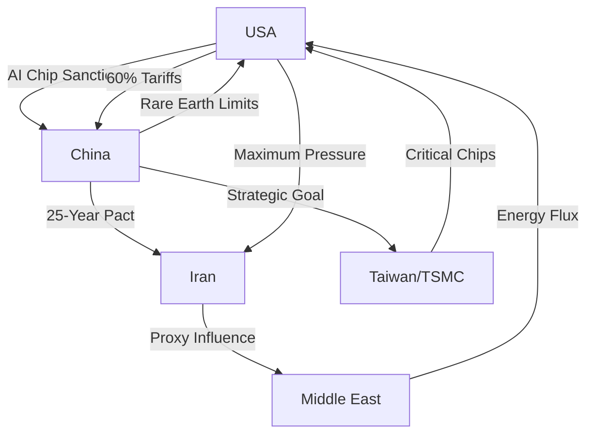

If you look closely at the escalating tension between the United States and China, it becomes evident that this is far more than a disagreement between two powerful leaders or a simple dispute over trade imbalances. We are witnessing a systemic struggle over who will architect the rules of the 21st century. Whether the catalyst is a formal summit between Donald Trump and Xi Jinping or a series of calculated diplomatic frictions, the stakes encompass the very foundations of global power: from the nanometers of high-tech chips in Taiwan to the oil fields of the Persian Gulf and the strategic shipping lanes of the South China Sea. 

  
  
 <a href="https://unsplash.com/@historyhd">History in HD</a> on <a href="https://unsplash.com/photos/2-men-in-black-suit-sitting-on-red-chair-05QvOWAzN3I">Unsplash</a>

This is no longer a quest to fix trade deficits; it is a battle for systemic survival. The competition is defined by a "tripolar" tension where technological supremacy, energy security, and regional hegemony intersect. To understand the future of the global order, one must analyze the interplay between the AI arms race, the shifting alliances in the Middle East, and the weaponization of global trade.

---

### 🤖 The AI Arms Race: The Fight for Compute Supremacy

When Trump and Xi negotiate, the most critical item on the agenda is **Artificial General Intelligence (AGI)**. The U.S. has pivoted from general competition to a targeted "small yard, high fence" strategy. This doctrine aims to protect a narrow set of critical technologies—the "small yard"—by erecting impenetrable regulatory and economic barriers—the "high fence."

Central to this strategy is the [U.S. Department of Commerce's](https://www.bis.doc.gov/) aggressive restriction on high-end GPUs. By limiting the export of Nvidia's H100 and A100 chips, the U.S. is attempting to create a "compute divide," ensuring that China lacks the hardware necessary to train the world's most advanced large language models (LLMs). This is not merely about commercial advantage; it is about military primacy. AI-driven autonomous weapons, cyber-warfare capabilities, and intelligence gathering are all dependent on the amount of "compute" a nation can mobilize.

Trump’s approach to AI is a paradox of deregulation and restriction. While he advocates for slashing domestic regulations to allow American AI firms to iterate faster, he simultaneously pushes for "starving" China of the hardware essential for progress. Conversely, Xi Jinping has integrated AI into the very fabric of the state through the [New Generation Artificial Intelligence Development Plan](https://www.gov.cn/), which explicitly targets global AI leadership by 2030.

However, the true choke point is not the chips themselves, but the machines that print them. The U.S. has exerted immense diplomatic pressure on the Netherlands to prevent [ASML from selling extreme ultraviolet (EUV) lithography machines](https://www.asml.com) to Chinese firms. Because EUV lithography is the **only** viable method for producing chips below 7 nanometers, China is effectively locked out of the cutting edge. Without these machines, China must rely on older "mature node" technology or gamble on high-risk, unproven alternatives. In any high-level summit, Trump would likely push for a total blockade of "compute" tech, while Xi would counter by leveraging China's dominance over critical minerals—such as gallium and germanium—which are essential for semiconductor production.

---

### 🇮🇷 The Iran Pivot: Maximum Pressure vs. The 25-Year Pact

The second pillar of this geopolitical struggle is the strategic alignment between Beijing and Tehran. Trump’s first-term legacy was defined by "Maximum Pressure"—the unilateral withdrawal from the Joint Comprehensive Plan of Action (JCPOA) and the imposition of crushing sanctions to bankrupt the Iranian regime. The goal was simple: force Iran to abandon its nuclear ambitions and cease funding proxies like Hezbollah and the Houthis.

However, this vacuum of leadership provided a golden opportunity for China. Beijing has stepped in to stabilize Tehran, signing a [landmark 25-year strategic partnership](https://www.reuters.com/world/china/iran-sign-25-year-strategic-partnership-agreement-2021-08-25/) that fundamentally alters the efficacy of U.S. sanctions. This agreement facilitates a steady flow of discounted Iranian oil into China, providing Tehran with an economic lifeline and Beijing with energy security.

> "The strategic alignment between Beijing and Tehran transforms Iran from a regional pariah into a key node in China's Belt and Road Initiative, creating a sanctuary for Iranian oil exports that bypasses the U.S. dollar."

This partnership is a direct challenge to the "petrodollar" system. By trading oil in non-dollar currencies (the "petroyuan"), China and Iran are attempting to build an economic fortress that is immune to U.S. Treasury sanctions. 

In a diplomatic clash, Iran becomes a primary sticking point. Trump would likely demand that China cease its oil imports from Iran as a condition for trade concessions. Xi, however, views Iran as a vital partner in the "Global South" and a strategic counterweight to U.S. naval presence in the Persian Gulf. The risk is a "feedback loop" where increased U.S. pressure on Iran only accelerates Tehran's integration into the Chinese economic sphere, further eroding American influence in the Middle East.

---

### 📈 Trade & Tariffs 2.0: The War Over Global Overcapacity

Trade remains the most visible weapon in this conflict. While the "Phase One" deal attempted to resolve tensions through bulk purchases of American agricultural goods, the systemic issues remained untouched. Trump is now proposing a more aggressive "Trade War 2.0," featuring a **universal baseline tariff** on all imports and potentially hitting Chinese goods with tariffs of **60% or higher**.

The modern conflict centers on "overcapacity." According to reports from the [International Monetary Fund (IMF)](https://www.imf.org/), China's state-led investment model has created an excess of production in sectors like Electric Vehicles (EVs), lithium-ion batteries, and solar panels. The U.S. and EU argue that China is using massive government subsidies to flood global markets with artificially cheap goods, effectively "exporting" its economic slowdown and crushing Western industries.

To counter this, the [Office of the U.S. Trade Representative (USTR)](https://ustr.gov/) has already implemented [100% tariffs on Chinese EVs](https://ustr.gov/about-us/policy-offices/press-office/press-releases/2024/may/ustr-finalizes-determination-section-301-china-trade), signaling a move toward complete industrial decoupling.

Xi’s response is the "Dual Circulation" strategy. This plan aims to:
1. **Internal Circulation:** Strengthen domestic consumption and technological self-reliance to reduce dependence on foreign markets.
2. **External Circulation:** Make the rest of the world more dependent on Chinese manufacturing and infrastructure.

We are seeing a clash of fundamental economic philosophies: Trump’s "America First" protectionism versus Xi’s vision of a China-centric global supply chain. Trump wants to "untangle" the two economies to reduce vulnerability; Xi wants to ensure the global economy cannot function without Chinese inputs.

---

### 🏝️ The Taiwan Variable: The Silicon Shield

The "elephant in the room" for any US-China discussion is Taiwan. Taiwan is not just a political flashpoint; it is the world's most critical economic node. [TSMC (Taiwan Semiconductor Manufacturing Company)](https://www.tsmc.com) produces approximately **90% of the world's most advanced semiconductors**.

If China were to achieve unification with Taiwan—by force or coercion—they would instantaneously acquire the hardware that the U.S. is spending billions to restrict. This creates the "Silicon Shield" theory: the idea that Taiwan is too valuable to the global economy for China to risk destroying its infrastructure during an invasion. However, as AI becomes central to military superiority, the temptation for China to secure this "chip factory" increases.

The U.S. finds itself in a strategic bind. According to analysis by the [Council on Foreign Relations (CFR)](https://www.cfr.org/), the U.S. is attempting to "de-risk" from China while remaining entirely dependent on Taiwanese silicon. Trump has historically viewed Taiwan through a transactional lens, suggesting the island should "pay for protection." Xi, meanwhile, views Taiwan as the final piece of the "China Dream" and a non-negotiable requirement for national rejuvenation.

In a potential summit, the stakes would be binary. Trump might offer tariff relief in exchange for a "no-invasion" pledge. But for Xi, the long-term goal of national unity may outweigh the short-term benefit of lower tariffs.

---

### 🧠 The Psychology of Power: Transactionalism vs. Strategic Patience

To predict the outcome of this struggle, one must understand the psychological divergence between the two leaders. 

**Donald Trump is a Transactional Leader.** He operates on the logic of the "deal." He seeks tangible, immediate wins—a reduction in the trade deficit, a specific policy shift, or a public victory. This makes him unpredictable and volatile, but it also means he is open to "grand bargains" that traditional diplomats would find unthinkable.

**Xi Jinping is a Strategic Leader.** He operates on a timeline of decades, not election cycles. His goal is the restoration of China as the central power of the East. For Xi, a "deal" is not a destination but a tool—a way to buy time, reduce pressure, and gather resources for the next phase of the long game.

This is the fundamental danger: Trump may walk away from a summit believing he has "won" a trade victory, while Xi views that same victory as a tactical retreat to allow China's AI and military capabilities to mature. One is playing a high-stakes game of poker; the other is playing a game of Go.

---

### 🏁 Conclusion: The Great Bifurcation

The era of hyper-globalization is over. Whether through a diplomatic breakthrough or a series of economic shocks, the world is splitting into two distinct spheres of influence. The "Geopolitical Triangle" of AI, Iran, and Trade reveals that this is not a conflict that can be solved with a single signature on a piece of paper.

The outcome will be determined by who can maintain their technological edge and who can build the most resilient alliances. If the U.S. can maintain the "high fence" around AI while diversifying its supply chains, it may sustain its hegemony. If China can successfully navigate its "Dual Circulation" and integrate the Global South through the Belt and Road Initiative, the center of gravity will shift eastward. One thing is certain: the next decade will be defined by a competition where the prize is nothing less than the digital and political architecture of the future.

#### 📚 References & Further Reading
* [White House National Security Strategy](https://www.whitehouse.gov/) - On the nature of systemic competition.
* [Center for Strategic and International Studies (CSIS)](https://www.csis.org/) - Analysis of semiconductor supply chains.
* [U.S. Department of Commerce (BIS)](https://www.bis.doc.gov/) - Export control regulations.
* [International Monetary Fund (IMF)](https://www.imf.org/) - Global trade and overcapacity reports.
* [TSMC Investor Relations](https://www.tsmc.com) - Production data on advanced nodes.

---

## 📖 Related Reading

- [🎙️ The Performance of Power: Decoding the "Expectant Pause"](/was-trump-waiting-for-applause-that-never-came/)
- [🚦 The Middle Path: Could "Traffic Light" Labels Fix India’s Junk Food Labeling War?](/fresh-twist-in-junk-food-warning-label-case-ex-fssai-chief-jumps-in-with-new-suggestions/)
- [Aastha Kunj Remains Shrouded In Darkness After The R*Pe Of A Minor](/aastha-kunj-remains-shrouded-in-darkness-after-the-rpe-of-a-minor/)
