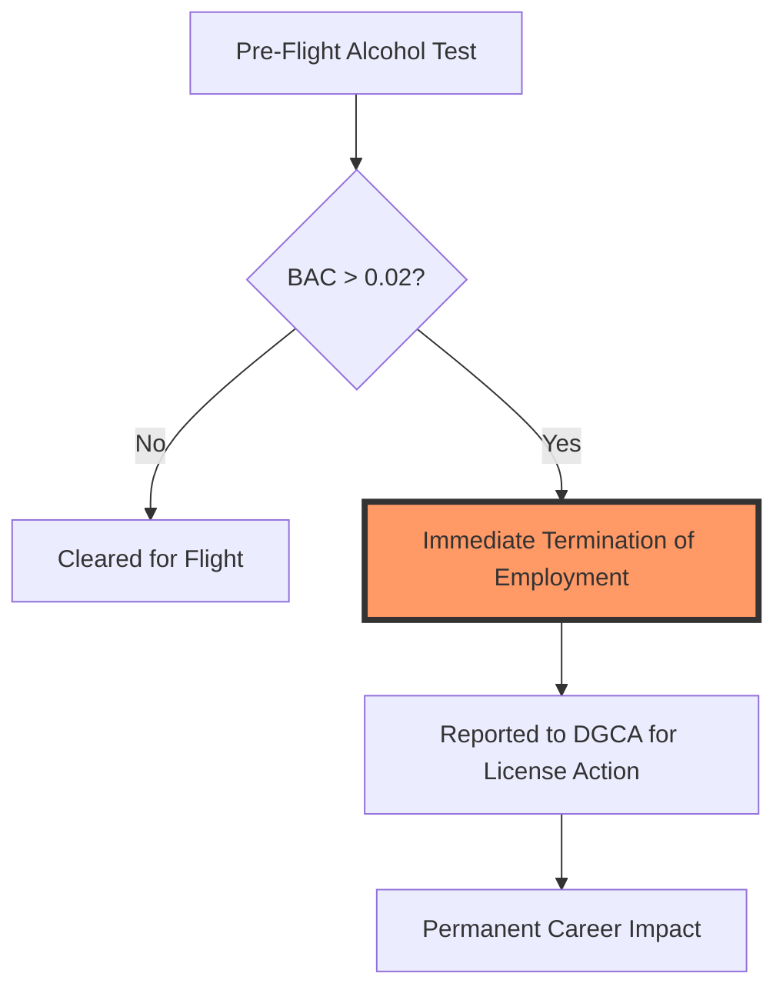

In the high-stakes environment of commercial aviation, there is zero margin for error. When an aircraft is cruising at 35,000 feet with hundreds of lives on board, the mental acuity of the cockpit crew is the only thing standing between a routine flight and a catastrophic disaster. Air India, the national carrier of India, has recognized a growing vulnerability in its safety protocol and is responding with a hammer.

  
  
 <a href="https://unsplash.com/@kamilpphotos">Kamil Pietrzak</a> on <a href="https://unsplash.com/photos/a-few-people-skydiving-Glj_cKt9u1I">Unsplash</a>

The airline has announced a sweeping "zero-tolerance" policy regarding substance abuse. Moving away from the traditional rehabilitative or suspension-based approach, Air India has shifted to a binary system: **compliance or termination**. Under the new mandate, any pilot found with alcohol in their system during a pre-flight check will be fired immediately on their first offense.

This pivot is not merely a bureaucratic adjustment; it is a response to a disturbing trend of failed breathalyzer tests and a harrowing incident involving a pilot testing positive for marijuana following a sudden loss of altitude. While the national regulator—the [Directorate General of Civil Aviation (DGCA)](https://www.dgca.gov.in)—typically mandates a graduated series of penalties, Air India is asserting that the risks of impairment are too great to permit a second chance.

---

### 🚫 The New Zero-Tolerance Rule: No More Second Chances

For years, the industry standard for handling first-time intoxication offenses was relatively lenient. Pilots who failed their initial breathalyzer tests were typically handed a three-month suspension, allowing them time to seek counseling or adjust their lifestyle before returning to the cockpit.

Air India has officially scrapped this grace period. The new policy is stark: if a pilot's blood alcohol content (BAC) is measured at **0.02 grams per 210 litres of breath** or higher, their employment is terminated immediately. This internal policy significantly exceeds the strictness of the national regulatory framework.

To understand the gravity of this shift, one must compare it to the standard [DGCA guidelines](https://aviationa2z.com/index.php/2025/05/31/air-india-to-fire-pilots-for-failing-alcohol-test), which operate on a tiered penalty system:
1. **First Offense:** A three-month suspension of the pilot's license.
2. **Second Offense:** A three-year suspension.
3. **Third Offense:** Permanent cancellation of the pilot's license.

By implementing immediate termination, Air India is effectively bypassing the "learning curve" of the regulator. The airline's stance is clear: if a pilot is impaired while on duty, they have fundamentally breached the trust required to operate a commercial aircraft.

---

### 📉 By the Numbers: A Growing Crisis in the Cockpit

The move toward zero tolerance is driven by alarming data. The prevalence of intoxicants among flight crews has transitioned from isolated incidents to a systemic trend that requires urgent intervention.

According to reports from [Aviation A2Z](https://aviationa2z.com/index.php/2025/05/31/air-india-to-fire-pilots-for-failing-alcohol-test), the data for the first half of 2024 alone reveals that **33 pilots failed alcohol tests**. While this number may seem small relative to the total pilot population, the implications are terrifying when considering the potential for "near-misses" that were never reported.

A deeper dive into Right to Information (RTI) filings reveals an even more sinister trajectory. Between 2020 and 2024, a staggering **724 airline crew members**—including pilots and cabin crew—tested positive for prohibited substances. The growth rate is particularly concerning: the number of pilots caught under the influence **doubled from 26 in 2020 to 54 in 2024**.

**Key Statistics at a Glance:**
* **724:** Total crew members testing positive (2020–2024).
* **107% Increase:** Growth in pilot intoxication cases from 2020 to 2024.
* **0.02 BAC:** The threshold for immediate firing at Air India.
* **33:** Pilots failed tests in just the first six months of 2024.

These numbers suggest that the previous regime of three-month suspensions failed as a deterrent. The "slap on the wrist" approach did not curb the behavior; instead, it may have signaled that substance abuse was a manageable risk.

---

### ⚠️ Beyond Alcohol: The Marijuana Incident and the "Detection Gap"

While breathalyzers are a routine part of pre-flight checklists, they only detect alcohol. The most alarming recent event at Air India highlighted a critical "detection gap" regarding narcotics.

During a flight from Phuket to Delhi, an Airbus A320neo experienced a sudden, violent altitude drop of approximately **300 feet**. The turbulence was severe enough to cause injuries to **17 passengers and crew members** ([Kalchakra News](https://kalchakranews.in/air-india-pilots-dope-test-failure-who-is-responsible-when-the-rule-book-is-broken)). In the aftermath of the incident, a mandatory drug screen revealed that the captain had tested positive for marijuana.

This incident exposed a dangerous flaw in aviation screening: drug testing is often reactive rather than proactive. While alcohol is checked every single flight, drug tests are frequently reserved for "post-incident" investigations or random quarterly screenings.

> "Aviation operates on precision... The same precision must apply to enforcement. When the rule book is broken in the cockpit, the result isn't a typo—it's a tragedy." — [Kalchakra News](https://kalchakranews.in/air-india-pilots-dope-test-failure-who-is-responsible-when-the-rule-book-is-broken)

The Phuket-Delhi incident proves that sobriety is not just about the absence of alcohol; it is about total cognitive clarity. Marijuana, while often perceived as a "soft" drug, impairs spatial awareness and reaction time—two critical faculties needed to recover an aircraft from an unexpected drop in altitude.

---

### 🌍 A Global Struggle: Impairment in the Skies

Air India is not fighting this battle in isolation. Aviation regulators worldwide are grappling with the mental health and substance abuse challenges facing pilots, who often deal with erratic schedules, chronic fatigue, and extreme isolation.

Similar crackdowns and high-profile failures have occurred across the globe:
* **United Kingdom:** In 2024, pilot Lawrence Russell was sentenced to jail after being found over the legal alcohol limit while preparing for a long-haul flight from Edinburgh to New York.
* **United States:** In a notable 2019 incident, two [United Airlines](https://www.united.com) pilots were arrested in Glasgow, Scotland, after reporting for duty while significantly over the legal limit.
* **Malaysia:** The Malaysia Aviation Group recently tightened its internal screening protocols following an incident where a pilot was apprehended in Indonesia for smuggling narcotics, including cocaine and methamphetamine.

These cases illustrate that the problem transcends borders and airline cultures. Whether it is the pressure of maintaining a perfect safety record or the stress of the "lifestyle" associated with long-haul flying, the temptation to use substances as a coping mechanism is a global industry risk.

---

### 🧠 The Human Element: Burnout vs. Discipline

While the "fire-on-first-offense" policy is necessary for safety, aviation experts argue that it addresses the *symptom* rather than the *cause*. Pilot burnout is a recognized phenomenon in the [IATA (International Air Transport Association)](https://www.iata.org) community. Long hours, jet lag, and the immense responsibility of passenger safety can lead to depression and substance dependency.

However, there is a fundamental difference between a pilot seeking help for a mental health struggle and a pilot reporting for duty while intoxicated. The former requires a supportive medical framework; the latter requires immediate removal. By drawing a hard line at the cockpit door, Air India is signaling that while they may support a pilot's recovery *off-duty*, they will not tolerate impairment *on-duty*.

---

### 🏁 The Bottom Line: Safety is Non-Negotiable

Air India’s decision to implement immediate termination may be viewed as harsh by labor advocates, but in the context of aviation, "harsh" is a secondary concern to "safe." The mathematical reality is simple: the cost of firing a qualified pilot is negligible compared to the cost of a single hull-loss accident caused by impairment.

When passengers board a flight, there is an implicit contract of trust. They trust the engineers, the air traffic controllers, and most of all, the pilots. By adopting a zero-tolerance policy, Air India is attempting to rebuild that trust and ensure that every person in the cockpit is 100% alert, 100% sober, and 100% committed to the safety of those on board.

For the traveling public, the message is clear: the era of the "three-month suspension" is over. In the modern sky, one strike is all it takes to be grounded forever.

---

## 📖 Related Reading

- [🛡️ Safety First: Why the Govt is Pushing Air India and DGCA on ‘Dope Checks’](/govt-asks-air-india-to-take-responsibility-tells-dgca-to-improve-dope-checks/)
- [What Actually Happened During the IndiGo Emergency Landing in Chennai?](/indigo-flight-makes-emergency-landing-after-engine-failure-full-emergency-declared-at-chennai-airport-the-times-of-india/)
- [🏁 The Geopolitical Triangle: AI, Iran, and the Trump-Xi Trade War](/trump-xi-discuss-ai-iran-war-and-trade-at-white-house-summit/)
