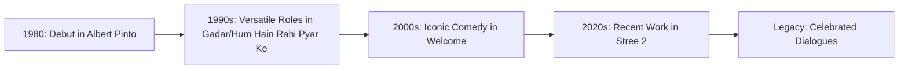

**“Celebrate His Work”: Mushtaq Khan’s son asks fans to remember the laughs after his passing**

  
  
 <a href="https://unsplash.com/@hk2214_">Hamza King</a> on <a href="https://unsplash.com/photos/a-man-standing-in-a-courtyard-in-front-of-a-building-6zNT4ToXNOQ">Unsplash</a>

The Hindi film industry has lost one of its most dependable and humorous faces. Mushtaq Khan, a veteran character actor known for his impeccable comic timing and versatility, was laid to rest in Mumbai on Friday, September 25, **2026**. His passing marks the end of a prolific journey that spanned over three decades, leaving behind a legacy of laughter and a void in the hearts of countless fans and colleagues.

Khan had been fighting a sudden and aggressive battle with cancer at Nanavati Hospital. He breathed his last on Thursday, leaving the industry in a state of shock. His son, Mohsin Khan, has urged fans and the film fraternity to look past the immediate grief and instead celebrate his father’s life by remembering the iconic dialogues and the sheer joy he brought to the silver screen.

---

### 🕊️ A Final Goodbye Among Friends

The funeral services were a testament to the respect Mushtaq Khan commanded within the industry. The gathering saw a convergence of Bollywood's most prominent comedic talents and directors, underscoring the deep bonds he formed throughout his career. Notable attendees included [Rajpal Yadav, Sanjay Mishra, and Sunil Pal](https://www.aninews.in/news/entertainment/bollywood/mushtaq-khan-laid-to-rest-rajpal-yadav-sanjay-mishra-anees-bazmee-pay-tribute-son-recalls-final-moments20260925184256), along with acclaimed filmmaker Anees Bazmee.

The atmosphere was a poignant blend of sorrow and gratitude. For many, Khan was more than just a co-star; he was a mentor and a dear friend. In a touching revelation, Rajpal Yadav shared that he had visited Khan at the hospital just a day before his passing, highlighting the enduring friendships that exist behind the scenes of the glamour. The burial in Mumbai served as a final salute to a man who spent his entire adult life ensuring the audience walked out of the theater with a smile.

---

### 🏥 The Sudden Turn: A Battle Against Time

The shock surrounding Mushtaq Khan's death stems largely from the speed with which his health deteriorated. While the family had hoped for a recovery, the nature of the illness proved relentlessly aggressive.

According to Mohsin Khan, the cancer was initially diagnosed at **stage one**, which usually offers a high probability of successful treatment. However, the disease mutated or progressed with an intensity that baffled the medical team.

> “It was initially at stage one, but as it became aggressive, it advanced through the stages so fast that even we couldn't realise it in time. And by the time it was detected, he was no longer with us in this world. But his end came with a smile on his face,” Mohsin told [ANI](https://www.aninews.in/news/entertainment/bollywood/mushtaq-khan-laid-to-rest-rajpal-yadav-sanjay-mishra-anees-bazmee-pay-tribute-son-recalls-final-moments20260925184256).

Despite the best efforts of the specialists at Nanavati Hospital, Khan's condition declined rapidly, and he passed away on Thursday at approximately **7 PM**.

---

### 🎬 Three Decades of Cinematic Excellence

Mushtaq Khan's journey in cinema began in **1980** with the film [Albert Pinto Ko Gussa Kyon Aata Hai](https://www.imdb.com/title/tt0080252/), a movie that set the stage for his ability to blend into diverse roles. For over **30 years**, he remained a constant fixture in the Bollywood ecosystem, mastering the art of the "supporting role"—the glue that holds a movie's narrative together.

His filmography is a roadmap of Hindi cinema's evolution. He appeared in massive hits such as the epic [Gadar: Ek Prem Katha](https://www.imdb.com/title/tt0320131/), the romantic comedy [Hum Hain Rahi Pyar Ke](https://www.imdb.com/title/tt0112523/), and the timeless [Aashiqui](https://www.imdb.com/title/tt0101340/). Even in the modern era, he continued to find work in blockbuster hits like [Stree 2](https://www.imdb.com/title/tt29481156/), proving that his talent was timeless.

[The News Mill](https://thenewsmill.com/2026/09/mushtaq-khan-laid-to-rest-in-mumbai-with-tributes-from-film-fraternity) noted that directors frequently sought him out because of his unique ability to make a scene feel authentic, regardless of the screen time he was allotted.

---

### 🎤 The Cult Legacy of "Welcome"

While his filmography is vast, Mushtaq Khan achieved a different level of immortality through the cult classic [Welcome](https://www.imdb.com/title/tt1113004/). His portrayal of the character Ballu provided some of the most enduring comedic moments in the history of the genre.

The brilliance of Khan's performance lay in his delivery. His iconic line—**“Meri ek taang nakli hai, main hockey ka bahut bada player hoon”**—has transcended the film itself to become a staple of internet meme culture. He possessed the rare gift of delivering absurd, ridiculous dialogue with a straight face and absolute confidence, a trait that Mohsin Khan believes is the true essence of his father's comedic genius.

---

### 🌟 A Final Curtain Call: Upcoming Projects

One of the few comforts for the grieving family and fans is that Mushtaq Khan's work will continue to grace screens for some time. Even during his final days, he remained passionate about his craft and committed to his pending projects.

Mohsin revealed that several pieces of work are currently awaiting release:
* A significant film marking the **launch of Shera sir's son**.
* Multiple upcoming Hindi feature films.
* A variety of television series and digital web series.

The family views these upcoming releases as a way to keep his spirit alive. Mohsin also expressed deep gratitude toward industry stalwarts like Anupam Kher and Rajpal Yadav, who provided unwavering emotional support during this crisis, as reported by [ANI](https://www.aninews.in/news/entertainment/bollywood/mushtaq-khan-laid-to-rest-rajpal-yadav-sanjay-mishra-anees-bazmee-pay-tribute-son-recalls-final-moments20260925184256).

---

### Conclusion: The End of an Era

The passing of Mushtaq Khan is more than the loss of a single actor; it is the fading of a particular brand of character acting that defined the gold era of Bollywood comedy. He belonged to a generation of performers who didn't seek the limelight but made the spotlight shine brighter for everyone else.

While the loss is immense, the family's wish to **celebrate rather than just mourn** is a fitting tribute. By revisiting his films and quoting his legendary lines, fans can ensure that the laughter he sparked continues to echo. Mushtaq Khan may have left the stage, but the smile he left on millions of faces remains his greatest masterpiece.

---

## 📖 Related Reading

- [One Strike and You're Out: Air India’s Massive Crackdown on Pilot Intoxication ✈️](/drunkards-flying-air-india-planes-one-more-pilot-fails-alcohol-test-suspended/)
- [🏁 The Geopolitical Triangle: AI, Iran, and the Trump-Xi Trade War](/trump-xi-discuss-ai-iran-war-and-trade-at-white-house-summit/)
- [🎙️ The Performance of Power: Decoding the "Expectant Pause"](/was-trump-waiting-for-applause-that-never-came/)
