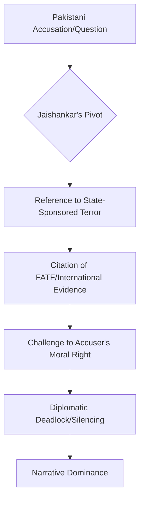

The [United Nations General Assembly (UNGA)](https://www.un.org/en/ga/) is traditionally a theater of choreographed diplomacy, a space where "deep concern" and "constructive dialogue" serve as the primary linguistic currency. However, in recent years, this stage has been repurposed for some of the most blunt and searing exchanges in modern geopolitics. At the center of this shift is India's External Affairs Minister, S. Jaishankar. 

Whenever a Pakistani representative or a global journalist attempts to pivot the conversation toward Kashmir or internal human rights, Jaishankar does not merely respond—he dismantles. This is not accidental rhetoric; it is a calculated departure from decades of cautious Indian diplomacy. The recurring thematic clash boils down to one fundamental, provocative question: **Does Pakistan have the moral or diplomatic "right" to lecture India while simultaneously sheltering terror infrastructure?**

---

### 🛡️ The "Moral Right" vs. State-Sponsored Terror

The core of the tension between India and Pakistan at the UN is a clash of competing narratives. For decades, Pakistan’s diplomatic playbook has been consistent: internationalize the Kashmir issue, frame it as a human rights crisis, and appeal to the UN's mandate on self-determination. 

Jaishankar’s strategy has been to fundamentally shift the "burden of proof." Rather than spending diplomatic capital defending India's internal administration—which he views as an internal matter—he attacks the credibility of the accuser. By invoking the principle of *clean hands*, he argues that a state employing terrorism as an instrument of foreign policy forfeits its standing to speak on international law.

> "Terrorism and talks cannot go together." This mantra, once a standard policy statement, has evolved under Jaishankar into a sharp rhetorical weapon used to silence adversarial questioning. It transforms the debate from a territorial dispute into a question of global security and state legitimacy.

This approach is rooted in the concept of [credible standing](https://www.mea.gov.in/), where the legitimacy of a diplomatic claim is tied to the behavior of the claimant. By highlighting the presence of designated terror outfits on Pakistani soil, Jaishankar argues that Pakistan's "right" to criticize is nullified by its own systemic failures.

---

### ⚡ The Art of "Strategic Bluntness"

Social media has branded Jaishankar’s style as "savage," but from a geopolitical lens, it is a precise exercise in **Strategic Bluntness**. Unlike previous eras of Indian diplomacy, characterized by bureaucratic caution and a desire to avoid "rocking the boat," Jaishankar blends academic precision with a cutting edge.

His responses typically follow a rigorous logical architecture:

1.  **The Pivot:** He acknowledges the question but immediately redirects it to the root cause—cross-border terrorism.
2.  **The Evidence:** He cites specific, verifiable instances of infiltration or the [Financial Action Task Force (FATF)](https://www.fatf-gafi.org/) grey-listing.
3.  **The Paradox:** He leaves the questioner with a logical contradiction—how can a state claiming to be a victim of instability also be the primary architect of that instability?

This shift mirrors a profound change in India's self-perception. India no longer views itself as a developing nation seeking validation from the West, but as a [leading power](https://www.thehindu.com/) capable of setting its own terms of engagement.

---

### 📉 Shifting the Narrative: From Territory to Terror

For nearly seventy years, Pakistan successfully framed the India-Pakistan conflict as a territorial dispute over Kashmir. However, under Jaishankar's tenure, the narrative has undergone a seismic shift. The conversation has moved from "border disputes" to "global security threats."

By framing Pakistan's actions not just as a bilateral problem, but as a threat to the stability of the [Global South](https://www.aljazeera.com/) and the wider world, Jaishankar aligns India's interests with those of the US, the EU, and other major powers. He posits that **terrorism is an absolute**, and there is no such thing as "good" or "bad" terror.

This shift is reinforced by international monitoring. The FATF's rigorous standards on combating money laundering and terror financing provided India with a factual baseline to argue that Pakistan's diplomatic maneuvers were mere smoke screens for financial negligence. By linking diplomatic rhetoric to **27+ FATF recommendations**, India effectively neutralized the traditional Pakistani playbook at the UN.

---

### 🌐 Geopolitical Weight: Power Dynamics and Asymmetry

The effectiveness of Jaishankar's responses is not merely a result of his wit; it is a reflection of the current power dynamics. Diplomacy is, at its core, a manifestation of national power. In the current global landscape, the asymmetry between India and Pakistan is stark.

**The stats driving this dynamic are undeniable:**
*   **Economic Scale:** India's GDP has surged to approximately **$3.7 trillion**, positioning it as one of the **top 5 global economies**.
*   **Financial Stability:** While India attracts record Foreign Direct Investment, Pakistan has frequently relied on [IMF bailouts](https://www.imf.org/) to avoid sovereign default.
*   **Institutional Influence:** India's role in the **G20 Presidency** and its membership in the [Quad](https://www.whitehouse.gov/quad/) have given it a seat at the high table of global governance.

When Jaishankar asks if Pakistan has the "right" to make certain claims, the international community hears it through the lens of this asymmetry. A rising power speaking truth to a struggling state carries a weight that a struggling state cannot counter with rhetoric alone. This "power-based diplomacy" ensures that India's bluntness is perceived as confidence rather than aggression.

---

### 📱 The Digital Front: Diplomacy as Content

An overlooked aspect of Jaishankar's UNGA strategy is its resonance in the digital age. In a world of 60-second reels and X (Twitter) threads, his concise, cutting responses are perfectly calibrated for viral consumption.

This "Digital Diplomacy" serves two distinct purposes:
1.  **External Signaling:** It demonstrates to the world that India is no longer intimidated by traditional adversarial narratives.
2.  **Internal Cohesion:** These clips go viral within India, boosting national pride and signaling to the domestic electorate that the government is taking a "strong" and "unapologetic" stand.

The "Does Pakistan Have The Right?" narrative is as much about domestic political signaling as it is about international relations. It transforms the dry proceedings of the UNGA into a high-stakes drama that resonates with a young, nationalist Indian population.

---

### 🔄 The Perpetual Cycle of UNGA Conflict

Despite the shift in narrative, the UNGA continues to be a site of recurring confrontation. Every September, the pattern remains predictable:

*   **The Opening:** Pakistan mentions "human rights" and "Kashmir" in its general debate speech.
*   **The Response:** India utilizes the "Right of Reply," highlighting "cross-border terror" and "state-sponsored proxies."
*   **The Result:** A diplomatic stalemate that reinforces the existing divide but leaves India as the one controlling the terminology of the debate.

This cycle is beneficial for India because it keeps the international community reminded of the terror links in the region, preventing the world from forgetting the root causes of the tension while India continues its economic ascent.

---

### 🏁 Conclusion: The New Era of Indian Diplomacy

S. Jaishankar has fundamentally rewritten the script for how India engages with its neighbor on the world stage. By replacing defensive diplomacy with a proactive, offensive strategy, he has challenged the very foundation of Pakistan's diplomatic claims. 

The question of whether Pakistan has the "right" to criticize India is no longer a subject for debate in these sessions—it is the central premise of India's argument. As India continues its trajectory toward becoming a global pole, this unapologetic, fact-based, and strategically blunt approach is likely to remain the hallmark of its foreign policy. India is no longer playing a game of diplomatic chess; it is redefining the board entirely.

---

### 📚 References & Further Reading

*   **Ministry of External Affairs (MEA), India:** [Official Statements on Pakistan](https://www.mea.gov.in/)
*   **United Nations General Assembly:** [General Debate Records](https://www.un.org/en/ga/)
*   **Financial Action Task Force (FATF):** [Country Reports and Grey-listing Criteria](https://www.fatf-gafi.org/)
*   **International Monetary Fund (IMF):** [Pakistan Economic Outlook](https://www.imf.org/)
*   **The Economist:** [Analysis of India's Rising Global Influence](https://www.economist.com/)
*   **Reuters:** [Reports on India-Pakistan Border Tensions](https://www.reuters.com/)

---

## 📖 Related Reading

- [When the Courtroom Isn't Safe: The UP Assault and the Bystander Who Stepped In](/video-man-pulls-wifes-hair-tries-to-choke-her-in-up-court-premises-gets-slapped/)
- [🌊 Nepal's Monsoon Crisis: The Heartbreaking Reality of the Floods](/nepal-floods-death-toll-hits-1453-as-5285-remain-missing-after-a-month/)
- [Remembering Mushtaq Khan: A Final Farewell to a Comedy Legend](/mushtaq-khan-laid-to-rest-son-urges-fans-to-celebrate-his-work-dialogues/)
