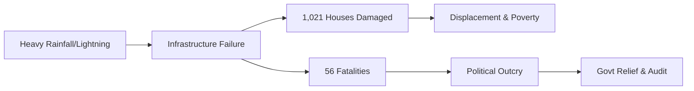

The current monsoon season has proven devastating for Uttar Pradesh, leaving a trail of destruction across the state. Official reports confirm that **56 people** have lost their lives and **1,021 houses** have been severely damaged. This tragedy, driven by a volatile combination of torrential rainfall and lethal lightning strikes, has ignited a fierce political confrontation. Opposition leaders are accusing the state government of systemic unpreparedness, specifically questioning the efficacy of early warning systems and the speed of relief distribution to rural communities.

  
  
 <a href="https://unsplash.com/@basilsmith">Basil Smith</a> on <a href="https://unsplash.com/photos/a-tree-in-a-field-with-a-lot-of-lightning-KmsDi5XH__0">Unsplash</a>

---

### 🌧️ The Scale of the Damage

The intensity of the precipitation has transformed entire residential pockets into disaster zones. According to official data, **1,021 houses** have been either partially or completely destroyed, displacing thousands of families. This devastation is not isolated to a single region but is spread across multiple districts where rural infrastructure proved insufficient against the onslaught.

This has triggered a secondary humanitarian crisis: sudden homelessness during the peak of the rainy season. In most affected areas, the collapse of *kutcha* (mud-walled) houses has been the primary cause of property loss. Local officials are currently conducting damage surveys to determine the exact scale of compensation required for families to rebuild their lives.

---

### ⚡ The Silent Killer: Lightning and Infrastructure

While flooding has caused widespread displacement, lightning has emerged as the deadliest factor. A significant portion of the **56 fatalities** resulted from lightning strikes and subsequent electrocution. Many victims were reportedly working in open fields or seeking shelter under trees—practices that increase vulnerability during electrical storms.

This crisis underscores the critical fragility of rural infrastructure. The lack of lightning conductors in village commons and the inadequacy of local alert systems have left farmers exposed. Furthermore, when aging residential walls collapse during these storms, simple shelters are often transformed into death traps.

---

### 🚩 The Political Fallout: Opposition vs. Government

The disaster has rapidly evolved into a political battleground. The Opposition, led primarily by the Samajwadi Party (SP), has launched a scathing critique of the Yogi Adityanath administration. Their central argument is that the state government failed to act on [IMD warnings](https://mausam.imd.gov.in/) and allowed rural drainage systems to deteriorate.

> "The loss of 56 lives is not merely a natural disaster but an administrative failure. The government remained a silent spectator while the poor lost their homes and lives," stated opposition representatives during recent press briefings.

Critics further allege that disaster management funds have not been effectively utilized to reinforce housing or install warning sirens in high-risk districts. They are now demanding a high-level audit to evaluate the state's preparedness for the 2024 monsoon cycle.

---

### 🛡️ State Response and Relief Measures

In response to the rising death toll and escalating political pressure, Chief Minister Yogi Adityanath has ordered an immediate comprehensive survey of all affected districts. The state government has committed to providing [ex-gratia payments](https://up.gov.in/) to the families of the deceased and financial assistance to those who lost their homes.

While the Uttar Pradesh government maintains a standardized compensation framework for lightning-related deaths, the Opposition argues that bureaucratic hurdles often delay the process, leaving grieving families without immediate support. To mitigate further loss, the [National Disaster Response Force (NDRF)](https://ndrf.gov.in/) has been deployed to high-risk areas to evacuate flooded villages and provide emergency medical aid.

---

### 🌡️ The Climate Context: A Growing Pattern

This spike in fatalities is not an isolated event but fits into a broader pattern of erratic weather across North India. The India Meteorological Department (IMD) has noted an increase in "extreme rain events"—phenomena where a month's worth of precipitation falls within a few days, overwhelming existing drainage and housing.

As the monsoon persists, the risk remains acute. With the soil already saturated, there is an increased probability of landslides in hilly terrains and further structural collapses in the plains. Experts from the [State Disaster Management Authority (SDMA)](https://sdma.up.nic.in/) suggest that unless the state pivots toward "climate-resilient" rural housing, these tragedies will become a seasonal certainty. This aligns with global trends reported by the [IPCC](https://www.ipcc.ch/), which highlight the increasing frequency of extreme weather in South Asia.

---

### Conclusion

The loss of **56 lives** and the destruction of **over 1,000 homes** serves as a grim reminder of the vulnerability of rural populations in Uttar Pradesh. While immediate relief payments are necessary, the ongoing political friction highlights the need for a fundamental shift in disaster strategy. Moving forward, the priority must shift from retroactive compensation to the proactive construction of infrastructure capable of withstanding the intensifying storms of a changing climate.

**References:**
* India Meteorological Department (IMD) - Weather Warnings
* Government of Uttar Pradesh - Official Portal
* National Disaster Response Force (NDRF) - Operations Report
* State Disaster Management Authority (SDMA) - UP Guidelines
* Intergovernmental Panel on Climate Change (IPCC) - Regional Impact Reports

---

## 📖 Related Reading

- [Nepal’s Glacial Catastrophe: 600 Dead and Thousands Missing in Sudden Flash Floods](/nepal-flash-floods-leave-600-dead-2400-missing-as-rescuers-race-against-rain/)
- [When the Courtroom Isn't Safe: The UP Assault and the Bystander Who Stepped In](/video-man-pulls-wifes-hair-tries-to-choke-her-in-up-court-premises-gets-slapped/)
- [🌊 Nepal's Monsoon Crisis: The Heartbreaking Reality of the Floods](/nepal-floods-death-toll-hits-1453-as-5285-remain-missing-after-a-month/)
