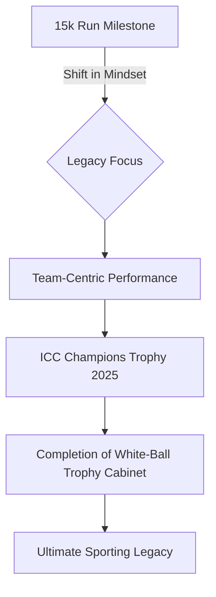

In a sport where the narrative is often dominated by the obsession with numerical superiority, Virat Kohli has just achieved a feat that defies standard comprehension. By becoming the first player in the history of international cricket to surpass the **15,000-run milestone** across all formats, Kohli has effectively moved beyond the realm of "greatness" and entered the territory of the "immortal." 

  
  
 <a href="https://unsplash.com/@katjaano">Katja Ano</a> on <a href="https://unsplash.com/photos/an-orange-curtain-with-the-words-why-why-on-it-zYOQVwBamIM">Unsplash</a>

However, in a move that defines his current psychological evolution, Kohli is not lingering on the applause. While the cricketing world celebrates the sheer volume of his scoring, the man himself is already casting his gaze toward a different horizon: the **ICC Champions Trophy 2025**. For Kohli, the transition is clear—the era of chasing personal records has been superseded by a relentless hunger for collective silverware.

---

### 📊 The Anatomy of 15,000 Runs: A Statistical Masterclass

Reaching 15,000 international runs is not merely a testament to talent; it is a victory of discipline, longevity, and an almost pathological commitment to fitness. To understand the scale of this achievement, one must look at the consistency required to maintain such a trajectory across three wildly different formats of the game.

Kohli's journey to this mark has been characterized by three distinct phases:
1. **The Aggressive Prodigy (2008–2012):** A period defined by raw energy and the desire to announce himself on the world stage.
2. **The Run-Machine (2013–2019):** A peak characterized by an unprecedented conversion rate of fifties into centuries and a dominance in ODI chases that remains unmatched.
3. **The Seasoned Strategist (2020–Present):** A phase where he has balanced individual output with the tactical needs of a transitioning Indian team.

According to data from [ESPNcricinfo](https://www.espncricinfo.com), Kohli's ability to maintain a high average while scoring at a brisk rate has set a new gold standard for the modern batter. With **over 50 international centuries** and a staggering volume of runs in high-pressure knockout games, he has proven that his numbers are not "padding" but are derived from match-winning contributions.

**Key Statistical Pillars:**
* **Consistency:** An average that has remained remarkably stable across a decade of play.
* **Format Versatility:** Mastery over the patience of Test cricket, the pacing of ODIs, and the volatility of T20Is.
* **The Chase Factor:** A career strike rate and average in successful run chases that elevate him above his peers.

---

### 🏆 Team Glory Over Personal Pedestals

The global reaction to the 15k milestone was one of expected reverence. Yet, Kohli’s internal reaction was markedly different. He has consistently signaled that while milestones provide a sense of progress, they do not provide a sense of completion.

> "Individual milestones are great, and they are a byproduct of hard work, but the ultimate satisfaction comes from winning trophies for the country. The goal is always to contribute to a team win in a major tournament," Kohli noted in a recent reflection on his career trajectory.

This shift in perspective is a crucial narrative arc in Kohli's career. Early in his journey, the drive was to be the "best in the world" on paper—a goal he largely achieved. Now, his focus has shifted toward the legacy of the [BCCI](https://www.bcci.tv) and the Indian national team. He recognizes that while a record book remembers the runs, the history books remember the trophies.

---

### 🎯 The Hunger for the ICC Champions Trophy 2025

If the 15,000-run mark is the "trophy" of individual achievement, the **ICC Champions Trophy 2025** is the "crown jewel" Kohli currently seeks. Despite the euphoria of the **2024 T20 World Cup** victory, the Champions Trophy represents a unique challenge that remains a missing piece in his white-ball puzzle.

The Champions Trophy is often described as a "Mini-World Cup." It features only the top-ranked teams, meaning every single match is essentially a high-stakes encounter. There are no "easy" games, and the knockout format leaves zero room for error. For a player who thrives under pressure, this is the ideal environment.

Having been a pivotal part of the **2011 ODI World Cup** triumph and the recent T20 glory, winning the Champions Trophy would effectively "complete" his portfolio. It would signal that India can dominate the shortest and longest versions of the game, as well as the elite-only ODI format. You can track the current rankings and qualifying trajectories on the [Official ICC Website](https://www.icc-cricket.com).

---

### 📈 The Strategic Roadmap to 2025

To ensure India captures the trophy, Kohli has modified his approach to batting. He is no longer just the primary aggressor; he has evolved into the "Anchor-Aggressor." This hybrid role allows him to stabilize the innings if early wickets fall, while still maintaining the ability to accelerate the scoring rate during the death overs.

The transition can be visualized as a shift from individual output to systemic success:

His preparation for 2025 is not just technical but psychological. Following the emotional peak of the 2024 T20 World Cup, Kohli has focused on "mental resetting." This involves:
* **Precision Fitness:** Maintaining the agility of a T20 player with the endurance of a Test specialist.
* **Role Adaptation:** Coordinating with younger talents like Shubman Gill and Yashasvi Jaiswal to ensure a balanced batting order.
* **Pressure Management:** Using his experience to mentor the next generation during high-tension knockout scenarios.

---

### 🌟 A Legacy in Transition: From Records to Mentorship

The most significant takeaway from Kohli's current phase is the example he is setting for the youth. In an era of "personal branding" and "social media metrics," seeing a global icon prioritize a team trophy over a personal record is a powerful statement. 

By placing the **Champions Trophy 2025** above his own scoring milestones, he is teaching the younger crop of Indian cricketers that the name on the front of the jersey carries more weight than the name on the back. This leadership-by-example is what transforms a great player into a legendary captain—regardless of whether he officially holds the captaincy title.

Experts at [Cricbuzz](https://www.cricbuzz.com) suggest that Kohli's ability to pivot his motivation is exactly why he has remained relevant for nearly two decades. Most players fade once they hit their "ceiling"; Kohli simply builds a new ceiling.

---

### 🔍 Comparative Analysis: The "Greats" and Their Milestones

When comparing Kohli's 15,000-run feat to other legends, the context of the modern game becomes apparent. While players like Sachin Tendulkar or Ricky Ponting reached massive numbers, they did so in an era with fewer T20 internationals and different fitness protocols.

**Comparison Table: The Drive for Greatness**

| Player | Primary Driver | Legacy Definition | Key Milestone |
| :--- | :--- | :--- | :--- |
| **Sachin Tendulkar** | Longevity & Perfection | The "God" of Cricket | 100 International Centuries |
| **Ricky Ponting** | Winning Culture | Most Successful Captain | World Cup Dominance |
| **Virat Kohli** | Intensity & Evolution | The Complete Modern Batter | **15,000+ Multi-format Runs** |

Kohli’s unique edge is his refusal to be satisfied with the "comparison" game. While the media compares him to Tendulkar, Kohli compares himself to the version of himself that hasn't won the Champions Trophy yet.

---

### 🏁 Conclusion: The Mission Over the Memory

Reaching **15,000 runs** is a breathtaking achievement that will be studied by sports scientists and cricket historians for decades. It is a monument to hard work and an obsession with excellence. However, the true measure of Virat Kohli is not found in the runs he has already scored, but in the trophy he is currently chasing.

As we approach 2025, the world will undoubtedly keep track of his runs. We will cheer when he hits 16,000 and marvel when he approaches 20,000. But for Kohli, those are merely footnotes. The real story is the **ICC Champions Trophy**. 

In a world obsessed with the "what," Kohli is focused on the "how"—how to lead his team to victory, how to overcome the pressure, and how to leave the game knowing he gave everything for the flag. The milestone is a memory; the trophy is the mission. For the most driven man in cricket, the hunt has only just begun.

**References & Further Reading:**
* [ESPNcricinfo Statsguru](https://statsguru.espncricinfo.com) - Detailed breakdown of Kohli's international aggregates.
* [ICC Official Rankings](https://www.icc-cricket.com/rankings) - Current standing of the Indian ODI team.
* [Times of India Sports](https://timesofindia.indiatimes.com/sports) - Coverage of Kohli's recent interviews and goals.
* [NDTV Sports](https://www.ndtv.com/sports) - Analysis of India's preparation for the 2025 cycle.

---

## 📖 Related Reading

- [Rain Fury in Uttar Pradesh: Death Toll Hits 56 as Political Tensions Rise](/up-rain-fury-toll-rises-to-56-1021-houses-damaged-opposition-attacks-govt/)
- [When the Courtroom Isn't Safe: The UP Assault and the Bystander Who Stepped In](/video-man-pulls-wifes-hair-tries-to-choke-her-in-up-court-premises-gets-slapped/)
- [🌊 Nepal's Monsoon Crisis: The Heartbreaking Reality of the Floods](/nepal-floods-death-toll-hits-1453-as-5285-remain-missing-after-a-month/)
